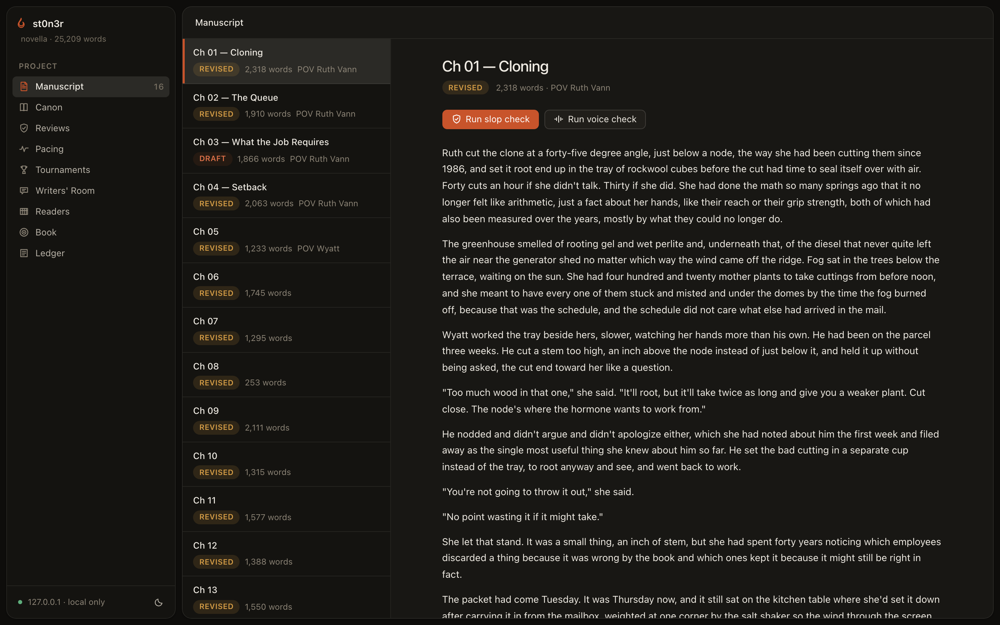

<p align="center">
  
</p>

<p align="center">
  <b>An AI harness purpose-built for long-form fiction — a literature instrument, not a drafting pipeline.</b>
</p>

<p align="center">
  
  
  
  <a href="https://github.com/skeletor-js/st0n3r/actions/workflows/ci.yml"></a>
</p>

---

st0n3r is not a chat wrapper. It is an opinionated system for writing novels and long-form prose with AI: a structured story bible the agent is forced to respect, a deterministic AI-slop detector, an eight-pass review engine, and a full instrument layer for voice, pacing, character interiority, and shipping — all working against plain Markdown files in a git-friendly project you own. No database, local-first, every action ledgered.

One discipline runs through all of it: **deterministic checks may gate; model judgments only advise.** Regex, counting, and statistics — free, reproducible, never hallucinating — are allowed to block a draft. LLM criticism is kept where it belongs: findings in a report that you accept or dismiss. The reasoning behind this and five more principles is in [docs/principles.md](docs/principles.md).

Named for William Stoner of John Williams' *Stoner*: quiet, stubborn devotion to the craft, whatever comes of it. (If the name reads another way to you, that's intentional too.)

> Inspired by [NousResearch/autonovel](https://github.com/NousResearch/autonovel), which showed what happens when AI is applied *intelligently* to literature. st0n3r generalizes the idea into a reusable, provider-agnostic harness.

## The three-minute demo

```bash
pip install 'st0n3r[all]'          # or: uv pip install 'st0n3r[all]'
export ANTHROPIC_API_KEY=sk-...    # or OPENAI_API_KEY, OPENROUTER_API_KEY, ...

stoner init my-novel && cd my-novel
# fill in canon/premise.md, canon/style.md, outline/beats/ch-01.md
stoner write 1                     # draft -> slop gate -> archive
stoner review 1                    # critic passes, saved report
stoner ui                          # local dashboard: heatmaps, triage, canon
```

Or let it run the whole way — resumable, with human checkpoints:

```bash
stoner brainstorm "a quiet novella about ..."   # seed -> premise + style guide
stoner foundation                               # characters, world, threads, outline, beats
stoner book                                     # every chapter + whole-book review rounds
```

The dashboard (`stoner ui`) is a local, no-build web UI that paints slop findings, review triage, pacing, and the rest straight onto your prose:

<p align="center"> </p>

Every command works on plain files. Nothing is hidden in a database; a writer can use the project structure with zero AI and it is still a good filing system.

## Proof of output

st0n3r has written a book with itself. [**Sungrown**](examples/novella/) is a 15-chapter, 25,241-word literary novella — a legacy Humboldt grower meets legalization — generated end-to-end from a one-paragraph seed through canon, outline, chapters, and six whole-manuscript review rounds, with no human edits to any generated file. Every chapter passed the slop gate (scores 1.7–20.3, all under the 25.0 threshold); the run ended at a plateau stop with 0 critical and 5 major findings remaining, reported rather than hidden; and the full canon, ledger, review, and resumable-state trail is committed alongside the prose in [`examples/novella/`](examples/novella/).

It was written through the `claude` Claude-Code-CLI provider — writer and reviewer on `claude-sonnet-5`, archivist on `claude-haiku-4-5` — which means the whole thing ran with no API key in play. One honest caveat: Sungrown predates the ten instrument groups, so it proves the core loop end to end; a second novella with the full instrument layer active from chapter one is the obvious next proof artifact.

## What's inside

The core loop — canon, memory, the write pipeline, the two immune systems — is the whole harness on its own. Ten opt-in instrument groups sit on top:

| Capability | Command | Kind |
|---|---|---|
| AI-slop detection | `stoner slop` | deterministic **gate** |
| Voice drift | `stoner voice check` | deterministic (optional **gate**) |
| No-unfired-guns | `stoner promises check` | deterministic **gate** |
| Ship readiness | `stoner ship check` | deterministic **gate** |
| Knowledge-boundedness | `stoner cast check` | advisory (LLM-attributed) |
| Critic passes | `stoner review` | advisory |
| Whole-book review | `stoner review-book` | advisory |
| Pacing | `stoner pacing report` | advisory |
| Writers' Room | `stoner room session` | advisory |
| Verisimilitude | `stoner facts sweep` | advisory |
| Reader simulation | `stoner readers run` | advisory |
| Motif recurrence | `stoner motifs scan` | deterministic report |
| Draft blame / restore | `stoner drafts` | deterministic |
| Draft tournaments | `stoner tournament run` | comparative, human-confirmed |

The full walkthrough — what each instrument does, the design decision that makes it trustworthy, screenshots — is [**the tour**](docs/tour.md).

Providers: `anthropic`, `openai`, `openrouter`, `together`, `groq`, `ollama`, any OpenAI-compatible endpoint — or no API key at all, driving the Claude Code or Codex CLIs under a subscription. Each agent role takes its own model. See [Providers & models](docs/providers.md).

## Install

```bash
pip install st0n3r                # core: slop detector, project structure, canon tools
pip install 'st0n3r[anthropic]'   # + Anthropic SDK
pip install 'st0n3r[openai]'      # + OpenAI SDK (also OpenRouter, Together, Groq, Ollama)
pip install 'st0n3r[ui]'          # + the local web dashboard
pip install 'st0n3r[export]'      # + PDF and DOCX export (EPUB is dependency-free)
pip install 'st0n3r[all]'         # everything above
```

With [uv](https://docs.astral.sh/uv/), from source:

```bash
git clone https://github.com/skeletor-js/st0n3r && cd st0n3r
uv venv && uv pip install -e '.[dev]'
.venv/bin/python -m pytest        # 866 tests (1 skipped without a live `claude` CLI), no network required
```

st0n3r needs Python 3.11 or newer. Both `stoner` and `st0n3r` work as the command name. The CLI-backed providers (`codex`, `claude`) need no Python extra — just their binary on PATH and a one-time sign-in.

## Documentation

- [Getting started](docs/getting-started.md) — install to a drafted first chapter
- [The tour](docs/tour.md) — every instrument, with the design decisions and screenshots
- [Principles](docs/principles.md) — why it's built this way
- [Concepts](docs/concepts.md) — the canon method, memory, the two immune systems
- [Providers & models](docs/providers.md) — model strings, roles, custom endpoints, Codex and Claude Code CLIs
- Per-instrument references: [Slop](docs/slop.md) · [Review](docs/review.md) · [Voice](docs/voice.md) · [Cast](docs/cast.md) · [Tournaments](docs/tournaments.md) · [Pacing](docs/pacing.md) · [Writers' Room](docs/room.md) · [Facts](docs/facts.md) · [Promises & motifs](docs/motifs.md) · [Readers](docs/readers.md) · [Drafts](docs/drafts.md) · [Ship](docs/ship.md) · [Autonomous mode](docs/autonomous.md) · [The web UI](docs/ui.md)
- [FAQ](docs/faq.md) — nonfiction, existing manuscripts, costs, privacy
- [Roadmap](docs/roadmap.md) — ten directions, each with its honest hard part
- [Credits](docs/CREDITS.md), and the planning trail in [docs/planning/](docs/planning/) and [docs/plans/](docs/plans/)

Architecture notes live in [docs/planning/ARCHITECTURE.md](docs/planning/ARCHITECTURE.md). The provider layer is the only place vendor SDKs are imported; everything else talks to one `Provider` interface. All agent file access is path-jailed to the project root, and every action lands in `.stoner/ledger.jsonl`.

## Status

v0.2.0 — functional end to end, with a complete generated novella as proof. Young; interfaces may move. The badge above is live: [GitHub Actions](.github/workflows/ci.yml) runs the test suite, ruff, and mypy on every push to main and every pull request, across Python 3.11 and 3.12.

## Credits & license

[MIT](LICENSE). Ideas were borrowed with gratitude and attribution — the layered story-bible architecture and comparative evaluation from [NousResearch/autonovel](https://github.com/NousResearch/autonovel), tiered AI-vocabulary catalogs from [blader/humanizer](https://github.com/blader/humanizer) and [conorbronsdon/avoid-ai-writing](https://github.com/conorbronsdon/avoid-ai-writing), the statistical framing from slop-forensics and EQ-Bench, and the function-word z-distance framing from Burrows' Delta. The full accounting is in [docs/CREDITS.md](docs/CREDITS.md).
