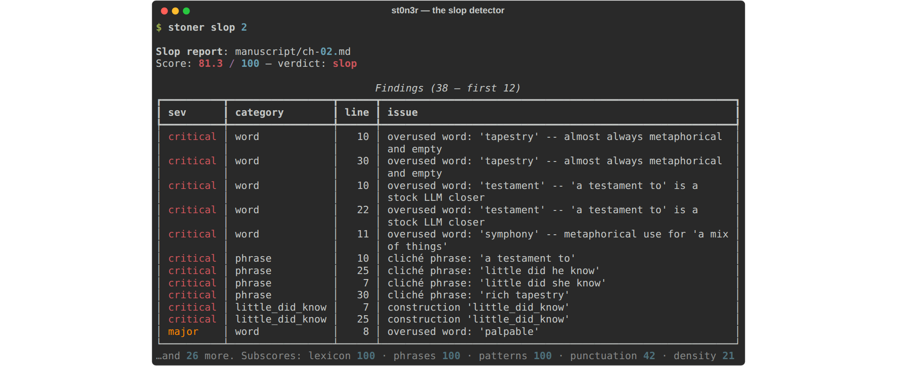
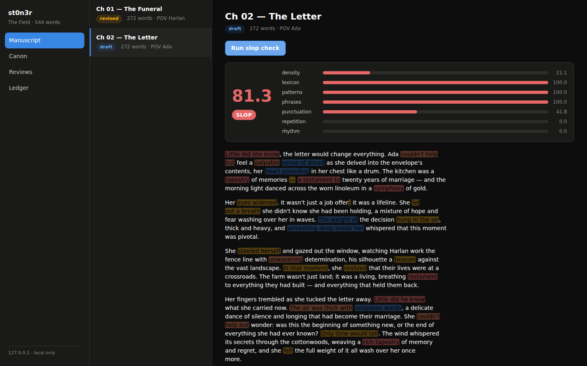
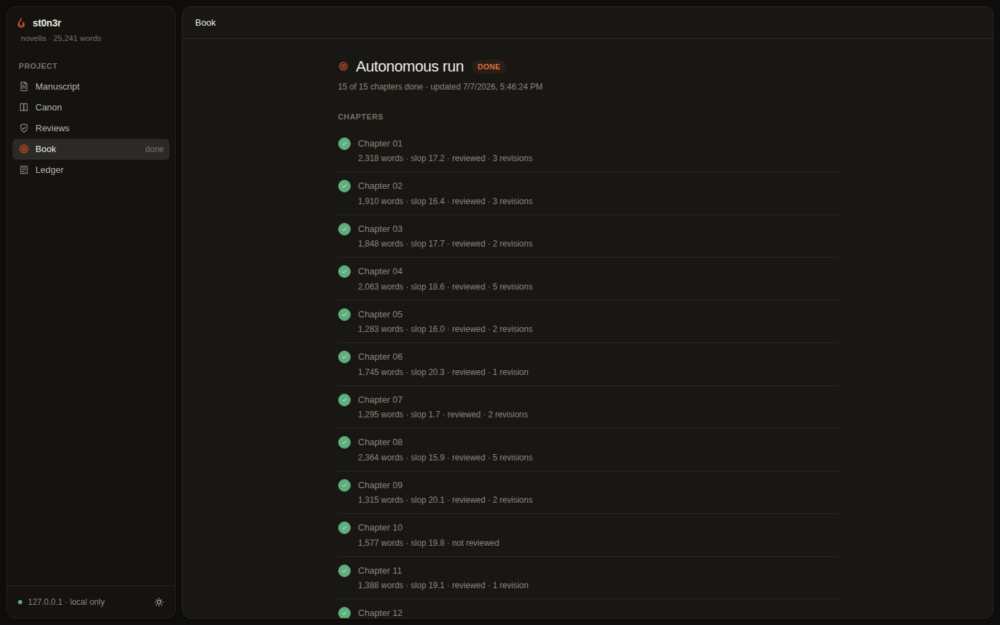
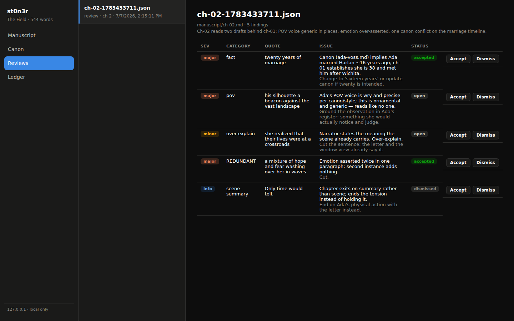
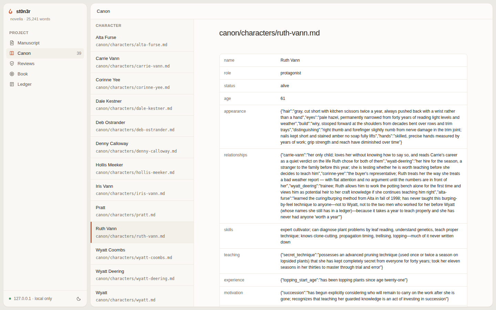

# st0n3r

**An AI harness purpose-built for long-form writing.**

st0n3r is not a chat wrapper. It's an opinionated system for writing novels
(and long-form prose generally) with AI: a structured story bible the agent is
forced to respect, a deterministic AI-slop detector, an eight-pass review
engine, and a draft → gate → revise → archive pipeline — all working against
plain Markdown files in a git-friendly project you own.

Named for William Stoner of John Williams' *Stoner*: quiet, stubborn devotion
to the craft, whatever comes of it. (If the name reads another way to you,
that's intentional too.)

> Inspired by [NousResearch/autonovel](https://github.com/NousResearch/autonovel),
> which showed what happens when AI is applied *intelligently* to literature.
> st0n3r generalizes the idea into a reusable, provider-agnostic harness.

## Why a harness?

LLMs fail at long-form writing in predictable ways: they forget facts
established forty chapters ago, drift out of voice, and settle into the same
overworked vocabulary and rhythms ("slop"). st0n3r attacks each failure
structurally:

| Failure | Mechanism |
|---|---|
| Continuity drift | **Canon** — a fact database in Markdown frontmatter that an *archivist* pass diffs against every chapter; conflicts are surfaced, never silently overwritten |
| Context overflow | **Memory** — rolling chapter summaries; the agent never reads the whole manuscript, it queries canon and asks for what it needs |
| AI slop | **Deterministic detector** — 7 analyzers, 400+ lexicon entries and patterns, statistical rhythm checks; a hard gate in the write pipeline, no LLM required |
| Shallow self-review | **Critic passes** — continuity, pacing, voice, line, logic, adversarial cut-analysis, a four-persona reader panel, and comparative STRONG/FINE/WEAK/CUT grading (absolute 1–10 scores collapse; comparisons don't) |
| Vendor lock-in | **Provider layer** — Anthropic API, any OpenAI-compatible endpoint (OpenAI, OpenRouter, Together, Groq, Ollama, vLLM…), the Codex CLI on a ChatGPT subscription, or the Claude Code CLI on a Claude subscription |
| "Now write the whole thing" | **Autonomous mode** — seed → brainstorm → generated canon/outline/beats → resumable chapter loop with whole-manuscript review rounds. [It has shipped a book.](examples/novella/) |

The slop detector at work — no LLM involved, pure analysis:



## Quickstart

```bash
pip install 'st0n3r[all]'          # or: uv pip install 'st0n3r[all]'
export ANTHROPIC_API_KEY=sk-...    # or OPENAI_API_KEY, OPENROUTER_API_KEY, ...

stoner init my-novel && cd my-novel
# fill in canon/premise.md, canon/style.md, outline/beats/ch-01.md
stoner write 1                     # draft -> slop gate -> archive
stoner review 1                    # eight critic passes, saved report
stoner ui                          # local dashboard: heatmaps, triage, canon
```

Or let it run the whole way:

```bash
stoner brainstorm "a quiet novella about ..."   # seed -> premise + style guide
stoner foundation                               # characters, world, threads, outline, beats
stoner book                                     # every chapter + whole-book review rounds; resumable
```

Every command works on plain files. Nothing is hidden in a database; a writer
can use the project structure with zero AI and it's still a good filing
system.

## The opinionated part

`stoner init` creates a project where knowledge has a home:

```
my-novel/
  stoner.yaml            # models, gates, review passes
  canon/                 # SINGLE SOURCE OF TRUTH
    premise.md           #   logline, themes, promise to the reader
    style.md             #   voice, POV, banned words (the slop detector reads these)
    characters/*.md      #   frontmatter = hard facts, body = soft characterization
    world/*.md           #   places, factions, rules
    timeline.md          #   what happened when
    threads.md           #   every open promise to the reader, tracked to resolution
  outline/beats/ch-NN.md # per-chapter beat sheets
  manuscript/ch-NN.md    # the prose, with status frontmatter
  .stoner/               # memory, session transcripts, reviews, action ledger
```

Frontmatter holds facts machines can diff (`age: 34`, `eyes: gray`); prose
holds what only prose can. After each chapter, the archivist extracts new
facts, diffs them against canon, applies what's safe, and flags what
contradicts — the manuscript and the bible cannot silently drift apart.

## Commands

| Command | What it does |
|---|---|
| `stoner init <name>` | Scaffold a project with instructive canon templates |
| `stoner chapter new/import <n>` | Create a chapter stub or bring in existing prose (no AI, no key) |
| `stoner canon new character/world <name>` | Instantiate a story-bible entry from the template |
| `stoner beats <n>` | Create the beat sheet the writer agent drafts from |
| `stoner write <n>` | Full pipeline: draft → slop gate (auto-revise) → archivist |
| `stoner brainstorm "<seed>"` | Seed → premise.md + style.md |
| `stoner foundation` | Generate characters/world/threads/outline/beats, with an evaluate-iterate loop |
| `stoner book` | Autonomous mode: draft every chapter, whole-book reviews, revision rounds, resumable |
| `stoner review-book` | One whole-manuscript review (critic + professor-of-fiction) |
| `stoner slop <n\|file\|all>` | Deterministic slop report with score, findings, spans |
| `stoner review <n>` | Critic passes → structured findings saved to `.stoner/reviews/` |
| `stoner revise <n>` | Model rewrites the chapter applying accepted findings |
| `stoner archive <n> [--auto]` | Extract facts, diff canon, sync memory (preview by default) |
| `stoner canon list/show/search/pack` | Inspect the bible; `pack` shows exactly what agents see |
| `stoner threads` / `status` / `ledger` | Plot threads, project overview, action log |
| `stoner providers` | Which backends are configured and authed |
| `stoner ui` | Local web dashboard (manuscript, slop heatmap, findings triage) |

Ten instrument groups extend the harness past drafting into measurement, revision, and shipping — each its own config block and ledger namespace, most of them off until you opt in:

| Group | What it does |
|---|---|
| `stoner voice` | Measured voice fingerprint (function-word stats, Burrows' Delta drift); `learn`/`show`/`check`, all deterministic. Optional drift gate in the write pipeline. See [Voice](docs/voice.md) |
| `stoner cast` | Private per-character interiority the writer agent can't see: knowledge-boundedness checks, scene simulation. See [Cast](docs/cast.md) |
| `stoner tournament` | Draft tournaments — N angled takes, blind pairwise judging, human-confirmed winner. See [Tournaments](docs/tournaments.md) |
| `stoner pacing` | Book-level pacing instruments: scene maps, tension curve, flatlines. Advisory. See [Pacing](docs/pacing.md) |
| `stoner room` | The Writers' Room — persistent editors with notebooks, cross-examination, and margin comments. Advisory. See [Writers' Room](docs/room.md) |
| `stoner facts` | The fact locker: sourced real-world detail, opt-in web research, a verisimilitude sweep. See [Facts](docs/facts.md) |
| `stoner promises` / `motifs` | The promise ledger (a deterministic no-unfired-guns gate) and motif registry (recurrence, candidate mining, ending-rhymes-with-opening). See [Promises & motifs](docs/motifs.md) |
| `stoner readers` | Reader simulation at scale: personas read the manuscript and vote; attention heatmaps; blind benchmarking against public-domain comps. See [Readers](docs/readers.md) |
| `stoner drafts` | Draft archaeology: snapshots, provenance, blame, restore, structural refactors. See [Drafts](docs/drafts.md) |
| `stoner ship` | The production line: EPUB/PDF/DOCX export, blurbs, table-read audio. See [Ship](docs/ship.md) |

`ship pdf` and `ship docx` need the `export` extra (`pip install 'st0n3r[export]'`, or `[all]`, which includes it); EPUB export is dependency-free.

## Providers

Model strings are `provider/model`:

```yaml
# stoner.yaml
models:
  writer: anthropic/claude-sonnet-5
  reviewer: openrouter/deepseek/deepseek-chat
  archivist: anthropic/claude-haiku-4-5-20251001
```

`anthropic`, `openai`, `openrouter`, `together`, `groq`, `ollama` work out of
the box (keys via env vars); any other OpenAI-compatible endpoint is one
`providers:` block away; `codex/<model>` drives the Codex CLI under your
ChatGPT subscription, and `claude/<model>` drives the Claude Code CLI under
your Claude subscription. Text-only CLI backends draft chapters in one
comprehensive completion; everywhere else they get a fenced-JSON tool
fallback automatically. See [docs/providers.md](docs/providers.md).

## Proof of output

st0n3r has written a book with itself: [**Sungrown**](examples/novella/), a
15-chapter, 25,000-word literary novella (a legacy Humboldt grower meets
legalization), generated end-to-end — seed → canon → outline → chapters → six
whole-manuscript review rounds — with every chapter passing the slop gate and
the full canon/ledger/review trail committed alongside the prose.

## The dashboard

`stoner ui` serves a local dashboard (nothing leaves 127.0.0.1), built on the
[Hearth](https://github.com/skeletor-js/Hearth) design system. The manuscript
browser runs live slop checks and paints every finding onto the prose — here
on the novella's real first chapter:



The Book panel tracks autonomous runs chapter by chapter:



Review findings are triaged in place — accept or dismiss, then `stoner
revise` applies what you accepted — and the canon browser shows the bible as
the agent sees it:





## Documentation

- [Getting started](docs/getting-started.md)
- [Concepts — the canon method](docs/concepts.md)
- [Providers & models](docs/providers.md)
- [Slop detection](docs/slop.md)
- [Review & revision](docs/review.md)
- [Autonomous mode](docs/autonomous.md)
- [The web UI](docs/ui.md)
- The instrument groups: [Voice](docs/voice.md), [Cast](docs/cast.md),
  [Tournaments](docs/tournaments.md), [Pacing](docs/pacing.md),
  [Writers' Room](docs/room.md), [Facts](docs/facts.md),
  [Promises & motifs](docs/motifs.md), [Readers](docs/readers.md),
  [Drafts](docs/drafts.md), [Ship](docs/ship.md)
- [FAQ](docs/faq.md)
- [Credits](docs/CREDITS.md) — and the planning/research trail in
  [docs/planning/](docs/planning/) and [docs/research/](docs/research/)

## Development

```bash
git clone https://github.com/skeletor-js/st0n3r && cd st0n3r
uv venv && uv pip install -e '.[dev]'
.venv/bin/python -m pytest        # 168+ tests, no network required
```

Architecture notes live in [docs/planning/ARCHITECTURE.md](docs/planning/ARCHITECTURE.md).
The provider layer is the only place vendor SDKs are imported; everything else
talks to one `Provider` interface. All agent file access is path-jailed to the
project root, and every action lands in `.stoner/ledger.jsonl`.

## Status

v0.2.0 — functional end to end, with a complete generated novella as proof.
Young; interfaces may move. Currently a private repo; MIT-licensed and
structured for open-sourcing when it's ready.

## License

[MIT](LICENSE). Ideas were borrowed with gratitude and attribution — see
[docs/CREDITS.md](docs/CREDITS.md).
