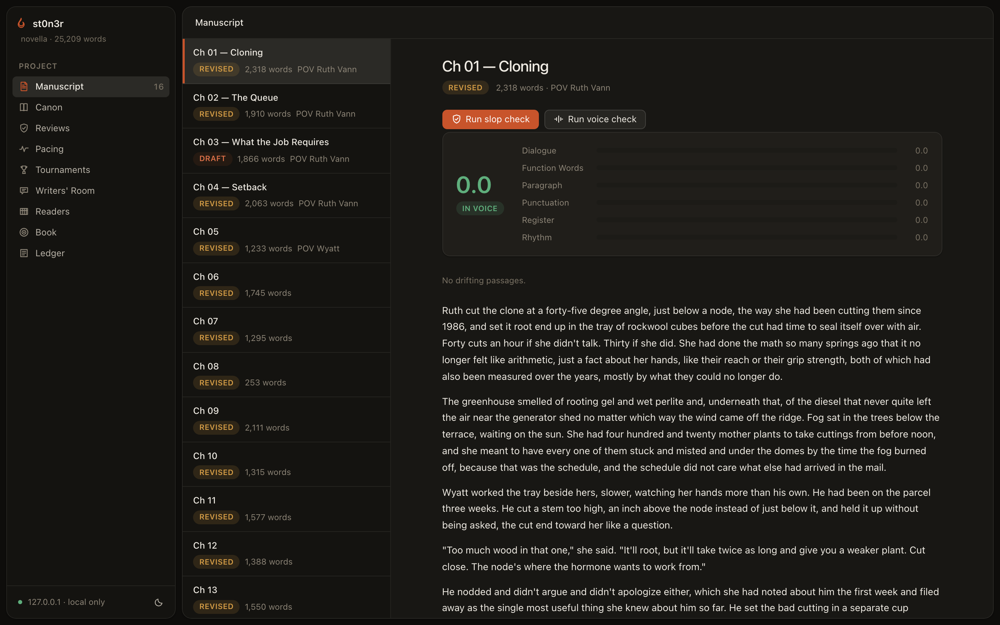
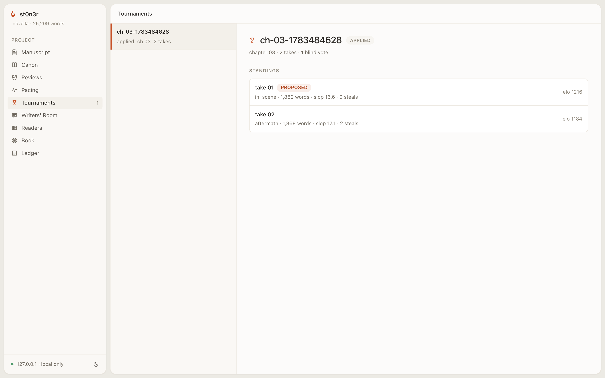
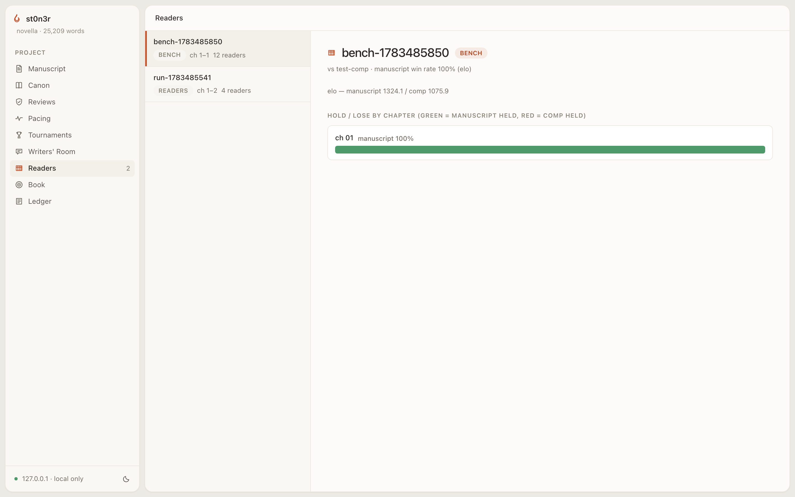
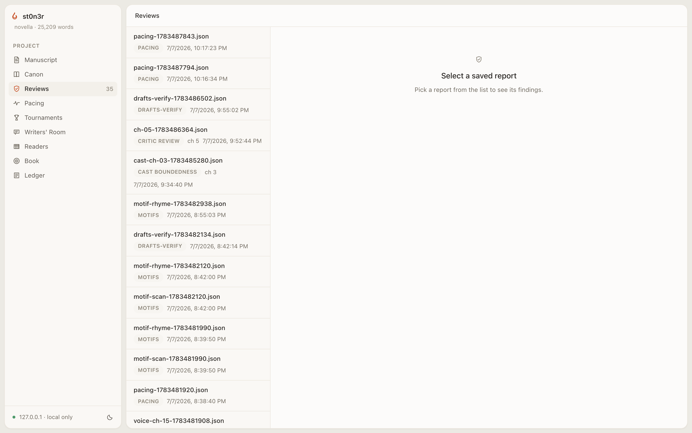

<p align="center">
  
</p>

<p align="center">
  <b>An AI harness purpose-built for long-form fiction — a literature instrument, not a drafting pipeline.</b>
</p>

<p align="center">
  
  
  
  
  
  
  
</p>

<p align="center">
  
  
  
  
</p>

---

st0n3r is not a chat wrapper. It is an opinionated system for writing novels and long-form prose with AI: a structured story bible the agent is forced to respect, a deterministic AI-slop detector, an eight-pass review engine, and a full instrument layer for voice, pacing, character interiority, and shipping — all working against plain Markdown files in a git-friendly project you own.

Named for William Stoner of John Williams' *Stoner*: quiet, stubborn devotion to the craft, whatever comes of it. (If the name reads another way to you, that's intentional too.)

> Inspired by [NousResearch/autonovel](https://github.com/NousResearch/autonovel), which showed what happens when AI is applied *intelligently* to literature. st0n3r generalizes the idea into a reusable, provider-agnostic harness.

## Contents

- [Why it exists](#why-it-exists)
- [How it's meant to be used](#how-its-meant-to-be-used)
- [The features](#the-features)
  - [The canon method](#the-canon-method) · [Slop detector](#the-slop-detector) · [Review engine](#the-review-engine) · [Voice fingerprint](#the-voice-fingerprint) · [Pacing instruments](#pacing-instruments) · [Draft tournaments](#draft-tournaments) · [Writers' Room](#the-writers-room) · [Cast](#cast-character-interiority) · [Fact locker](#the-fact-locker) · [Promises & motifs](#promises--motifs) · [Reader simulation](#reader-simulation) · [Draft archaeology](#draft-archaeology) · [Production line](#the-production-line) · [The dashboard](#the-dashboard) · [Autonomous mode](#autonomous-mode) · [Providers](#the-provider-layer)
- [Proof of output](#proof-of-output)
- [Roadmap](#roadmap)
- [Install](#install) · [Documentation](#documentation) · [Credits & license](#credits--license)

## Why it exists

LLM prose defaults to slop. Left alone, a model writing at length forgets facts established forty chapters ago, drifts out of voice, and settles into the same overworked vocabulary and rhythms. Every mechanism in st0n3r is a way of slowing the machine down to the speed of craft. Six principles run through all of it.

**Prose quality is a fight against a default, not a feature you request.** The slop detector exists because "write well" is not an instruction a model reliably follows. So the harness measures the tells — clichés, filter words, uniform sentence rhythm, punctuation habits — deterministically, and gates on them.

**Absolute LLM scores collapse, so judgment must be comparative.** Ask a model to rate a chapter 1–10 and almost everything comes back a 7. So st0n3r's judgment passes force relative choices instead: paragraphs labeled STRONG / FINE / WEAK / CUT with no numbers allowed, a cut of exactly 400 words, blind pairwise take-versus-take comparisons, a panel that promotes only what several readers raise independently.

**Deterministic checks may gate; LLM output only advises.** Two immune systems that fail differently. Regex, counting, and statistics cost nothing, never hallucinate, and give the same answer every time — that is what you want in a *gate*. Model judgment catches what no regex can — a continuity break, a sagging middle, two characters who sound alike — but it is expensive, non-deterministic, and can be confidently wrong, so it never gates. It produces *findings* that sit in a report until you accept or dismiss them. One system's blind spot is not the other's.

**Canon is the single source of truth, and frontmatter is diffable fact.** The `canon/` directory is the book's law — not the manuscript. Character and world files split in two: YAML frontmatter holds hard facts a machine can diff (`age: 34`, `eyes: gray`), prose below holds the soft characterization only prose can carry. When the manuscript and the bible disagree, that disagreement is surfaced as a conflict to resolve, never silently averaged away.

**The ledger is an append-only account of every mutation.** A chapter drafted, a fact applied, a slop check, each agent turn — every action appends a line to `.stoner/ledger.jsonl`, and full transcripts land in `.stoner/sessions/`. When you wonder "what changed my character sheet?", `stoner ledger` answers it. Nothing the harness does is off the record.

**Plain files, no database, local-first.** The whole project is Markdown, YAML, and JSON. It diffs cleanly under git, you can edit any file by hand at any time, and the harness reads from disk fresh on every operation. The dashboard binds to `127.0.0.1`. Nothing leaves your machine unless you run a command that calls a model, and the two commands that can reach the open web are both opt-in and ledgered.

## How it's meant to be used

The workflow is a loop: build the bible, draft against gates, review and revise, then ship. Two entry points share the same files, so you can move between them freely — the harness driving the loop does not lock you out of it.

**Start a project.** `stoner init` scaffolds the opinionated layout: `stoner.yaml`, the `canon/` bible, `outline/beats/`, `manuscript/`, and `.stoner/` for memory, ledger, and reports.

**For a new book — brainstorm and foundation.** `stoner brainstorm "<seed>"` fills the premise and style templates from one line of idea. `stoner foundation` generates characters, world, threads, an outline, and a beat sheet per chapter, with an evaluate-iterate loop that names the single weakest element and regenerates just that. The two edit stops in the middle — sharpening premise/style, then the outline/beats — are where authoring actually happens.

**For an existing book — import.** `stoner chapter import` brings prose in without retyping, then `stoner archive N --auto` chapter by chapter builds canon and rolling memory around the manuscript you already have. No API key needed to import.

**Write with gates.** `stoner write N` runs the full pipeline: the writer agent drafts from your beats, canon, and memory; the deterministic slop gate scores the draft and auto-revises if it is over threshold; the archivist extracts new facts, diffs them against canon, and syncs memory. A voice-drift gate is available too, off by default.

**Review and revise.** `stoner review N` runs critic passes and saves a findings report. You triage — accept or dismiss each finding, in the terminal or the dashboard — and `stoner revise N` rewrites the chapter applying only what you accepted.

**Let it run, with checkpoints.** `stoner book` drafts every planned chapter through the write pipeline, runs whole-book review and revision rounds as it goes, and saves resumable state before every model call. Ctrl-C is safe; rerunning picks up where it stopped.

**Ship.** `stoner ship check` refuses on real not-dones (chapter gaps, unfired guns) and warns on the rest; then EPUB, PDF, DOCX, blurbs, and table-read audio.

### Quick start

```bash
pip install 'st0n3r[all]'          # or: uv pip install 'st0n3r[all]'
export ANTHROPIC_API_KEY=sk-...    # or OPENAI_API_KEY, OPENROUTER_API_KEY, ...

stoner init my-novel && cd my-novel
# fill in canon/premise.md, canon/style.md, outline/beats/ch-01.md
stoner write 1                     # draft -> slop gate -> archive
stoner review 1                    # critic passes, saved report
stoner ui                          # local dashboard: heatmaps, triage, canon
```

Or let it run the whole way:

```bash
stoner brainstorm "a quiet novella about ..."   # seed -> premise + style guide
stoner foundation                               # characters, world, threads, outline, beats
stoner book                                     # every chapter + whole-book review rounds; resumable
```

Every command works on plain files. Nothing is hidden in a database; a writer can use the project structure with zero AI and it is still a good filing system.

## The features

The core loop — canon, memory, the write pipeline, the two immune systems — is the whole harness on its own. Ten instrument groups sit on top of it: measurement, revision, and shipping tools, each its own config block and ledger namespace, most of them off until you opt in. A project that only wants to draft chapters pays nothing for the rest. They share the core's one discipline: **deterministic checks may gate, model judgments only advise.**

| Capability | Command | Kind |
|---|---|---|
| AI-slop detection | `stoner slop` | deterministic **gate** |
| Voice drift | `stoner voice check` | deterministic (optional **gate**) |
| No-unfired-guns | `stoner promises check` | deterministic **gate** |
| Ship readiness | `stoner ship check` | deterministic **gate** |
| Knowledge-boundedness | `stoner cast check` | advisory (LLM-attributed) |
| Critic passes | `stoner review` | advisory |
| Whole-book review | `stoner review-book` | advisory |
| Pacing | `stoner pacing report` | advisory |
| Writers' Room | `stoner room session` | advisory |
| Verisimilitude | `stoner facts sweep` | advisory |
| Reader simulation | `stoner readers run` | advisory |
| Motif recurrence | `stoner motifs scan` | deterministic report |
| Draft blame / restore | `stoner drafts` | deterministic |
| Draft tournaments | `stoner tournament run` | comparative, human-confirmed |

---

### The canon method

The `canon/` directory is the book's law. Every character and world file is split, and the split is load-bearing: frontmatter holds facts the archivist can diff, the prose body holds characterization it never touches. `canon/timeline.md` holds dated events; `canon/threads.md` tracks every planted question and Chekhov's gun as `open`, `resolved`, or `abandoned`. After each chapter, the archivist extracts new facts, diffs them against canon, applies what is safe, and flags what contradicts.

**The design decision that makes it trustworthy:** conflicts are never auto-applied, whatever flags you pass. A fact that contradicts existing canon is surfaced for you to resolve by hand — the manuscript and the bible cannot silently drift apart. Agents never see canon raw; they get a **context pack** (`stoner canon pack` prints it verbatim) assembled by priority so lower-value sections drop cleanly under a budget instead of getting mangled mid-sentence.

```bash
stoner canon new character "Mara Quill"   # instantiate from the template (no API key)
stoner canon pack                          # exactly what the agent sees
stoner archive 3                           # preview the facts ch-03 would add
stoner threads                             # every open promise, tracked to resolution
```

See [Concepts](docs/concepts.md).

---

### The slop detector

`stoner slop` is a deterministic analyzer for AI-flavored prose. Seven analyzers — lexicon, phrases, patterns, punctuation, repetition, rhythm, density — run over the chapter with about 900 lexicon entries and statistical rhythm checks, producing a 0–100 score banded clean / touched-up / slop-adjacent / slop. It is a hard gate in the write pipeline; no model, no cost, same answer every time.

**The design decision that makes it trustworthy:** clusters, not accusations. No single word convicts. Everything is measured as a *rate* per 1,000 words, the score only climbs when signals stack, and documents under 200 words are damped because a couple of unlucky word choices in a fragment are not evidence. It is a smoke alarm, not an editor — and it reads your own `## Banned` list from `canon/style.md`.

```bash
stoner slop 2                    # one chapter, scored with findings and spans
stoner slop all                  # every chapter
stoner slop 2 --fmt json --save  # machine-readable, saved to .stoner/reviews/
```

<p align="center"></p>

See [The slop detector](docs/slop.md).

---

### The review engine

`stoner review` runs LLM critic passes and saves the findings; `stoner revise` applies the ones you accept. Eight passes are available — `continuity`, `pacing`, `voice`, `line` (the default set), plus `logic`, `adversarial`, `panel`, and `grade`. `stoner review-book` reads the whole manuscript once as a literary critic and once as a professor of fiction, returning findings tagged by chapter.

**The design decision that makes it trustworthy:** the comparative passes never emit a number. `grade` labels every paragraph STRONG / FINE / WEAK / CUT; `adversarial` must cut exactly 400 words and classify each cut; `panel` convenes four reader personas and only promotes issues three of four raise independently. Findings quote the chapter verbatim and locate to spans, so the dashboard can highlight them and `revise` can apply only what you accepted.

| Command | What |
|---|---|
| `stoner review 3` | default passes, saved report |
| `stoner review 3 --passes adversarial,grade` | pick passes |
| `stoner revise 3` | rewrite applying accepted findings |
| `stoner review-book` | one whole-manuscript pass |

See [Review & revise](docs/review.md).

---

### The voice fingerprint

`stoner voice` measures a body of exemplar prose into numbers — function-word frequencies, sentence-length distribution, punctuation rates, closed-class habits — and scores new writing as a *drift* against it, in the spirit of Burrows' Delta. Where slop measures distance from good prose in general, voice measures distance from *your* prose in particular. A chapter can pass the slop gate clean and still not sound like your book.

**The design decision that makes it trustworthy:** it is entirely deterministic — no model, same answer every time — which is exactly why it is allowed to act as a gate. Because voice is a matter of taste, that gate stays opt-in and default-off; a project that never runs `voice learn` never trips it.

```bash
stoner voice learn                # build the fingerprint from your exemplars
stoner voice learn --from-manuscript  # also learn from this book's revised chapters
stoner voice check 3              # drift of chapter 3 (0 = in voice)
stoner voice check all --save     # score every chapter, save a report
```

<p align="center"></p>

See [Voice](docs/voice.md).

---

### Pacing instruments

`stoner pacing report` reads the whole book as a shape: scene-versus-summary ratio per chapter, a tension curve across chapters, flatline runs, ending echoes, and POV whiplash. It mixes deterministic structural measures with optional per-chapter LLM instruments.

**The design decision that makes it trustworthy:** it is advisory on *both* kinds of input — it never gates, even on its deterministic measures, because pacing is about shape over distance and a single low-tension chapter is rarely worth acting on. A *run* of them is the signal, and the report surfaces runs worst-first.

```bash
stoner pacing report            # deterministic measures + LLM instruments
stoner pacing report --no-llm   # deterministic only, free and offline
```

<p align="center"></p>

See [Pacing](docs/pacing.md).

---

### Draft tournaments

`stoner tournament` drafts N takes of a chapter from distinct angles, judges them in blind pairwise comparisons, and proposes a winner for a human to confirm. Votes train the project's taste model over time. It applies the same insight as the comparative review passes — "which of these two is better" is answerable where "rate this 1–10" is not.

**The design decision that makes it trustworthy:** the winner is a *proposal*, not a commit. Nothing lands in the manuscript until a human says so, via `stoner tournament apply` or after a blind A/B `vote`. Every take is snapshotted through draft archaeology, so nothing a tournament drafts is lost, and grafting the best "steals" from losing takes into the winner is one explicit model call, not a silent merge.

```bash
stoner tournament run 3 --takes 4   # 4 angled takes, judged blind
stoner tournament vote <id>         # blind A/B; trains the taste model
stoner tournament apply <id>        # write the confirmed winner (the human step)
stoner write 3 --tournament 4       # tournament as the drafting step, then the slop gate
```

<p align="center"></p>

See [Tournaments](docs/tournaments.md).

---

### The Writers' Room

A one-shot review forgets everything the moment it finishes. The Writers' Room is a persistent roster of editor personas that keep *notebooks* — a running opinion and a list of open items that survive across sessions — so an editor can flag "the middle still doesn't earn its length" in one pass and re-check that exact concern in the next. The default roster is four editors, each a persona wrapped around existing review passes.

**The design decision that makes it trustworthy:** the cost is bounded and predictable — one call per editor per assigned pass, one cross-examination per editor, plus at most one re-locate fallback and one comment follow-up — so the roster size is the only cost knob. It is advisory only; the room never gates. Margin comments anchor to a verbatim quote, so they survive edits that do not touch that span.

```bash
stoner room session 3             # run the roster over chapter 3
stoner room session --book        # a whole-book milestone session
stoner room notebook "Line Editor"   # one editor's running opinion + open items
stoner room comment 3 --quote "..." --text "..."   # pin a margin comment
```

<p align="center"></p>

See [Writers' Room](docs/room.md).

---

### Cast: character interiority

`stoner cast` gives major characters a private interior state the writer agent can never see: what they know and *when* they learned it, what they want but won't say, the lies they maintain, the topics they refuse. From that comes a machine-checkable knowledge-boundedness check — a character acting on a fact before they could know it is a violation — and a scene-simulation loop where character agents collide by genuine information asymmetry.

**The design decision that makes it trustworthy:** canon is fed straight into the writer's prompt, which is exactly why canon cannot hold secrets — a secret that reaches the prompt gets narrated onto the page and subtext dies. So private state lives outside canon in `.stoner/cast/`, and the writer-facing context path never reads it. Subtext reaches the manuscript only through scene scripts *you* choose to feed `stoner write N --task`.

```bash
stoner cast init "Ruth Vann"      # seed a sheet from canon (no API key)
stoner cast update 3 --auto       # curate private state from chapter 3
stoner cast check 3               # flag anachronistic knowledge (advisory)
stoner cast scene --who ruth-vann,dale-kestner --chapter 3 --brief "..."
```

See [Cast](docs/cast.md).

---

### The fact locker

Models hallucinate checkable real-world detail confidently. The fact locker stores sourced specifics — a fee, a statute, a form, a brand — as first-class canon artifacts under `canon/facts/`, fed to the writer through the same context-pack channel as the rest of canon. The verisimilitude sweep holds a chapter against them, flagging contradictions and unsourced confident claims.

**The design decision that makes it trustworthy:** `source_url` is mandatory — a fact with no source is dropped, never stored, so the harness never degrades into remembering detail it cannot attribute. Web research to *build* the locker is explicitly opt-in (`facts.enabled: true`), refuses inside autonomous book mode, and writes every network action to the ledger under `facts.*`. There is no silent fallback to unsourced facts; a provider that cannot search fails loudly.

```bash
stoner facts add --name "..." --claim "..." --source-url https://...   # offline
stoner facts research "Humboldt permit fees" --apply   # opt-in, ledgered, touches the web
stoner facts sweep 3              # verisimilitude pass on ch-03
```

See [Facts](docs/facts.md).

---

### Promises & motifs

Two ledgers for what a book promises and what it echoes. **Promises** type the rows in `canon/threads.md` by kind — mystery, threat, want, image — and follow each from plant to payoff. **Motifs** track recurrence: a deterministic matrix of every registered motif across chapters, plus model-assisted candidate mining and an ending-rhymes-with-opening scan.

**The design decision that makes it trustworthy:** `stoner promises check` is a *deterministic* gate — it exits nonzero while any promise-kind row is still open, no model required, so it can gate a script or a release. Plain kind-less open threads only warn, because abandoning a thread is a legitimate authorial call. That is the same line `stoner ship check` draws between unfired guns (blockers) and open threads (warnings).

```bash
stoner promises plant t7 "who cut the fence" --kind mystery
stoner promises check             # exit 1 while any promise-kind row is open
stoner motifs scan                # deterministic recurrence matrix
stoner motifs rhyme               # does the ending rhyme with the opening?
```

See [Promises & motifs](docs/motifs.md).

---

### Reader simulation

`stoner readers` runs a roster of reader personas over the finished manuscript and reports where enough of them independently react — a synthetic focus group with attention heatmaps. It can also benchmark the book blind against a public-domain comp, chapter-aligned, scored with the same Elo math the tournaments use.

**The design decision that makes it trustworthy:** agreement gating. A negative segment becomes a finding only when at least half the roster agrees on it — one bored reader is noise, half the panel losing the thread in the same place is signal. Comps are supplied by you and must be public domain; no comp text ships in the package and there is no fetch-from-URL.

```bash
stoner readers run --chapters 1-5   # the roster reads, then builds the heatmap
stoner readers heatmap              # attention heatmap + trouble segments
stoner readers bench middlemarch --chapters 1-3   # blind pairwise vs. a comp
```

<p align="center"></p>

See [Readers](docs/readers.md).

---

### Draft archaeology

Every rewrite the harness makes — draft, slop-revise, review-revise, tournament graft, refactor, restore — routes through a single snapshot chokepoint. So `stoner drafts` can show a chapter's whole history, attribute each current sentence to the rewrite that introduced it, restore any past state reversibly, and perform guarded structural refactors (merge, split, move-reveal, flip-POV). It is version control tuned for prose, and it records *why* each change happened.

**The design decision that makes it trustworthy:** `blame` is deterministic — it walks the snapshot chain, no model — and restore is never destructive, because the pre-restore state is itself snapshotted first. Pruning always keeps the original draft and every human-edit snapshot, and keeps content hashes so `blame` still resolves against pruned entries.

```bash
stoner drafts blame 3             # attribute each sentence to the rewrite that made it
stoner drafts diff 3 <a> <b>      # unified diff between snapshots
stoner drafts restore 3 <snap>    # reversible restore of a chapter or paragraph
stoner drafts refactor split 4 --at 12       # deterministic structural edits
```

See [Drafts](docs/drafts.md).

---

### The production line

`stoner ship` turns a finished manuscript into things you can send: a readiness check, a dependency-free byte-reproducible EPUB3, a typeset trade-paperback PDF, a Shunn submission DOCX, marketing blurbs, and stitched table-read audio.

**The design decision that makes it trustworthy:** the network is never touched silently. The deterministic exports need no model and no network; blurbs and `--assist` audio call the writer model; a network TTS backend is reached only by explicit choice (`--backend openai`) and the default `say` backend is local. `ship check` refuses on genuine not-dones and records any `--allow-incomplete` override in the ledger.

```bash
stoner ship check                # blockers refuse, warnings inform
stoner ship epub                 # dependency-free, byte-reproducible EPUB3
stoner ship all                  # check + EPUB + PDF + DOCX
stoner ship audio 1              # stitched table-read WAV for ch-01
```

See [Ship](docs/ship.md).

---

### The dashboard

`stoner ui` serves a local dashboard for the project in the current directory — a single static page plus a small JSON API, no build step, no CDN, no external requests. It reads straight from disk on every request, so edits from your editor, the CLI, or an agent mid-run show up on refresh. Nine panels: Manuscript, Canon, Reviews, Pacing, Tournaments, Writers' Room, Readers, Book, and Ledger. It is built on the [Hearth](https://github.com/skeletor-js/Hearth) design system, with warm light and dark themes.

The Manuscript panel runs live slop checks and paints every finding onto the prose, tinted by severity:

<p align="center"> </p>

Reviews are triaged in place — accept or dismiss, then `stoner revise` applies what you accepted — with every report kind (review, slop, book, voice, pacing, cast, readers) routed to the right shape:

<p align="center"> </p>

**Local-only by default:** the server binds to `127.0.0.1:8377`. There is no auth layer, so `--host 0.0.0.0` (which exposes triage writes to your network) is for trusted networks only. Model calls are never made from the UI — drafting, reviewing, and revising stay in the CLI.

See [The web UI](docs/ui.md).

---

### Autonomous mode

Three commands take a project from a one-line idea to a reviewed manuscript. `brainstorm` builds the premise and style; `foundation` builds the rest of the bible with an evaluate-iterate loop; `book` drafts every planned chapter through the full write pipeline and runs whole-book review and revision rounds on top.

**The design decision that makes it trustworthy:** state is saved before every model call, so Ctrl-C, a crash, or a rate-limit death always leaves a resumable run — and a chapter you wrote by hand is respected on resume, not redrafted. Autonomy here means the harness drives the loop, not that you are locked out of it; the two human checkpoints (after brainstorm, after foundation) are what keep the result a book rather than a book-shaped object.

<p align="center"></p>

```bash
stoner book --max-chapters 4 --max-minutes 60   # bounded, resumable run
stoner book --tournaments                       # slot chapters via draft tournament
stoner book                                      # resumes exactly where it stopped
```

See [Autonomous mode](docs/autonomous.md).

---

### The provider layer

Every model is named by one string, `provider/model`. `anthropic`, `openai`, `openrouter`, `together`, `groq`, and `ollama` work out of the box with keys from env vars; any other OpenAI-compatible endpoint is one `providers:` block away. Each role — writer, reviewer, archivist, reader, researcher — takes its own model, so you can draft with one model and review with another.

**Run entirely through the local CLIs, no API key.** `codex/<model>` drives the Codex CLI under a ChatGPT subscription and `claude/<model>` drives the Claude Code CLI under a Claude subscription — each model call becomes one `codex exec` or `claude -p` invocation. These backends are text-only (no native tool-calling): drafting is single-shot from a context-complete system prompt, and everywhere else the engine degrades to a fenced-JSON tool protocol automatically. The Claude Code adapter disables every built-in tool and runs in a throwaway temp directory, so the CLI can never touch your project — st0n3r's own path-jailed tools are the only way a model writes to disk.

```yaml
# stoner.yaml
models:
  writer: anthropic/claude-sonnet-5
  reviewer: openrouter/deepseek/deepseek-chat
  archivist: anthropic/claude-haiku-4-5-20251001
```

```bash
stoner providers                 # which backends are configured and authed
stoner write 1 --model claude/claude-sonnet-5   # draft through the Claude CLI, no key
```

See [Providers & models](docs/providers.md).

## Proof of output

st0n3r has written a book with itself. [**Sungrown**](examples/novella/) is a 15-chapter, 25,241-word literary novella — a legacy Humboldt grower meets legalization — generated end-to-end from a one-paragraph seed through canon, outline, chapters, and six whole-manuscript review rounds, with no human edits to any generated file. Every chapter passed the slop gate (scores 1.7–20.3, all under the 25.0 threshold); the run ended at a plateau stop with 0 critical and 5 major findings remaining, reported rather than hidden; and the full canon, ledger, review, and resumable-state trail is committed alongside the prose in [`examples/novella/`](examples/novella/).

It was written through the `claude` Claude-Code-CLI provider — writer and reviewer on `claude-sonnet-5`, archivist on `claude-haiku-4-5` — which means the whole thing ran with no API key in play. One honest caveat: Sungrown predates all ten instrument groups, so it proves the core loop end to end. A second novella written with voice gating, tournaments, the fact locker, and the room active from chapter one is the top item on the roadmap below.

## Roadmap

Ten directions, chosen for what would actually change the writer's day, grounded in the codebase's real seams and the plans' deferred-work lists. Each names the workflow pain it fixes and the honest hard part.

**1. Per-character dialogue fingerprints.** The voice engine already fingerprints the book's narration; the cast system already attributes dialogue lines to speakers. Join them and every character gets a measured voice, so "does Ruth still sound like Ruth in chapter 12" becomes a number instead of a hunch — the single most common failure in long dialogue-heavy drafts. *Hard part:* a minor character's lines are sparse early on, so a per-speaker fingerprint is noisy until enough dialogue accumulates; it needs a confidence floor and honest "not enough signal yet" degradation rather than a false precise score.

**2. Series-spanning canon.** A trilogy today means copy-pasting character and world files between projects and watching them drift. A canon layer above the book — shared characters, world, and timeline with per-book overrides — would let a series hold continuity the way a single book does. *Hard part:* distinguishing an intentional cross-book change (a character ages, a regime falls) from an accidental contradiction; the diff engine has to reason about "true as of book N," not just "true."

**3. Draft-over-draft reader-attention deltas.** Reader simulation builds an attention heatmap; the snapshot store versions every chapter. Overlay them and you can answer "did the chapter 9 rewrite actually recover the attention it was losing" — closing the loop between a revision and its effect on readers. *Hard part:* persona runs are non-deterministic, so a raw before/after delta is mostly noise; it needs a pinned roster, a fixed seed, and a significance threshold before a change counts as real.

**4. Editor-in-the-loop revise.** The Writers' Room already captures editor intent in notebooks and margin comments, but `revise` today reads generic findings. Wire the room in so "the line editor still thinks the middle drags" drives the rewrite directly — the editor's persisting opinion becomes the revision instruction. *Hard part:* a notebook opinion is prose, not a typed, span-anchored finding; turning a running opinion into a bounded, applicable instruction without licensing the model to rewrite the whole chapter is the real work.

**5. Scene-level tournaments.** Tournaments run per chapter, but the strongest gains usually live in one scene, not the whole thing. Sub-chapter tournaments would spend the budget exactly where a chapter is weakest. *Hard part:* the repo has no scene-segmentation model yet, so reliable scene boundaries in continuous prose come first — and grafting a winning scene back in without a visible seam is harder than swapping a whole chapter.

**6. Pluggable search backend for the fact locker.** `facts research` discovery needs an Anthropic role or the `claude` CLI today. A SearXNG or search-API adapter would free the locker from a single vendor and make offline-ish research practical. *Hard part:* every backend returns a different result shape and reliability, and the locker's core contract — every stored fact carries a real source URL — has to hold identically across all of them or the whole guarantee weakens.

**7. Voice-drift and pacing columns in tournament standings.** A take can win the blind judge and still drift from the book's established voice. Surfacing the deterministic voice-drift and pacing signals as advisory columns in the standings would let the human confirm step see what the blind judge can't. *Hard part:* keeping advisory signals strictly advisory — they must inform the person confirming a winner, never silently re-rank the blind pairwise judge, or the comparison stops being blind.

**8. Shipped public-domain author fingerprints.** "Hold me to Cather" as a one-command starting voice, built from public-domain corpora with proper CREDITS entries — a scaffold for writers who don't yet have exemplar prose of their own. *Hard part:* licensing hygiene (only genuinely public-domain texts, sourced and cited), and framing a borrowed fingerprint clearly as a starting reference, not a target to imitate wholesale into pastiche.

**9. epubcheck integration and a public release path.** `ship epub` is byte-reproducible but never validated against the EPUB spec; and the repo is private with static badges because there is no CI. Optional epubcheck validation plus a GitHub Actions recipe running the 853-test suite and ruff would let the badges above become live and the repo go public with a real green check. *Hard part:* epubcheck is a Java dependency, so it has to stay optional and clearly gated — and committing to CI means committing to keeping the suite green on every push, which is a discipline, not a feature.

**10. M4B audiobook with chapter marks, and the two missing UI panels.** `ship audio` already stitches per-chapter table-read WAVs; an M4B container with embedded chapter marks makes it a real audiobook. Separately, the motif recurrence matrix and the drafts blame/timeline are the two instruments with the most to show visually and no dashboard panel yet. *Hard part:* M4B needs ffmpeg unconditionally, which breaks the dependency-free promise for that one path, so it belongs behind its own extra; and a blame view needs sentence offsets to survive the chapter renderer's Markdown transform, which is offset plumbing the UI does not have today.

## Install

```bash
pip install st0n3r                # core: slop detector, project structure, canon tools
pip install 'st0n3r[anthropic]'   # + Anthropic SDK
pip install 'st0n3r[openai]'      # + OpenAI SDK (also OpenRouter, Together, Groq, Ollama)
pip install 'st0n3r[ui]'          # + the local web dashboard
pip install 'st0n3r[export]'      # + PDF and DOCX export (EPUB is dependency-free)
pip install 'st0n3r[all]'         # everything above
```

With [uv](https://docs.astral.sh/uv/), from source:

```bash
git clone https://github.com/skeletor-js/st0n3r && cd st0n3r
uv venv && uv pip install -e '.[dev]'
.venv/bin/python -m pytest        # 853 tests, no network required
```

st0n3r needs Python 3.11 or newer. Both `stoner` and `st0n3r` work as the command name. The CLI-backed providers (`codex`, `claude`) need no Python extra — just their binary on PATH and a one-time sign-in. `ship pdf` / `ship docx` need the `export` extra; the dashboard needs `ui`.

## Documentation

- [Getting started](docs/getting-started.md) — install to a drafted first chapter
- [Concepts](docs/concepts.md) — the canon method, memory, the two immune systems
- [Providers & models](docs/providers.md) — model strings, roles, custom endpoints, Codex and Claude Code CLIs
- [Slop detection](docs/slop.md) — the seven analyzers and how to read a score
- [Review & revise](docs/review.md) — the eight passes and the triage flow
- [Autonomous mode](docs/autonomous.md) — brainstorm, foundation, book, review-book
- [The web UI](docs/ui.md) — the nine dashboard panels
- The instrument groups: [Voice](docs/voice.md) · [Cast](docs/cast.md) · [Tournaments](docs/tournaments.md) · [Pacing](docs/pacing.md) · [Writers' Room](docs/room.md) · [Facts](docs/facts.md) · [Promises & motifs](docs/motifs.md) · [Readers](docs/readers.md) · [Drafts](docs/drafts.md) · [Ship](docs/ship.md)
- [FAQ](docs/faq.md) — nonfiction, existing manuscripts, costs, privacy
- [Credits](docs/CREDITS.md), and the planning trail in [docs/planning/](docs/planning/) and [docs/plans/](docs/plans/)

Architecture notes live in [docs/planning/ARCHITECTURE.md](docs/planning/ARCHITECTURE.md). The provider layer is the only place vendor SDKs are imported; everything else talks to one `Provider` interface. All agent file access is path-jailed to the project root, and every action lands in `.stoner/ledger.jsonl`.

## Status

v0.2.0 — functional end to end, with a complete generated novella as proof. Young; interfaces may move. Currently a private repo; MIT-licensed and structured for open-sourcing when it is ready.

## Credits & license

[MIT](LICENSE). Ideas were borrowed with gratitude and attribution — the layered story-bible architecture and comparative evaluation from [NousResearch/autonovel](https://github.com/NousResearch/autonovel), tiered AI-vocabulary catalogs from [blader/humanizer](https://github.com/blader/humanizer) and [conorbronsdon/avoid-ai-writing](https://github.com/conorbronsdon/avoid-ai-writing), the statistical framing from slop-forensics and EQ-Bench, and the function-word z-distance framing from Burrows' Delta. The full accounting is in [docs/CREDITS.md](docs/CREDITS.md).
