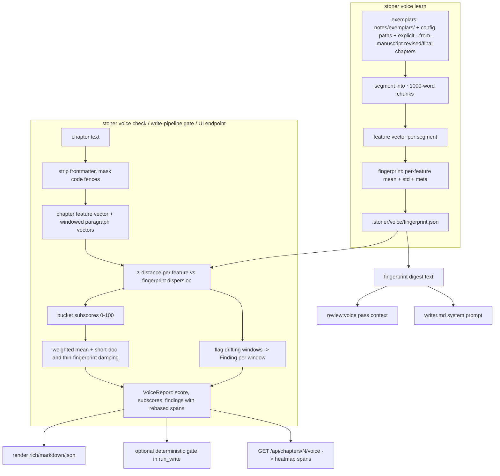

## Summary

Add a stylometric voice fingerprint per project, learned deterministically from exemplar prose, plus a 0-100 voice-drift score with paragraph-level findings — mirroring the slop detector end to end (analyzers -> score -> report -> spans -> CLI/UI). Style stops being adjectives in `canon/style.md` and becomes something the harness measures and can optionally gate on.

---

## Problem Frame

`canon/style.md` states voice intent in prose, and the `review:voice` pass asks an LLM whether a chapter adheres to it. Neither measures anything: the style guide is unenforced, and the LLM pass is advisory, unrepeatable, and blind to the writer's actual statistical signature. Meanwhile the repo already proves the pattern that works — `src/stoner/slop/` scores prose with pure arithmetic, emits `Finding` spans a UI can highlight, and gates the write pipeline deterministically (invariant 2).

The Voice Engine is the slop detector's sibling: instead of comparing prose against a fixed lexicon of AI tells, it compares prose against a learned fingerprint of *this* writer — sentence-length burstiness, clause and punctuation rhythm, function-word profile, diction register, paragraph shape, dialogue ratio. Every draft gets a voice-drift score the way it gets a slop score today; revision gets "this paragraph broke voice here" with a span for the heatmap. The fingerprint is the measured counterpart to `style.md`, which stays the human-readable intent.

---

## Requirements

Fingerprint learning:

- R1. `stoner voice learn` builds a fingerprint from exemplar prose (the writer's own and/or texts they supply) and writes it to `.stoner/voice/fingerprint.json`. Re-running on identical exemplars produces an identical fingerprint.
- R2. All feature extraction is pure-Python arithmetic on the frozen core deps. No spaCy/nltk, no new dependencies, no network.
- R3. The feature set covers: sentence-length distribution and burstiness, paragraph shape, clause and punctuation rhythm, function-word profile, diction-register proxies (word length, morphology-based latinate ratio, windowed type-token ratio, contraction rate), and dialogue ratio.
- R4. The fingerprint file is versioned; loading a mismatched version fails with an actionable "re-run stoner voice learn" error. Undersized exemplar corpora produce a warning at learn time and score damping at check time; below a hard floor, learn refuses.

Drift scoring:

- R5. `stoner voice check <chapter|path|all>` produces a 0-100 drift score (0 = in voice), per-bucket subscores, a verdict band, and findings — rendered `rich|markdown|json` exactly like `stoner slop`, with optional `--save` into `.stoner/reviews/`.
- R6. Paragraph-window findings carry `Span`s over the raw file (frontmatter included, code fences masked), so CLI and UI can highlight where voice broke. Each finding names the drifting features with measured-vs-fingerprint values.
- R7. Scores are computed arithmetically only (invariant 1). Short documents and thin fingerprints damp the score rather than convicting on noise.
- R8. A missing fingerprint makes `voice check` fail with an actionable message; every other integration (gate, review digest, writer prompt, UI) degrades silently to current behavior.

Pipeline and review integration:

- R9. `run_write` gains an optional deterministic voice gate (off by default) sharing the existing `gates.max_revision_loops` revise budget; voice findings feed the same revise loop the slop gate uses (invariant 2: deterministic checks may gate).
- R10. The existing `review:voice` LLM pass receives a compact fingerprint digest plus the latest measured drift when a fingerprint exists — it stays advisory and unchanged when none exists.
- R11. The writer agent's system prompt receives the same digest (empty when absent), so drafts aim at the measured voice, not just the adjectives.

Surface and hygiene:

- R12. Every mutating action ledgers under `voice.*` (invariant 5).
- R13. Shipped data files (the function-word list) follow `slop/data/*.yaml` conventions with header comments; no copyrighted corpora ship in the package; test fixtures use public-domain prose only; any derived list is attributed in `docs/CREDITS.md` (invariant 12).
- R14. The UI gains a voice check mirroring the slop check: endpoint, score card, findings with spans rebased onto the rendered body (one static HTML file, no build step — invariant 6).

---

## Key Technical Decisions

- Fingerprint = per-feature mean and dispersion over ~1000-word exemplar segments, not whole-corpus point estimates: dispersion is what makes "normal variation for this writer" a measurement instead of a guess, and it is exactly what drift is scored against.
- Drift = per-feature z-distance against fingerprint dispersion (Burrows'-Delta-style for the function-word profile), mapped to 0-100 with the same curve shape as slop's `_rate_score` (0 inside one standard deviation, 50 at ~2, ~90 at ~3.5) and combined via a `SlopConfig`-style weighted mean. Pure arithmetic throughout — invariant 1 permits numeric scores only when computed this way.
- No frequency lexicon ships. Diction register comes from suffix morphology (latinate endings), mean word length, windowed type-token ratio, contractions, and the function-word profile. This keeps the data surface to one small function-word YAML (closed-class words, uncopyrightable) and sidesteps licensing entirely (invariants 8, 12).
- Reuse slop's text plumbing — `split_frontmatter`, `mask_code_fences`, `split_sentences`, `TOKEN_RE` imported from `stoner.slop.analyzers` / `stoner.project` — so voice and slop agree on coordinates, masking, and tokenization. One span convention, one rebase pattern (`slop/__init__.py` `_rebase_finding`).
- Paragraph findings use windows of consecutive paragraphs with a ~120-word minimum, scored on window-stable features only. Single paragraphs are statistically too short; windows still give the UI a contiguous span to heat-map.
- `VoiceReport` is a new model in `src/stoner/types.py` mirroring `SlopReport` (path, score, subscores, findings, stats, created_at). It crosses module boundaries (voice -> CLI, pipeline, UI), which is the stated bar for `types.py`. Reports save into `.stoner/reviews/` (`voice-ch-NN-<ts>.json`) so existing report-listing conventions apply — no new report directory.
- The gate is opt-in (`voice.gate: false`): a deterministic gate is sanctioned (invariant 2), but gating drafts against a fingerprint the writer has not vetted would be hostile as a default. When enabled it reuses the slop gate's revise-loop plumbing and budget rather than growing its own.
- The advisory LLM judge is the *existing* `review:voice` pass upgraded with a measured digest via an optional-with-default `PassContext` field — not a new pass. Keeps the registry small, keeps LLM judgment advisory (invariant 2), and defines the relationship explicitly: fingerprint = measured counterpart, `style.md` = human intent, `review:voice` = judgment informed by both.
- Exemplars live in `notes/exemplars/` by default (agents never read `notes/` unbidden) plus a config list of extra paths; the project's own `revised|final` chapters are included only via an explicit `--from-manuscript` flag. `voice learn` never falls back to manuscript chapters silently when `notes/exemplars/` is empty — learning a fingerprint from weak early drafts must be a deliberate act, not a surprise. The fingerprint is derived state in `.stoner/voice/`, never in `canon/` — canon body prose stays machine-untouched (invariant 3). Exemplars are local files that never leave the machine (invariant 9; this feature adds zero network surface).

---

## High-Level Technical Design

Feature buckets (weights sum to 1.0, `SlopConfig`-style; exact features are directional, calibrated in U3):

| bucket | example features | window-stable |
|---|---|---|
| rhythm | sentence-length mean, CV (burstiness), short-sentence rate, long-sentence rate | yes |
| paragraph | words/paragraph mean + CV, sentences/paragraph | no (chapter-level only) |
| punctuation | commas/sentence; em-dash, semicolon, ellipsis, question, exclamation per 1000 words | yes |
| function_words | rates of ~150 closed-class words; composite Burrows'-Delta mean absolute z | yes |
| register | mean word length, latinate-suffix rate, windowed TTR, contraction rate | yes |
| dialogue | dialogue word ratio, mean dialogue-run length | no (chapter-level only) |

Verdict bands mirror slop's four-band shape with voice labels: `< 15` in voice, `< 30` drifting, `< 55` off voice, else broke voice.

Module layout under `src/stoner/voice/`:

- `features.py` — segmentation and feature extraction; `data/function_words.yaml` loaded and cached like `slop/lexicon.py`.
- `fingerprint.py` — fingerprint model (pydantic, feature-local), learn from texts, load/save/version-check `.stoner/voice/fingerprint.json`, human-readable digest text.
- `drift.py` — `run_voice(text, fingerprint, ...) -> VoiceReport`: chapter score, windowed findings, span rebase; `VoiceConfig`-driven weights; gate-check helper for the write pipeline.
- `report.py` — `render(report, fmt="rich|markdown|json")` to a detached recording Console, pure, mirroring `slop/report.py` including verdict bands.

---

## Integration Surface

- CLI: `stoner voice learn`, `stoner voice show`, `stoner voice check` — nested sub-app created inside `src/stoner/cli/voice_cmds.py` exposing `register(app)`; one import + one `register` line appended in `src/stoner/cli/main.py`.
- config.py: one new field `voice: VoiceConfig` on `StonerConfig`. `VoiceConfig` fields: `exemplars: list[str] = ["notes/exemplars"]`, `gate: bool = False`, `max_drift_score: float = 40.0`, `weights: dict[str, float]` (defaults from `voice/drift.py`).
- types.py: `VoiceReport` (mirrors `SlopReport`). Reuses existing `Finding`/`Span`/`Severity`. Finding source convention: `voice:<bucket>`.
- project.py DIRS: add `notes/exemplars` and `.stoner/voice`. New state file `.stoner/voice/fingerprint.json`. Saved reports: `.stoner/reviews/voice-<stem>-<ts>.json` (existing dir).
- canon: no new artifacts, no CanonStore methods, no template changes. `style.md` untouched.
- ledger: `voice.learn`, `voice.check`, `voice.gate` (emitted by the write pipeline when the gate triggers or fails).
- review: no new PASSES entry. `PassContext` gains optional-with-default `voice_digest: str = ""`; `build_context` populates it when a fingerprint exists; `_voice_prompt` appends it to the task when non-empty.
- engine/tools.py: one new agent tool `voice_check` mirroring `slop_check` (returns "ERROR: no fingerprint..." rather than raising).
- engine/prompts/: additive `{voice_digest}`-style section in `writer.md`; `pipelines/common.chapter_context` supplies the value ("" when absent).
- ModelRoles: none. Scoring is deterministic; the advisory judge is the existing `review:voice` pass resolving against `reviewer`.
- UI: `GET /api/voice` (fingerprint meta or 404-shaped absent marker), `GET /api/chapters/{number}/voice` (report with spans rebased onto the body, mirroring `api_chapter_slop`); `ui/static/index.html` gains a "Run voice check" button and score card beside the slop card, reusing its finding-rendering.
- pyproject: nothing. Core deps only.
- Dependencies on other feature plans: none. (Feature 4 Pacing measures structure in its own namespace; no seam is shared beyond the enumerated files above.)

---

## Implementation Units

### U1. Feature extraction core

**Goal**: Deterministic stylometric feature vectors from raw prose.

**Requirements**: R2, R3, R13

**Dependencies**: none

**Files**:
- `src/stoner/voice/__init__.py`
- `src/stoner/voice/features.py`
- `src/stoner/voice/data/function_words.yaml`
- `tests/test_voice.py`

**Approach**: Implement segmentation (split text into ~1000-word chunks on paragraph boundaries) and per-bucket feature functions returning a flat named-feature mapping. Reuse `stoner.slop.analyzers.split_sentences`, `TOKEN_RE`, `mask_code_fences` and `stoner.project.split_frontmatter/count_words` — do not re-implement tokenization. Function-word list loaded and cached from `data/function_words.yaml` following the `slop/lexicon.py` loader shape (validation errors -> a feature-local error type; header comment documents provenance: closed-class English function words, hand-assembled). Latinate ratio via suffix regex in the spirit of slop's `_ADJ_SUFFIXES`. Dialogue ratio via quote-delimited run detection tolerant of straight and curly quotes. All thresholds and word lists module-level `_UPPER_SNAKE` constants.

**Patterns to follow**: `src/stoner/slop/analyzers.py` (module structure, docstring style, constants, offset-preserving masking); `src/stoner/slop/lexicon.py` (YAML loading, caching, `force_reload` for tests).

**Test scenarios**:
- Two contrasting public-domain passages (e.g. long-breath Melville vs clipped declarative prose) produce measurably different rhythm, punctuation, and register features.
- Same text twice -> identical vectors (determinism).
- Text with dialogue vs none -> dialogue ratio separates; curly-quote text matches straight-quote equivalent.
- Code-fenced content is excluded from every feature.
- Segmentation: 5000-word text -> ~5 segments, none splitting mid-paragraph; sub-segment-size text -> one segment.
- Malformed `function_words.yaml` (non-list) -> actionable loader error.

**Verification**: paired-fixture feature separation holds; `pytest tests/test_voice.py`, `ruff`, `mypy` clean.

### U2. Fingerprint learn, persist, digest

**Goal**: Learn a versioned fingerprint from exemplars and expose it as state plus a human-readable digest.

**Requirements**: R1, R4, R13

**Dependencies**: U1

**Files**:
- `src/stoner/voice/fingerprint.py`
- `src/stoner/config.py`
- `src/stoner/project.py`
- `tests/test_voice.py`

**Approach**: A pydantic fingerprint model (feature-local, not `types.py`): `version`, per-feature `{mean, std}`, meta (exemplar labels, segment count, total words, created_at). `learn` takes labeled texts, segments via U1, computes stats; refuse below a hard word floor (~1000), record a thin-corpus flag below a comfort threshold (~5000) that drift scoring later uses for damping. Save/load against `.stoner/voice/fingerprint.json` with version check -> actionable error on mismatch. A digest function renders a short plain-text summary (top distinguishing stats, exemplar provenance) for prompts. Add `VoiceConfig` to `config.py` and the two DIRS entries to `project.py` (additive).

**Patterns to follow**: `src/stoner/canon/memory.py` (small JSON state object over `.stoner/`); `GateConfig`/`ModelRoles` in `config.py` (sub-model with defaults).

**Test scenarios**:
- Learn from PD fixture texts -> stable JSON on disk; re-learn on same inputs -> byte-stable feature stats.
- Below hard floor -> refusal with actionable message; between floor and comfort threshold -> thin flag set.
- Load with bumped version -> error mentioning `stoner voice learn`.
- Corrupt JSON -> actionable error (not a stack trace).
- Digest is non-empty, plain text, and bounded in length.
- `StonerConfig.load` round-trips `voice:` block from `stoner.yaml`; defaults apply when absent.

**Verification**: fingerprint file human-readable and git-diffable; config defaults verified via existing `StonerConfig` tests pattern.

### U3. Drift scoring, findings, VoiceReport, rendering

**Goal**: 0-100 drift score with paragraph-window findings and three-format rendering.

**Requirements**: R5, R6, R7, R8 (scoring half), R13

**Dependencies**: U1, U2

**Files**:
- `src/stoner/voice/drift.py`
- `src/stoner/voice/report.py`
- `src/stoner/voice/__init__.py`
- `src/stoner/types.py`
- `tests/test_voice.py`

**Approach**: `run_voice(text, fingerprint, path="", config=None) -> VoiceReport`. Strip frontmatter, mask fences, compute the chapter vector; per feature, z = |value - mean| / max(std, floor); map max(0, z - 1) through a `_rate_score`-shaped curve; bucket subscore = mean of its features; overall = weighted mean, then damping for short docs (reuse slop's `SHORT_DOC_WORD_THRESHOLD` idea) and for thin fingerprints. Windowed findings: greedy windows of consecutive paragraphs to a ~120-word minimum, scored on window-stable buckets; emit a `Finding` per drifting window (minor at moderate z, major at extreme z), issue text naming the top contributing features with measured vs `mean±std` values, suggestion pointing at the direction ("shorten sentences", "cut semicolons"); cap findings per document. Rebase spans onto original coordinates exactly as `slop/__init__.py` does. `report.py` mirrors `slop/report.py`: pure `render`, detached recording Console, verdict bands. Add `VoiceReport` to `types.py`.

**Execution note**: calibrate thresholds against the paired fixtures until in-voice text scores in the "in voice" band and off-voice text (checked against a fingerprint learned from the *other* fixture) lands "off voice" or worse — the `tests/test_slop.py` SLOPPY/CLEAN separation pattern, but cross-applied.

**Patterns to follow**: `src/stoner/slop/score.py` (`_rate_score`, `combine`, weights-sum-to-1.0, constants); `src/stoner/slop/__init__.py` (`run_slop` flow, `_rebase_finding`); `src/stoner/slop/report.py` (pure render, verdict bands).

**Test scenarios**:
- Fingerprint learned from voice A: checking more A-voice text scores < 15; checking B-voice text scores >= 30 (calibration separation).
- Findings carry spans; rebasing verified by slicing the original text with span offsets and matching quotes.
- Deliberately off-voice paragraph inside otherwise in-voice text -> a window finding covering it, naming at least one plausible feature.
- Text shorter than the damping threshold -> score damped toward 0; thin-fingerprint flag -> damped score and an info-level note in stats.
- `render` in all three formats returns text and never writes stdout; unknown fmt raises ValueError.
- Missing/None fingerprint path -> actionable error (R8).

**Verification**: calibration separation asserted in tests; JSON render round-trips through `VoiceReport.model_validate_json`.

### U4. CLI: `stoner voice learn | show | check`

**Goal**: The user-facing surface, mirroring `stoner slop` UX.

**Requirements**: R1, R5, R8, R12

**Dependencies**: U2, U3

**Files**:
- `src/stoner/cli/voice_cmds.py`
- `src/stoner/cli/main.py`
- `tests/test_voice.py`

**Approach**: `voice_cmds.py` exposes `register(app)` creating a nested `voice` Typer sub-app (mirror `canon_app` nesting via `app.add_typer`, module layout via `book_cmds.py`: own `console`/`err_console`, `_project()`, `_fail()`, heavy imports inside command bodies). `learn`: gather exemplars from config paths plus optional extra path args and an explicit `--from-manuscript` flag (revised/final chapters only); when the gathered exemplar set is empty and the flag is absent, fail actionably naming the flag — never fall back to manuscript chapters silently. Print corpus size, warnings, and where the fingerprint landed; ledger `voice.learn` with word/segment counts. `show`: render the digest plus a rich table of per-feature mean±std; fail actionably when absent. `check <chapter|path|all>`: resolve targets exactly like the `slop` command, render via `voice/report.py`, `--save` into `.stoner/reviews/voice-<stem>-<ts>.json`, ledger `voice.check` with score. Two additive lines in `main.py` (import + register).

**Patterns to follow**: `slop` command in `src/stoner/cli/main.py` (target resolution, fmt option, save path shape, `typer.echo` of pre-rendered text); `src/stoner/cli/book_cmds.py` (register module shape).

**Test scenarios**:
- CliRunner: `voice learn` in a tmp project with exemplar files -> fingerprint exists, ledger has `voice.learn`.
- `voice learn` with `notes/exemplars/` empty and no `--from-manuscript` -> exit 1 naming the flag; with the flag and revised/final chapters present -> fingerprint learned from those chapters.
- `voice check <n>` before learn -> exit 1 with message naming `stoner voice learn`.
- `voice check <n> --save` -> report file in `.stoner/reviews/`, ledger `voice.check` with score detail.
- `voice check all` with no chapters -> clean failure message.
- `voice show` renders digest; `--fmt json` output parses as `VoiceReport`.
- No command touches the network (all deterministic — safe for `tests/test_cli.py`-style no-network runs).

**Verification**: commands behave under `monkeypatch.chdir` CliRunner like existing CLI tests; ledger entries present.

### U5. Deterministic voice gate in the write pipeline

**Goal**: Opt-in gate: drafts that break voice trigger the bounded auto-revise loop.

**Requirements**: R9, R12

**Dependencies**: U3

**Files**:
- `src/stoner/pipelines/write.py`
- `src/stoner/voice/drift.py` (gate helper)
- `tests/test_voice.py`

**Approach**: A gate helper in the voice namespace: given a project and chapter body, return `(report | None, fails)` — `None`/no-fail when `voice.gate` is off or no fingerprint exists (R8 degradation). In `run_write`, after the slop gate settles, run the voice gate; while it fails and revision loops remain (shared `gates.max_revision_loops` counter, continuing from the slop loop's count), ledger `voice.gate` with score and loop number, feed the voice findings (majors first, capped like the slop path's 40) into `revise_chapter`, re-check. Record `voice_before`/`voice_after` on `WriteResult` (additive dataclass fields defaulting to -1.0) and a note when the gate still fails. Keep the write.py diff minimal and additive — one block, one helper import.

**Patterns to follow**: the slop-gate loop in `src/stoner/pipelines/write.py` `run_write` (`_slop_gate_fails`, `pipeline.write.slop_revise` ledgering, bounded loop, notes on failure).

**Test scenarios**:
- Gate off (default): `run_write` behavior byte-identical to today; no `voice.*` ledger entries (ScriptedProvider, monkeypatched `revise_chapter` — mirror `tests/test_pipeline.py`).
- Gate on, no fingerprint: pipeline proceeds, note recorded, no gate failure.
- Gate on, fingerprint present, scripted draft far off-voice: revise loop invoked, `voice.gate` ledgered, loop bounded by `max_revision_loops`.
- Gate on, draft in voice: no extra revise calls; `gate_passed` semantics unchanged.

**Verification**: existing `tests/test_pipeline.py` still green untouched; new scenarios pass.

### U6. Advisory digest: review pass, writer prompt, agent tool

**Goal**: The measured fingerprint informs the LLM surfaces without gating them.

**Requirements**: R10, R11, R8

**Dependencies**: U2, U3

**Files**:
- `src/stoner/review/passes.py`
- `src/stoner/pipelines/common.py`
- `src/stoner/engine/prompts/writer.md`
- `src/stoner/engine/tools.py`
- `tests/test_voice.py`

**Approach**: Add `voice_digest: str = ""` to `PassContext` (optional-with-default so the other seven passes are untouched); `build_context` populates it from the fingerprint digest plus the current chapter's top measured drift lines when a fingerprint exists, capped to a small char budget. `_voice_prompt` appends a "Measured voice fingerprint" section to its task when the digest is non-empty, instructing the model to explain and localize the measured drift, not to re-score it (LLM stays advisory — invariant 2). `chapter_context` in `pipelines/common.py` gains a `voice_digest` key (""), and `writer.md` gains an additive, conditional-reading section documenting the placeholder in its doc-comment header. Add a `voice_check` tool to `default_registry()` mirroring `slop_check`: runs drift against the saved fingerprint, returns rendered markdown, returns `"ERROR: ..."` strings instead of raising (registry convention).

**Patterns to follow**: `PassContext`/`build_context` and `_voice_prompt` in `src/stoner/review/passes.py`; `slop_check` tool registration in `src/stoner/engine/tools.py`; prompt-template doc-comment headers in `src/stoner/engine/prompts/*.md`.

**Test scenarios**:
- No fingerprint: `build_context` yields `voice_digest == ""`; `_voice_prompt` output identical to current (regression guard); writer prompt renders with an empty section.
- Fingerprint present: `_voice_prompt` user prompt contains the digest; other passes' prompts do not change.
- `voice_check` tool without fingerprint -> "ERROR: ..." string, no exception; with fingerprint -> rendered report text.
- Full `run_review` with a FakeProvider still parses and saves (existing `tests/test_review.py` untouched and green).

**Verification**: all 227 existing tests green (this unit touches the most shared code); new assertions pass.

### U7. UI: voice endpoints and panel

**Goal**: Voice score and heatmap spans in the local dashboard, beside slop.

**Requirements**: R14, R8

**Dependencies**: U3

**Files**:
- `src/stoner/ui/server.py`
- `src/stoner/ui/static/index.html`
- `tests/test_voice_ui.py`

**Approach**: `GET /api/voice` returns fingerprint meta (version, exemplar labels, word/segment counts) or a 404 when absent. `GET /api/chapters/{number}/voice` mirrors `api_chapter_slop` exactly: run drift on the raw file, dump the report, rebase spans onto the frontmatter-stripped body; 409-or-404-style actionable error when no fingerprint exists (pick the same error shape the frontend already handles for missing resources). In `index.html`, add a "Run voice check" button next to "Run slop check", a second score card reusing the existing score-card CSS and verdict-tone mapping (extend the verdict->tone map with the four voice bands), and reuse the existing findings rendering; no new files, no build step, Hearth design system classes only.

**Patterns to follow**: `api_chapter_slop` span-rebase block in `src/stoner/ui/server.py`; `runSlop`/score-card wiring in `ui/static/index.html`; `tests/test_ui.py` (TestClient over `create_app`, missing-extra import monkeypatch, path-jail style checks).

**Test scenarios**:
- No fingerprint: `/api/voice` and `/api/chapters/1/voice` return the documented error shape (not 500).
- With fingerprint + chapter: voice endpoint returns score, subscores, findings whose spans index correctly into the returned-body coordinate system (slice-and-compare against `GET /api/chapters/1` body).
- Nonexistent chapter -> 404.
- App importable and creatable without the `ui` extra beyond what `tests/test_ui.py` already asserts (no regression).

**Verification**: endpoints contract-tested; manual smoke of the panel via `stoner ui` noted as a follow-up check for the implementer, since the HTML has no automated harness.

---

## Scope Boundaries

Non-goals:

- No LLM anywhere in fingerprinting or drift scoring — the only LLM touchpoints are the existing advisory review pass and writer prompt (U6).
- No POS tagging, parsing, or embeddings; heuristics at the slop detector's fidelity level are the ceiling.
- No per-character voice fingerprints (dialogue attributed to speakers) — that needs character identity plumbing owned by feature 2.
- No automatic style.md editing or generation from the fingerprint (invariant 3).
- No cross-project or shipped author fingerprints in this iteration; the package ships only the function-word list.

### Deferred to Follow-Up Work

- Shipped example fingerprints for public-domain authors ("hold me to Cather") — no fingerprints ship in v1; docs describe how to build one from public-domain texts. Shipping curated fingerprints (author selection, storage location, CREDITS entries) is follow-up work.
- Per-chapter gate exemptions (e.g. a frontmatter key exempting a chapter from the voice gate) — trivially additive later; in v1 the gate is opt-in and default-off, so intentional voice shifts are handled by leaving the gate off.
- Per-character dialogue fingerprints once feature 2's cast state exists.
- Fingerprint drift-over-time tracking (compare fingerprints across revisions) — natural once feature 9's draft archaeology lands.
- `voice learn --from-chapters` auto-refresh hooks in the book pipeline.

Parking-lot items (series canon, voice fine-tunes, nonfiction, multi-writer) remain out of scope.

---

## Assumptions

- English-language heuristics (suffix morphology, function-word list, quote conventions) are acceptable — consistent with the slop detector's existing stance.
- ~1000-word segments, ~120-word finding windows, z-curve breakpoints, and the 40.0 gate default are starting calibrations; U3's paired-fixture tests are the guardrail, and constants are tunable without API change.
- Voice reports belong in `.stoner/reviews/` rather than a new directory; the UI's report listing tolerates the new filename prefix.
- Sharing `gates.max_revision_loops` between slop and voice gates (one combined budget per write) is the right cost control; a separate voice budget is not warranted yet.
- Exemplar texts may be copyrighted works the writer supplies locally; they are read from disk only, never shipped, never transmitted — no licensing or privacy exposure.
- Cross-fixture calibration (fingerprint from voice A vs text in voice B) is an adequate stand-in for real drift until real projects exercise it.

---

## Risks & Dependencies

- Calibration risk: z-normalized scoring over small exemplar corpora is noisy. Mitigated by dispersion floors, thin-corpus damping, hard word floors, and the paired-fixture separation tests; expect one tuning pass after first real use.
- Validity risk: function-word Delta comes from authorship attribution between authors; using it for within-author drift is directionally supported but unproven here. The feature-set is diversified across six buckets so no single family dominates (weights cap exposure).
- Shared-file merge pressure: `main.py`, `config.py`, `types.py`, `project.py`, `write.py`, `passes.py`, `common.py`, `writer.md`, `tools.py`, `server.py`, `index.html` are touched by multiple plans. Every touch here is additive and enumerated in Integration Surface; plan 011 owns wiring order.
- False-positive hostility: an over-eager gate that blocks intentional voice shifts (a new POV, an epistolary chapter) would erode trust — hence gate off by default, per-chapter damping, and findings that always show the arithmetic.
