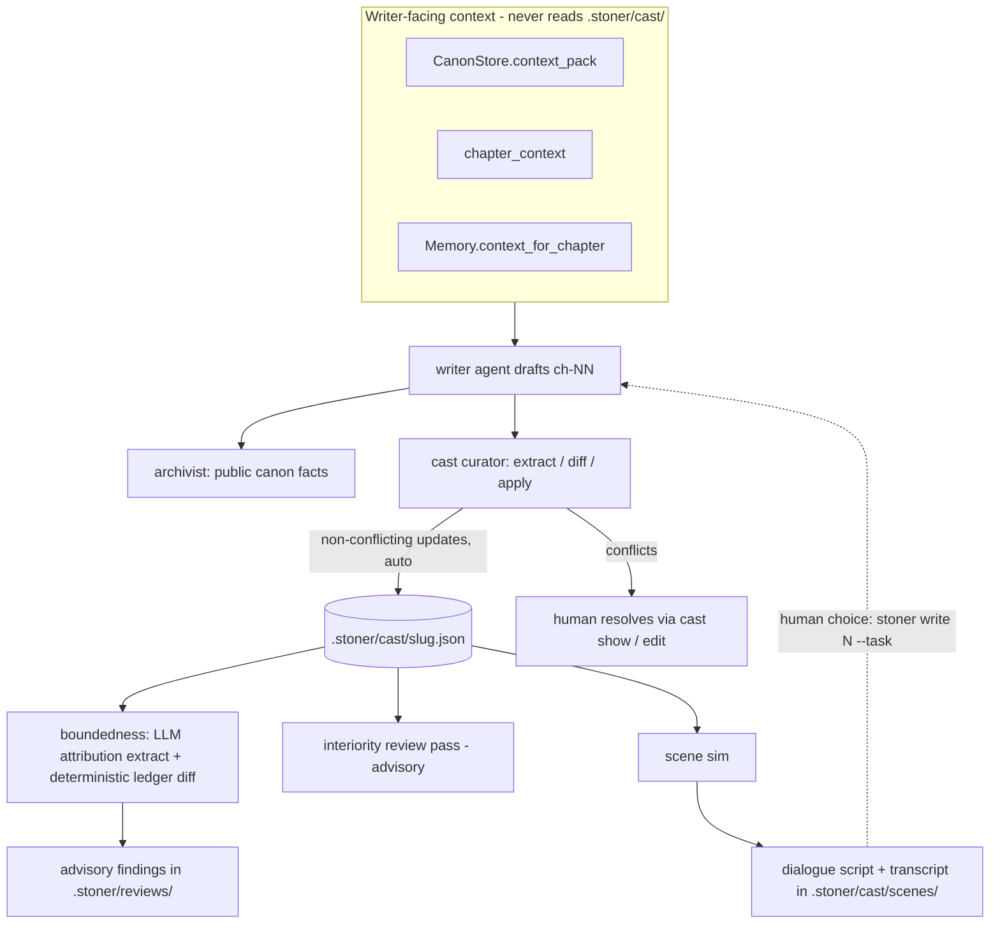
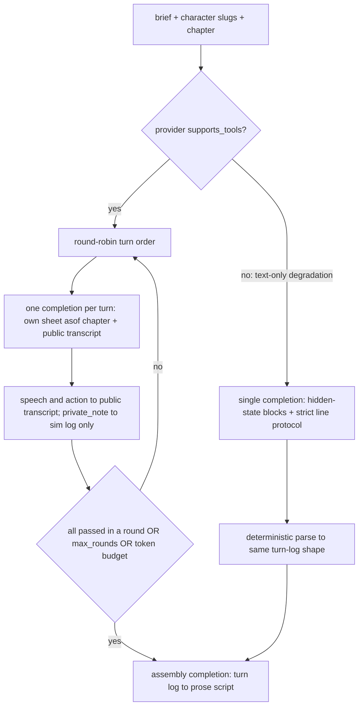

## Summary

Major characters become persistent agents with private state the writer agent cannot see: what they know (keyed to the chapter where they learned it), want, lie about, and refuse to say. Private state lives in `.stoner/cast/<slug>.json`, is maintained by an archivist-style extract/diff/apply step after each chapter, powers a budgeted scene-simulation loop that generates dialogue by collision, and feeds a machine-checkable knowledge-boundedness check plus an advisory `interiority` review pass.

---

## Problem Frame

The harness currently models characters as canon files: a hard-fact frontmatter sheet plus soft prose sections (`canon/characters/<slug>.md`). Everything in canon flows into the writer's context via `CanonStore.context_pack` — which is exactly why canon cannot hold secrets. A character's unspoken want, active lie, or privately-held knowledge that reaches the writer prompt gets narrated onto the page; subtext dies the moment the narrator can see it. And nothing enforces the timeline: a character can act in chapter 4 on information the book only gives them in chapter 9, and no pass today would notice, because no ledger records when each character learned each fact.

This feature builds the missing layer: per-character private state stored outside canon, a timeline-bounded knowledge ledger that makes anachronistic knowledge a detectable diff rather than a vibe, and a scene-simulation loop where character agents — each seeing only its own sheet — collide to produce dialogue with genuine information asymmetry. Dramatic irony, subtext, and characters who surprise their author become mechanics instead of accidents.

---

## Requirements

Private state and privacy boundary:

- R1. Each major character has a cast sheet at `.stoner/cast/<slug>.json` holding private state: knowledge ledger, wants (stated vs. real), fears, active lies, and refusals. Sheets are pydantic-validated JSON.
- R2. Writer-facing context assembly never includes cast private state. `CanonStore.context_pack`, `pipelines/common.chapter_context`, `canon/memory.py`, and `review/passes.build_context` read canon, memory, outline, and manuscript only — never `.stoner/cast/`. A regression test asserts a project with populated cast sheets produces writer context containing none of the private-state text.
- R3. No agent tool in `engine/tools.default_registry` exposes cast private state; humans inspect sheets via `stoner cast show`.
- R4. Cast sheets can be created from an existing canon character (`stoner cast init <name>`) without a model call.

Knowledge boundedness:

- R5. Every knowledge entry carries `learned_in` (chapter number; 0 = pre-story backstory), how it was learned, and a supporting quote or source note.
- R6. The boundedness check core is a deterministic pure function: given attribution records (character, knowledge-entry id, quote) for chapter N and the cast sheets, any referenced entry with `learned_in > N` is a violation finding. Fully unit-testable with no provider.
- R7. Attribution extraction from a drafted chapter is LLM-assisted (the model maps dialogue/action references to knowledge-entry ids), accepts `provider=` injection, and never gates: because the check's inputs are LLM-extracted, all boundedness findings are advisory (invariant 2).
- R8. References to knowledge no ledger records surface as info-severity "unlogged knowledge" findings pointing at `stoner cast update`.

Cast state maintenance:

- R9. After a chapter, an extract/diff/apply step mirrors `canon/archivist.py`: pure assemble/parse/diff/apply module that never calls a provider; the pipeline owns the model call; conflicts with existing sheet state surface for the human and are never auto-overwritten.
- R10. `run_write` optionally runs the cast update after the archivist stage, gated on `cast.auto_update` config and the presence of cast sheets; absent sheets, the pipeline behaves exactly as today.
- R11. Every mutating cast action appends a ledger line under the `cast.*` prefix.

Scene simulation:

- R12. A scene sim puts N character agents in a room: deterministic round-robin turns, each turn one plain completion whose system prompt carries only that character's private sheet (knowledge bounded to the scene's chapter) plus the public scene transcript. No character ever sees another's sheet.
- R13. Scene sims are budgeted like `engine/agent.py`: max rounds and a total token budget from config; the transcript is written to disk incrementally so an interrupted sim leaves usable state.
- R14. Per-turn private notes (what the character thinks but does not say) are logged to the sim transcript only and never enter the public transcript other agents see.
- R15. Text-only providers (`supports_tools=False`: codex/claude CLIs) degrade to a single-call role-play: one completion containing per-character hidden-state blocks and a strict line-oriented output protocol parsed deterministically (invariant 7).
- R16. The sim ends with one assembly completion that renders the turn log as a prose dialogue script. Output is printed and saved under `.stoner/cast/scenes/`; the sim never writes manuscript files — the human feeds the script to `stoner write N --task` or drafts from it.

Review integration:

- R17. An `interiority` entry is added to `review.passes.PASSES` (additive): an advisory LLM pass checking the draft against cast sheets for refusals violated without cause, lies dropped without an exposure beat, wants contradicted, and missed dramatic-irony opportunities. It is not added to the default `review_passes` config list.

Configuration and CLI:

- R18. One new config sub-model `cast: CastConfig` on `StonerConfig`; no other config fields.
- R19. A `stoner cast` command group (`init`, `list`, `show`, `update`, `check`, `scene`) registered from `cli/cast_cmds.py` via `register(app)`.
- R20. No new dependencies; core deps only.

---

## Key Technical Decisions

- Private state in `.stoner/cast/` JSON, not `canon/`: canon is the writer's context source by construction (`context_pack`), so privacy must be structural, not prompt-discipline. Enforcement lives in context assembly — `CanonStore.context_pack` walks only `canon/`, `chapter_context` composes canon + memory + beats + prior tail, `build_context` mirrors it — and none of those code paths is modified to read cast state. A regression test pins this (invariants 3, 6). The public face of a character (appearance, role, voice) stays in canon; the sheet holds only what the narrator must not know.

- JSON sheets, not markdown-with-frontmatter: cast state is machine-diffed private data with no prose body a human should wordsmith, so the canon frontmatter/body split does not apply. `.stoner/memory.json` is the precedent for structured harness state under `.stoner/`. Human edits are still legal and respected: the curator diffs before applying and surfaces conflicts rather than overwriting (invariant 3's conflict rule, applied to cast state).

- Boundedness = LLM extraction feeding a deterministic ledger diff: the model does the one thing regex cannot (map "Ruth mentions the foreclosure notice" to knowledge entry `k004`), and the check itself — `learned_in > current chapter` — is pure arithmetic over the ledger, unit-testable without a provider. Because the extraction step is LLM-assisted, findings are advisory and never gate (invariant 2); the slop gate stays the only deterministic-input gate. Severity policy: a boundedness violation is major, escalating to critical when the violated fact is another character's secret.

- `cast.auto_update` defaults to true: the hook is gated on cast sheets existing, so a project pays nothing until it opts into the cast system at all; once a project has opted in, silent sheet staleness is a worse failure than the archivist-scale cost the curator adds to each `stoner write`.

- Scene sim uses plain completions, not the tool loop: character turns need no tools — each turn is one `CompletionRequest` built from the private sheet and public transcript, mirroring `pipelines/common.call_model`. Turn order and the stop rule are deterministic (round-robin; scene ends when every character passes in a full round, or budgets trip), so no moderator model calls are spent on orchestration. One assembly call at the end converts the turn log to prose. Cost: N characters x rounds + 1 calls, capped by `scene_max_rounds` and `scene_token_budget` (invariant 4: agents get canon pack + bounded sheet digests + the scene transcript, never the manuscript).

- Text-only degradation is a single-call role-play (invariant 7): CLI-backed providers re-send the whole conversation per subprocess call, so a 3-character, 8-round sim would be 25 slow calls with protocol drift risk. When `provider.supports_tools` is false (the same signal `draft_chapter` branches on), the sim becomes one completion: the prompt carries each character's hidden-state block labeled "known only to X — other characters must not act on this," and demands a strict line protocol (`SLUG> speech`, `SLUG [action] ...`, `SLUG (private)> note`) parsed by regex into the same turn-log shape the multi-call path produces.

- Curator mirrors `canon/archivist.py` exactly: pure assemble/parse/diff/apply module that never calls a provider; `interiority/pipeline.py` owns the `call_model` invocation. Diff rules make conflicts explicit — a want shift where wants are already set, a lie exposure already recorded in a different chapter, a duplicate fact with a different `learned_in` — and `apply(auto=False)` is a dry run (invariant 3 discipline on private state).

- No new `ModelRoles` field: scene turns and assembly resolve against `writer` (they draft prose), curator and attribution extraction resolve against `archivist` (they extract structured facts). `foundation.py` resolving against `writer` is the precedent; adding a `cast` role to `ModelRoles` remains the sanctioned upgrade path if needed later.

- Chapter number is the timeline unit: `learned_in` and scene `chapter` are chapter numbers, matching how `timeline.md` (`ch-NN`), memory, and the archivist already reference story time. In-chapter ordering is out of scope; a violation is only flagged across chapter boundaries.

---

## High-Level Technical Design



Scene simulation loop:



Cast sheet shape (directional, feature-local pydantic models):

```
{
  "slug": "ruth-vann",
  "name": "Ruth Vann",
  "canon_ref": "canon/characters/ruth-vann.md",
  "wants": {"stated": "...", "real": "..."},
  "fears": ["..."],
  "knowledge": [
    {"id": "k004", "fact": "...", "learned_in": 3, "how": "witnessed|told|inferred|backstory",
     "source": "<quote or note>", "secret": true}
  ],
  "lies": [
    {"id": "l001", "claim": "...", "truth": "k004", "audience": "everyone|<slug>",
     "active": true, "exposed_in": null}
  ],
  "refusals": [{"topic": "...", "reason": "..."}],
  "seed_notes": "<Wants / Fears section copied from canon at init>",
  "last_updated_chapter": 5,
  "updated_at": 1730000000.0
}
```

Knowledge-entry ids are per-sheet sequential (`k001`, `k002`, ...) and assigned by the store, never by the model. The boundedness extractor receives each character's ledger as an id/fact table, returns attributions `{character, entry_id|null, quote, basis}`, and the pure checker diffs `learned_in` against the chapter under review.

---

## Integration Surface

- CLI: `stoner cast` group — `cast init <name>`, `cast list`, `cast show <slug>`, `cast update <n>`, `cast check <n>`, `cast scene` — in `src/stoner/cli/cast_cmds.py` exposing `register(app)`; one registration line added at the bottom of `src/stoner/cli/main.py`.
- config.py: one new field `cast: CastConfig` on `StonerConfig`. `CastConfig` fields: `auto_update: bool = True`, `scene_max_rounds: int = 8`, `scene_token_budget: int = 60000`, `scene_mode: str = "auto"` (auto|multi|single), `sheet_digest_chars: int = 4000`.
- types.py: no changes. All cast models are feature-local in `src/stoner/interiority/`. `Finding`, `Severity`, `Usage` reused as-is.
- project.py DIRS: no changes (cast store mkdirs on demand). New `.stoner/` files: `.stoner/cast/<slug>.json`, `.stoner/cast/scenes/<ts>-<name>.json`, reports at `.stoner/reviews/cast-ch-NN-<ts>.json` (+ `.md`).
- canon: no new artifact types, templates, or CanonStore methods. Read-only use of `get_character`/`find_character_by_name`/`extract_section` for `cast init` seeding.
- ledger actions: `cast.init`, `cast.update`, `cast.check`, `cast.scene.start`, `cast.scene.turn`, `cast.scene.done`.
- review: one additive `PASSES["interiority"]` entry in `src/stoner/review/passes.py` whose prompt builder imports a digest helper from `stoner.interiority`. No PassContext changes. Not added to the default `review_passes` list.
- engine/tools.py: no changes — deliberately no agent tool exposes cast private state (R3).
- engine/prompts/: five new templates — `cast_update.md`, `cast_attribution.md`, `cast_character.md`, `cast_scene_single.md`, `cast_scene_assemble.md`.
- ModelRoles: no new roles. Scene turns/assembly resolve against `writer`; curator and attribution extraction resolve against `archivist`.
- UI: none (deferred; see Scope Boundaries).
- pyproject: no new extras or deps.
- pipelines: one additive hook in `src/stoner/pipelines/write.py` `run_write` — after the archivist stage, run the cast update when `config.cast.auto_update` is true and cast sheets exist; conflicts appended to `WriteResult.notes`.
- Dependencies on other feature plans: none. Other plans may consume cast sheets if present (Tournaments could treat scene takes as candidates; Writers' Room editors could cite sheets) — all "consumes if present" from their side; nothing here requires them.

---

## Implementation Units

### U1. Cast sheets: models, store, privacy boundary

**Goal**: Pydantic cast-sheet models and a `CastStore` over `.stoner/cast/`, with the privacy boundary pinned by tests.

**Requirements**: R1, R2, R3, R4, R5 (schema half), R11 (init ledger).

**Dependencies**: none.

**Files**:
- `src/stoner/interiority/__init__.py`
- `src/stoner/interiority/sheet.py` (CastSheet, KnowledgeEntry, Lie, Refusal, Wants models)
- `src/stoner/interiority/store.py` (CastStore: load/save/list, init_from_canon, knowledge_asof, private_digest, review_digest)
- `tests/test_interiority.py`

**Approach**: `CastStore(project)` resolves paths through `WritingProject.resolve` (path jail), mkdirs `.stoner/cast/` on demand, and validates JSON through the pydantic models on load (corrupt file -> actionable error naming the file, matching `BookState`'s tolerance posture). `init_from_canon(name)` finds the canon character via `CanonStore.find_character_by_name`, creates a sheet with empty ledgers, and copies the canon `## Wants / Fears` section (via `extract_section`) into `seed_notes` for the human to structure — no model call. `knowledge_asof(sheet, chapter)` filters entries to `learned_in <= chapter`. `private_digest(sheet, chapter, max_chars)` renders the bounded view for scene prompts (drop oldest non-secret entries first when over budget). `review_digest(project, chapter, max_chars)` renders all sheets with `learned_in` labels for checker roles — checkers see private state by design; the privacy boundary is writer-facing context only. Store assigns knowledge/lie ids sequentially.

**Patterns to follow**: `src/stoner/canon/memory.py` (state-file helper over project read/write, cap-with-drop-oldest), `src/stoner/canon/store.py` `slugify`/`extract_section`, `src/stoner/project.py` path jail.

**Test scenarios**:
- Round-trip: create sheet, save, load; fields and id sequence survive.
- `init_from_canon` on a scaffolded project with a character file: sheet created with `canon_ref` and `seed_notes` populated; second call refuses to clobber the existing sheet.
- `init_from_canon` with unknown name: actionable error.
- `knowledge_asof(4)` excludes an entry with `learned_in: 9`, includes `learned_in: 0` backstory.
- `private_digest` respects `max_chars` and never includes another character's data.
- Privacy regression: project with populated cast sheets containing a sentinel string — `CanonStore.context_pack()`, `chapter_context(project, n)` values, and `build_context(project, n)` fields all lack the sentinel.
- Corrupt sheet JSON: load raises an error naming the file.

**Verification**: `pytest tests/test_interiority.py` green; `ruff check` and `mypy` clean on the new module.

### U2. Cast curator: extract/diff/apply after a chapter

**Goal**: The archivist-mirror for private state: prompt assembly, tolerant parsing, conflict diffing, and dry-run/auto apply.

**Requirements**: R9, R10 (pipeline function half), R11.

**Dependencies**: U1.

**Files**:
- `src/stoner/interiority/curator.py` (pure: build prompt, parse, diff, apply)
- `src/stoner/interiority/pipeline.py` (run_cast_update: owns the call_model invocation)
- `src/stoner/engine/prompts/cast_update.md`
- `tests/test_interiority.py` (extend)

**Approach**: `cast_update_prompt(chapter_text, sheets_digest)` asks STRICT JSON keyed by slug: `new_knowledge` (fact, how, quote, secret), `want_shift` (or null), `new_lies`, `lie_updates` (id, exposed, quote), `refusal_updates`. Parse with the archivist's tolerant-candidates approach. Diff rules producing `CastConflict` records: want shift when wants already set; lie exposure when `exposed_in` already set to a different chapter; new fact case-fold-matching an existing entry's fact with a different `learned_in`; unknown lie/entry ids become not-applied notes, never invented. `apply(store, parsed, chapter, auto=False)` returns a `CastApplyResult` (applied, conflicts, skipped) and only touches disk when `auto=True`; new knowledge gets `learned_in = chapter` and store-assigned ids. `run_cast_update(project, number, model=None, provider=None, auto=False)` reads the chapter, builds the digest (capped ~8k chars like the archivist's canon digest), calls `call_model(role="archivist")`, applies, ledgers `cast.update` with applied/conflict counts.

**Patterns to follow**: `src/stoner/canon/archivist.py` end to end (schema instructions, `parse_archivist_json` candidates, `Conflict`/`ApplyResult`, auto=False dry-run), `src/stoner/pipelines/write.py` `run_archive` (pipeline owns the model call, ledger entry shape).

**Test scenarios**:
- Scripted provider returns valid JSON with one new fact per character: dry run reports would-apply without disk writes; `auto=True` writes entries with `learned_in` = chapter and fresh ids.
- Want shift against a sheet with wants already set: conflict surfaced, sheet unchanged even with `auto=True`.
- Lie exposure for an already-exposed lie (different chapter): conflict; same chapter: idempotent no-op (re-running on a redraft must not duplicate, mirroring the archivist's timeline dedup).
- Unknown lie id in `lie_updates`: recorded as not-applied with reason.
- Garbage model output: parse error raised with actionable message; nothing written.
- Ledger assertion: `cast.update` line appended with counts.

**Verification**: extended `tests/test_interiority.py` green; a manual dry-run against a fixture project prints a readable conflict table.

### U3. Knowledge boundedness check

**Goal**: The machine-checkable core: LLM attribution extraction feeding a deterministic ledger diff, surfaced as advisory findings.

**Requirements**: R5, R6, R7, R8, R11.

**Dependencies**: U1 (parallel with U2).

**Files**:
- `src/stoner/interiority/boundedness.py` (pure: attribution prompt, parse, `check_boundedness`)
- `src/stoner/interiority/pipeline.py` (extend: run_cast_check)
- `src/stoner/engine/prompts/cast_attribution.md`
- `tests/test_interiority.py` (extend)

**Approach**: The prompt gives the chapter text plus, per character, an id/fact/learned_in table of their full ledger, and asks STRICT JSON attributions: `{character, entry_id or null, quote, basis: speaks|acts|thinks}` — every place a character's dialogue, action, or interior narration relies on a ledger fact, plus null-id records for knowledge the ledger does not cover. `check_boundedness(attributions, sheets, chapter)` is pure: resolved entry with `learned_in > chapter` -> Finding (source `cast:boundedness`, severity major; critical when the entry is another character's `secret: true` knowledge — acting on an unlearned secret is the worst class of leak); null-id -> info "unlogged knowledge; run stoner cast update"; unknown entry id -> info parse note. Quotes located via `review.passes.locate_span`. `run_cast_check(project, number, ...)` calls `call_model(role="archivist")`, runs the pure check, saves `.stoner/reviews/cast-ch-NN-<ts>.json` + `.md` (report shape mirroring `review/runner.py` saved reports), ledgers `cast.check`. Findings never gate.

**Patterns to follow**: `src/stoner/review/passes.py` (`extract_json`, `locate_span`, Finding construction, `_MAX_FINDINGS_PER_PASS` capping), `src/stoner/review/runner.py` (report persistence shape), `src/stoner/canon/archivist.py` (prompt/schema discipline).

**Test scenarios**:
- Pure check: attribution to entry `learned_in: 9` reviewed at chapter 4 -> major finding; same at chapter 9 or 10 -> no finding; `learned_in: 0` backstory -> never flags.
- Secret escalation: violated entry marked `secret: true` on another character's sheet referenced by this character -> critical.
- Null entry_id attribution -> info finding naming `stoner cast update`.
- Attribution naming a slug with no sheet -> skipped with a note, no crash.
- End-to-end with scripted provider: report JSON + md written under `.stoner/reviews/`, ledger `cast.check` appended, findings advisory (no exit-code/gate semantics).
- Empty cast dir: `run_cast_check` returns an empty report with a note, no model call.

**Verification**: extended `tests/test_interiority.py` green; the pure `check_boundedness` tests pass with no provider constructed.

### U4. Scene simulation loop (multi-call)

**Goal**: Character agents collide: round-robin plain completions, per-character private context, budgets, incremental transcript, assembly to a prose script.

**Requirements**: R12, R13, R14, R16, R11.

**Dependencies**: U1 (parallel with U2/U3).

**Files**:
- `src/stoner/interiority/scene.py` (run_scene, SceneResult, turn-log model, transcript writer)
- `src/stoner/engine/prompts/cast_character.md`
- `src/stoner/engine/prompts/cast_scene_assemble.md`
- `tests/test_interiority_scene.py`

**Approach**: `run_scene(project, slugs, chapter, brief, model=None, provider=None)` loads sheets, builds each character's system prompt from `cast_character.md`: canon voice section (public), `private_digest(sheet, chapter)` under an explicit "PRIVATE — never state directly; let it shape what you say, dodge, and lie about" header, the scene brief, and the strict per-turn STRICT-JSON protocol `{speech, action, private_note, pass}`. Turns proceed round-robin; each turn is one `CompletionRequest` (via the same resolve-provider dance as `call_model`, writer role) whose user message is the public transcript plus "your move". `speech`/`action` append to the public transcript; `private_note` goes only to the on-disk sim log. Stop when every character passes within one full round, `scene_max_rounds` is reached, or summed usage exceeds `scene_token_budget` (note appended, mirroring `agent.py` budget-stop text). Transcript JSON written incrementally after every turn (mirror `_Transcript` in `engine/agent.py`) to `.stoner/cast/scenes/<ts>-ch-NN-<slugs>.json`; ledger `cast.scene.start` / `cast.scene.turn` (per turn, with speaker and pass flag) / `cast.scene.done`. Unparseable turn output: retry once with a format correction (textproto's `FORMAT_CORRECTION` posture), then record the raw text as speech and continue — a sim must degrade, not abort. Assembly: one writer-role completion over the public turn log via `cast_scene_assemble.md`, returning the prose script stored in `SceneResult.script` and the transcript file.

**Patterns to follow**: `src/stoner/engine/agent.py` (`_Transcript` incremental save, budget stop, ledger-per-turn), `src/stoner/pipelines/common.py` (`call_model`, `render_prompt`), `src/stoner/engine/textproto.py` (format-correction retry posture).

**Test scenarios**:
- Two-character sim with a scripted provider queue: turns alternate, public transcript contains speech/action only, `private_note` text appears in the saved transcript JSON but never in any subsequent request's messages (assert on the provider's captured requests).
- Sheet isolation: character A's request messages never contain character B's private digest sentinel.
- All-pass round ends the scene before `scene_max_rounds`.
- Token budget exhaustion mid-scene: stops with a budget note; transcript file valid JSON.
- Malformed turn JSON: one retry, then raw-text fallback; sim completes.
- Assembly call receives the public log and `SceneResult.script` carries its output; `cast.scene.*` ledger lines present.
- Unknown slug in `slugs`: actionable error before any model call.

**Verification**: `pytest tests/test_interiority_scene.py` green; a fixture-project sim with a scripted provider produces a readable script and a well-formed transcript file.

### U5. Single-call scene degradation and mode selection

**Goal**: The invariant-7 path: one completion role-plays the whole collision with hidden-state blocks and a strict line protocol; mode selection wires auto/multi/single.

**Requirements**: R15, R16 (parity half).

**Dependencies**: U4.

**Files**:
- `src/stoner/interiority/scene.py` (extend: single-call branch, protocol parser, mode selection)
- `src/stoner/engine/prompts/cast_scene_single.md`
- `tests/test_interiority_scene.py` (extend)

**Approach**: `cast_scene_single.md` carries the brief, each character's hidden-state block ("known only to RUTH-VANN; other characters must not reference or act on it"), the boundedness rule ("no character may use knowledge their block does not contain"), and the output protocol: exactly one fenced ```scene block of lines `SLUG> speech`, `SLUG [action] ...`, `SLUG (private)> note`. A deterministic regex parser converts the block to the same turn-log shape U4 produces (tolerant of surrounding prose, like `textproto.parse_response`; unparseable lines recorded as parse notes). Mode selection in `run_scene`: `scene_mode == "auto"` -> single-call when `provider.supports_tools` is false, multi otherwise; explicit `"multi"`/`"single"` override. Single-call output flows into the same transcript file, ledger entries (`cast.scene.turn` per parsed turn), and assembly call, so `SceneResult` is mode-invariant.

**Patterns to follow**: `src/stoner/engine/textproto.py` (fenced-block protocol, tolerant parse with visible parse-error notes), `src/stoner/pipelines/write.py` `draft_chapter` (the `supports_tools` branch as the degradation trigger).

**Test scenarios**:
- Parser: well-formed scene block with speech/action/private lines -> correct turn log; private lines excluded from the public log.
- Parser tolerance: prose before/after the fence; a malformed line becomes a parse note, rest survives; missing fence entirely -> actionable error.
- Mode auto with a `supports_tools=False` scripted provider -> exactly one completion issued; with `supports_tools=True` -> multi path.
- Explicit `scene_mode: "single"` forces single-call on a tools-capable provider.
- Parity: single-call and multi-call runs produce the same `SceneResult` field shape and transcript schema.

**Verification**: extended `tests/test_interiority_scene.py` green; parser unit tests pass with no provider.

### U6. Interiority review pass

**Goal**: The advisory LLM pass: check a drafted chapter against cast sheets for broken interiority mechanics.

**Requirements**: R17.

**Dependencies**: U1 (parallel with U2-U5).

**Files**:
- `src/stoner/review/passes.py` (additive: `_interiority_prompt`, `PASSES["interiority"]` entry)
- `tests/test_interiority.py` (extend)

**Approach**: `_interiority_prompt(ctx)` imports the U1 `review_digest` helper and builds the digest from `ctx.project` for `ctx.chapter` — no PassContext change, no `build_context` change. Task: flag refusals violated without an on-page cause, active lies contradicted without an exposure beat, stated-vs-real want collapses (character baldly narrating their real want), and missed dramatic-irony setups (reader-known secrets a scene ignores). Empty cast dir -> the prompt states no cast sheets exist and instructs an empty findings list. Standard `_JSON_INSTRUCTIONS` + `_make_standard_parser("interiority")`, source `review:interiority`, severity advisory-only per invariant 2. Users opt in via `review_passes` in `stoner.yaml`; the default list is untouched.

**Patterns to follow**: `src/stoner/review/passes.py` `_continuity_prompt`/`_voice_prompt` (system+task shape, standard parser, registry entry).

**Test scenarios**:
- `PASSES["interiority"]` present; `build_prompt` on a project with sheets embeds sheet content in the user prompt and standard JSON instructions.
- Empty cast dir: prompt contains the no-sheets instruction; parser on an empty-findings response returns [].
- Parser: scripted response with two findings -> Finding objects with source `review:interiority`.
- `run_review(passes=["interiority"])` end-to-end with a scripted provider: report saved, findings advisory, other default passes unaffected.

**Verification**: extended `tests/test_interiority.py` green; existing `tests/test_review.py` still green (registry addition is non-breaking).

### U7. CLI, config, and write-pipeline hook

**Goal**: `stoner cast ...` command group, `CastConfig`, the gated `run_write` hook, and user docs.

**Requirements**: R10 (hook half), R18, R19, R4/R11 (surface half).

**Dependencies**: U2, U3, U4, U5.

**Files**:
- `src/stoner/cli/cast_cmds.py`
- `src/stoner/cli/main.py` (one `cast_cmds.register(app)` line)
- `src/stoner/config.py` (add `CastConfig` + `cast` field)
- `src/stoner/pipelines/write.py` (post-archivist gated cast update)
- `docs/cast.md`
- `tests/test_cast_cli.py`

**Approach**: `cast_cmds.py` mirrors `book_cmds.py`: module-level consoles, `_project()`, `_fail()`, `register(app)` creating a nested `cast_app` typer (mirroring `canon_app` in main.py). Commands: `init <name>` (no network; ledger `cast.init`), `list`/`show <slug>` (rich tables; `show` prints wants/lies/refusals and the knowledge ledger with `learned_in`), `update <n> [--auto/--dry-run] [--model]` (dry-run default; conflict table like the archivist CLI posture), `check <n> [--model]` (prints findings table + report path; exit 0 regardless — advisory), `scene --who a,b --chapter N --brief "..." [--mode auto|multi|single] [--model]` (prints script, transcript path). Heavy imports inside command bodies. `run_write` hook: after `run_archive`, when `config.cast.auto_update` and `CastStore.list()` is non-empty, call `run_cast_update(auto=True)`; conflicts append one summary line to `WriteResult.notes`; a curator failure degrades to a note, never fails the write (mirroring review-runner's degrade-don't-abort posture). `docs/cast.md` documents the workflow, the privacy model, and the boundedness check, following `docs/review.md` structure.

**Patterns to follow**: `src/stoner/cli/book_cmds.py` (register/module shape), `src/stoner/cli/main.py` `canon_app` (nested noun sub-app), `tests/test_cli.py` (CliRunner + monkeypatch.chdir, no-network commands).

**Test scenarios**:
- `stoner cast init "Ruth Vann"` in a scaffolded tmp project with that canon character: sheet file created, `cast.init` ledgered; repeat run refuses.
- `cast list`/`cast show` render without error on populated and empty cast dirs.
- `cast update 1 --auto` with an injected scripted provider (monkeypatched pipeline): applies and prints counts; dry-run default prints would-apply without writing.
- `run_write` with cast sheets present + scripted provider: cast update runs after archivist; with `auto_update: false` or no sheets: no cast calls issued (assert on provider request count).
- Curator failure inside `run_write`: pipeline completes; `WriteResult.notes` carries the degrade note.
- Config: `stoner.yaml` with a `cast:` block round-trips through `StonerConfig.load`; defaults hold when absent.

**Verification**: `pytest tests/test_cast_cli.py tests/test_pipeline.py` green; full suite green (227 existing tests unaffected); `stoner cast --help` lists the six commands.

---

## Scope Boundaries

Non-goals:

- No automatic injection of private-state hints into the writer prompt. Subtext reaches the manuscript through scene scripts the human chooses to feed `stoner write N --task`, or through the writer reading the assembled dialogue; the narrator never sees sheets.
- No agent tool for cast state in `default_registry` — the writer must not be able to query what it must not know.
- No in-chapter timeline granularity: boundedness is chapter-resolution only.
- No automatic backfill of knowledge ledgers from an existing manuscript; `stoner cast update <n>` per chapter is the migration path.
- No LLM-assisted `cast init` seeding (deterministic seed from canon only).
- No gate anywhere in this feature: every finding is advisory (invariant 2).
- Parking lot (out of scope across all plans): series-spanning canon, voice fine-tunes, nonfiction mode, two-writers-one-canon.

### Deferred to Follow-Up Work

- UI: a cast panel (sheets, ledger timeline, scene transcripts) in `ui/static/index.html` plus read-only endpoints.
- Feeding scene takes into Draft Tournaments as candidate drafts (consumes seam owned by plan 003).
- A `cast` entry in `ModelRoles` if writer/archivist resolution proves too coarse.
- LLM-assisted sheet seeding and a "propose cast from canon" batch command.
- Cross-character contradiction sweeps (two characters' ledgers disagreeing about a shared event).
- A human-curated scene library export (`stoner cast scene --save notes/scenes/<name>.md`). Not in v1: scene state already persists under `.stoner/cast/scenes/` and session transcripts under `.stoner/sessions/`.

---

## Assumptions

- Chapter number is an adequate timeline proxy; the book's story time maps monotonically to chapter order (flashbacks are handled by `learned_in: 0` backstory entries or human ledger edits).
- Scene sims are human-initiated (`stoner cast scene`), short, and cheap to re-run; incremental transcript saves satisfy the resumability invariant without a resume command.
- `provider.supports_tools == False` is the right degradation trigger for scene mode, matching `draft_chapter`'s existing branch; per-turn plain completions are acceptable on all tools-capable providers.
- The `archivist` role model is capable enough for curator extraction and attribution mapping; no dedicated role needed at ship.
- Checker roles (curator, boundedness, interiority pass) seeing private state is correct — privacy is a writer-facing boundary, not a global one; the human sees everything via `cast show`.
- Roughly 8k chars of cast digest per curator/check call keeps costs in line with the archivist stage.
- One test file split (`test_interiority.py`, `test_interiority_scene.py`, `test_cast_cli.py`) fits the one-file-per-subsystem convention given the feature's breadth.

---

## Risks & Dependencies

- Attribution extraction quality bounds the boundedness check's usefulness: a model that misses references produces false negatives. Mitigation: the check is advisory, unmatched references still surface as info findings, and the pure checker is independently testable so extraction can be swapped or improved without touching the diff logic.
- Single-call scene mode leaks less asymmetry than the multi-call path (one model holds all secrets). Mitigation: explicit hidden-state framing plus the boundedness rule in-prompt; documented as a degradation, not parity.
- Curator drift: repeated redrafts of a chapter could accrete near-duplicate knowledge entries. Mitigation: case-folded duplicate detection diffs to conflict/skip; same-chapter re-runs are idempotent by rule (U2).
- Shared-seam touches (`config.py`, `cli/main.py`, `review/passes.py`, `pipelines/write.py`) are one-field/one-line/one-entry/one-hook additive; the integration plan (011) owns merge ordering across the ten features.
- No hard dependency on any other feature plan.
