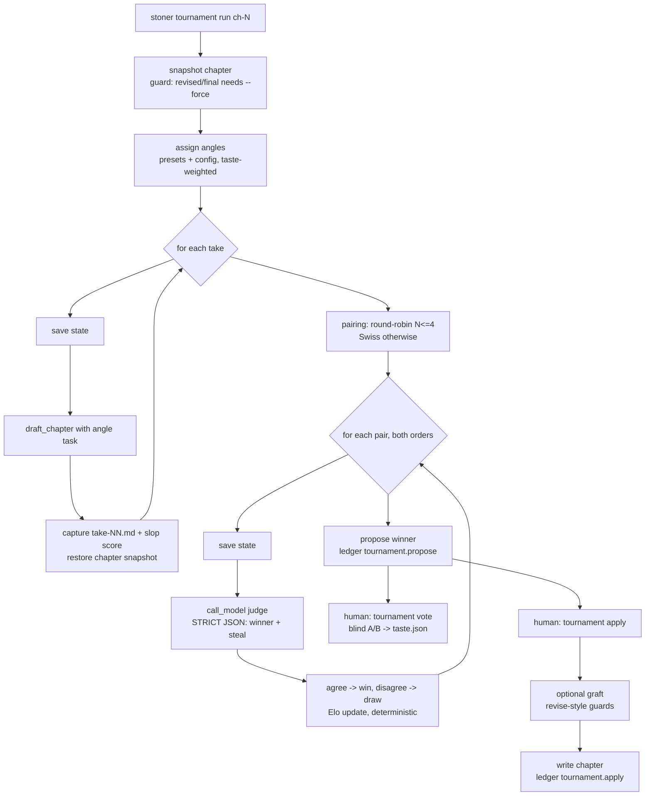

## Summary

Never draft once. `stoner tournament run <chapter>` drafts N takes of a chapter from deliberately different angles, judges them in blind pairwise comparisons with Elo standings, proposes a winner the human confirms, and grafts the losers' named best moves onto the champion. The writer's own blind votes accumulate into a per-project taste profile that reweights future judging.

---

## Problem Frame

The harness currently drafts each chapter exactly once (`run_write` in `src/stoner/pipelines/write.py`), then polishes that single take. Polishing cannot rescue a take that started from the wrong angle — wrong entry point, wrong distance, wrong mode. Variance is the cheapest quality lever an LLM harness has, and it is unused.

Judging multiple takes is where naive designs die: absolute 1-10 LLM scoring "collapses into a ~2-point band; comparative methods work — Elo tournaments between chapters" (docs/research/RESEARCH.md:18-20, the milestone-1 finding). So the judge is only ever asked "A or B", ratings are pure arithmetic, and every verdict is advisory: the human confirms the winner before it touches the manuscript (hard invariants 1 and 2).

Openings and endings carry disproportionate weight — they decide whether a reader starts and whether the book lands — so they default to larger tournaments. And the writer is the only judge that ultimately matters: blind A/B votes train `.stoner/taste.json`, so the project learns what its author actually prefers instead of what a model prefers.

---

## Requirements

Drafting takes:

- R1. `run_tournament(project, chapter, ...)` drafts N takes of one chapter, each from a distinct angle, reusing `draft_chapter` mechanics (tool loop for tool providers, single-shot for text-only providers, 200-word refusal guard).
- R2. Angle presets ship built in (at minimum: in-scene vs aftermath, POV-tight vs POV-distant, dialogue-led vs interior-led, late-entry, image-first) and projects can define additional angles in `stoner.yaml`; each take records its assigned angle.
- R3. Takes are stored under `.stoner/tournaments/<id>/take-NN.md` with frontmatter (angle, words, slop score); the manuscript chapter file is left exactly as it was before the tournament until a human applies a winner.
- R4. Default N comes from config; ch-01 and the final planned chapter default to a larger N via per-slot config (`opening`, `ending`).

Judging:

- R5. Every judgment is one `call_model` pairwise comparison returning STRICT JSON with a forced A/B verdict plus one named "steal" (the loser's single strongest specific move). No numeric scores anywhere in the prompt or the parse (invariant 1).
- R6. Position bias is mitigated by judging each pair twice with presentation order swapped; the two verdicts must agree to count as a win — disagreement records a draw.
- R7. Standings are Elo, computed by deterministic code from comparison outcomes only; takes are presented to the judge blind (no angle names, no slop scores, anonymous A/B labels).
- R8. Pairing is full round-robin for N <= 4 and Swiss-style (pair adjacent standings, no rematches) for larger N; total judge calls never exceed a configurable comparison budget, and a cumulative token budget stops the run early with current standings intact.
- R9. The tournament result is a PROPOSED winner. Nothing writes to `manuscript/` until `stoner tournament apply` (or the UI-confirmed equivalent) is invoked by the human (invariant 2).

Grafting:

- R10. After a winner is confirmed, an optional graft step folds the accumulated named steals from losing takes into the winner via one revise-style call, guarded exactly like `review/revise.py`: sentinel extraction (`BEGIN CHAPTER`/`END CHAPTER`), refusal when the result is empty or under 1/4 of the original word count, original never destroyed.

Writer's votes and taste:

- R11. `stoner tournament vote` (CLI) and the UI expose blind A/B voting on take pairs: randomized presentation order, angles and judge verdicts hidden until after the vote.
- R12. Votes persist to `.stoner/taste.json`: full vote history plus derived per-angle win/loss stats and per-judge-model agreement stats. Plain JSON, no ML dependencies.
- R13. The taste profile reweights future tournaments two ways: a rendered taste digest is injected into the judge prompt as an advisory prior, and angle selection deterministically prefers angles with strong human win rates once enough votes exist.

Lifecycle and safety:

- R14. Tournament state lives at `.stoner/tournaments/<id>.json` mirroring the `BookState` pattern: pydantic model, saved before every model call, corrupt file backed up to `.bak` and replaced with fresh state, resumable with `stoner tournament run --resume <id>` (invariant 10).
- R15. Running a tournament on a chapter whose status is `revised` or `final` requires `--force` (invariant 11); applying a winner over a chapter that changed since the tournament snapshot also requires `--force`.
- R16. Every mutating step appends a ledger line under the `tournament.*` prefix (invariant 5).
- R17. All model-facing behavior works on `supports_tools=False` providers via the existing single-shot draft path and plain completions for judging/grafting (invariant 7).

---

## Key Technical Decisions

- Elo over Bradley-Terry: Elo is sequential, order-tolerant, trivially deterministic, and directly endorsed by the milestone-1 research ("Elo tournaments between chapters", docs/research/RESEARCH.md:19). Bradley-Terry requires iterative MLE fitting for marginal accuracy gains that do not matter at N <= 8. Fixed K=32, initial rating 1200, draws score 0.5. Ratings are arithmetic on verdicts, so numeric standings are legal under invariant 1.
- Both-orders judging with disagreement-as-draw: position bias is the dominant failure mode of pairwise LLM judging. Judging each pair as (A,B) and (B,A) and requiring agreement converts positional noise into draws instead of false wins. Costs 2x calls; the comparison budget accounts for it.
- Reuse `draft_chapter` via snapshot/capture/restore rather than a parallel drafting path: `draft_chapter` (src/stoner/pipelines/write.py) owns the tool loop, the text-only degradation, and the refusal guard, and its agent writes to the canonical chapter path. The tournament snapshots the chapter before starting, captures the chapter file into take storage after each draft, and restores the snapshot (or the `new_chapter_stub` scaffold when no chapter existed) after each take. No chapter file is ever deleted (invariant 11); a duplicated drafting pipeline would rot.
- Angle as task augmentation, not prompt fork: each take passes an angle-specific `task` string into `draft_chapter`, layered on the existing `writer.md` system prompt. One writer prompt stays the single source of drafting truth; angles are data (name + instruction), so project-defined angles in config are first-class.
- Steals collected during judging, not in a separate pass: the judge verdict JSON already reads both takes, so asking for the loser's one strongest named move costs zero extra calls. Grafting consumes the accumulated steals for the takes that lost to the champion.
- Per-take slop is recorded, never gates take selection: `run_slop` scores each take for the report and the taste record, but dropping takes on slop would let a deterministic gate silently shrink the field the human never saw. The judge never sees slop scores (blindness). `tournament apply` does not run the slop gate or auto-revise loop on the applied winner; post-apply polish belongs to the normal `stoner review`/`revise` flow.
- Judge role resolves against `reviewer`: no new `ModelRoles` field. Judging is critique work; `call_model(project, "reviewer", ...)` keeps the config surface flat. A dedicated role can be added later if judging wants a cheaper model.
- Taste stays advisory and plain: `.stoner/taste.json` is vote history plus counting stats. It biases the judge prompt (text digest) and angle selection (deterministic weighting), never the Elo arithmetic — human data must not be laundered into fake objectivity (invariants 1, 2). A blind vote on a judged pair trains taste only; live-tournament standings are immutable, keeping judging reproducible within a tournament while the taste profile reweights future judging.
- State-per-tournament, not one global file: `.stoner/tournaments/<id>.json` keeps tournaments independently resumable and inspectable, mirroring how reviews save one file per run.

---

## High-Level Technical Design

Module layout under `src/stoner/tournament/`:

- `state.py` — `TournamentState` (pydantic): id, chapter, status (`drafting|judging|proposed|applied|abandoned`), takes (index, angle, rel path, words, slop), comparisons (pair, order, verdict, steal), ratings, budget counters, chapter snapshot fingerprint, timestamps. `load_state`/`save_state` with `.bak` recovery, copied from the `BookState` pattern in `src/stoner/pipelines/book.py`.
- `angles.py` — preset angle table (name + drafting instruction) plus merge with `config.tournament.angles`; deterministic taste-weighted selection of N distinct angles.
- `rating.py` — pure Elo functions and pairing schedules (round-robin, Swiss with no-rematch), seeded by tournament id for reproducibility.
- `takes.py` — snapshot/capture/restore drafting loop around `draft_chapter`.
- `judge.py` — pair judging (both orders), STRICT JSON parsing via `extract_json` from `src/stoner/review/passes.py`, budget enforcement.
- `graft.py` — steal-folding call with `revise.py`-style sentinel extraction and length guards.
- `taste.py` — `TasteProfile` over `.stoner/taste.json`: vote recording, per-angle and per-judge-model stats, prompt digest rendering.
- `run.py` — `run_tournament` orchestrator returning a `TournamentResult` dataclass (takes, comparisons, proposed winner, usage, notes); `apply_winner` for the confirm step; `on_event` callback mirroring book mode.

Budget model: `comparisons_done` and cumulative token usage live in state; when either budget trips mid-judging, remaining pairs are skipped, standings stand, and the proposal is made from current Elo with a note. Resume continues the pairing schedule from state.

Tournament ids: `ch-NN-<timestamp>` matching the `.stoner/reviews/ch-NN-<ts>.json` naming convention.

---

## Integration Surface

- CLI: new group `stoner tournament` via `src/stoner/cli/tournament_cmds.py` exposing `register(app)` (one added line in `src/stoner/cli/main.py`). Commands: `tournament run <chapter>`, `tournament status [id]`, `tournament list`, `tournament vote <id>`, `tournament apply <id>`.
- config.py: one new field `tournament: TournamentConfig` on `StonerConfig`. `TournamentConfig`: `takes: int = 3`, `slot_takes: dict[str, int] = {"opening": 5, "ending": 5}`, `angles: list[dict] = []` (project-defined name + instruction), `max_comparisons: int = 24`, `max_tokens_budget: int = 500_000`, `graft: bool = True`.
- types.py: no changes. All tournament models are feature-local in `src/stoner/tournament/`.
- project.py / DIRS: no changes. `.stoner/tournaments/` and `.stoner/taste.json` are created lazily (same as `.stoner/reviews/`).
- canon: no new artifact types; reads `banned_terms()` and `context_pack()` only.
- ledger actions: `tournament.start`, `tournament.take`, `tournament.compare`, `tournament.propose`, `tournament.vote`, `tournament.graft`, `tournament.apply`, `tournament.resume`.
- review: no PASSES entries, no PassContext changes. Imports `extract_json` from `src/stoner/review/passes.py` (read-only reuse).
- engine/tools.py: no new agent tools.
- engine/prompts/: two new templates, `tournament_judge.md` and `tournament_graft.md` (HTML doc-comment headers documenting placeholders, per convention).
- ModelRoles: no new role; judging and grafting resolve against `reviewer`, drafting resolves against `writer` (via `draft_chapter`).
- UI: three endpoints on `src/stoner/ui/server.py` — `GET /api/tournaments`, `GET /api/tournaments/{id}` (blinded pair payloads), `POST /api/tournaments/{id}/votes` (second write endpoint in the UI, pydantic body) — plus a tournaments panel in `src/stoner/ui/static/index.html` (side-by-side blind A/B reader with vote buttons).
- pyproject: no new dependencies or extras.
- Other feature plans: none required. Exposed seam for the integration plan (011): `run_tournament`/`apply_winner` in `src/stoner/tournament/run.py` is the entry point for wiring `stoner write --tournament N` and book-mode per-slot tournaments; this plan does not modify the existing `write` command or `pipelines/book.py`. Voice Engine drift scores as a judging signal are deferred (consumes nothing from plan 001).

---

## Implementation Units

### U1. Core state, config, angles, and Elo

**Goal**: The deterministic skeleton — config field, state model with crash-safe persistence, angle presets, Elo math, and pairing schedules — with zero model calls.

**Requirements**: R2, R4, R6 (draw arithmetic), R7, R8 (schedules), R14

**Dependencies**: none

**Files**: `src/stoner/tournament/__init__.py`, `src/stoner/tournament/state.py`, `src/stoner/tournament/angles.py`, `src/stoner/tournament/rating.py`, `src/stoner/config.py`, `tests/test_tournament.py`

**Approach**: Add `TournamentConfig` to config.py (one field on `StonerConfig`, defaults per Integration Surface). `TournamentState` pydantic model with `load_state(project, id)`/`save_state` lifted from the `BookState` functions in `src/stoner/pipelines/book.py` (corrupt -> `.bak` -> fresh). `angles.py`: module-level preset list (in_scene, aftermath, pov_tight, pov_distant, dialogue_led, interior_led, late_entry, image_first — each a name plus a 2-3 sentence drafting instruction), merged with config-defined angles; `select_angles(n, taste=None)` returns n distinct angles, default order when no taste data. `rating.py`: `expected(ra, rb)`, `update(ra, rb, outcome)` with K=32/start 1200, `round_robin_pairs(n)`, `swiss_pairs(ratings, played)` avoiding rematches, all pure and seeded deterministic. Slot resolution helper: chapter 1 -> `opening`, `max(planned_chapters(project))` -> `ending` (reuse `planned_chapters` from `pipelines/book.py`).

**Patterns to follow**: `BookState`/`load_state`/`save_state` in `src/stoner/pipelines/book.py`; module-level `_UPPER_SNAKE` constants for K-factor and defaults as in `src/stoner/slop/`.

**Test scenarios**: Elo update symmetry and draw handling (two equal ratings, draw -> unchanged); round-robin pair count for n=3,4; Swiss produces no rematches and pairs adjacent standings for n=6; corrupt state file -> `.bak` created, fresh state returned; config round-trips `tournament:` block from stoner.yaml; slot sizing picks `slot_takes["opening"]` for ch-01 and `["ending"]` for the last planned chapter; angle selection returns n distinct angles and honors config-defined ones.

**Verification**: `pytest tests/test_tournament.py`, `ruff check`, `mypy` clean; existing 227 tests still green (config change is additive-default).

### U2. Take drafting with snapshot/capture/restore

**Goal**: Draft N angled takes into `.stoner/tournaments/<id>/take-NN.md` without disturbing the manuscript.

**Requirements**: R1, R2, R3, R15 (pre-run guard), R16, R17

**Dependencies**: U1

**Files**: `src/stoner/tournament/takes.py`, `tests/test_tournament_run.py`

**Approach**: `draft_takes(project, state, provider=None, on_event=None)`: snapshot the chapter (frontmatter+body, or record absence); refuse `revised`/`final` status without force flag. Per take: save state, build angle task (angle instruction appended to the drafting task; for text-only providers this replaces the default single-shot user message, so it must repeat the "reply with ONLY the chapter prose" contract from `draft_chapter`), call `draft_chapter(project, n, task=..., provider=provider)`, read the chapter file, write it to `.stoner/tournaments/<id>/take-NN.md` with frontmatter `{angle, words, slop}` (slop via `run_slop` with canon `banned_terms()`), ledger `tournament.take`, then restore the snapshot — original content if it existed, else the `new_chapter_stub` scaffold from `src/stoner/canon/scaffold.py`. A draft failure (refusal guard RuntimeError) records a note and continues with remaining takes; a tournament needs >= 2 successful takes to proceed.

**Patterns to follow**: `draft_chapter`/`run_write` call shape in `src/stoner/pipelines/write.py` (provider kwarg threading, `Usage` accumulation); `_emit` callback tolerance from `pipelines/book.py`.

**Test scenarios**: ScriptedProvider (tests/test_pipeline.py style) returning distinct prose per take -> N take files exist with correct angle frontmatter and the chapter file matches its pre-tournament content byte-for-byte; chapter absent before run -> chapter restored to stub, not deleted; status `final` chapter -> raises without force, proceeds with force; one take under 200 words -> that take skipped with note, others captured; ledger contains one `tournament.take` per captured take.

**Verification**: `pytest tests/test_tournament_run.py`; no network (scripted providers only).

### U3. Blind pairwise judging

**Goal**: Judge pairs both-orders with STRICT JSON verdicts, update Elo, enforce budgets, and propose a winner.

**Requirements**: R5, R6, R7, R8, R9 (propose only), R14, R16, R17

**Dependencies**: U1 (parallel with U2 — testable on synthetic take files)

**Files**: `src/stoner/tournament/judge.py`, `src/stoner/engine/prompts/tournament_judge.md`, `tests/test_tournament_run.py`

**Execution note**: U2 and U3 touch the same test file; land U2's test scaffolding (project fixture + take-file helper) first or coordinate the fixture in a shared helper at the top of the file.

**Approach**: `tournament_judge.md` presents two anonymized takes ("Take A", "Take B" — full text, no angle names, no scores) plus premise/beats context and an optional `{taste_digest}` placeholder (empty string when absent — `render_prompt` already blanks missing keys). Output contract: STRICT JSON `{"winner": "A"|"B", "steal": {"from": "A"|"B", "move": "<one specific named move, with a short quote>"}, "why": "<one sentence>"}` — forced choice, no scores, parsed with `extract_json` from `src/stoner/review/passes.py`; an unparseable verdict counts the order-run as no-contest (pair retried once, then recorded as draw with a note). `judge_pair` runs both presentation orders via `call_model(project, "reviewer", ...)`; agreement -> decisive, disagreement -> draw; steals from the losing side accumulate on the loser's take record. `run_judging(project, state, ...)`: schedule from `rating.py` (round-robin N<=4, Swiss rounds = ceil(log2 N)+1 otherwise), save state before every call, ledger `tournament.compare` per pair, stop when `max_comparisons` or token budget trips (note + proposal from current standings), then set `status=proposed`, `proposed_winner`, ledger `tournament.propose`.

**Patterns to follow**: `call_model` in `src/stoner/pipelines/common.py`; `extract_json` tolerance and the STRICT JSON prompt phrasing in `src/stoner/review/passes.py`; save-before-call from `pipelines/book.py`.

**Test scenarios**: FakeProvider scripted so take 2 wins every comparison both orders -> take 2 proposed, ratings ordered accordingly; scripted disagreement between orders -> draw recorded, ratings move by draw arithmetic; malformed JSON twice -> draw with note, run completes; `max_comparisons=2` with 3 takes -> judging stops early, proposal still made, budget note present; state file on disk shows `judging` status with partial comparisons before the final call (save-before-call observable); steal text from verdict lands on the losing take's record; ledger has `tournament.compare` per pair and one `tournament.propose`.

**Verification**: `pytest tests/test_tournament_run.py`; prompt template has the HTML doc-comment header listing placeholders.

### U4. Orchestrator, graft, and apply

**Goal**: `run_tournament` end-to-end (draft -> judge -> propose), resume support, and the human-confirmed `apply_winner` with optional grafting.

**Requirements**: R1, R9, R10, R14, R15, R16

**Dependencies**: U2, U3

**Files**: `src/stoner/tournament/run.py`, `src/stoner/tournament/graft.py`, `src/stoner/engine/prompts/tournament_graft.md`, `tests/test_tournament_graft.py`

**Approach**: `run_tournament(project, chapter, takes=None, model=None, provider=None, resume_id=None, force=False, on_event=None) -> TournamentResult` (dataclass: id, takes drafted, comparisons run, proposed winner index, usage, notes — mirrors `WriteResult` conventions, never prints). Resume loads state and continues from its phase; ledger `tournament.start`/`tournament.resume`. `apply_winner(project, id, take=None, graft=None, force=False)`: verify the chapter still matches the tournament's snapshot fingerprint (else require force); if grafting enabled and losing takes carry steals, one `call_model(project, "reviewer", ...)` with `tournament_graft.md` (winner body + bulleted named steals with source quotes) returning sentinel-wrapped prose, extracted and guarded exactly like `revise_chapter` in `src/stoner/review/revise.py` (empty or < 1/4 original words -> refuse graft, fall back to raw winner with a note); write the result via `project.write_chapter` with `status: draft`, ledger `tournament.graft` and `tournament.apply`. `apply_winner` never runs the slop gate or auto-revise loop from `run_write`; post-apply polish belongs to the normal `stoner review`/`revise` flow. `take=` lets the human apply a non-proposed take — the proposal is advisory.

**Patterns to follow**: sentinel regexes and length guard in `src/stoner/review/revise.py`; result-dataclass shape from `WriteResult` in `src/stoner/pipelines/write.py`.

**Test scenarios**: full scripted run (3 takes, scripted verdicts) -> `TournamentResult` with proposed winner, state `proposed`; resume after simulated crash mid-judging (kill after first comparison by scripting a provider exception) -> second run completes without re-drafting takes; apply with graft scripted to return sentinel prose -> chapter body is grafted text, status `draft`; graft returns 50 words for a 2000-word winner -> graft refused, raw winner applied, note present; apply after hand-editing the chapter -> refuses without force; apply with `take=` override writes that take; ledger sequence start -> take* -> compare* -> propose -> graft -> apply.

**Verification**: `pytest tests/test_tournament_graft.py tests/test_tournament_run.py`; manuscript untouched in every pre-apply scenario.

### U5. Taste profile and blind votes

**Goal**: Vote recording into `.stoner/taste.json` and the two reweighting outputs: judge-prompt digest and angle-selection weights.

**Requirements**: R11 (storage side), R12, R13

**Dependencies**: U1 (parallel with U2-U4)

**Files**: `src/stoner/tournament/taste.py`, `tests/test_taste.py`

**Approach**: `TasteProfile` pydantic over `.stoner/taste.json` (same corrupt->`.bak` handling as state). Contents: `votes` list ({tournament_id, chapter, take_a, take_b, angle_a, angle_b, picked, judge_model, judge_pick, ts}), derived `angle_stats` ({angle: {wins, losses}}) and `judge_agreement` ({model_str: {agree, disagree}}), recomputed on append (counting, no ML). `record_vote(project, state, pair, picked)` cross-references the judge's verdict on that pair (if judged) to update agreement, appends to the tournament state's vote list too, ledgers `tournament.vote`. `digest(max_chars)` renders an advisory prior for `{taste_digest}` ("Writer preferences from N blind votes: dialogue_led 4-1, pov_distant 0-3. This judge agreed with the writer 62% of past votes.") — empty string below a minimum vote count (assume 5). `angle_weights()` feeds `select_angles` in `angles.py`: deterministic ordering by human win rate with ties broken by preset order.

**Patterns to follow**: `Memory` over `.stoner/memory.json` in `src/stoner/canon/memory.py` (plain-JSON store with cap discipline); calibration-style paired assertions from `tests/test_slop.py` for the weighting.

**Test scenarios**: votes recorded -> taste.json contains history and correct angle_stats; judge picked A, human picked B -> disagreement counted for that judge model; digest empty below 5 votes, populated and under budget above; angle_weights reorders selection after lopsided votes, stable order with no votes; corrupt taste.json -> `.bak` and fresh profile.

**Verification**: `pytest tests/test_taste.py`; taste.json is human-readable plain JSON.

### U6. CLI: `stoner tournament ...`

**Goal**: The full command group — run, status, list, vote, apply — wired with one line in main.py.

**Requirements**: R4 (flag overrides), R9, R11, R15, R16

**Dependencies**: U4, U5

**Files**: `src/stoner/cli/tournament_cmds.py`, `src/stoner/cli/main.py`, `tests/test_tournament_cli.py`

**Approach**: Mirror `src/stoner/cli/book_cmds.py` exactly: own `console`/`err_console`, `_project()`, `_fail`, `register(app)` called at the bottom of main.py, heavy imports inside command bodies, `_progress_printer()`-style `on_event` for run. `tournament run <chapter> [--takes N] [--max-comparisons K] [--model] [--resume ID] [--force]`; `tournament list` (rich Table of id, chapter, status, takes, proposed); `tournament status <id>` (standings table by Elo, steals, budget); `tournament vote <id> [--pairs K]` — interactive blind loop: print take A and take B (randomized order, angles hidden), prompt a/b/skip via `typer.prompt`, reveal angle + judge verdict only after the vote, record via U5; `tournament apply <id> [--take N] [--no-graft] [--force]` with a confirmation prompt showing the proposed winner's angle and word count.

**Patterns to follow**: `src/stoner/cli/book_cmds.py` (register pattern, progress printer, error mapping to `typer.Exit(1)`); `tests/test_cli.py` (CliRunner, `monkeypatch.chdir`, no-network commands only — vote/list/status/apply against pre-seeded state files; `run` covered in U2-U4 pipeline tests, CLI-side only argument plumbing with a monkeypatched `run_tournament`).

**Test scenarios**: `tournament list` on seeded `.stoner/tournaments/` -> table rows; `vote` with scripted stdin picks -> taste.json updated, angle revealed after not before (assert output ordering); `apply` prompts and honors `--force`/`--take`; `run` with `--takes 7` passes 7 through (monkeypatched orchestrator asserts kwargs); unknown id -> exit 1 with actionable message.

**Verification**: `pytest tests/test_tournament_cli.py tests/test_cli.py`; `stoner tournament --help` lists all five commands.

### U7. UI: tournaments panel and blind voting endpoint

**Goal**: Read tournaments and vote blind from the local UI.

**Requirements**: R9 (advisory display), R11

**Dependencies**: U4, U5

**Files**: `src/stoner/ui/server.py`, `src/stoner/ui/static/index.html`, `tests/test_ui.py`

**Approach**: Three additive endpoints in `create_app`: `GET /api/tournaments` (list from `.stoner/tournaments/*.json`: id, chapter, status, takes, proposed), `GET /api/tournaments/{id}` (detail: standings, unjudged-or-votable pairs with take bodies delivered under randomized `a`/`b` keys and a server-generated pair token; angle and verdict fields withheld while status permits voting), `POST /api/tournaments/{id}/votes` (pydantic body: pair token + pick; writes through U5's `record_vote`; second write endpoint after the finding PATCH, same shape). Path-jail the id (reuse the module-level helper style of `_safe_review_path`). index.html gains a Tournaments panel: list -> detail with side-by-side blind reading panes, A/B vote buttons, post-vote reveal, standings table, and a "proposed winner — apply from the CLI" banner (apply stays CLI-only; the UI never mutates the manuscript). One file, no build step, no CDN (invariant 6).

**Patterns to follow**: `src/stoner/ui/server.py` endpoint and path-jail conventions; `tests/test_ui.py` (TestClient contracts, escape tests, missing-extra import monkeypatch).

**Test scenarios**: seeded tournament state -> list and detail payloads correct; detail while votable omits angle/verdict fields; POST vote with valid token -> 200 and taste.json updated; invalid token or id traversal (`../`) -> 4xx; no endpoint mutates chapter files (assert manuscript mtimes unchanged after votes).

**Verification**: `pytest tests/test_ui.py`; manual: open UI against a fixture project, cast a blind vote, confirm reveal ordering.

---

## Scope Boundaries

Non-goals:

- No automatic winner application anywhere — not in book mode, not on budget exhaustion. Proposal is the ceiling of autonomy (invariant 2).
- No wiring of `stoner write --tournament N` or book-mode per-slot tournaments in this plan; the seam (`run_tournament`/`apply_winner`) is exposed and the integration plan (011) owns the wiring.
- No tournaments across chapters (chapter-vs-chapter Elo from the research doc is a different feature; this is take-vs-take within one chapter slot).
- No absolute quality scores, judge rubrics with numeric scales, or LLM-computed ratings.
- No streaming/parallel take drafting; takes draft sequentially (provider layer is one sync call; parallelism is a provider-layer concern).
- Parking-lot items (series canon, voice fine-tunes, nonfiction mode, multi-writer) remain out of scope.

### Deferred to Follow-Up Work

- Voice-drift and pacing signals as advisory columns in standings (consumes Voice Engine / Pacing seams if those plans land).
- Scene-level (sub-chapter) tournaments; requires a scene segmentation model the repo does not yet have.
- Taste-profile decay/windowing once vote volume makes early votes stale.
- A config toggle to run the slop gate + auto-revise loop from `run_write` on applied winners, if drafting-parity gating proves wanted.
- A dedicated `judge` model role in `ModelRoles` if cheaper judging models prove reliable.
- UI-side apply with confirmation, if the UI ever grows manuscript-mutation affordances beyond finding status.

---

## Assumptions

- A "scene" in the feature pitch maps to a chapter in the current repo (chapters are the drafting unit; beats subdivide them). Tournament granularity is the chapter.
- The `reviewer` role model is acceptable for judging and grafting; no new role is warranted yet.
- Slot detection by position (ch-01 = opening, max planned chapter = ending) is sufficient; no explicit slot frontmatter is needed.
- Restoring a previously-absent chapter to the `new_chapter_stub` scaffold satisfies the never-delete-chapters invariant in spirit and letter.
- Sending two full takes per judge call is affordable at default N (mirrors `book_review`'s cost posture); the comparison and token budgets are the safety valve.
- 5 votes is a reasonable minimum before the taste digest activates (constant, trivially tunable).
- Swiss rounds = ceil(log2 N)+1 gives adequate ranking confidence for N <= 8 given both-orders judging.
- `.stoner/taste.json` is project-scoped (per-project taste), consistent with everything else under `.stoner/`.

---

## Risks & Dependencies

- Judge draw inflation: both-orders agreement may produce mostly draws on close takes, flattening Elo. Mitigation: standings still order on decisive results; the report surfaces draw rate so the human sees when the field is genuinely even; budget is not wasted re-judging draws.
- Cost multiplication: N takes multiplies drafting cost, and both-orders judging doubles comparisons. Mitigation: budgets in config and state (R8), Swiss pairing past N=4, per-slot sizing so big tournaments are reserved for openings/endings.
- Snapshot/restore races: a user editing the chapter mid-tournament could lose edits at restore. Mitigation: snapshot fingerprint check before every restore and at apply (R15); mismatch aborts with the take safely captured.
- Text-only providers (codex/claude CLI) judging drift: STRICT JSON from CLI backends is less reliable. Mitigation: `extract_json` tolerance, one retry, then draw — degradation never aborts a tournament (mirrors review-pass degradation).
- Shared test-file contention between U2 and U3 (noted in U3's execution note).
- No hard dependencies on other feature plans.
