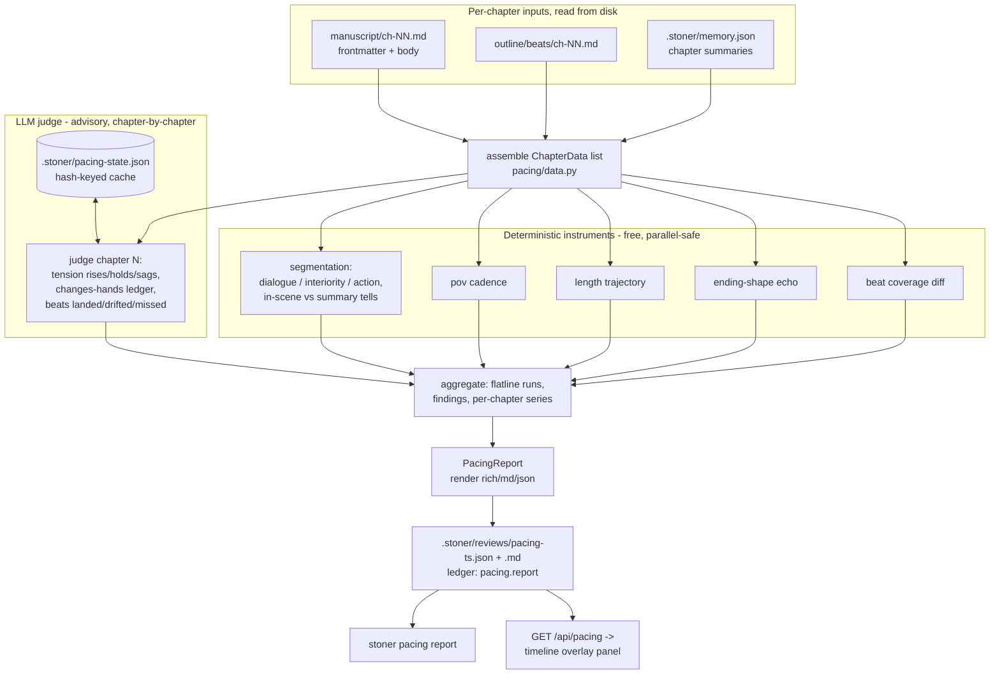

## Summary

Build the book-level pacing instrument layer: deterministic scene/summary maps, POV cadence, length trajectory, mode mix, and ending-echo detection computed free from the manuscript files, plus LLM-advisory tension labels, a "what changes hands" ledger, and beat-drift matching — assembled into a per-book pacing report (`.stoner/reviews/pacing-*.json/.md`) and a manuscript-timeline overlay in the UI. The target diagnostic: "Chapters 9–12 flatline; nothing changes hands."

---

## Problem Frame

Pacing was autonovel's admitted unsolved ceiling because it is structural, not sentence-level (`docs/research/RESEARCH.md`: "Weaknesses to improve on: ... pacing ceiling"; anti-patterns #8 beats landing exactly on schedule, #9 repeated chapter-ending structure, #12 summary where scene is needed — "70%+ of a chapter should be in-scene").

The repo has two pacing-adjacent tools and neither operates at book level:

- The `pacing` review pass (`src/stoner/review/passes.py`) is chapter-scoped and LLM-only. It sees one chapter plus context; it cannot see that four consecutive chapters sag, that POV cadence broke in act two, or that every chapter ends the same way.
- The slop rhythm analyzer (`src/stoner/slop/analyzers.py`, `analyze_rhythm`) is sentence/paragraph-scoped and deterministic. Burstiness inside one document, nothing across chapters.

Nothing in the harness reads the manuscript as a shape. This feature is the instrument layer between them: book-level, mostly deterministic (free, reproducible, cacheable), with a bounded chapter-by-chapter LLM judge for the judgments regexes cannot make (tension, stakes movement, beat matching). Make pacing visible and it becomes fixable — the report and the timeline overlay are the deliverable; fixing is the human's (and later the Writers' Room's) job.

---

## Requirements

Deterministic instruments (free, no provider calls):

- R1. A scene-vs-summary map per chapter: dialogue ratio, in-scene marker density vs summary tells, and an in-scene fraction checked against a configurable target (default 0.70, from the research anti-pattern list).
- R2. A dialogue/interiority/action mode mix per chapter (approximate percentages from deterministic heuristics).
- R3. POV cadence analysis from chapter frontmatter `pov`: the POV sequence, run lengths, cadence breaks, and POVs that appear then vanish.
- R4. Chapter length trajectory from word counts: the series itself plus flags for monotonic drift, outliers, and dead-uniform stretches.
- R5. Repeated chapter-ending-structure detection: classify each chapter's ending shape deterministically and flag runs of consecutive chapters sharing one shape (anti-pattern #9).
- R6. Deterministic beat-sheet coverage checks per chapter: beat sheet present/absent, POV field agreement between `outline/beats/ch-NN.md` frontmatter and the chapter, and section-presence stats — the parts of beat drift that are actual file diffing.

LLM-advisory instruments (chapter-by-chapter, never gating):

- R7. A tension curve as forced-relative per-chapter labels — each chapter judged rises/holds/sags relative to the previous chapter — never numeric scores (hard invariant 1). Consecutive sags/holds aggregate into flatline findings.
- R8. A "what changes hands" ledger per chapter: concrete stakes/possession/knowledge changes, with an explicit empty state ("nothing changes hands") that feeds the flatline diagnostic.
- R9. Beat-drift matching: each beat-sheet beat judged landed/drifted/missed against the chapter's memory summary (semantic matching the deterministic diff of R6 cannot do).
- R10. LLM instruments work chapter-by-chapter using memory summaries for cross-chapter context; the whole manuscript is never sent in one call (hard invariant 4). Per-chapter judgments are cached by chapter content hash and state is saved before every model call (hard invariant 10).

Report and surfaces:

- R11. `run_pacing` produces one per-book pacing report saved as JSON + Markdown under `.stoner/reviews/` with a pure `render(report, fmt="rich|markdown|json")`, mirroring the slop report pattern. Findings use the shared `Finding` model with `source="pacing:<instrument>"` and `ch-NN:` category prefixes (the book-review chapter-tagging convention).
- R12. `stoner pacing report` runs the instruments and prints/saves the report; `--no-llm` restricts to deterministic instruments (free, offline). Every run appends a ledger entry.
- R13. The UI gains a manuscript-timeline structure overlay: per-chapter lanes for length, in-scene fraction, mode mix, POV, tension arrows, and changes-hands, rendered as inline SVG/CSS in the single-file `ui/static/index.html` (no CDN, no build step), fed by a new read-only endpoint.
- R14. Config lives in one `pacing: PacingConfig` sub-model; the LLM judge resolves against the existing `reviewer` role; the report is advisory only — no gate anywhere consumes it (hard invariant 2 kept clean: nothing here gates in v1).

---

## Key Technical Decisions

- Book-level layer, not a new review pass: the existing `pacing` ReviewPass and slop `analyze_rhythm` stay untouched; this feature reads all chapters' files and frontmatter directly and reasons across them. Adding cross-chapter context to `PassContext` was rejected — passes are chapter-scoped by design and the runner sequencing doesn't fit a whole-book instrument.
- Deterministic instruments first, in the slop mold (invariant 2): each instrument is a pure function over pre-assembled per-chapter data returning findings + stats + a per-chapter series, mirroring `AnalyzerResult` in `src/stoner/slop/analyzers.py`. They read files via `WritingProject` only, cost nothing, and are reproducible. Heuristics are pragmatic and documented as non-perfect, exactly like slop's sentence splitter.
- One combined LLM judge call per chapter, not one per instrument: tension label, changes-hands entries, and beat matching are all judgments about the same chapter, so one prompt returns all three (STRICT JSON, tolerant `extract_json` parsing). This bounds cost at N calls for N chapters and keeps each call's context small: chapter body + previous chapter's memory summary + that chapter's beat sheet — never the whole manuscript (invariant 4).
- Tension is forced-relative (invariant 1): the judge labels each chapter `rises|holds|sags` relative to the previous chapter (chapter 1 gets `opens`). No 1–10, no absolute bands. Flatline detection is then arithmetic over the labels (a run of `holds`/`sags` with empty changes-hands ledgers), which is where the "Chapters 9–12 flatline; nothing changes hands" diagnostic comes from — computed, not asked for.
- Beat drift splits into a deterministic half and an LLM half: file presence, POV agreement, and section stats are deterministic diffing (R6); whether a beat actually landed in prose is semantic and goes to the judge against the memory summary (R9). Judging beats against the summary rather than the full chapter is deliberate — the summary is what the archivist recorded as having happened, so a beat absent from it is exactly the drift signal wanted, and it keeps the judge prompt small.
- Judge results cached in `.stoner/pacing-state.json` keyed by chapter content hash, written before each model call (invariant 10): re-running the report after editing chapter 7 re-judges only chapter 7; an interrupted run resumes. Corrupt state falls back to `.bak` per the BookState pattern.
- Report lives in `.stoner/reviews/pacing-<ts>.{json,md}` with a pure `render(fmt)` copied from `src/stoner/slop/report.py` (detached rich Console, returns text). Reusing the reviews dir means the existing UI review listing and `.stoner` layout need no new directory; `_review_kind` in `ui/server.py` gets a `pacing` case so the report doesn't masquerade as a slop report.
- Advisory only, no gate (invariant 2): even the deterministic instruments do not gate `stoner book` in this release — no pacing metric joins `GateConfig` and no gating hook ships. Instrumentation earns trust before it earns veto power; promoting a validated in-scene-fraction gate is deferred follow-up work that requires calibration evidence from real manuscripts first.
- Findings reuse shared models: `Finding` with `source="pacing:<instrument>"`, `ch-NN:` category prefix (the `book_review.finding_chapter` convention), severities per the shared `Severity` enum. `PacingReport` itself stays feature-local in `src/stoner/pacing/` — like `BookReviewReport`, it crosses no module boundary that justifies `types.py` (contract rule: prefer feature-local).
- Text-only degradation (invariant 7): the judge is a plain `call_model` completion with STRICT-JSON prompting — no tools — so codex/claude CLI backends work unchanged. A failing or unparseable judge call degrades that chapter to `label="unjudged"` plus one info finding, mirroring how `review/runner.py` degrades a failing pass instead of aborting.

---

## High-Level Technical Design



The report's spine is a per-chapter series table — one row per chapter, one column per instrument signal (words, dialogue_ratio, in_scene_fraction, mode mix, pov, ending_shape, tension label, changes_hands count, beats landed/drifted/missed) — because that is exactly what a timeline overlay renders and what a writer scans. Findings hang off it for the anomalies (flatline runs, ending echoes, cadence breaks, scene-starved chapters).

Directional shape of the judge exchange (per chapter, STRICT JSON like every pass):

```
system: pacing judge persona (engine/prompts/pacing_judge.md)
user:   chapter N body
        + previous chapter memory summary (or "first chapter")
        + beat sheet for N (or "none")
        -> {"tension": "rises|holds|sags",
            "tension_why": "...",
            "changes_hands": ["...", ...],   // empty list allowed and meaningful
            "beats": [{"beat": "...", "verdict": "landed|drifted|missed", "note": "..."}]}
```

---

## Integration Surface

- CLI: new group `stoner pacing` via `src/stoner/cli/pacing_cmds.py` exposing `register(app)` (one added line in `src/stoner/cli/main.py`, next to `book_cmds.register(app)`). Commands: `stoner pacing report` (flags: `--no-llm`, `--format rich|markdown|json`, `--model`, `--no-save`).
- config.py: one new field `pacing: PacingConfig` on `StonerConfig`. `PacingConfig` fields: `in_scene_min_ratio: float = 0.70`, `ending_echo_min_run: int = 3`, `flatline_min_run: int = 3`, `pov_break_min_run: int = 4`, `llm_instruments: bool = True`.
- types.py: no changes (reuses `Finding`, `Severity`, `Span`, `Usage`; `PacingReport` is feature-local).
- project.py DIRS / `.stoner/` files: no DIRS change. New state file `.stoner/pacing-state.json` (judge cache/resume; hash-keyed, `.bak` on corruption). Reports written to existing `.stoner/reviews/` as `pacing-<ts>.json` + `pacing-<ts>.md`.
- canon: no new artifact types, templates, or CanonStore methods (reads `Memory` and beat-sheet files read-only).
- ledger: new actions `pacing.report` (one per saved report: chapter count, findings, flatline runs, llm on/off), `pacing.judge` (one per chapter LLM call: chapter, cached/fresh, usage).
- review: no PASSES entries, no PassContext changes. Imports `extract_json` and `locate_span` from `src/stoner/review/passes.py` (read-only reuse of shared helpers).
- engine/tools.py: no new tools in v1 (a `pacing_check` agent tool is deferred follow-up).
- engine/prompts/: one new template `src/stoner/engine/prompts/pacing_judge.md`.
- ModelRoles: no new role — judge resolves against `reviewer` via `call_model(project, "reviewer", ...)`.
- UI: one new endpoint `GET /api/pacing` in `src/stoner/ui/server.py` (latest `pacing-*.json` from `.stoner/reviews/`, `{}` if none — defensive like `/api/book`); extend `_review_kind` to return `"pacing"` when the payload carries a `series` key; one new "Pacing" panel in `src/stoner/ui/static/index.html` (inline SVG sparkline lanes, no CDN, single file).
- pyproject: no new dependencies or extras.
- Dependencies on other feature plans: none hard. Reader Simulation (8) may later overlay its attention heatmap on the same timeline panel — this plan's series schema is the seam it would consume; nothing here depends on it. Writers' Room (5) may consume pacing findings if present; degrades to absent.

---

## Implementation Units

### U1. Chapter data assembly + text segmentation

**Goal**: The shared per-chapter input record and the deterministic text segmentation every scene/summary instrument builds on.

**Requirements**: R1, R2

**Dependencies**: none

**Files**:
- `src/stoner/pacing/__init__.py` (package init; public API stub)
- `src/stoner/pacing/data.py` (ChapterData assembly: frontmatter, body, word count, beat-sheet text, memory summary — all via `WritingProject`/`Memory`, frontmatter stripped, code fences masked)
- `src/stoner/pacing/segments.py` (segmentation heuristics)
- `tests/test_pacing_segments.py`

**Approach**: `segments.py` classifies a chapter body paragraph-by-paragraph. Dialogue = quoted-span coverage (straight and curly quotes). Interiority = thought/filter-verb density (reuse the spirit of slop's `FILTER_WORDS`, plus wondered/knew/remembered-class verbs and free-indirect markers). Summary tells = past-perfect runs ("had " + participle density), temporal-compression phrases ("over the next", "in the weeks that followed", "by the time"), and zero-dialogue stretches; in-scene markers = dialogue presence, present-action verbs, concrete beat punctuation. Output per chapter: dialogue_ratio, interiority_ratio, action_ratio (mode mix, R2) and in_scene_fraction (R1) plus per-paragraph classifications so findings can quote the worst summary blocks. Reuse `split_frontmatter`, `count_words`, and `mask_code_fences` (import from `stoner.slop.analyzers`) rather than reimplementing. Document heuristics as pragmatic, not linguistic — same stance as `split_sentences`.

**Patterns to follow**: `src/stoner/slop/analyzers.py` (module docstring style, `_UPPER_SNAKE` thresholds, `AnalyzerResult`-shaped return of findings + stats); `src/stoner/project.py` `split_frontmatter`/`count_words`.

**Test scenarios**:
- A dialogue-heavy scene paragraph block classifies as in-scene with dialogue_ratio > 0.4.
- A past-perfect narration block ("She had spent the summer... By August she had...") classifies as summary.
- Mixed chapter: in_scene_fraction lands between the pure fixtures' values (paired-fixture separation, `tests/test_slop.py` calibration pattern).
- Empty body and dialogue-only body do not divide by zero; ratios clamp to [0,1].
- `ChapterData` assembly on a scaffolded project returns one record per chapter with beat text and memory summary populated when present, empty strings when absent.

**Verification**: segmentation separates the paired fixtures; assembly works on a `WritingProject.create` + `scaffold_project` tmp project; ruff and mypy clean.

### U2. Structural instruments (POV, length, ending echo, scene map, beat coverage)

**Goal**: All remaining deterministic book-level instruments as pure functions over `list[ChapterData]`.

**Requirements**: R1, R3, R4, R5, R6

**Dependencies**: U1

**Files**:
- `src/stoner/pacing/instruments.py`
- `tests/test_pacing_instruments.py`

**Approach**: Each instrument is `(chapters, config) -> InstrumentResult{findings, stats, series}` where `series` is a per-chapter value list keyed by chapter number (the timeline spine). POV cadence (R3): sequence from frontmatter `pov` (empty -> "unknown"), flag runs >= `pov_break_min_run` in a book that otherwise alternates, and POVs that appear once then vanish. Length trajectory (R4): the word-count series, flags for monotonic decline/growth across 5+ chapters, outliers beyond ~2x the median deviation, and dead-uniform stretches (reuse the CV idea from `analyze_rhythm` at chapter granularity). Ending echo (R5): classify each chapter's final paragraph into a fixed five-shape taxonomy defined as module-level constants (one-line punch, dialogue close, question close, summary/reflection close, cliff verb close) via deterministic heuristics; flag runs >= `ending_echo_min_run` of one shape at minor, all-chapters-one-shape at major. The taxonomy is not a config surface; the classification heuristics behind each shape are tuned against the U7 fixtures. Scene map (R1): aggregate U1 per-chapter in_scene_fraction; each chapter below `in_scene_min_ratio` yields a finding quoting its largest summary block. Beat coverage (R6): beat sheet missing, `pov` mismatch between beat frontmatter and chapter frontmatter, and empty required sections (Goal/Conflict/Turn/Exit State from the beats template). All findings carry `source="pacing:<instrument>"` and category `ch-NN:<bucket>` so `finding_chapter`-style recovery works.

**Execution note**: the five instruments are independent given U1 — parallelize freely within the unit, or split among implementers; they share only `ChapterData` and `InstrumentResult`.

**Patterns to follow**: `src/stoner/slop/analyzers.py` (per-analyzer function shape, finding caps per instrument, severity assignment by threshold); `src/stoner/review/book_review.py` `ch-NN:` category convention.

**Test scenarios**:
- POV: ABABAB with one AAAA run flags a cadence break; single-POV book flags nothing.
- Length: fabricated declining series (5k -> 1k over 8 chapters) flags drift; jittery-but-stable series does not.
- Ending echo: 4 chapters all ending in a one-line punch paragraph flags a run; varied endings flag nothing.
- Scene map: chapter fixture with in_scene_fraction 0.3 yields a finding quoting its summary block; 0.85 chapter yields none.
- Beat coverage: missing beat file, POV mismatch, and empty Turn section each yield exactly one finding with correct `ch-NN:` category.
- Two-chapter book: no instrument crashes on short series (window guards).

**Verification**: paired flat-book vs shaped-book fixtures separate on findings count per instrument; all instruments pure (no provider, no writes); ruff and mypy clean.

### U3. LLM judge: tension, changes-hands, beat drift

**Goal**: The chapter-by-chapter advisory judge with prompt/parser purity, hash-keyed caching, and resumable state.

**Requirements**: R7, R8, R9, R10

**Dependencies**: U1 (uses `ChapterData`); independent of U2

**Files**:
- `src/stoner/pacing/judge.py`
- `src/stoner/engine/prompts/pacing_judge.md`
- `tests/test_pacing_judge.py`

**Approach**: Split pure from effectful, like `review/passes.py` vs `runner.py`: `build_judge_prompt(chapter_data, prev_summary) -> (system, user)` and `parse_judgment(text) -> ChapterJudgment` are pure; `judge_chapters(project, chapters, model=None, provider=None, on_event=None) -> list[ChapterJudgment], Usage` owns the loop. Prompt template `pacing_judge.md` follows the HTML doc-comment header convention and forbids numeric scores explicitly (the `grade` pass precedent); tension must be exactly one of rises/holds/sags (opens for chapter 1), judged relative to the previous chapter's summary. `changes_hands` is a list of concrete changes; the prompt states that an empty list is a valid, honest answer. Beats come from the chapter's beat sheet; verdicts landed/drifted/missed are judged against the memory summary. Parsing uses `extract_json`; unparseable or provider-error results degrade to `tension="unjudged"` plus one info finding (runner degradation pattern) — never abort the run. Cache: `.stoner/pacing-state.json` maps chapter number -> {content_hash, judgment}; before each model call the current state is flushed to disk (BookState save-before-call pattern); a hash hit skips the call and ledgers `pacing.judge` with `cached=true`. Corrupt state file moves to `.bak` and starts fresh. Model resolves via `call_model(project, "reviewer", ...)`; `provider=` kwarg injectable for tests.

**Patterns to follow**: `src/stoner/review/passes.py` (STRICT JSON instructions, `extract_json`, `_shape` example-driven prompts); `src/stoner/pipelines/book.py` (state saved before every model call, `.bak` on corruption, `on_event` callback); `src/stoner/pipelines/common.py` `call_model`.

**Test scenarios**:
- FakeProvider scripted with valid JSON: judgments carry the right tension labels and beat verdicts; usage accumulates.
- Scripted garbage response: that chapter degrades to `unjudged` + info finding; other chapters unaffected.
- Second run with unchanged chapters: zero provider calls (cache hits), ledger shows `cached=true` entries.
- Edited chapter 2 of 3: exactly one fresh provider call.
- Corrupt `.stoner/pacing-state.json`: renamed to `.bak`, run completes fresh.
- Prompt content: assembled user prompt contains chapter body, previous summary, and beat sheet, and never a second chapter's body (invariant-4 guard test).

**Verification**: all tests offline via injected provider; state file round-trips; prompt template renders with `render_prompt`; ruff and mypy clean.

### U4. Report assembly, aggregation, and rendering

**Goal**: `run_pacing` — the public API combining U2 + U3 into a saved, renderable `PacingReport`, including flatline-run derivation.

**Requirements**: R7 (aggregation half), R8, R11, R14

**Dependencies**: U2, U3

**Files**:
- `src/stoner/pacing/report.py` (PacingReport dataclass, `render(report, fmt)`, markdown/rich renderers)
- `src/stoner/pacing/__init__.py` (`run_pacing(project, llm=True, model=None, provider=None, save=True) -> PacingReport`)
- `tests/test_pacing_report.py`

**Approach**: `run_pacing` assembles `ChapterData` (U1), runs the deterministic instruments (U2), optionally the judge (U3), then derives cross-instrument aggregates arithmetically: flatline runs = maximal runs of >= `flatline_min_run` chapters where tension is holds/sags AND changes_hands is empty, emitted as major findings phrased as the target diagnostic ("Chapters 9–12 flatline; nothing changes hands"). Report fields: created_at, llm on/off, model, per-chapter series table (one row per chapter: words, dialogue_ratio, in_scene_fraction, mode mix, pov, ending_shape, tension, changes_hands, beat verdict counts), per-instrument stats, findings, usage, json_path/md_path. `render` is pure with the three formats and detached-Console rich rendering, copied structurally from `slop/report.py`; the rich view leads with the series table (chapters as rows) then findings by severity. Save to `.stoner/reviews/pacing-<ts>.json` + `.md` via `project.write`; ledger `pacing.report`. The JSON payload carries a top-level `series` key — the marker U6's `_review_kind` extension keys on.

**Patterns to follow**: `src/stoner/slop/report.py` (render purity, format dispatch, verdict-free tables); `src/stoner/review/book_review.py` (report dataclass, save-both-formats, ledger entry shape).

**Test scenarios**:
- Full run on a scripted 4-chapter project with FakeProvider: report saved as both files, ledger `pacing.report` appended, series has 4 rows.
- `llm=False`: no provider constructed, tension column reads skipped, deterministic findings still present.
- Flatline derivation: scripted judgments (holds/sags + empty ledgers for ch 2–4) produce one major finding naming "Chapters 2–4"; a rises in the middle breaks the run.
- `render` returns non-empty strings for all three formats and raises ValueError on unknown fmt; rich render does not print to stdout.
- Zero-chapter project raises ValueError with a "draft some chapters first" message (book-review precedent).

**Verification**: end-to-end offline run produces valid JSON loadable by `json.loads` with `series` present; markdown renders the diagnostic sentence verbatim; ruff and mypy clean.

### U5. Config + CLI

**Goal**: `PacingConfig` on `StonerConfig` and the `stoner pacing report` command group.

**Requirements**: R12, R14

**Dependencies**: U4

**Files**:
- `src/stoner/config.py` (add `pacing: PacingConfig` + the sub-model)
- `src/stoner/cli/pacing_cmds.py`
- `src/stoner/cli/main.py` (one `pacing_cmds.register(app)` line)
- `tests/test_cli.py` (extend) or `tests/test_pacing_cli.py`

**Approach**: `pacing_cmds.py` mirrors `book_cmds.py`: module-level `console`/`err_console`, `_project()`/`_fail()`, `register(app)` attaching a nested `pacing` typer sub-app (the `canon_app` nesting pattern) with a `report` command. Heavy imports inside the command body. Flags: `--no-llm` (deterministic only, no network — safe default for offline), `--format` (default rich), `--model` (judge override), `--no-save`. Prints via `render`; exits 1 on `ProjectError`/`ProviderError` with the message. `PacingConfig` defaults per the Integration Surface list; instruments read thresholds from `project.config.pacing`.

**Patterns to follow**: `src/stoner/cli/book_cmds.py` (register shape, error handling); `src/stoner/cli/main.py` `canon_app` (nested sub-app); `src/stoner/config.py` `GateConfig` (sub-model style).

**Test scenarios**:
- CliRunner: `stoner pacing report --no-llm` in a tmp project with two chapters exits 0 and writes `pacing-*.json` (no-network command, `tests/test_cli.py` constraint respected).
- `--format json` output parses as JSON.
- Outside a project: exits 1 with the "Run `stoner init`" message.
- `stoner.yaml` with `pacing: {in_scene_min_ratio: 0.5}` loads and changes the scene-map threshold.
- Config default round-trip: `StonerConfig().dump_yaml()` includes the `pacing` block; existing yaml without it still loads (backward compat).

**Verification**: CliRunner tests pass offline; existing config tests unaffected; ruff and mypy clean.

### U6. UI: /api/pacing + manuscript-timeline overlay

**Goal**: The structure overlay: a Pacing panel rendering the report's series as timeline lanes.

**Requirements**: R13

**Dependencies**: U4 (series schema)

**Files**:
- `src/stoner/ui/server.py` (add `GET /api/pacing`; extend `_review_kind`)
- `src/stoner/ui/static/index.html` (Pacing panel)
- `tests/test_ui.py` (extend)

**Approach**: `GET /api/pacing` returns the newest `pacing-*.json` from `.stoner/reviews/` parsed, or `{}` when none/malformed — the `/api/book` defensive pattern, reading disk per request. `_review_kind` gains: payload with `series` -> `"pacing"` (checked before the existing slop fallback) so the reviews list labels it correctly. The panel, in the existing single-file no-CDN style: chapters as columns on a shared x-axis; lanes for (a) word-count bars, (b) in-scene fraction sparkline with the `in_scene_min_ratio` guideline, (c) stacked mode-mix bars, (d) POV color lane, (e) tension arrows (up/flat/down glyphs), (f) changes-hands dots (empty = hollow — flatline chapters visibly hollow-flat); ending-echo runs and flatline findings highlighted as spans across columns; hover shows the chapter's row values; empty state prompts `stoner pacing report`. Inline SVG/CSS only, Hearth design tokens already in the file.

**Patterns to follow**: `src/stoner/ui/server.py` `/api/book` (defensive read) and `_safe_review_path` jail (reuse for file selection); existing index.html panel/tab structure and fetch conventions.

**Test scenarios**:
- TestClient: `/api/pacing` with no report returns `{}`; after writing a fixture `pacing-1.json` returns its content.
- Malformed pacing JSON on disk returns `{}` (no 500).
- `/api/reviews` listing labels the fixture `kind: "pacing"` and existing slop/review fixtures keep their kinds (regression).
- Missing-fastapi behavior unchanged (existing monkeypatch test still green).

**Test expectation**: index.html rendering itself is not unit-tested — no JS test harness exists in the repo; endpoint contracts carry the coverage, manual check via `stoner ui`.

**Verification**: test_ui.py green including regressions; panel renders against a real generated report in a scratch project via `stoner ui`; page loads with no external requests.

### U7. End-to-end calibration on paired book fixtures

**Goal**: Prove the layer separates a flat book from a shaped book end-to-end, and lock the thresholds against regression.

**Requirements**: R1–R9 (calibration), R11

**Dependencies**: U4, U5

**Files**:
- `tests/test_pacing_e2e.py`

**Approach**: Two scripted mini-projects built in tmp_path (the per-file fixture convention): FLAT_BOOK — 5 chapters of summary-heavy prose, identical ending shape, single unbroken POV, near-uniform lengths, judge scripted to holds/sags with empty changes-hands; SHAPED_BOOK — dialogue-forward scenes, varied endings, alternating POV, varied lengths, judge scripted with rises and populated ledgers. Assert directional separation, not exact values (the `test_slop.py` calibration stance): FLAT produces a flatline finding, an ending-echo finding, and more scene-map findings than SHAPED; SHAPED produces zero major findings. Also asserts the full CLI path (`pacing report --no-llm` then with scripted provider) and that a re-run reuses the judge cache. Ending-shape bucket tuning happens here: the five-shape taxonomy is fixed, and this unit calibrates the heuristic boundaries between shapes against the paired fixtures.

**Patterns to follow**: `tests/test_slop.py` (paired SLOPPY/CLEAN separation assertions); `tests/test_review.py` (FakeProvider end-to-end with report-file and ledger assertions).

**Test scenarios**:
- FLAT vs SHAPED separation as above (happy-path calibration).
- Report JSON from FLAT contains the "Chapters X–Y flatline" phrasing.
- Ledger contains `pacing.report` once per run and `pacing.judge` per chapter with cache flags on re-run.
- Whole suite: existing 227 tests remain green (no shared-seam regressions).

**Verification**: full `pytest` green; separation assertions stable across two consecutive runs (determinism check for the non-LLM half).

---

## Scope Boundaries

Non-goals:

- No pacing gate: nothing blocks `stoner book`, `stoner write`, or revise loops on pacing output. Advisory report only.
- No scene-level segmentation of chapters into named scenes (paragraph-granularity classification only); no outline restructuring suggestions.
- No automatic pacing fixes or revision integration — the report informs the human (and, later, other features).
- No cross-book or comp-title comparison (Reader Simulation's territory).
- No new agent tool, no new review pass, no changes to the existing `pacing` ReviewPass or slop rhythm analyzer.
- Parking-lot items (series canon, voice fine-tunes, nonfiction mode, multi-writer) remain out of scope.

### Deferred to Follow-Up Work

- Promote a validated in-scene-fraction gate into `GateConfig` once calibration evidence from real manuscripts supports it; until then pacing stays advisory and no gating hook exists.
- A `pacing_check` agent tool in `engine/tools.py` so the writer agent can self-check structure mid-draft.
- A whole-book tension ranking call over memory summaries (forced-relative ranking of all chapters at once) as a second opinion on the per-chapter labels.
- Overlaying Reader Simulation attention heatmaps and Writers' Room margin notes on the timeline panel.
- Docs page (`docs/pacing.md`) and concepts.md cross-links once the feature stabilizes.

---

## Assumptions

- Chapter frontmatter `pov` is the authoritative POV signal; chapters without it degrade to an "unknown" lane rather than triggering inference.
- Memory summaries exist for drafted chapters (the write pipeline maintains them); chapters missing summaries are judged with "no summary available" context and beat drift degrades to coverage-only for them.
- Quoted-span dialogue detection (straight + curly quotes) is adequate for the target prose style; unquoted dialect styles are out of calibration scope for v1.
- The 0.70 in-scene target from RESEARCH.md is a starting default, expected to be tuned via `PacingConfig`, not a validated constant.
- Reusing `.stoner/reviews/` for pacing reports (per the namespace table) is acceptable to the UI listing given the `_review_kind` extension.
- One judge call per chapter at roughly review-pass cost is an acceptable price for `--llm` runs; `--no-llm` is the free path.
- Importing `mask_code_fences` and `extract_json`/`locate_span` across feature namespaces (from slop/review) is sanctioned shared-helper reuse, not a namespace violation.

---

## Risks & Dependencies

- Heuristic misclassification: scene/summary and ending-shape heuristics will have false positives on literary styles (present-tense narration, quoteless dialogue). Mitigated by advisory-only status, config thresholds, paired-fixture calibration, and per-instrument finding caps; the honest failure mode is a noisy lane, not a blocked pipeline.
- Judge label instability: rises/holds/sags may wobble across runs on borderline chapters. Mitigated by hash-keyed caching (labels are stable until the chapter changes) and by deriving flatlines from label+ledger conjunction rather than labels alone.
- Shared-seam collisions with the other nine plans: touches to `config.py`, `main.py`, `ui/server.py`, `index.html` are additive single-block edits, fully enumerated above; integration plan 011 owns merge order.
- `_review_kind` extension risk: another feature writing JSON with a `series` key into `.stoner/reviews/` would mislabel; the key check can be tightened to `series` + `source == "pacing"` at integration if needed.
