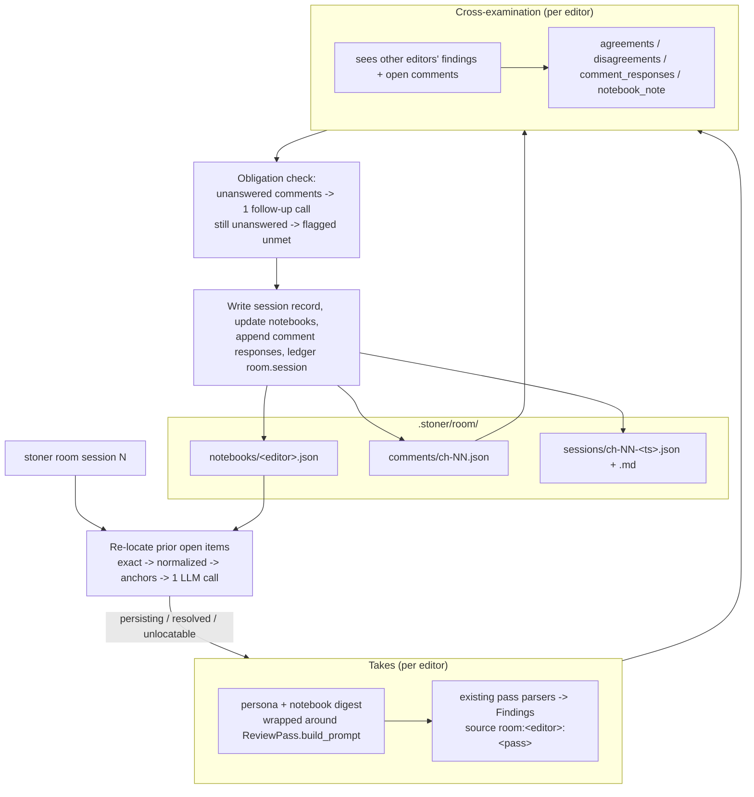

## Summary

Replace one-shot review passes with a persistent editorial room: named editors (developmental editor, line editor, continuity pedant, first reader) who keep notebooks across the whole project, re-check whether prior flags were addressed, disagree with each other on the record, and answer the writer's margin comments. Editors wrap the existing `review/passes.py` machinery; nothing about the room gates.

---

## Problem Frame

`stoner review` today is a linter: every run starts from zero. A pass that flagged the same over-explained paragraph three revisions running has no way to say so, no way to notice you fixed it, and no way to argue with another pass that thinks the paragraph should stay. Real editorial pressure comes from memory and accountability in both directions — the editor remembers what they flagged, and the writer can pin a comment to a span and demand an answer.

The repo already has every ingredient: `ReviewPass` prompt-builder/parser pairs (`src/stoner/review/passes.py`), a runner that degrades pass failures to info findings (`src/stoner/review/runner.py`), a `Finding` lifecycle with human triage (`src/stoner/types.py`), quote anchoring via `locate_span`, a rolling-summary memory pattern with hard caps (`src/stoner/canon/memory.py`), and a UI PATCH pattern for status updates (`src/stoner/ui/server.py`). The room composes these; it does not replace them.

---

## Requirements

Editors and notebooks

- R1. The project has a configurable roster of named editors, defaulting to four: developmental editor, line editor, continuity pedant, first reader. Each editor is a persona description plus a set of existing review-pass names.
- R2. Each editor keeps a notebook in `.stoner/room/notebooks/<slug>.json`: a running-opinion paragraph plus tracked items (what they flagged, where, current cross-session status, escalation count). Notebooks are hard-capped in size following the `memory.json` rolling-summary pattern — they can never grow unbounded into prompt context.
- R3. A capped notebook digest (opinion + open items, most recent first) is injected into every prompt that editor sends, so takes are informed by project history.
- R4. Notebooks are updated after every session: deterministic bookkeeping for tracked items, plus the editor's own one-paragraph opinion refresh returned inside the cross-examination call (no extra call).

Room sessions

- R5. `stoner room session <chapter>` runs a chapter-scoped session: prior-flag re-location, one take per editor (their passes with persona and notebook injected), one cross-examination call per editor, comment-obligation settlement, notebook updates, and a persisted session record (JSON + Markdown) under `.stoner/room/sessions/`.
- R6. Findings produced by editor takes use the existing `Finding` model and status lifecycle (open/accepted/dismissed/fixed), with source convention `room:<editor-slug>:<pass>`. Human triage via the existing finding-status mechanics remains authoritative.
- R7. A failing take or cross-examination call degrades to an info finding in the session record and never aborts the session (mirrors `runner._run_one_pass`).
- R8. `stoner room session --book` runs a milestone whole-book session with manuscript assembly capped exactly like `review/book_review.py` (all chapters verbatim up to 12; beyond that, last 6 full plus memory summaries).

Addressed-or-persisting tracking

- R9. At session start, each editor's open notebook items for the session scope are re-located in the current text: exact `locate_span` first, then whitespace-normalized matching, then sentence-anchor matching, then a single batched LLM-assisted re-locate call for whatever remains.
- R10. An item whose quote still matches deterministically is marked persisting and its escalation count increments; the LLM fallback classifies the rest as resolved (text changed and issue gone) or persisting-with-new-quote; unclassifiable items become unlocatable and stay open.
- R11. Persisting items escalate on the record: escalation counts appear in the notebook, in the editor's prompts ("you flagged this in session N and it persists"), and in the session Markdown — never as an automatic severity bump or a gate.

Cross-examination

- R12. After takes, each editor sees the other editors' findings for this session and files agreements and disagreements referencing finding ids, stored verbatim in the session record. Purely advisory.
- R13. Cross-examination prompts frame judgments comparatively (agree/disagree/priority-rank), never as numeric scores.

Margin comments

- R14. The writer can annotate any span of a chapter: via the UI panel and via `stoner room comment <chapter> --quote "..." --text "..."` (quote anchored with `locate_span`; unanchored quotes accepted with a warning and no span). Comments persist in `.stoner/room/comments/ch-NN.json`.
- R15. Every open comment in a session's scope is an obligation: it is injected into the cross-examination prompts, and any comment left unanswered after cross-examination triggers one dedicated follow-up completion. A comment still unanswered after that is flagged unmet in the session record and CLI output — never silently dropped.
- R16. Comment responses (editor, text, session id) accumulate on the comment; the writer resolves or dismisses comments via CLI or UI PATCH, mirroring the finding-status PATCH pattern.

Cost and degradation

- R17. A default chapter session costs a bounded call count: one call per editor per assigned pass, one cross-examination call per editor, at most one re-locate fallback call, at most one comment follow-up call. The roster is the cost knob.
- R18. Every room step is a plain single-shot completion with STRICT-JSON prompting — no tool loop — so text-only providers (codex/claude CLI, `supports_tools=False`) work unchanged.
- R19. Every session appends `room.*` ledger entries with scope, editors, findings count, and usage.

---

## Key Technical Decisions

- Editors wrap passes at the (system, user) tuple level, not inside `passes.py`: an editor take calls the existing `ReviewPass.build_prompt(ctx)`, prepends the persona to the returned system prompt, and appends notebook-digest and prior-flag sections to the returned user prompt. Rationale: zero changes to `review/passes.py` or `PassContext`, existing parsers reused as-is, and any future pass added to `PASSES` is immediately assignable to an editor.
- Notebooks are JSON, not Markdown: they are machine-updated bookkeeping with caps and per-item state (escalations, cross-session status), exactly the shape of `.stoner/memory.json`. Human-readable views come from the session Markdown and `stoner room notebook <editor>`, not from the storage format. Respects invariant 6 (plain files, git-friendly).
- Cross-session finding status lives in the notebook, not on `Finding`: `Finding.status` stays the human-triage lifecycle (open/accepted/dismissed/fixed); notebook items carry the editor's own bookkeeping status (open/persisting/resolved/dismissed/unlocatable). Rationale: no `types.py` change, no ambiguity about who owns which state, and LLM-judged "resolved" never overwrites a human's triage (invariants 2 and 3 by analogy: machine judgments surface, they don't overwrite). Human triage flows the other way with full authority: a human `dismissed` on a room finding is reconciled into the matching notebook item at session start — triage silences the editor's memory, not merely escalation.
- Re-location is deterministic-first with one batched LLM fallback: exact match, then normalized match, then sentence anchors — all free and reproducible; only quotes that drift beyond that go into a single re-locate completion per session. Rationale: invariant 2 (deterministic where possible), cost discipline, and `locate_span` already exists as the tier-one primitive.
- Escalation is record-keeping, never severity mutation or gating: a persisting flag raises its escalation count and gets louder framing in prompts and reports, but severity remains whatever the editor assigned this session. Rationale: invariant 2 — LLM findings are advisory; a deterministic counter that silently promotes minor to major would launder an LLM judgment into a gate input.
- The opinion refresh rides the cross-examination call: the cross-exam JSON schema includes a `notebook_note` field, so per-editor memory maintenance costs zero extra calls. Rationale: R17 cost bound.
- Comment answering happens in cross-examination, not in takes: takes reuse existing pass parsers, which cannot extract comment responses; cross-examination is room-owned prompt + parser, so `comment_responses` lives there, with one deterministic follow-up call as the obligation backstop. Rationale: keeps pass reuse pure and makes "the room must answer" checkable by code, not vibes.
- The room resolves models against the existing reviewer role, with an optional `room.model` override: no new `ModelRoles` field. Rationale: smallest shared-seam touch; the override covers "I want a cheaper model for the room" without config sprawl.
- Book sessions mirror `book_review.py` assembly constants rather than importing its private `_assemble_manuscript`: same 12-chapter verbatim limit and last-6-full rule, implemented in `room/` against `Memory` and `WritingProject`. Rationale: invariant 4 compliance without coupling to another module's private surface.

---

## High-Level Technical Design

Session record shape (directional): `{scope, chapter?, editors, relocation: [{item_id, outcome, new_quote?}], findings: [Finding...], takes: {editor: summary}, cross_exam: [{editor, agreements, disagreements, comment_responses, notebook_note}], obligations_unmet: [comment ids], model, usage, created_at}`. The Markdown rendering groups findings by editor, prints the disagreement record as a transcript, and lists "On the record" persisting items with their session history.

Notebook shape (directional): `{editor, opinion, items: [{id, chapter, quote, issue, severity, pass, status, first_session, last_seen_session, escalations}], updated_at}` — opinion capped in chars, items capped in count with oldest resolved items dropped first (the `rebuild_book_so_far` eviction idea applied to items).

Prompt-injection flow for a take: `build_context(project, chapter)` (unchanged) -> `pass.build_prompt(ctx)` -> wrap: system = persona + original system; user = original user + `## Your Notebook` digest + `## Your Prior Flags On This Chapter` recap. Parsers untouched.

---

## Integration Surface

- CLI: `stoner room` sub-app via `src/stoner/cli/room_cmds.py` exposing `register(app)`; one import + register line appended in `src/stoner/cli/main.py`. Commands: `room session`, `room comment`, `room comments`, `room notebook`, `room status`.
- config.py: one new field `room: RoomConfig` on `StonerConfig`. `RoomConfig`: `editors: list[EditorSpec]` (default four; `EditorSpec`: `name`, `persona`, `passes`), `model: str = ""` (empty resolves against reviewer role), `opinion_cap_chars: int = 2000`, `digest_chars: int = 3000`, `max_open_items: int = 50`, `max_resolved_items: int = 20`, `llm_relocate: bool = True`.
- types.py: no changes. `Finding`, `Severity`, `Span`, `Usage` reused; room-local shapes stay in `src/stoner/room/`.
- project.py DIRS: add `.stoner/room`, `.stoner/room/notebooks`, `.stoner/room/sessions`, `.stoner/room/comments`.
- canon: no new artifact types, no CanonStore changes (read-only consumption via existing `build_context`).
- ledger actions: `room.session`, `room.relocate`, `room.comment.add`, `room.comment.answer`, `room.comment.resolve`, `room.notebook.update`.
- review: no `PASSES` entries added, no `PassContext` extension. Read-only imports of `PASSES`, `build_context`, `extract_json`, `locate_span` from `src/stoner/review/passes.py`.
- engine/tools.py: no agent tools added.
- engine/prompts/: `room_crossexam.md`, `room_relocate.md`, `room_comment_followup.md` (HTML doc-comment headers, rendered by `pipelines/common.render_prompt`).
- ModelRoles: no new role; resolves against `reviewer` with `room.model` override.
- UI (`src/stoner/ui/server.py`, `src/stoner/ui/static/index.html`): GET `/api/room/sessions`, GET `/api/room/sessions/{file}`, GET `/api/room/notebooks`, GET `/api/room/comments/{chapter}`, POST `/api/room/comments/{chapter}`, PATCH `/api/room/comments/{chapter}/{comment_id}`; one "Writers' Room" panel in index.html (session list, disagreement transcript, comment add/resolve on the chapter view).
- pyproject: no new dependencies or extras.
- Dependencies on other feature plans: none. If the Pacing (4) or Voice (1) features later register new review passes, the roster config can assign them to editors with zero room changes — consumes `PASSES` if present, degrades to the built-in eight if absent.

---

## Implementation Units

### U1. RoomConfig, defaults, and state scaffolding

**Goal**: The room's configuration surface and on-disk directories exist; the default four-editor roster loads from a bare `stoner.yaml`.

**Requirements**: R1, R2 (paths), R17 (roster as cost knob).

**Dependencies**: none.

**Files**: `src/stoner/config.py`, `src/stoner/project.py` (DIRS), `src/stoner/room/__init__.py`, `src/stoner/room/roster.py`, `tests/test_room.py` (new).

**Approach**: Add `EditorSpec` and `RoomConfig` pydantic models to config.py and the single `room` field on `StonerConfig`. `room/roster.py` owns slugification (name -> filesystem slug), default personas for the four editors, and validation that assigned pass names exist in `PASSES` (unknown names warn and are skipped at session time, mirroring the runner's unknown-pass degradation). Extend `DIRS` with the four `.stoner/room/*` paths.

**Patterns to follow**: `GateConfig`/`ModelRoles` in `src/stoner/config.py` (nested sub-model with defaults); `DIRS` list in `src/stoner/project.py:21`.

**Test scenarios**: loading a project with no `room:` key yields four editors with distinct slugs and non-empty pass sets; a `stoner.yaml` overriding one editor's passes round-trips; an editor spec naming an unknown pass survives config load (validation is soft); `scaffold_project` + `WritingProject.create` produce the `.stoner/room/` tree.

**Verification**: config defaults and overrides behave as tested; ruff/mypy/pytest green.

### U2. Notebook store

**Goal**: Persistent, capped, per-editor notebooks with a prompt-ready digest.

**Requirements**: R2, R3, R4 (deterministic half), R11 (escalation storage).

**Dependencies**: U1.

**Files**: `src/stoner/room/notebook.py`, `tests/test_room.py`.

**Approach**: A `Notebook` class mirroring `canon/memory.py:Memory`: load/save over `.stoner/room/notebooks/<slug>.json` via `WritingProject` (path-jailed), `setdefault`-based schema tolerance, item upsert keyed by finding id, escalation increment, status transitions (open/persisting/resolved/dismissed/unlocatable), opinion setter with char cap, and eviction (drop oldest resolved beyond `max_resolved_items`, then oldest low-severity open beyond `max_open_items`, recording an eviction note in the opinion). A `reconcile_dismissals` step runs at session start: it reads session records newer than the notebook's `updated_at` and marks items dismissed wherever the human dismissed the matching room finding — dismissed items stop being tracked (no re-location, no digest, no escalation) but may remain in the notebook file as dismissed history. `digest(chapter=None, max_chars)` renders opinion + open/persisting items (scope-filtered, most recent first, truncated at the cap) for prompt injection.

**Patterns to follow**: `src/stoner/canon/memory.py` (`_load`/`_save` shape, `rebuild_book_so_far` cap-and-drop-oldest, `context_for_chapter` sectioned rendering).

**Test scenarios**: upsert then reload round-trips items; escalation increments across two updates; digest respects `max_chars` and drops oldest first; eviction keeps open items in preference to resolved ones; corrupt notebook JSON degrades to an empty notebook rather than raising; digest for a chapter excludes other chapters' items; a session record newer than `updated_at` carrying a human-dismissed finding marks the matching item dismissed on reconcile, and the dismissed item no longer escalates or reappears in the next session's digest.

**Verification**: notebook files stay under configured caps after simulated 30-session churn in a test loop.

### U3. Margin comments store and CLI anchoring

**Goal**: Writers can pin comments to spans; comments persist with response history and an open/answered/resolved lifecycle.

**Requirements**: R14, R16 (store half), R19 (comment ledger actions).

**Dependencies**: U1. Parallel with U2 and U4.

**Files**: `src/stoner/room/comments.py`, `tests/test_room_comments.py` (new).

**Approach**: `CommentStore` over `.stoner/room/comments/ch-NN.json`: add (anchor quote via `locate_span` against the current chapter body; missing quote -> span None + warning note), list (all/open), append_response (editor, text, session id -> status answered), resolve/dismiss. Each mutation appends the matching `room.comment.*` ledger entry. Comment model is a room-local pydantic model (id, chapter, quote, span, text, status: open|answered|resolved|dismissed, responses, created_at).

**Patterns to follow**: `src/stoner/review/passes.py:locate_span` for anchoring; `Ledger.append` free-form detail kwargs; JSON-file store conventions from `canon/memory.py`.

**Test scenarios**: adding a comment with a verbatim quote stores a correct span and line; a quote absent from the chapter stores span None and a warning; append_response flips open -> answered; resolve on an answered comment persists and ledgers; listing an absent chapter file returns empty; malformed comment file degrades to empty with no raise.

**Verification**: ledger tail shows `room.comment.add` after add; comment JSON is human-readable and git-diffs cleanly.

### U4. Finding re-location

**Goal**: Prior open flags are deterministically re-found in revised text, with one batched LLM fallback classifying the drifters.

**Requirements**: R9, R10, R11 (outcome recording).

**Dependencies**: U1 (and U2's item shape — coordinate on the item dict; can develop in parallel against the schema agreed in U2's docstring). Parallel with U3.

**Files**: `src/stoner/room/relocate.py`, `src/stoner/engine/prompts/room_relocate.md`, `tests/test_room.py`.

**Approach**: `relocate_items(body, items, project, provider=None) -> list[RelocationOutcome]`. Tiers: (1) `locate_span` exact; (2) whitespace/curly-quote-normalized search with offset mapping back to the original body; (3) sentence-anchor match (first and last ~5 words of the quote each located, span spanning both). Deterministic hits -> persisting (unchanged text means unaddressed). Remaining items go into ONE completion built from `room_relocate.md` (revised chapter + drifted quotes; STRICT JSON: per item, `RESOLVED` or a new verbatim quote), parsed with `extract_json`, new quotes re-verified with `locate_span` before acceptance (an unverifiable "quote" from the model -> unlocatable, not trusted). `llm_relocate: false` or a provider error degrades every drifted item to unlocatable-open — never aborts.

**Patterns to follow**: `locate_span` and `extract_json` in `src/stoner/review/passes.py`; the fail-soft degradation of `runner._run_one_pass`; STRICT-JSON prompt style of `_JSON_INSTRUCTIONS`.

**Test scenarios**: exact quote in unchanged text -> persisting with span; quote with only whitespace drift -> persisting via tier 2 with correct original-body offsets; scripted provider returns RESOLVED for one item and a valid new quote for another -> resolved and persisting-with-new-span respectively; model returns a hallucinated quote not present in the body -> unlocatable; provider raising ProviderError -> all drifted items unlocatable, no exception; empty item list -> no model call made (assert scripted provider unconsumed).

**Verification**: no completion is issued when all items resolve deterministically (cost discipline observable in the test's provider call count).

### U5. Session engine: takes, cross-examination, obligations, records

**Goal**: `run_room_session` orchestrates the full chapter or book session end to end and persists the record.

**Requirements**: R3, R4, R5, R6, R7, R8, R12, R13, R15, R17, R18, R19.

**Dependencies**: U2, U3, U4.

**Files**: `src/stoner/room/session.py`, `src/stoner/engine/prompts/room_crossexam.md`, `src/stoner/engine/prompts/room_comment_followup.md`, `tests/test_room.py`.

**Approach**: `run_room_session(project, chapter=None, book=False, model=None, provider=None) -> RoomSessionResult` (dataclass: counts, usage, notes, record paths — never prints). Flow: resolve provider against reviewer role (or `room.model`); reconcile human dismissals into notebooks (U2); re-locate per editor (U4) and update notebooks; per editor, per assigned pass: `build_context` once per session, wrap `pass.build_prompt` output with persona + notebook digest + prior-flag recap, call model, parse with the pass's own parser, rewrite each finding's source to `room:<slug>:<pass>`, locate spans; per editor, one cross-exam completion (`room_crossexam.md`: own findings, other editors' findings, open comments, escalation framing; STRICT JSON: agreements, disagreements, comment_responses, notebook_note) — judgments framed as agree/disagree/priority-rank only; settle comment obligations (append responses via U3; unanswered -> one `room_comment_followup.md` completion answering as "the room"; still unanswered -> `obligations_unmet` in the record); update notebooks (new items from findings, opinion from notebook_note); write `.stoner/room/sessions/<id>.json` + `.md`; ledger `room.session` with scope, editors, findings, usage. Book scope assembles the manuscript with book_review's caps (<=12 verbatim, else last 6 full + `Memory` summaries) and substitutes the assembled text for the chapter body in take prompts; passes whose `build_prompt` needs a `PassContext` get one built from a synthetic whole-book context (chapter=0, prior_tail empty). Any single call failure degrades to an info finding (source `room:<slug>`) and the session continues.

**Execution note**: the two prompt templates land in this unit; keep their JSON shapes documented in the HTML header comment per repo convention.

**Patterns to follow**: `src/stoner/review/runner.py` (`_resolve_provider`, `_run_one_pass` degradation, report save + ledger); `src/stoner/review/book_review.py` (`_FULL_TEXT_LIMIT`/`_RECENT_FULL` assembly, Markdown rendering); `pipelines/common.render_prompt` for templates; result-dataclass convention from `pipelines/` (`ReviseResult`).

**Test scenarios**: end-to-end chapter session with a `FakeProvider` scripting takes + cross-exams -> session JSON exists, findings carry `room:<slug>:<pass>` sources with located spans, notebooks gained items, ledger has `room.session`; a prior open notebook item whose quote persists -> escalation incremented and "On the record" section present in the session Markdown; an open comment answered in a scripted cross-exam -> comment status answered with response attributed to the editor; an open comment ignored by all cross-exams -> exactly one follow-up completion issued; follow-up also silent -> `obligations_unmet` populated and result notes mention it; one take scripted to raise ProviderError -> info finding, session completes; book scope with 14 chapters -> assembled prompt contains 6 full chapters and 8 summaries (assert on the captured request); text-only provider path exercised by running the whole session through a `supports_tools=False` fake.

**Verification**: total provider call count for a default 4-editor chapter session matches the R17 bound; session record round-trips through `json.loads`.

### U6. CLI: `stoner room` command group

**Goal**: The room is drivable from the terminal: sessions, comments, notebooks, obligations.

**Requirements**: R5, R8, R14, R15 (surfacing unmet obligations), R16.

**Dependencies**: U3, U5. Parallel with U7.

**Files**: `src/stoner/cli/room_cmds.py`, `src/stoner/cli/main.py` (two lines: import + register), `tests/test_room_cli.py` (new).

**Approach**: `room_app = typer.Typer()` nested sub-app (mirroring `canon_app` in main.py), registered via `register(app)`. Commands: `room session <chapter> [--book] [--model]` (rich table of per-editor finding counts, disagreements count, unmet obligations; exit 0 always — advisory, invariant 2); `room comment <chapter> --quote --text`; `room comments <chapter> [--all]` (table with status and response counts, `--resolve <id>`/`--dismiss <id>` options); `room notebook <editor>` (renders opinion + open items); `room status` (open comments and persisting items across the project). Heavy imports inside command bodies; `_project()`/`_fail()` helpers copied per `book_cmds.py` convention.

**Patterns to follow**: `src/stoner/cli/book_cmds.py` (module shape, register, error handling, rich tables); nested sub-app wiring of `canon_app` in `src/stoner/cli/main.py:26-29`.

**Test scenarios**: CliRunner: `room comment` then `room comments` shows the comment (no network); `room notebook` on a fresh project prints an empty-notebook message, exit 0; `room session` with `run_room_session` monkeypatched to a canned result prints the table and exits 0 even with unmet obligations (warning printed); `room session` outside a project exits 1 with the standard message; unknown editor name to `room notebook` exits 1.

**Verification**: `stoner room --help` lists all five commands; no command performs network I/O in tests.

### U7. UI: room endpoints and panel

**Goal**: Sessions, notebooks, and margin comments are visible and comments are writable from the local dashboard.

**Requirements**: R14 (UI half), R16, R12 (disagreements rendered).

**Dependencies**: U3, U5 (record/comment schemas). Parallel with U6.

**Files**: `src/stoner/ui/server.py`, `src/stoner/ui/static/index.html`, `tests/test_room_ui.py` (new).

**Approach**: Additive endpoints reading from disk per request: GET `/api/room/sessions` (list, newest first), GET `/api/room/sessions/{file}` (path-jailed to `.stoner/room/sessions/` via a `_safe_review_path`-style helper kept as plain python), GET `/api/room/notebooks`, GET `/api/room/comments/{chapter}`, POST `/api/room/comments/{chapter}` (pydantic body: quote, text; anchors via U3 and ledgers), PATCH `/api/room/comments/{chapter}/{comment_id}` (pydantic body with status literal, mirroring `_FindingStatusUpdate`). index.html gains a "Writers' Room" section: session list with per-editor findings and the disagreement transcript, notebook viewer, and a comment box on the chapter view (select text -> quote prefilled). One file, no build step, no CDN, Hearth styling — invariant 6.

**Patterns to follow**: `src/stoner/ui/server.py` (`_safe_review_path` jail helper, `_FindingStatusUpdate` PATCH shape, lazy fastapi import, `_load_review`/`_save_review` JSON handling); `tests/test_ui.py` (TestClient fixture, path-escape tests, missing-extra monkeypatch).

**Test scenarios**: POST a comment with a verbatim quote -> 200, comment file exists, GET returns it with span; PATCH status to resolved -> persisted on disk; GET a session file with `../` traversal -> 400; GET a missing session -> 404; GET notebooks on a fresh project -> empty list, 200; endpoints importable/failing gracefully without the ui extra (import monkeypatch pattern).

**Verification**: dashboard renders the room panel against a project with one scripted session record; all existing test_ui.py tests still pass untouched.

---

## Scope Boundaries

Non-goals:

- No new review passes: editors compose the existing eight; new passes belong to their own features (pacing, voice).
- No gating: room output never blocks `stoner write`, `stoner book`, or export. Zero changes to `GateConfig`.
- No automatic revision from room findings: the writer triages and runs the existing `stoner revise`; room findings feed it through the same accepted-findings path as review findings.
- No agent tool loop: the room is plain completions by design (that IS the degradation path).
- No inter-editor multi-turn debate: cross-examination is one structured round, not a conversation transcript.
- Parking lot (all plans): series-spanning canon, voice fine-tunes, nonfiction mode, two-writers-one-canon.

### Deferred to Follow-Up Work

- Feeding room disagreement records into revise prompts ("the line editor disagrees with this cut") — needs revise-prompt changes owned by review/.
- Editor performance memory ("the writer dismissed 80% of my flags — recalibrate") as a taste signal; overlaps with Tournaments' taste file, coordinate there.
- Selecting `stoner revise` findings directly from a room session record via CLI flag (`--from-room <session>`).
- UI text-selection span capture for comments beyond quote-paste (needs offset plumbing in the chapter renderer).

---

## Assumptions

- A1. The four default personas and their pass assignments (developmental: pacing+logic; line: line+adversarial; continuity pedant: continuity; first reader: grade) are reasonable defaults; the roster is config so the owner can rearrange without code.
- A2. "Quote still verbatim-present" is an acceptable deterministic proxy for "not addressed"; edge cases (quote unchanged but surrounding fix applied) are tolerable false-persists the writer can dismiss.
- A3. Notebook items key off finding ids from session records; ids are stable because `Finding.id` is generated once and persisted.
- A4. Comments per chapter stay small (tens, not thousands); a single JSON file per chapter is sufficient and git-friendly.
- A5. Book-scope sessions are rare, writer-initiated milestones; `room session --book` runs regardless of book size (on a small book it degrades to near-chapter cost naturally), and no scheduling/auto-trigger or minimum-chapter logic is warranted.
- A6. Reusing the reviewer model role for the room is acceptable; the `room.model` override exists for cost tuning.
- A7. `docs/plans/` is the sanctioned home for this document even though the directory is new in the repo.

---

## Risks & Dependencies

- Cross-exam JSON is the most complex parsed shape in the feature (nested agreements/disagreements/comment_responses); tolerant parsing must degrade field-by-field, not all-or-nothing — mitigated by dedicated parser tests with partially malformed scripted responses.
- Persisting-flag false positives (A2) could make notebooks noisy; mitigated by the writer's ability to dismiss items (dismissed items stop re-locating) and by resolved-item eviction caps.
- Session call count scales linearly with roster size times pass count; a hand-rolled roster with 8 editors and 5 passes each is expensive. Mitigated by documenting the R17 cost model in `room session --help` and ledgering usage per session.
- Shared-seam merge risk with the other nine plans concentrates in `config.py`, `project.py` DIRS, `cli/main.py`, and `ui/server.py`; all touches here are additive single-field/single-line and enumerated in Integration Surface for the integration plan (011) to sequence.
- No hard dependency on any other feature plan.
