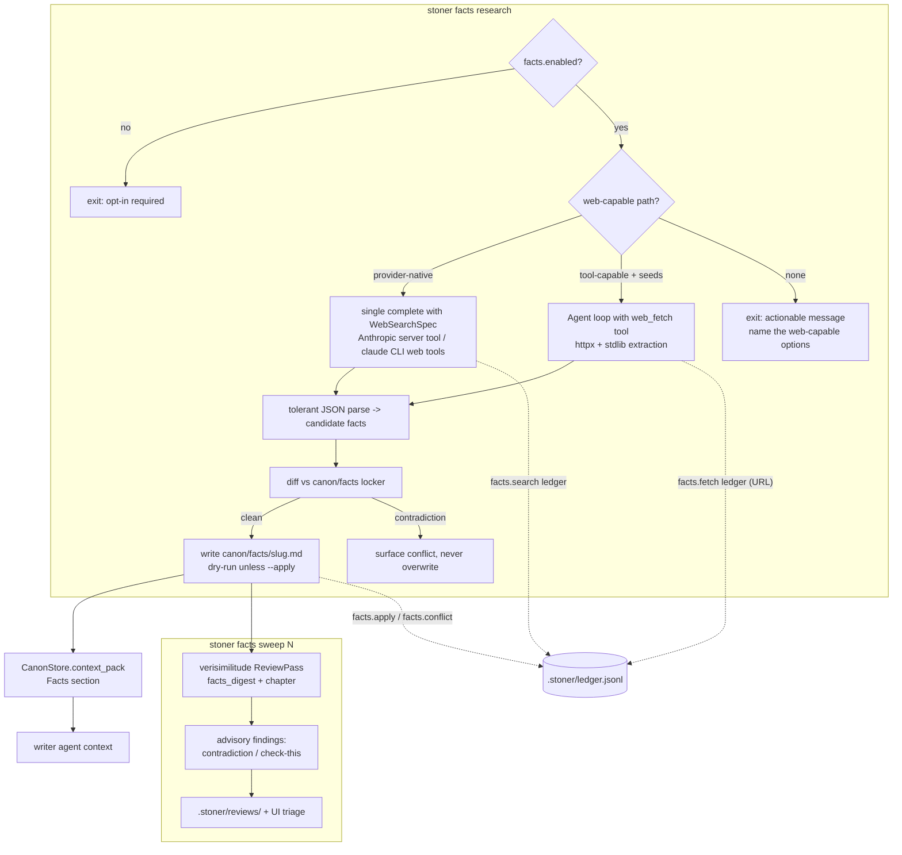

## Summary

Add a research role that builds a sourced fact locker under `canon/facts/`, feeds real detail
into the writer's context pack, and sweeps drafted chapters for anachronisms, contradictions,
and confident-sounding unsourced specifics. Web access is a pluggable, explicitly opt-in
capability with a ledgered trail for every network action and a clear failure mode when no
web-capable provider path exists.

---

## Problem Frame

Literature is dense with true detail; models hallucinate confidently. The difference between
"she filled out paperwork" and the actual name of the county form Ruth Vann would dread is
exactly the kind of specificity the harness cannot currently supply or check: nothing in the
repo can source a fact, remember where it came from, or notice when a draft asserts a specific
(a date, a fee, a statute, a brand) that no one ever verified.

The repo already has the right substrate. Canon is the single source of truth with a
diff-don't-overwrite conflict method (`src/stoner/canon/archivist.py`), `context_pack()` is the
one channel that feeds durable facts to the writer (`src/stoner/canon/store.py`), and the
review registry accepts additive advisory passes (`src/stoner/review/passes.py`). The
examples/novella (Sungrown — Humboldt legalization) is the proof corpus: its world entry
`examples/novella/canon/world/the-cannabis-land-use-ordinance-the-eureka-permit-process.md` is
full of checkable specifics (50 ft setbacks, $1,200 reinspection fee, June 1–October 31
forbearance window) that a verisimilitude sweep should be able to hold a draft to.

The hard part is web access in a provider-agnostic (invariant 7), local-by-default
(invariant 9) harness. Verified 2026 reality:

- The Anthropic Messages API has a server-side web search tool (`type: web_search_20250305`,
  `name: web_search`) that runs searches inside one `messages.create` call — no client-side
  tool loop — with `max_uses`, `allowed_domains`, mandatory citations, and search counts in
  `usage.server_tool_use.web_search_requests`. It fits behind the repo's single
  `Provider.complete()` method.
- OpenAI's real web search lives on the Responses API; on Chat Completions it requires
  `web_search_options` plus dedicated search models (`gpt-5-search-api`; the
  `gpt-4o-search-preview` models shut down 2026-07-23). The repo's `openai_compat` provider
  speaks `chat.completions` against arbitrary base URLs (OpenRouter, Together, Groq, Ollama),
  so there is no portable provider-native search on that path.
- The `claude` CLI backend (`src/stoner/providers/claude_code.py`) already ships its own
  `WebSearch`/`WebFetch` tools; in `-p` print mode they are enabled by tool allowlisting. The
  provider currently disables all tools — research calls can selectively re-enable exactly the
  web tools while keeping the filesystem jail.
- For everything else, the already-declared `httpx` core dependency (declared, currently
  unused directly) supports a harness-side `web_fetch` agent tool: fetch a URL the model or
  the writer supplies, extract readable text with a stdlib `html.parser` reducer, no new
  dependencies. Fetch-only mode can verify specifics on known sites but cannot discover
  sources; that limitation is stated, not papered over.

---

## Requirements

Fact locker:

- R1. Facts live as canon artifacts in `canon/facts/<slug>.md`: frontmatter carries the hard
  fields (name, claim, tags, source_url, source_title, accessed date, confidence, status);
  body carries verbatim quotes and notes. Frontmatter is diffable; body is never
  machine-edited after a human touches it (invariant 3).
- R2. Applying researched facts follows the canon method: new facts write cleanly,
  contradictions with existing locker entries surface as conflicts for the human, and nothing
  auto-overwrites. Dry-run is the default; `--apply` commits non-conflicting facts only.
- R3. Locker facts feed the writer: `CanonStore.context_pack()` gains a Facts section so
  `chapter_context` and the review passes pick facts up through the existing channel with no
  pipeline changes.
- R4. Facts can be added manually offline (`stoner facts add`) — the locker is useful without
  any network capability.

Research pipeline:

- R5. `stoner facts research "<topic>"` runs a researcher (ModelRoles.researcher, resolving
  against writer when unset) that returns candidate facts as STRICT JSON with source URLs,
  parsed tolerantly, diffed against the locker, and applied per R2.
- R6. Web access is opt-in and human-invoked: all network research is refused unless
  `facts.enabled: true` in stoner.yaml, and even when enabled the research pipeline refuses
  with an actionable error when invoked from autonomous `stoner book` context — book mode
  consumes the locker, it never builds it. The docs/faq.md privacy answer is updated to name
  `facts research` as a network-touching command (invariant 9).
- R7. Every network action is ledgered under `facts.*`: each harness-side fetch with its URL,
  each provider-native search batch with count (and queries where the provider exposes them),
  plus research start/done and apply/conflict entries (invariant 5).
- R8. Web capability is pluggable with three paths: (a) provider-native search (Anthropic
  server tool; claude CLI web tools), (b) harness-side `web_fetch` for tool-capable providers,
  seeded by `--url` and model-known URLs, (c) none — in which case the command fails with an
  actionable message naming the ways to get a web-capable path. No silent degradation to
  unsourced facts.
- R9. Provider-agnosticism holds: no vendor SDK use outside `providers/`; the capability is
  expressed as a provider-neutral request field mapped inside each provider; text-only
  providers keep working (claude CLI single-shot; codex CLI simply lacks the capability)
  (invariant 7).

Manuscript sweep:

- R10. A `verisimilitude` review pass (additive PASSES entry, not in the default
  `review_passes` list) checks a chapter against the locker: contradictions with locker facts
  are findings, and confident-sounding unsourced specifics — dates, brands, laws, fees,
  procedures, named forms — are flagged as check-this findings. All advisory, never gating
  (invariant 2).
- R11. `stoner facts sweep <chapter>` runs just that pass through the existing review runner,
  so reports land in `.stoner/reviews/` and findings triage in the UI works unchanged.

---

## Key Technical Decisions

- Web capability as a provider-neutral request field, mapped per-provider: `CompletionRequest`
  gains an optional `web_search: WebSearchSpec | None` (max_uses, allowed_domains) and
  `Provider` gains a `supports_web_search` class flag. `AnthropicProvider` maps the spec to
  the `web_search_20250305` server tool dict inside `messages.create` (single-method fit,
  server-side loop, bounded `pause_turn` continuation); `ClaudeCodeProvider` maps it to
  enabling exactly `WebSearch,WebFetch` in print mode (feature-detected, filesystem jail
  intact); every other provider keeps the flag false and raises `ProviderError` if the spec is
  set. Rationale: keeps invariant 7 — the semantic capability crosses the seam, the vendor
  wire format stays inside `providers/`. Rejected: passing raw vendor tool dicts through the
  request (leaks vendor shapes), and adopting the OpenAI Responses API (new provider surface
  for one feature; Chat Completions search needs dedicated models and is not portable across
  the openai_compat fleet).
- Sourced-fact JSON is the portable citation channel: the researcher prompt demands STRICT
  JSON facts each carrying `source_url`/`source_title`/`quote`, parsed with an
  archivist-style tolerant extractor. Provider-native citations (Anthropic's
  `web_search_result_location` blocks, surfaced via `CompletionResponse.raw`) are used for
  ledger detail, not as the primary parse target. Rationale: one parser works across
  anthropic, claude CLI, and fetch-tool paths; native citations differ per vendor and are
  absent on two of the three paths.
- Harness-side fetch uses httpx + stdlib extraction, no new deps: `web_fetch` does a capped
  GET (size, timeout, redirect limits, text/* only) and reduces HTML to readable text with an
  `html.parser`-based tag stripper (drop script/style/nav, collapse whitespace, truncate).
  Rationale: invariant 8 — `readability-lxml` and `trafilatura` drag heavy C/lxml deps for
  marginal gain when the consumer is a model quoting passages, not a rendering engine. The
  extraction is honest about being crude; the model reads the text and quotes verbatim.
- Fetch-only mode is verification, not discovery, and says so: without provider-native search
  the researcher can only fetch URLs it is given (`--url` seeds) or already knows. The CLI
  help and docs state this; the failure message when a topic needs discovery recommends an
  Anthropic or claude-CLI researcher role. Rationale: shipping a scraping-based pseudo-search
  (DuckDuckGo HTML etc.) is fragile and dishonest about reliability; a configurable search
  API is deferred.
- Locker conflicts mirror the archivist, implemented feature-locally: `facts/locker.py` is
  pure assemble/parse/diff/apply (never calls a provider); same-slug facts with materially
  different claims become Conflict records; `apply(auto=False)` is the dry-run default.
  Rationale: invariant 3 and the proven `canon/archivist.py` pattern; pipelines own LLM calls.
- Facts enter the writer through `context_pack()`, not a new channel: an additive Facts
  section (one line per fact: claim, source domain, confidence) slots into the existing
  priority order after World. Rationale: R3 with zero changes to `pipelines/common.py` or the
  writer prompt; the pack's whole-section budget logic already handles overflow (invariant 4).
- The sweep is an advisory ReviewPass registered additively: pass logic lives in
  `src/stoner/facts/sweep.py`; `review/passes.py` gets a one-line registration and an
  optional-with-default `PassContext.facts_digest` field. It is not added to the default
  `review_passes` config list and stays opt-in permanently: the pass is only meaningful with
  a populated locker, and its cost should always be a deliberate choice. Rationale:
  invariant 2 (LLM judgments advisory), shared-seam etiquette (additive, other passes
  unaffected), and no behavior change for existing projects.
- Opt-in config is one sub-model: `facts: FactsConfig` (enabled=False, max_searches,
  allowed_domains, max_facts_per_run) plus `ModelRoles.researcher: ""` resolving against
  writer when empty — the sanctioned way to add a role. Rationale: invariant 9 needs one
  unmissable switch; scattered flags would blur the privacy promise. Cost control is the
  per-run `max_searches` cap (default 8) plus the per-search ledger trail; no per-project
  search budget cap.

---

## High-Level Technical Design



Fact entry shape (`canon/facts/humboldt-reinspection-fee.md`, directional):

```yaml
---
name: Category II reinspection fee
claim: "Humboldt Category II violations carry a $1,200 reinspection fee and 60-day cure"
tags: [permits, humboldt]
source_url: https://humboldtgov.org/...
source_title: Humboldt County Code ...
accessed: 2026-07-07
confidence: high      # high | medium | low
status: unverified    # unverified | verified | disputed  (human-set after review)
---
## Quotes
> verbatim source passage...
## Notes
```

Conflict semantics: a researched fact whose slug matches an existing entry but whose `claim`
(or any frontmatter fact field) materially differs is a Conflict — reported with both values
and the supporting quote, mirroring `archivist.Conflict`. `status` and body are human
territory and never machine-changed once set.

Sweep prompt contract (directional): the pass feeds the chapter plus a facts digest (claim +
source + confidence per entry) and asks for STRICT JSON findings in two categories —
`contradiction` (chapter asserts something a locker fact refutes; severity major) and
`check-this` (chapter states a confident specific — date, fee, statute, brand, named form,
procedure — that no locker fact covers; severity minor/info). Standard findings shape so
`_make_standard_parser`-style parsing, `locate_span`, and the UI work unchanged.

---

## Integration Surface

- CLI: new group `stoner facts` via `src/stoner/cli/facts_cmds.py` exposing `register(app)`;
  one import+register line added to `src/stoner/cli/main.py`. Commands: `facts research`,
  `facts list`, `facts show`, `facts add`, `facts sweep`.
- config.py: new field `facts: FactsConfig` (enabled=False, max_searches=8,
  allowed_domains=[], max_facts_per_run=20); `ModelRoles` gains `researcher: str = ""`
  (empty resolves against writer).
- types.py: new `WebSearchSpec` model; `CompletionRequest` gains
  `web_search: WebSearchSpec | None = None`; `Usage` gains `web_searches: int = 0`
  (participates in `+`). All additive with defaults.
- providers: `base.Provider` gains class attr `supports_web_search: bool = False`;
  `anthropic.py` and `claude_code.py` gain web_search mappings (feature-local, additive);
  other providers untouched.
- project.py DIRS: add `"canon/facts"`. No new `.stoner/` files.
- canon: `CanonKind` literal gains `"fact"`; `CanonStore._entry_kind` recognizes
  `canon/facts/`; `context_pack()` gains a Facts section; new template
  `src/stoner/canon/templates/facts/_template.md` registered in `scaffold._RENDERED_FILES`
  as `canon/facts/_template.md`.
- ledger actions: `facts.research.start`, `facts.research.done`, `facts.search`,
  `facts.fetch`, `facts.apply`, `facts.conflict`, `facts.add`, `facts.sweep.run`.
- review: PASSES gains `"verisimilitude"` (registered from `facts/sweep.py`); `PassContext`
  gains `facts_digest: str = ""` (optional-with-default); `build_context` populates it when
  `canon/facts/` has entries. Not added to default `review_passes`.
- engine/tools.py: no change to `default_registry()`; the `web_fetch` tool is defined in
  `src/stoner/facts/webfetch.py` and bound only into the research agent's registry.
- engine/prompts/: new `facts_research.md` (researcher system/user template).
- ModelRoles: new `researcher` role, resolves against writer when empty.
- UI: none (findings from the sweep flow through existing review endpoints).
- pyproject: none (httpx already a core dep; stdlib html.parser for extraction).
- dependencies on other feature plans: none. The Writers' Room (5) and Pacing (4) plans also
  add PASSES entries; all are additive dict insertions with no ordering constraint. Feature 2
  (Interiority) may later consume locker facts via `context_pack`, which it gets for free.
- docs: `docs/facts.md` (new); `docs/faq.md` privacy answer amended to list `facts research`.

---

## Implementation Units

### U1. Web-capable completion seam

**Goal**: A provider-neutral way to request web search through `Provider.complete()`, mapped
natively by the Anthropic and claude-CLI providers, refused loudly everywhere else.

**Requirements**: R8, R9

**Dependencies**: none

**Files**:
- `src/stoner/types.py` (WebSearchSpec; CompletionRequest.web_search; Usage.web_searches)
- `src/stoner/providers/base.py` (supports_web_search flag; docstring)
- `src/stoner/providers/anthropic.py`
- `src/stoner/providers/claude_code.py`
- `tests/test_facts_web.py`

**Approach**: `WebSearchSpec` holds max_uses and allowed_domains only — the provider-neutral
subset both native paths can honor (claude CLI cannot enforce domains; it records that in the
response notes rather than failing). Anthropic: when the spec is set, append the
`{"type": "web_search_20250305", "name": "web_search", "max_uses": ..., "allowed_domains":
...}` dict to the tools payload (verified request shape from the Claude platform docs);
tolerate the new response block types (`server_tool_use`, `web_search_tool_result`) in
`_parse_response` by skipping non-text/tool_use blocks; copy
`usage.server_tool_use.web_search_requests` into `Usage.web_searches`; on
`stop_reason: "pause_turn"`, resend the paused assistant message up to a small fixed bound;
surface searched queries and cited URLs through `CompletionResponse.raw`. claude_code: when
the spec is set and the `--tools` flag is feature-detected, pass `--tools
"WebSearch,WebFetch"` instead of `--tools ""` (scratch cwd and all filesystem tools stay
disabled); without the flag, raise ProviderError naming the CLI version issue. Providers with
`supports_web_search=False` raise ProviderError if a request carries the spec — silent
ignoring would fake sourcing.

**Patterns to follow**: `tests/test_providers.py` fake-SDK harness for the Anthropic mapping;
`tests/test_claude_code_provider.py` subprocess-stub pattern for CLI flag assertions;
`Usage.__add__` in `src/stoner/types.py`.

**Test scenarios**:
- Anthropic request with spec set includes the server tool dict with max_uses and
  allowed_domains; response containing server_tool_use/web_search_tool_result blocks parses to
  text + Usage.web_searches without error.
- Anthropic pause_turn response triggers one bounded continuation then returns final text.
- claude_code with spec set builds a command containing `--tools "WebSearch,WebFetch"`; with
  spec unset, keeps `--tools ""`.
- openai_compat provider raises ProviderError when the spec is set.
- Usage addition sums web_searches.

**Verification**: full test suite green; no vendor imports outside `providers/`; requests
without the spec are byte-identical to today's (regression assertions in existing provider
tests still pass).

### U2. Fact locker core + canon integration

**Goal**: `canon/facts/` as a first-class canon artifact with archivist-style diff/apply and a
Facts section in the writer's context pack.

**Requirements**: R1, R2, R3, R4

**Dependencies**: none (parallel with U1, U3)

**Files**:
- `src/stoner/facts/__init__.py`
- `src/stoner/facts/locker.py`
- `src/stoner/canon/store.py` (additive: CanonKind "fact", `_entry_kind`, context_pack Facts
  section)
- `src/stoner/canon/templates/facts/_template.md`
- `src/stoner/canon/scaffold.py` (one `_RENDERED_FILES` entry)
- `src/stoner/project.py` (DIRS += "canon/facts")
- `tests/test_facts_locker.py`

**Approach**: `locker.py` defines the fact frontmatter contract (see design sketch), a
`FactRecord` dataclass, `list_facts(store)`, `facts_digest(store, max_chars)` (one line per
fact: claim, source domain, confidence — used by both context_pack and the sweep pass),
`parse_research_json(text)` (tolerant, mirroring `parse_archivist_json`),
`diff_facts(candidates, store) -> list[FactConflict]` (same-slug materially-different-claim
rule; case-insensitive compare like `archivist._values_conflict`), and
`apply_facts(store, candidates, auto=False)` (dry-run default; writes via a new fact-path
upsert; conflicting slugs never written; sets `accessed` and `status: unverified`).
context_pack inserts the Facts section between World and Recent Timeline using the existing
whole-section budget helper. The template file carries the frontmatter skeleton and
instructive comments matching the character/world template voice.

**Patterns to follow**: `src/stoner/canon/archivist.py` (parse/diff/apply, Conflict,
dry-run default); `CanonStore._upsert` and `slugify`; `tests/test_canon.py` fixture style.

**Test scenarios**:
- `stoner`-scaffolded project gets `canon/facts/` and the template; scaffold re-run leaves
  existing files untouched.
- Writing a fact entry then `list_entries(kind="fact")` returns it; template stem excluded.
- context_pack includes the Facts line for a saved fact; with a tiny max_chars budget the
  Facts section drops whole rather than mangles (mirrors existing truncation tests).
- diff: candidate with new slug -> no conflict; same slug + same claim (case shifted) -> no
  conflict; same slug + different fee value -> Conflict carrying both values and quote.
- apply dry-run touches no files; apply auto writes non-conflicting entries only; a
  hand-edited body is preserved on re-apply of the same slug's unchanged claim.
- Humboldt scenario: seed locker with the $1,200 reinspection-fee fact from the novella's
  world entry, apply a contradictory $500 candidate, assert Conflict.

**Verification**: 227 existing tests still green (store/scaffold changes are additive);
new locker tests pass; `stoner init` on a fresh tmp project creates `canon/facts/`.

### U3. Harness-side web_fetch tool

**Goal**: A ledgered, capped, opt-in URL fetcher usable as an agent tool by any tool-capable
provider — the degradation path when no native search exists.

**Requirements**: R7, R8

**Dependencies**: none (parallel with U1, U2)

**Files**:
- `src/stoner/facts/webfetch.py`
- `tests/test_facts_fetch.py`

**Approach**: `fetch_readable(url, *, timeout, max_bytes, allowed_domains) -> FetchResult`
(final URL, title, extracted text, truncated flag, error string) using httpx with a
`st0n3r-facts/<version>` user agent, redirect and size caps, text/* content-type check, and a
stdlib `html.parser` reducer that drops script/style/head/nav content and collapses
whitespace. A `make_web_fetch_tool(project, ledger, config)` factory returns a
`(project, **kwargs) -> str` tool function matching `engine/tools.py` conventions (never
raises; `"ERROR: ..."` strings), enforcing `facts.enabled`, the domain allowlist when set,
and appending a `facts.fetch` ledger line (url, status, bytes) on every attempt including
failures. Not added to `default_registry()` — bound only by the research pipeline.

**Patterns to follow**: tool-function shape and error convention in
`src/stoner/engine/tools.py`; `httpx.MockTransport` for network-free tests (httpx already
used in `tests/test_providers.py`).

**Test scenarios**:
- HTML page via MockTransport -> readable text, script/style stripped, title captured.
- Oversized body -> truncated at max_bytes with truncated flag; non-text content-type ->
  ERROR string; connection error -> ERROR string, no raise.
- Domain allowlist set and URL off-list -> ERROR string, and the refusal is ledgered.
- Every call (success and failure) appends exactly one `facts.fetch` ledger line with the URL.
- facts.enabled false -> tool refuses with an actionable ERROR string.

**Verification**: tests pass with zero real network (MockTransport only); tool string
outputs are model-consumable plain text.

### U4. Research pipeline + CLI research/add commands

**Goal**: `stoner facts research "<topic>"` end to end: opt-in gate, capability selection,
researcher call, parse, diff, dry-run/apply, full ledger trail; plus offline `facts add`.

**Requirements**: R2, R4, R5, R6, R7, R8

**Dependencies**: U1, U2, U3

**Files**:
- `src/stoner/facts/research.py`
- `src/stoner/engine/prompts/facts_research.md`
- `src/stoner/config.py` (FactsConfig; ModelRoles.researcher)
- `src/stoner/cli/facts_cmds.py` (group scaffold; research + add commands)
- `src/stoner/cli/main.py` (register line)
- `tests/test_facts_research.py`
- `tests/test_facts_cli.py` (research/add command paths, no network)

**Approach**: `run_research(project, topic, urls=(), apply=False, model=None, provider=None)
-> ResearchResult` (dataclass: candidates, applied, conflicts, usage, notes — pipeline result
convention). Flow: refuse unless `config.facts.enabled` (actionable message naming the yaml
key); refuse when invoked from book-mode context — an explicit guard, not mere unwiring, so
the network surface stays strictly human-invoked even when `facts.enabled` is true
(actionable message; book mode consumes the locker, it never builds it); resolve researcher
role (`models.researcher` else writer); pick the path —
provider-native when `provider.supports_web_search` (single `complete()` with WebSearchSpec
built from FactsConfig), else fetch-tool mode when the provider supports tools and seeds or
canon give starting URLs (an `engine/agent.Agent` run with a registry of `web_fetch` +
`query_canon` + `search_text`), else fail listing the three remedies (anthropic researcher
role, `claude` provider, or `--url` seeds with a tool-capable provider). The prompt template
demands STRICT JSON facts with source_url/source_title/quote/confidence and explicitly
forbids unsourced facts; parse via `locker.parse_research_json`; drop candidates without a
source_url (counted in notes); diff+apply per U2. Ledger: `facts.research.start` (topic,
path, model), `facts.search` (count from Usage.web_searches, queries/URLs from raw when the
provider exposes them, "count unknown" note for claude CLI), `facts.apply`/`facts.conflict`
per fact, `facts.research.done` (counts, usage). `facts add` writes one locker entry from
flags (name, claim, source-url, confidence) with no network and a `facts.add` ledger line.

**Patterns to follow**: `src/stoner/pipelines/write.py` run_write result/notes shape;
`pipelines/common.py` `resolve_role_model`/`call_model`; `cli/book_cmds.py` register(app) and
error handling; `tests/test_pipeline.py` ScriptedProvider queues.

**Test scenarios**:
- facts.enabled false -> ResearchResult never created; CLI exits nonzero with the yaml key in
  the message; nothing ledgered beyond nothing (no facts.* lines).
- Invocation flagged as book-context (facts.enabled true) -> refuses with a clear message
  before any provider call; no network attempt, no facts.* ledger lines.
- Native path: FakeProvider with supports_web_search=True returns scripted JSON naming the
  Humboldt "Cannabis Land Use Ordinance" fact -> dry-run lists candidates, `--apply` writes
  `canon/facts/`, ledger shows research.start/search/apply/done in order.
- Fetch path: tool-capable FakeProvider scripted to call web_fetch on a seed URL (served by
  MockTransport) then emit JSON -> fact applied; `facts.fetch` ledger line carries the URL.
- No-capability path: text-only FakeProvider without native search and no seeds -> exact
  failure message naming the three remedies.
- Candidate without source_url is dropped and counted in notes, never written.
- Conflicting candidate (same slug, different claim) surfaces in ResearchResult.conflicts and
  is not written even with `--apply`.
- Researcher role resolution: models.researcher set -> used; empty -> writer model used.

**Verification**: end-to-end run on a tmp project with scripted providers produces locker
files, ledger lines, and console output; no test opens a socket.

### U5. Verisimilitude sweep pass

**Goal**: An advisory review pass that checks a chapter against the locker and flags
confident unsourced specifics as check-this findings.

**Requirements**: R10, R11

**Dependencies**: U2

**Files**:
- `src/stoner/facts/sweep.py`
- `src/stoner/review/passes.py` (PassContext.facts_digest default field; build_context
  population; one PASSES registration line)
- `tests/test_facts_sweep.py`

**Approach**: `sweep.py` builds the ReviewPass: prompt = chapter + facts digest (from
`locker.facts_digest`) + instructions to emit standard-shape STRICT JSON findings in exactly
two categories — `contradiction` (assertion a locker fact refutes; severity major; must quote
the chapter and name the fact slug in the issue) and `check-this` (confident specific with no
covering fact; severity minor; issue phrased as a verification task, not a claim of error).
Reuses `_std_user_prompt`-style assembly and the standard parser so `locate_span`, Finding
status flow, saved reports, and the UI need nothing new. Registration is an additive
`PASSES["verisimilitude"]` entry; `PassContext.facts_digest` defaults to `""` so all existing
passes and tests are untouched; `build_context` fills it only when locker entries exist.

**Execution note**: register at the bottom of `passes.py` with the import placed after all
shared helpers are defined (facts/sweep.py imports PassContext and helpers from
review.passes; bottom-of-module registration keeps the cycle safe). Findings use the existing
`review:<name>` source convention (`review:verisimilitude`).

**Patterns to follow**: continuity pass construction in `src/stoner/review/passes.py`
(`_std_user_prompt`, `_make_standard_parser`); `tests/test_review.py` FakeProvider
fenced-JSON scripting and saved-report assertions.

**Test scenarios**:
- Locker holds the $1,200 reinspection-fee fact; chapter text says "$500 reinspection fee";
  scripted model returns a contradiction finding -> Finding severity major, span located,
  category `contradiction`.
- Chapter says "she filled out the county form" area specifics with no covering fact;
  scripted check-this finding parses at severity minor with a verification-phrased issue.
- Empty locker -> facts_digest empty; pass still runs and prompt tells the model every
  specific is unsourced (all findings are check-this).
- run_review with passes=["verisimilitude"] saves `.stoner/reviews/ch-NN-*.json` and ledgers
  `review.run`; a garbage model response degrades to one info finding (runner contract).
- Existing review tests unaffected (PassContext default field).

**Verification**: full review test suite green; sweep findings render in the existing report
markdown and UI status PATCH flow without changes.

### U6. facts CLI surface completion + docs

**Goal**: The remaining commands (`list`, `show`, `sweep`), the privacy documentation, and
the feature doc.

**Requirements**: R6, R11

**Dependencies**: U4, U5

**Files**:
- `src/stoner/cli/facts_cmds.py` (list/show/sweep commands)
- `docs/facts.md`
- `docs/faq.md` (amend the network-commands answer)
- `tests/test_facts_cli.py` (extend)

**Approach**: `facts list` renders a rich Table (slug, claim excerpt, confidence, status,
accessed, source domain); `facts show <slug>` prints the entry; `facts sweep <chapter>`
resolves the reviewer role and calls `run_review(project, chapter,
passes=["verisimilitude"])`, printing the standard findings table and ledgering
`facts.sweep.run`. docs/facts.md covers: the locker contract, the three web paths and their
constraints (including that fetch-only mode is verification-not-discovery and that claude-CLI
mode cannot enforce domain filters), pricing note for Anthropic native search ($10 per 1,000
searches per current docs), the opt-in flag, and the ledger trail. faq.md's "when does it
touch the network" answer adds `facts research` (and `facts sweep` as a model-calling
command) to the enumerated list.

**Patterns to follow**: `cli/main.py` canon_app nested-noun sub-app and Table rendering;
`tests/test_cli.py` CliRunner + monkeypatch.chdir, no-network commands.

**Test scenarios**:
- `facts list` on empty locker prints an empty-state message, exit 0; after `facts add`,
  the table includes the entry.
- `facts show missing-slug` exits nonzero with a clear message.
- `facts sweep 1` with a monkeypatched run_review invokes it with
  passes=["verisimilitude"] and ledgers `facts.sweep.run`.
- Doc lint: faq answer names `facts research` (assert in a docs test only if the repo grows
  one; otherwise manual verification).

**Verification**: CliRunner tests green; `stoner facts --help` lists all five commands;
docs render cleanly.

---

## Scope Boundaries

Non-goals:

- No configurable third-party search API (Brave/SearXNG/Tavily keys) — the native paths plus
  seeded fetch cover the honest cases; a pluggable search backend is follow-up work.
- No OpenAI Responses API provider and no `web_search_options` support in openai_compat —
  Chat Completions search requires dedicated search models and is not portable across the
  compatible-endpoint fleet the provider serves.
- No research during `stoner write`/`stoner book` — research is a deliberate, human-invoked
  command, enforced by the pipeline's book-context refusal (see U4), not merely left
  unwired; the autonomous loop consumes whatever the locker already holds.
- No fact freshness/re-verification scheduler; `accessed` dates and human `status` edits are
  the mechanism.
- No robots.txt handling or crawling: `web_fetch` performs single user-directed fetches, not
  traversal; it never follows links on its own.
- No UI panel for the locker; sweep findings ride the existing review UI.
- Parking lot (all plans): series canon, voice fine-tunes, nonfiction mode, multi-writer.

### Deferred to Follow-Up Work

- Configurable search backend for non-native providers (SearXNG URL or search-API key in
  FactsConfig).
- Codex CLI web capability (its search flag surface is unverified; keep
  supports_web_search=False until checked).
- Deterministic pre-scan for "confident specifics" (regex for dates, dollar amounts, statute
  citations) to focus the sweep prompt — a nice slop-style companion, not needed for v1.
- Anthropic `web_search_20260209`+ dynamic filtering and `response_inclusion` — token
  optimizations; the basic 20250305 tool is sufficient and more widely supported.
- Cross-checking researched facts against character/world frontmatter (beyond the locker
  itself); today the sweep pass covers chapter-level contradictions.

---

## Assumptions

- The Anthropic server-side web search tool remains available to API keys by default (org
  admins can disable it; the ProviderError path covers the resulting 400).
- The `claude` CLI's tool-allowlist flag surface stays feature-detectable via the existing
  `-p --help` cache; if a future CLI drops `--tools`, research via that provider fails loudly.
- `Usage.web_searches` as an additive int field will not disturb existing `+` call sites
  (default 0, summed like the token fields).
- A stdlib HTML-to-text reducer is good enough for model consumption; we accept crude output
  on JS-heavy pages and report extraction failures as ERROR strings.
- Fact identity is slug-of-name; researchers are prompted to reuse existing fact names when
  updating a topic, and same-topic-different-name duplicates are a human triage problem, not
  a machine-merge problem.
- The novella's Humboldt ordinance specifics are used as test fixture material only (repo's
  own content, no licensing concern).
- `facts sweep` counts as a model-calling command in the privacy promise, same class as
  `review`.

---

## Risks & Dependencies

- Anthropic response-shape drift (new block types, pause_turn behavior) could break parsing;
  mitigated by skip-unknown-blocks parsing and `raw` passthrough, and by tests pinning only
  the documented shapes.
- claude-CLI research offers no domain filtering and no per-search visibility; ledger entries
  record the limitation explicitly so the privacy trail is honest rather than falsely precise.
- Fetch-mode research quality depends on the model knowing plausible URLs; mitigated by
  `--url` seeds and by documenting fetch mode as verification-only.
- Import-cycle risk in the PASSES registration (facts/sweep.py <-> review/passes.py);
  mitigated by bottom-of-module registration (U5 execution note) and a test importing both
  modules in both orders.
- Sweep false positives on fiction-internal inventions (GrowTrack is an invented system in
  the novella): the prompt must distinguish real-world specifics from canon-established
  fictional ones by including the canon digest; findings stay advisory (invariant 2) so the
  cost of a false positive is one dismissed finding.

---

## Sources & Research

- Anthropic web search tool — request shape (`type: web_search_20250305`, `name:
  web_search`), `max_uses`, `allowed_domains`/`blocked_domains` (mutually exclusive),
  server-side loop, `pause_turn`, `encrypted_content` pass-back, citations,
  `usage.server_tool_use.web_search_requests`, $10 per 1,000 searches; newer
  `web_search_20260209`/`web_search_20260318` add dynamic filtering and response inclusion:
  https://platform.claude.com/docs/en/docs/agents-and-tools/tool-use/web-search-tool
  (verified 2026-07-07); announcement: https://www.anthropic.com/news/web-search-api
- OpenAI web search — Responses API `web_search` tool is the primary surface; Chat
  Completions requires `web_search_options` + dedicated search models (`gpt-5-search-api`;
  `gpt-4o-search-preview` models deprecated, shutdown 2026-07-23); domain filtering
  Responses-only: https://developers.openai.com/api/docs/guides/tools-web-search and
  https://developers.openai.com/api/docs/guides/migrate-to-responses (verified 2026-07-07).
- Claude Code CLI headless mode — `-p/--print` with `--allowedTools`/tool allowlisting
  governs which built-in tools (including WebSearch/WebFetch) may run without prompting:
  https://code.claude.com/docs/en/settings and community/CI references, e.g.
  https://hidekazu-konishi.com/entry/claude_code_cicd_and_headless_automation.html
  (verified 2026-07-07); the repo's provider already feature-detects flags via `-p --help`
  (src/stoner/providers/claude_code.py).
- Repo grounding: `src/stoner/canon/store.py` (CanonKind, context_pack budget method),
  `src/stoner/canon/archivist.py` (diff/apply, Conflict, dry-run default),
  `src/stoner/canon/scaffold.py` (_RENDERED_FILES), `src/stoner/review/passes.py`
  (PassContext, PASSES, standard parser), `src/stoner/providers/{base,anthropic,
  claude_code,openai_compat}.py`, `src/stoner/config.py`, `docs/faq.md` (privacy promise),
  `examples/novella/canon/world/the-cannabis-land-use-ordinance-the-eureka-permit-process.md`
  (proof-corpus specifics).
