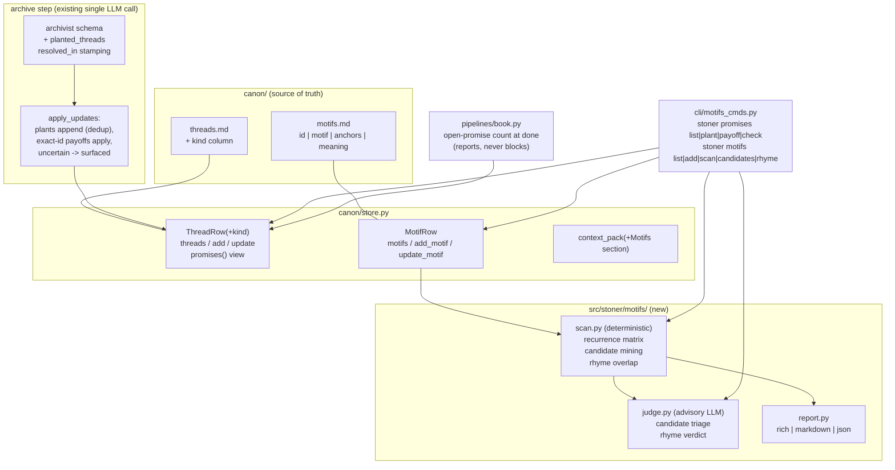

## Summary

Extend the threads machinery so planted promises (mystery, threat, want, image) are tracked from plant to payoff with a deterministic no-unfired-guns check, add a `canon/motifs.md` registry with a deterministic per-chapter recurrence matrix, and measure whether the ending rhymes with the opening — deterministic overlap plus a comparative advisory LLM judgment.

---

## Problem Frame

Threads track plot; literature runs on images and promises. `canon/threads.md` already records open/resolved/abandoned rows (`CanonStore.threads()/add_thread/update_thread`, `ThreadRow`, `parse_table`/`render_table`), and the archivist already updates thread status during archive. But a thread row cannot say *what species of promise* it is, the harness never notices a recurring image, and nothing measures whether the ending answers the opening — the single strongest predictor of an ending that lands (`canon/premise.md` even ships a "Promise to the Reader" section nothing enforces).

The repo's institutional learning is explicit: build ON threads.md, don't add a parallel store. A promise is a richer thread, not a different thing — `opened_in` is the plant, `resolved_in` is the payoff, `status: open` is an unfired gun. Motifs have no existing home and get a new registry. All recurrence measurement must be deterministic (invariant 2); all LLM judgment (is this recurrence meaningful? does the ending rhyme?) must be comparative/categorical and advisory only (invariant 1).

---

## Requirements

Promises:

- R1. `canon/threads.md` gains one trailing `kind` column (empty for plain plot threads; `mystery|threat|want|image` marks a promise). Existing six-column files parse unchanged; the column is added lazily on the first write, never by a read.
- R2. `CanonStore` exposes promise-aware access: `ThreadRow` carries `kind`, promises are listable as a filtered view of threads, and plant/payoff operations set `kind`+`opened_in` and `status: resolved`+`resolved_in` respectively.
- R3. The archivist detects newly planted promises and payoffs during the archive step. Plants append rows the way timeline rows append (idempotent on re-run). Payoffs auto-apply only on an exact existing-id match against an open row; uncertain or conflicting matches surface in `ApplyResult` unapplied — never auto-resolved.
- R4. A deterministic no-unfired-guns check exists: `stoner promises check` exits nonzero while promise rows remain open, and book mode reports remaining open promises at completion (surfaced loudly, not blocking — abandoning a thread is the writer's call).

Motifs:

- R5. `canon/motifs.md` is a scaffolded, hand-editable pipe-table registry (id, motif name, anchor phrases, intended meaning) with `CanonStore` accessors mirroring the threads trio.
- R6. A deterministic recurrence scan maps every registered motif across all chapters via stem-normalized anchor matching, rendered as a per-chapter matrix (rich/markdown/json) and saved as a JSON report.
- R7. Deterministic candidate mining finds unregistered content n-grams recurring across enough distinct chapters, excluding grams already covered by registered anchors.
- R8. An advisory LLM judgment classifies mined candidates (promote / ignore, with reasons) and flags whether registered-motif recurrences read as meaningful or accidental — emitted as advisory `Finding`s, never written to `canon/motifs.md`.
- R9. Registered motifs appear in the writer's `context_pack` digest as a bounded section, so drafts can weave them deliberately.

Ending-rhymes-with-opening:

- R10. A deterministic overlap measure compares the opening and closing chapter windows: content-token overlap, distinctive shared terms, and motif co-presence. Numbers are arithmetic only.
- R11. An advisory LLM judgment reads only the opening and closing windows, framed comparatively, returning a categorical verdict (RHYMES / PARTIAL / FLAT) with quoted image pairs as evidence. Advisory only.

Integration:

- R12. CLI ships as `stoner promises ...` and `stoner motifs ...` sub-apps in `src/stoner/cli/motifs_cmds.py`, wired by one `register(app)` line in `cli/main.py`.
- R13. Config adds one `motifs: MotifsConfig` field; every mutating command appends a `motif.*` ledger line.
- R14. Only `stoner motifs candidates` and `stoner motifs rhyme` call a model; everything else runs offline (local-by-default promise).

---

## Key Technical Decisions

- Promises live in threads.md as typed rows, not in a sibling `canon/promises.md`: `ThreadRow` already has the plant (`opened_in`), the payoff (`resolved_in`), and the fired/unfired state (`status`) — a promise needs exactly one more cell, its `kind`. A sibling table would force double entry (every planted gun is also a thread), drift between the two files, and a second archivist channel; the institutional learning says build on threads.md. Cost: widening a hand-editable shared table — mitigated below. The `canon/promises.md` artifact name reserved for this feature goes unused, deliberately. (Invariants 3, 6.)
- Lazy, write-time column migration: `threads()` already pads short rows, so old six-column files read fine with `kind=""`. `add_thread`/`update_thread` append the missing `kind` header before rendering — necessary because `render_table` truncates rows to header width, which would otherwise silently drop the new cell. Reads never rewrite files; hand-edited prefix/suffix prose round-trips as today. (Invariants 3, 11.)
- Plant/payoff detection extends the existing archivist call, not a second LLM pass: `_SCHEMA_INSTRUCTIONS` gains an additive `planted_threads` list (id, thread, kind, quote) and `apply_updates` stamps `resolved_in` when a `thread_updates` entry resolves a thread. One archivist call per chapter stays one call; `_normalize` setdefaults keep old outputs valid. Conflicts and unknown ids surface in `ApplyResult`, mirroring how timeline rows dedupe and conflicts never auto-overwrite. (Invariant 3.)
- Motif matching is deterministic string/stem work mirroring the slop repetition analyzer: reuse `iter_tokens`/`STOPWORDS` from `slop/analyzers.py`, add a crude suffix stemmer (s/es/ed/ing), and match anchors as stemmed-phrase containment. The recurrence matrix and rhyme overlap are pure arithmetic, so numeric output is allowed and reproducible. (Invariants 1, 2.)
- All LLM judgments are categorical, comparative, and advisory: candidate triage is promote/ignore, rhyme is RHYMES/PARTIAL/FLAT with quoted evidence pairs; both parse via `review.passes.extract_json` into `Finding`s (sources `motif:candidates`, `motif:rhyme`) that a human triages. They never gate and never write canon. (Invariants 1, 2, 3.)
- Rhyme reads only the opening and closing windows (default one chapter each, configurable), never the whole manuscript. (Invariant 4.)
- No new model role, no new deps: judgments resolve against the `reviewer` role via `pipelines/common.call_model`; scan reports save to the existing `.stoner/reviews/` directory. Text-only providers are already covered because both judgment calls are single plain completions, not tool loops. (Invariants 7, 8.)

---

## High-Level Technical Design



Deterministic scan flow: read each `manuscript/ch-NN.md` body (frontmatter stripped), tokenize, stem, then (a) count stemmed-anchor phrase hits per motif per chapter into a matrix, (b) mine cross-chapter 3/4-grams whose distinct-chapter count clears `candidate_min_chapters` and which no registered anchor covers, (c) for rhyme, compute content-token Jaccard between opening/closing windows, list distinctive shared terms (present in both windows, rare elsewhere), and split motifs into both/opening-only/closing-only. Directional report shape:

```
MotifScanReport: rows=[{motif_id, per_chapter: {n: count}, chapters_hit, first, last}]
CandidateReport: [{gram, chapters, total}]
RhymeReport: {jaccard, shared_distinctive, motifs_both, motifs_open_only, motifs_close_only}
```

---

## Integration Surface

- CLI: `stoner promises` sub-app (`list`, `plant`, `payoff`, `check`) and `stoner motifs` sub-app (`list`, `add`, `scan`, `candidates`, `rhyme`), both registered from `src/stoner/cli/motifs_cmds.py` via `register(app)`; one line added to `src/stoner/cli/main.py`. Additive: the existing `stoner threads` table gains a `kind` column.
- config.py: `motifs: MotifsConfig` with `candidate_min_chapters: int = 3`, `candidate_cap: int = 12`, `rhyme_window: int = 1`.
- types.py: nothing new — advisory outputs reuse `Finding`.
- project.py DIRS / `.stoner/`: no new dirs; scan/rhyme JSON reports save under existing `.stoner/reviews/` (`motif-scan-<ts>.json`, `motif-rhyme-<ts>.json`).
- canon: `canon/threads.md` gains trailing `kind` column (template + lazy write-time migration); new artifact `canon/motifs.md` with template `src/stoner/canon/templates/motifs.md` registered in `scaffold._RENDERED_FILES`; `CanonStore` adds `promises()`, plant/payoff helpers, `MotifRow`, `motifs()`, `add_motif()`, `update_motif()`; `CanonKind` gains `"motifs"`; `context_pack` gains a bounded Motifs section (after Open Threads). `canon/promises.md` intentionally not created (see KTD 1).
- canon/archivist.py: additive `planted_threads` schema list + `_normalize` default; `apply_updates` applies plants (deduped) and stamps `resolved_in` on resolving `thread_updates`; new surfaced-suggestion fields on `ApplyResult`.
- ledger: `motif.register`, `motif.update`, `motif.scan`, `motif.candidates`, `motif.rhyme`, `motif.promise.plant`, `motif.promise.payoff`, `motif.promise.check`.
- review: no PASSES entries, no PassContext changes.
- engine/tools.py: no new agent tools.
- engine/prompts/: `motif_candidates.md`, `motif_rhyme.md`.
- ModelRoles: no new role — candidate/rhyme judgments resolve against `reviewer`.
- UI: none.
- pyproject: no new deps or extras.
- pipelines/book.py: additive `remaining_open_promises` field on `BookResult`, one open-promise count + `promises.open` event + ledger line at completion.
- Dependencies on other feature plans: none hard. Book-mode completion reporting is a seam feature 10 (Production Line) and the Writers' Room may consume if present; degrades to nothing if they ignore it.

---

## Implementation Units

### U1. Promise-typed thread rows in CanonStore

**Goal**: threads.md carries a `kind` column; the store reads, writes, and migrates it safely.

**Requirements**: R1, R2

**Dependencies**: none

**Files**: `src/stoner/canon/store.py`, `src/stoner/canon/templates/threads.md`, `tests/test_canon.py`

**Approach**: Append `kind` as the last `ThreadRow` field (default `""`) and last table column; widen the row padding from 6 to 7. In `add_thread`/`update_thread`, upgrade parsed headers by appending `kind` when absent before `render_table` (otherwise `render_table`'s truncation to header width drops the cell). Add `promises()` returning threads with non-empty `kind`, plus `plant_promise(id, thread, kind, opened_in, notes)` and `payoff_promise(id, resolved_in, notes)` thin wrappers over add/update that validate `kind` against the four promise types. Update the threads template header and guidance prose to explain promise kinds. Reads never rewrite the file.

**Patterns to follow**: `CanonStore.threads()/add_thread/update_thread` and the `TimelineRow` padding idiom (store.py:347-397); template tone of `canon/templates/threads.md`.

**Test scenarios**: parsing a legacy six-column threads.md yields rows with `kind=""`; `plant_promise` on a legacy file upgrades the header, preserves prefix/suffix prose and existing rows verbatim, and round-trips through `threads()`; `payoff_promise` sets `status=resolved` and `resolved_in`; invalid promise kind raises `CanonError`; duplicate id still raises; `context_pack` Open Threads section is unchanged by the new column.

**Verification**: full `pytest tests/test_canon.py` green including pre-existing threads tests untouched; a scaffolded project's threads.md matches the new template.

### U2. Archivist plant/payoff extraction

**Goal**: the existing archive step detects planted promises and payoffs, applying only what is certain.

**Requirements**: R3

**Dependencies**: U1

**Files**: `src/stoner/canon/archivist.py`, `tests/test_canon.py`

**Approach**: Add a `planted_threads` list to `_SCHEMA_INSTRUCTIONS` (`{id, thread, kind, quote}`; instruct the model to propose ids in the existing thread-id style and only report explicit plants) and setdefault it in `_normalize`. In `apply_updates`: plants with an unused id and no existing row with the same normalized description append via `add_thread` with `opened_in=ch-NN` (mirroring the timeline-row dedup so re-archiving a redraft is idempotent); a proposed id colliding with a different existing thread is surfaced unapplied with a reason. For payoffs, keep `thread_updates` as the single channel but stamp `resolved_in=ch-NN` when a known-id update sets `status: resolved` and the row lacks one; unknown ids stay surfaced-unapplied as today; an already-resolved row with a different `resolved_in` is surfaced, never overwritten. Record surfaced plants/payoffs on `ApplyResult` so the CLI archive command can print them for human triage.

**Patterns to follow**: timeline-row dedup in `apply_updates` (archivist.py:308-323); `thread_updates` unknown-id surfacing (archivist.py:327-343); `Conflict` never-auto-overwrite discipline.

**Test scenarios**: parsed output with a new plant appends a kind-typed row once and is a no-op on second apply; plant proposing an existing id with different text is surfaced unapplied; resolve update on an open promise stamps `resolved_in`; resolve on a row already resolved in a different chapter surfaces without overwrite; legacy archivist JSON without `planted_threads` still applies cleanly; `auto=False` dry-run touches nothing on disk.

**Verification**: `pytest tests/test_canon.py tests/test_pipeline.py` green — the write pipeline's archive step needs no changes and existing scripted-provider tests still pass.

### U3. Motif registry

**Goal**: `canon/motifs.md` exists, scaffolds, and is readable/writable through CanonStore; the writer's context pack knows about motifs.

**Requirements**: R5, R9

**Dependencies**: none (parallel with U1/U2)

**Files**: `src/stoner/canon/store.py`, `src/stoner/canon/scaffold.py`, `src/stoner/canon/templates/motifs.md`, `tests/test_canon.py`

**Approach**: New template — guidance prose plus pipe table `| id | motif | anchors | meaning | notes |`, anchors semicolon-separated within the cell — registered in `_RENDERED_FILES` (idempotent, never overwrites). `MotifRow` dataclass with an `anchor_list` helper splitting/stripping the anchors cell; `motifs()/add_motif/update_motif` mirroring the threads trio exactly (missing file returns `[]`; duplicate id raises). Map `canon/motifs.md` to a new `"motifs"` `CanonKind` in `_entry_kind`. Extend `context_pack` with a Motifs section immediately after Open Threads (`- name: meaning (anchors: a; b)` lines), added through the existing `add()` budgeter so lower-priority sections drop first.

**Patterns to follow**: `canon/templates/threads.md` template voice; threads trio in store.py; `_RENDERED_FILES` registration (scaffold.py:18-27); `context_pack` section budgeting (store.py:424-515).

**Test scenarios**: `scaffold_project` writes motifs.md once and skips it when present; add/update/list round-trip including semicolon anchors; `anchor_list` handles empty and single-anchor cells; `context_pack` includes registered motifs and omits the section when the registry is empty; tight `max_chars` drops the Motifs section whole rather than mangling it.

**Verification**: `pytest tests/test_canon.py` green; `stoner init` on a fresh tmp project produces motifs.md.

### U4. Deterministic scans: recurrence matrix, candidate mining, rhyme overlap

**Goal**: all three measurements run offline, reproducibly, from registered motifs and chapter text.

**Requirements**: R6, R7, R10

**Dependencies**: U3

**Files**: `src/stoner/motifs/__init__.py`, `src/stoner/motifs/scan.py`, `src/stoner/motifs/report.py`, `tests/test_motifs.py`

**Approach**: `scan.py` reuses `iter_tokens` and `STOPWORDS` from `slop/analyzers.py` plus a module-local suffix stemmer (strip s/es/ed/ing with a length floor); thresholds as module-level `_UPPER_SNAKE` constants. `scan_motifs(project, store)` builds the per-chapter count matrix by stemmed-phrase containment of each anchor over each chapter body (frontmatter stripped via `split_frontmatter`). `mine_candidates(project, store, min_chapters, cap)` counts distinct-chapter occurrences of content 3/4-grams (mirroring `analyze_repetition`'s n-gram loop, aggregated per chapter instead of per document), drops stopword-only grams and grams whose stems are covered by any registered anchor, and returns the top `cap` by chapter spread. `rhyme_overlap(project, store, window)` compares first-`window` vs last-`window` chapter token sets: content-token Jaccard, distinctive shared terms (in both windows, absent or rare in middle chapters), and motif co-presence buckets. Report dataclasses are feature-local. `report.py` mirrors `slop/report.py`: pure `render(report, fmt="rich|markdown|json")` on a detached recording `Console`; a save helper writes JSON to `.stoner/reviews/motif-scan-<ts>.json` / `motif-rhyme-<ts>.json`.

**Patterns to follow**: `analyze_repetition` n-gram machinery (analyzers.py:347-435); `slop/report.py` detached-Console render; `run_slop`'s frontmatter-strip-then-analyze flow.

**Test scenarios**: mirror `tests/test_slop.py`'s paired-fixture calibration — a manuscript seeded with a motif anchor in chapters 1/3/5 yields exactly those matrix cells nonzero and correct counts; inflected anchor forms ("rivers" vs "river") still match via stemming; candidate mining surfaces a phrase seeded across 3 chapters, excludes one covered by a registered anchor, and returns nothing below `min_chapters`; rhyme fixtures where the ending echoes the opening score strictly higher Jaccard and more shared-distinctive terms than an unrelated ending; empty registry yields an empty matrix without error; all three renderers produce non-empty output for each fmt and `render` never touches the module console.

**Verification**: `pytest tests/test_motifs.py` green; identical inputs produce identical reports across runs (assert equality of two scan invocations).

### U5. Advisory LLM judgments: candidate triage and rhyme verdict

**Goal**: LLM judgment layered on the deterministic outputs as advisory Findings — categorical, comparative, never gating.

**Requirements**: R8, R11

**Dependencies**: U4

**Files**: `src/stoner/motifs/judge.py`, `src/stoner/engine/prompts/motif_candidates.md`, `src/stoner/engine/prompts/motif_rhyme.md`, `tests/test_motifs.py`

**Approach**: Both prompts are templates with the HTML doc-comment placeholder header, rendered by `pipelines/common.render_prompt`, called via `pipelines/common.call_model` against the `reviewer` role (`provider=` kwarg exposed for test injection). `judge_candidates` feeds mined candidates plus the registered registry and asks for a STRICT JSON list of `{gram, verdict: promote|ignore, suggested_name?, meaning?, reason}`; verdicts become `Finding`s (source `motif:candidates`, promote=minor/info) and are never written to motifs.md — the human runs `stoner motifs add`. `judge_rhyme` feeds the opening window, closing window, deterministic `RhymeReport`, and registry, asking comparatively ("which opening images/promises recur or transform in the ending?") for `{verdict: RHYMES|PARTIAL|FLAT, pairs: [{opening_quote, closing_quote, note}]}` → `Finding`s with source `motif:rhyme`. Parse with `review.passes.extract_json`; a failed call or unparseable output degrades to a single info Finding rather than raising, mirroring `review/runner.py`. Cap findings mirroring `_MAX_FINDINGS_PER_PASS`.

**Patterns to follow**: `engine/prompts/archivist.md` header convention; `review/passes.py` `extract_json` + parser tolerance; `review/runner.py` degrade-to-info-Finding on pass failure; grade pass's categorical-verdict prompt style (numeric scores forbidden).

**Test scenarios**: with a `FakeProvider` scripting fenced-JSON verdicts, `judge_candidates` returns Findings tagged `motif:candidates` and motifs.md is byte-identical before/after; garbage model output degrades to one info Finding, no exception; `judge_rhyme` maps a scripted PARTIAL verdict with two quote pairs into Findings carrying both quotes; prompt user content includes only the windowed chapters (assert a middle chapter's sentinel text is absent).

**Verification**: `pytest tests/test_motifs.py` green with zero network (scripted providers only); prompt templates render with no unfilled placeholders.

### U6. CLI, config, and book-mode seam

**Goal**: everything is drivable from `stoner promises` / `stoner motifs`, configured via one config field, and book mode reports unfired guns at completion.

**Requirements**: R4, R12, R13, R14

**Dependencies**: U1, U2, U3, U4, U5

**Files**: `src/stoner/cli/motifs_cmds.py`, `src/stoner/cli/main.py`, `src/stoner/config.py`, `src/stoner/pipelines/book.py`, `tests/test_cli.py`, `tests/test_book.py`

**Approach**: `motifs_cmds.py` defines two typer sub-apps and exposes `register(app)` adding both (mirror `canon_app` nesting, main.py:26-29; module structure mirrors `book_cmds.py` with its own `_project`/`_fail`). Promises: `list` (rich table: id, kind, thread, planted, status, payoff), `plant`, `payoff`, `check` (prints open promises; exit 1 while any promise-kind row is open; `--strict` also counts plain kind-less open threads, making it a full loose-ends check — deterministic, so gating is allowed). Motifs: `list`, `add`, `scan` (`--fmt`, saves JSON report), `candidates` and `rhyme` (model-calling, help text says so; `--no-judge` on both runs the deterministic half only). Heavy imports inside command bodies; every mutating/reporting command ledgers its `motif.*` action. Add `MotifsConfig` to `StonerConfig` (three fields per Integration Surface) and thread it into scan/mine/rhyme defaults. In `run_book`, after the final review pass and before `phase="done"`, count open promise rows into a new `BookResult.remaining_open_promises`, emit a `promises.open` event, and ledger `motif.promise.check` — reporting only, completion is not blocked. Add the `kind` column to the existing `stoner threads` table.

**Patterns to follow**: `cli/book_cmds.py` `register(app)` + `_progress_printer` event handling; `stoner threads` command (main.py:296-313) for table style; `GateConfig` for the config sub-model shape; `BookResult.remaining_major_findings` for the result-field idiom.

**Test scenarios**: via `CliRunner` (mirror `tests/test_cli.py`, no-network commands only): `promises plant` then `promises list` shows the row and appends a `motif.promise.plant` ledger line; `promises check` exits 1 with an open promise and 0 after `promises payoff`; on a project with one open promise-kind row and one open kind-less thread, `promises check` fails citing only the promise while `promises check --strict` fails on both; `motifs add` then `motifs scan --fmt json` on a seeded chapter emits valid JSON with the expected cell and writes the report file; `motifs scan` in a project with no motifs prints a friendly empty message, exit 0. In `tests/test_book.py`: a scripted book run with one open promise ends with `remaining_open_promises == 1`, a `promises.open` event observed via `on_event`, and `phase == "done"` (not blocked).

**Verification**: `pytest` full suite green; `ruff check` and `mypy` clean; `stoner --help` lists both sub-apps; manual smoke on a tmp project: init → plant → check (exit 1) → payoff → check (exit 0).

---

## Scope Boundaries

Non-goals:

- No UI endpoints or index.html panels for promises/motifs.
- No new review pass in `PASSES`; the room/review features can read the same reports later.
- No agent tools — the writer sees motifs via `context_pack`; plants happen through the archivist or the CLI, not mid-draft tool calls.
- No auto-registration of motifs and no auto-resolution of promises by the LLM, ever.
- No blocking of book completion on open promises — deterministic `check` gates only where the user invokes it.
- No semantic/embedding motif matching; matching is string/stem only.
- Parking-lot items (series canon, voice fine-tunes, nonfiction, multi-writer) remain out of scope.

### Deferred to Follow-Up Work

- A `promises` review pass surfacing plant-density and stale open promises per chapter.
- Motif panel in the local UI (recurrence matrix heatmap).
- `stoner motifs promote` — one-command adoption of a judged candidate into motifs.md.
- Rhyme comparison against outline beats (does the planned ending rhyme before it's drafted).
- Wiring `promises check` into a future `stoner ship` preflight (feature 10's call).
- Seeding a standing promise row from premise.md's "Promise to the Reader" section at scaffold time. A fresh project deliberately starts with zero promise rows — promises are planted by the human or the archivist, not the scaffold.

---

## Assumptions

- Appending `kind` as the LAST threads.md column is safe because all parsing is positional-with-padding and `render_table` preserves prefix/suffix prose; hand-editors tolerate one new trailing column.
- The reserved `canon/promises.md` artifact may go unused when the justified design keeps promises inside threads.md; `stoner promises` remains the promised surface.
- Archivist tests live in `tests/test_canon.py` (verified: `apply_updates` is exercised there) and new archivist behavior belongs beside them.
- One extra schema list in the single archivist call is within the model's reliable output envelope; no second extraction call is needed.
- `reviewer` is the right role for both judgments; no `ModelRoles` addition is warranted.
- Chapter windows of 1 chapter each (configurable via `rhyme_window`) fit any provider's context alongside the registry and deterministic report.
- Importing `iter_tokens`/`STOPWORDS` from `slop.analyzers` into `motifs/scan.py` is acceptable cross-feature reuse (both are stable, pure helpers), preferable to duplicating tokenization.
- `promises.open` as a book event type follows the existing `chapter.done`/`budget.timeout` dotted event convention even though the ledger prefix is `motif.*`.

---

## Risks & Dependencies

- Threads.md schema widening is the one shared-canon touch other parallel features could feel: any plan reading `threads()` gets a new dataclass field with a default, which is backward-compatible, but a plan that constructs `ThreadRow` positionally with 6 values would still work (kind defaults). Integration plan 011 should land U1 early.
- Archivist plant hallucination: models may propose promises that are just plot beats. Mitigations: schema instructs explicit-plants-only, plants dedupe, everything lands as `open` rows a human can delete, and the archive CLI prints appended plants for triage.
- Candidate mining noise on short manuscripts: below ~3 chapters the chapter-spread threshold returns little; acceptable — the feature earns its keep late in a draft.
- Stem matching misses paraphrased motifs ("the river" vs "the current"); the advisory candidate pass partially compensates. Semantic matching is deliberately deferred.
- `context_pack` growth: the Motifs section competes for the same char budget; placed after Open Threads it can displace character detail on huge casts. The budgeter drops whole sections, so degradation is clean.
