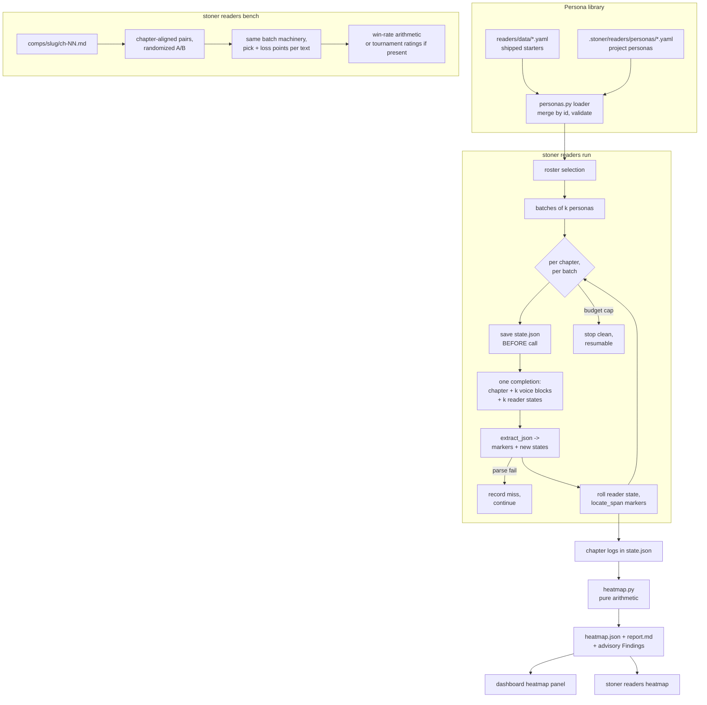

## Summary

Build a synthetic focus group: dozens of distinct personas reading the manuscript
chapter-by-chapter with persistent per-reader state, logging span-anchored attention
events (bored, confused, reread, hooked) that aggregate arithmetically into a
whole-book attention heatmap, plus blind pairwise benchmarking against user-supplied
public-domain comps. New subsystem in `src/stoner/readers/`, surfaced as
`stoner readers ...` and a dashboard heatmap panel.

---

## Problem Frame

The `panel` review pass (`src/stoner/review/passes.py`) already proved the concept
in miniature: four personas in one completion, 3-of-4 consensus promoted to major.
It is cheap and useful, but it cannot answer the questions that decide whether a book
works: where do readers check out, which chapters lose which kinds of readers, does
attention recover after the midpoint, and how does the book hold up next to Williams.
Those need many distinct readers, chapter-by-chapter continuity (a reader who forgot
the chapter-3 setup is a signal, not a bug), and aggregation across the whole
manuscript. One hundred simulated readers disagreeing in patterns is signal no single
review pass gives.

This is explicitly an extend-not-replace decision: `panel` stays untouched as the
fast single-call pass inside `stoner review`; readers is a separate subsystem that
scales the same idea with persistence and aggregation. It is also the most call-heavy
feature of the ten (personas × chapters), so cost control is the primary design
constraint, not an afterthought.

---

## Requirements

Personas

- R1. The package ships a starter library of at least 20 distinct personas as YAML
  data files under `src/stoner/readers/data/`, each declaring id, name, age, tastes,
  genre priors, patience, and a rendered voice block. Distinctness across age, taste,
  and patience axes is a review criterion for the data itself.
- R2. Projects can add or override personas via `.stoner/readers/personas/*.yaml`;
  the loader merges by id with project definitions winning.
- R3. Persona definitions are validated (unique ids, required fields) with actionable
  errors naming the offending file and field.

Simulation

- R4. `stoner readers run` simulates a roster reading chapters in manuscript order;
  each persona carries persistent reader state forward between chapters: what they
  remember (in their own voice), what they expect, what they have grown bored of.
- R5. Personas are batched k per completion: one call covers one chapter for k
  personas, each addressed by a distinct voice block, returning strict JSON keyed by
  persona id with markers and updated state.
- R6. Markers are span-anchored events only — `bored`, `confused`, `reread`,
  `hooked` — anchored by verbatim quotes resolved with `locate_span`. No persona
  emits a numeric score (invariant 1: comparative/event framing, never absolute).
- R7. Per-call context is the chapter body plus a capped canon/style slice plus each
  batched persona's compact state — never the whole manuscript (invariant 4).
- R8. A failed or unparseable batch call degrades to a recorded miss for those
  personas on that chapter; the run continues (mirrors the review runner's
  never-abort posture).
- R9. Runs work on text-only providers: plain completions, no tools, tolerant JSON
  extraction (invariant 7).

Cost and resumability

- R10. Run state persists in `.stoner/readers/runs/<run-id>/state.json`, saved
  before every model call; corrupt state is backed up to `.bak` and rebuilt
  (invariant 10, BookState pattern).
- R11. Budget caps: configurable max model calls per run and roster size; a run stops
  cleanly at the cap and `stoner readers run --resume` continues it.
- R12. Every model call appends a ledger entry with usage; run start and completion
  are ledgered (invariant 5).

Aggregation

- R13. The attention heatmap is computed arithmetically from marker events: chapters
  segmented by paragraph, per-segment marker counts across personas, agreement
  fractions, and disagreement patterns split by persona attributes. No LLM call in
  aggregation (invariant 1: numeric values only when arithmetic).
- R14. Heatmap saved as JSON plus a markdown report alongside the run; high-agreement
  trouble segments become advisory `Finding`s (source `readers:heatmap`) that never
  gate anything (invariant 2). Findings at or above `readers.agreement_threshold`
  are also mirrored into `.stoner/reviews/` as a saved report (JSON + markdown pair,
  `readers-<run_id>-<ts>.json`/`.md`, top-level `kind: "readers"`) containing only
  those findings as standard `Finding` objects, so the existing finding-triage UI
  and PATCH-status endpoint cover them with no new write surface. Raw per-persona
  logs and full run state stay run-local under `.stoner/readers/runs/<id>/`.

Benchmarking

- R15. `stoner readers comps add` ingests a user-supplied public-domain text from a
  local file, splits it into chapters under `comps/<slug>/`, and records
  title/author/year/source metadata. No sample comp text ships in the package;
  acquiring PD texts is docs-only guidance, with attribution conventions, in
  `docs/CREDITS.md` (invariant 12).
- R16. `stoner readers bench <comp>` runs chapter-aligned blind pairwise reads
  (randomized A/B per pair) reusing the persona batch machinery, and reports where
  the manuscript holds or loses attention relative to the comp via win-rate
  arithmetic per chapter and overall.
- R17. If the Draft Tournaments plan ships rating utilities, bench consumes them via
  guarded import; absent, it degrades to standalone pairwise win-rate aggregation.
  No hard dependency.

Surfaces

- R18. CLI group `stoner readers ...` lives in `src/stoner/cli/readers_cmds.py`
  exposing `register(app)`; `cli/main.py` changes are two additive lines.
- R19. UI: read-only endpoints for runs and heatmaps; `ui/static/index.html` gains a
  heatmap panel over the manuscript timeline. One static file, no build step, no CDN
  (invariant 6).
- R20. Config: one new top-level field `readers: ReadersConfig` and one new
  `ModelRoles` field `reader` defaulting to a cheap (haiku-class) model.
- R21. The `panel` pass and `PASSES` registry are untouched; readers registers no
  review pass.

---

## Key Technical Decisions

- Extend panel, do not replace it: `panel` remains the cheap in-review pass; readers
  is a standalone subsystem for depth and scale. Decided explicitly per the
  extend-vs-replace institutional rule; zero edits to `review/passes.py` (R21).
- Batching is the cost lever: k personas per completion (default 4) with named voice
  blocks and JSON keyed by persona id turns call count from personas × chapters into
  ceil(personas/k) × chapters — a 24-persona, 20-chapter run at k=4 is 120 calls, not
  480. Invariant 4 holds per call because the chapter is sent once per batch.
- Dedicated cheap `reader` model role: reader reactions are high-volume, low-stakes
  judgments; default the role to the archivist-class model and let users raise it.
  Adding a `ModelRoles` field is the sanctioned extension path (config.py digest).
- Reader state mirrors `memory.json`: per-persona rolling memory (char-capped, oldest
  detail dropped), open expectations, and fatigue notes — persistent interiority
  without context bloat. Schema and capping logic follow `canon/memory.py`.
- Markers are events, aggregation is arithmetic: personas emit only typed,
  quote-anchored events; every number in the heatmap (attention values, agreement
  fractions, win rates) is computed in Python. This is invariant 1 applied end to
  end; it also makes the heatmap reproducible from saved chapter logs.
- Run state is the BookState pattern: one pydantic model in
  `.stoner/readers/runs/<run-id>/state.json`, saved before every call, `.bak` on
  corruption, budget counters inside the state (invariant 10).
- Comps are project-local and user-supplied: `comps/<slug>/ch-NN.md` plus
  `comp.json` metadata, created on demand by the CLI (no `DIRS` change, no scaffold
  change). Nothing ships in the wheel; no fetch-from-URL in v1, so no new network
  surface (invariant 9). PD-only and attribution guidance goes in `docs/CREDITS.md`
  (invariant 12).
- Tournament ratings are a soft seam: bench tries a guarded import of the tournament
  namespace's rating utilities and falls back to win-rate arithmetic. The feature is
  complete without plan 003.
- No new `types.py` models: markers, reader state, and heatmap structures are
  feature-local pydantic models in `src/stoner/readers/`; aggregated trouble spots
  reuse the existing shared `Finding` (source `readers:heatmap`), and high-agreement
  findings are mirrored into `.stoner/reviews/` as a `kind: "readers"` report so
  triage reuses the existing UI and PATCH-status endpoint rather than growing a new
  write surface.
- Paragraph segmentation for the heatmap: paragraphs are stable, human-meaningful
  units; spans are located against the original chapter body (same offset discipline
  as slop's mask-then-rebase), so segments survive re-renders of the report.

---

## High-Level Technical Design



The batched chapter prompt asks each of the k personas — addressed by voice block —
to read the chapter as themselves, given their rolled-forward state, and return per
persona: a marker list (`type`, verbatim `quote`, short `note`), an updated memory
line, updated expectations, and a fatigue note. Directional response shape:

```
{"readers": {"<persona_id>": {
    "markers": [{"type": "bored|confused|reread|hooked", "quote": "...", "note": "..."}],
    "memory": "...", "expectations": ["..."], "fatigue": "..."}},
 "summary": "..."}
```

Aggregation walks every persona's markers per chapter, buckets them into paragraph
segments by located span, and computes per segment: marker counts by type, an
attention value (hooked fraction minus bored+confused fraction — pure arithmetic),
and agreement (fraction of roster marking the segment at all). Disagreement patterns
come from splitting the roster by persona attributes (age band, patience, genre
prior) and reporting segments where subsets diverge. Segments above an agreement
threshold for negative markers become advisory `Finding`s, and that high-agreement
set is mirrored into `.stoner/reviews/` as a `kind: "readers"` report for triage.

Bench aligns manuscript chapter n with comp chapter n up to the shorter book,
presents each pair blind (A/B order randomized per pair, mapping stored in run
state), and asks each batched persona for a pick plus where each text lost them.
Reported numbers are win rates; if tournament rating utilities are importable they
replace the aggregation, not the reads.

---

## Integration Surface

- CLI: new group `stoner readers` with subcommands `personas`, `run`, `heatmap`,
  `bench`, `comps add`, `comps list` — all in `src/stoner/cli/readers_cmds.py`
  exposing `register(app)`; two additive lines in `src/stoner/cli/main.py` (import +
  register), nested `comps` sub-app mirrors `canon_app`.
- config.py: one new field `readers: ReadersConfig` (fields: `roster: list[str]`
  default empty = default roster, `roster_size: int = 12`,
  `personas_per_call: int = 4`, `max_calls_per_run: int = 150`,
  `agreement_threshold: float = 0.5`); one new `ModelRoles` field
  `reader: str = "anthropic/claude-haiku-4-5-20251001"`.
- types.py: no changes; reuses existing `Finding`, `Span`, `Usage`.
- project.py / dirs: no `DIRS` or scaffold changes. New state paths created on
  demand: `.stoner/readers/personas/` (hand-authored project personas),
  `.stoner/readers/runs/<run-id>/{state.json, heatmap.json, report.md}`. New
  project dir `comps/<slug>/` (`ch-NN.md` + `comp.json`), created by
  `readers comps add`.
- canon: no new artifact types, no `CanonStore` changes (read-only use of
  `context_pack`).
- ledger actions: `readers.run.start`, `readers.run.call`, `readers.run.done`,
  `readers.heatmap`, `readers.comps.add`, `readers.bench.start`,
  `readers.bench.done`.
- review: no `PASSES` entries, no `PassContext` changes. The heatmap step mirrors
  high-agreement findings into `.stoner/reviews/` as a saved report
  (`readers-<run_id>-<ts>.json` + `.md`, top-level `kind: "readers"` per the
  integration plan's report-kind convention); the existing finding-triage
  PATCH-status endpoint covers those findings as-is — reused, not extended. The
  `readers.heatmap` ledger action covers the write.
- engine/tools.py: no agent tools added.
- engine/prompts/: `readers_chapter.md`, `readers_bench.md` (HTML doc-comment
  headers, rendered by `pipelines/common.render_prompt`).
- ModelRoles: new `reader` role (see config.py above).
- UI: additive endpoints `GET /api/readers/runs`, `GET /api/readers/runs/{run_id}`
  in `src/stoner/ui/server.py`; one new "Readers" heatmap panel in
  `src/stoner/ui/static/index.html`.
- pyproject: no new dependencies or extras.
- Other feature plans: consumes Draft Tournaments (003) rating utilities if
  present, degrades to win-rate aggregation if absent. Pacing (004) also renders a
  manuscript-timeline visualization in the dashboard; visual conventions should be
  reconciled by the integration plan, no code dependency either way.

---

## Implementation Units

### U1. Persona library and loader

**Goal**: Shipped starter personas plus a validating loader that merges project
personas.

**Requirements**: R1, R2, R3

**Dependencies**: none

**Files**:
- `src/stoner/readers/__init__.py`
- `src/stoner/readers/personas.py`
- `src/stoner/readers/data/personas.yaml`
- `tests/test_readers_personas.py`

**Approach**: Feature-local pydantic `Persona` (id, name, age, tastes, genre priors,
patience, quirks, voice notes) with a `voice_block()` render used verbatim in
prompts. Loader mirrors `slop/lexicon.py`: module `DATA_DIR`, cached load, explicit
cache-bypass hook for tests. Project overlay reads `.stoner/readers/personas/*.yaml`
and merges by id (project wins). Roster selection helper: explicit ids from config,
else a deterministic default roster of `roster_size` maximizing attribute spread.
Author 24 starters spanning age bands, genre priors (literary, thriller, romance,
SF/F, nonfiction-leaning), and patience levels; distinctness is part of the data
review, not just the schema.

**Patterns to follow**: `src/stoner/slop/lexicon.py` (packaged YAML data dir +
cached loader), `src/stoner/slop/data/*.yaml` (commented flat YAML style).

**Test scenarios**:
- Shipped library loads; >=20 personas; all ids unique; every persona renders a
  non-empty voice block.
- Project persona file with a new id merges in; same-id file overrides the shipped
  persona's fields.
- Duplicate ids within project files raise an actionable error naming the file.
- Malformed persona YAML (missing required field) raises with file and field named.
- Default roster selection is deterministic and respects `roster_size`.

**Verification**: Loader unit tests green; `ruff` and `mypy` clean on the new module.

### U2. Config, run state, and marker models

**Goal**: The persistence backbone: `ReadersConfig`, the `reader` model role, and
crash-safe run state with budget counters.

**Requirements**: R10, R11 (state half), R20

**Dependencies**: none (parallel with U1)

**Files**:
- `src/stoner/config.py`
- `src/stoner/readers/state.py`
- `tests/test_readers_state.py`

**Approach**: Add `ReadersConfig` and `ModelRoles.reader` exactly as enumerated in
Integration Surface. `state.py` defines feature-local pydantic models: `Marker`
(type, quote, note, chapter, persona id, optional resolved span), `ReaderState`
(memory string with char cap and oldest-dropped trimming per `canon/memory.py`,
expectations list, fatigue note, missed chapters), `ChapterLog` (per persona per
chapter marker lists plus one-line reaction), and `RunState` (run id, chapter range,
roster ids, reader states, chapter logs, budget counters, cumulative `Usage`, and
for bench runs the comp slug and blind A/B mapping). `load_state`/`save_state`
mirror `pipelines/book.py`: corrupt file moved to `.bak`, fresh state returned;
save writes atomically under `.stoner/readers/runs/<run-id>/state.json`. Run ids
are timestamp-based.

**Patterns to follow**: `src/stoner/pipelines/book.py` (`BookState`, `load_state`,
`save_state`, `.bak` recovery, budget-in-state), `src/stoner/canon/memory.py`
(cap-and-drop trimming).

**Test scenarios**:
- Round-trip: save then load reproduces the state.
- Corrupt state.json is renamed to `.bak` and a fresh state is returned.
- Reader memory trimming drops oldest content once past the cap.
- Config defaults resolve (`readers` block absent from stoner.yaml yields defaults;
  `models.reader` present and haiku-class by default).

**Verification**: State tests green; existing `tests/test_config`-adjacent
assertions (if any touch ModelRoles dumps) still pass; full suite unaffected.

### U3. Chapter simulation pipeline

**Goal**: The core run loop: batched persona reads, rolling state, markers, budget,
resume, degradation.

**Requirements**: R4, R5, R6, R7, R8, R9, R11 (cap/resume behavior), R12

**Dependencies**: U1, U2

**Files**:
- `src/stoner/readers/simulate.py`
- `src/stoner/engine/prompts/readers_chapter.md`
- `tests/test_readers_simulate.py`

**Approach**: `run_readers(project, chapters=None, roster=None, model=None,
provider=None, on_event=None) -> ReadersRunResult` following the pipeline contract
(result dataclass with counts, `usage`, `notes`; never prints). Loop: for each
chapter in order, for each batch of `personas_per_call` personas — save state,
render `readers_chapter.md` (chapter body, capped `context_pack` slice, k voice
blocks, k compact reader states), one plain completion via `pipelines/common.
call_model` with role `reader` (no tools, so text-only providers work natively),
parse with `review.passes.extract_json`, resolve marker quotes with `locate_span`
(unresolvable quotes kept as chapter-level markers with null span), roll each
persona's state, append to chapter logs, ledger `readers.run.call` with usage.
Parse failure or missing persona key records a miss for the affected personas and
continues. Stop cleanly when `max_calls_per_run` is hit; `--resume` picks up from
the state's cursor and respects already-logged chapters. Emit `on_event` dicts for
CLI progress. Prompt forbids numeric ratings and demands verbatim quotes; strict
JSON shape as sketched in the design section. Expose a batch-call helper reusable
by U5.

**Patterns to follow**: `src/stoner/pipelines/book.py` (save-before-call, budget,
`on_event`, resume), `src/stoner/review/passes.py` (`extract_json`, `locate_span`,
strict-JSON prompt discipline, `_shape`-style JSON examples), `src/stoner/
pipelines/common.py` (`render_prompt`, `call_model`), panel prompt's persona-block
construction as the multi-voice precedent.

**Test scenarios**:
- Happy path with a `ScriptedProvider`: 2 chapters, 4 personas, k=2 → 4 calls;
  markers land with resolved spans; each reader's memory and expectations roll
  forward between chapters; ledger has `readers.run.start`, four
  `readers.run.call`, `readers.run.done`.
- Budget cap of 2 calls stops after chapter 1 with resumable state; a second run
  with `--resume` semantics completes chapter 2 without re-reading chapter 1.
- One scripted garbage response: affected personas get a miss for that chapter, run
  completes, result notes record the degradation.
- Marker quote not present in chapter body: marker kept with null span.
- State file on disk is valid after a simulated interrupt (state saved before the
  failing call).

**Verification**: Simulation tests green with no network; run twice on the same
scripted inputs produces identical chapter logs (determinism given a scripted
provider).

### U4. Heatmap aggregation and report

**Goal**: Pure-arithmetic attention heatmap, agreement/disagreement analysis, and
advisory findings from saved chapter logs.

**Requirements**: R13, R14

**Dependencies**: U2 (models only; parallel with U3 using fixture logs)

**Files**:
- `src/stoner/readers/heatmap.py`
- `tests/test_readers_heatmap.py`

**Approach**: Pure functions from `RunState` + chapter bodies to a feature-local
`HeatmapReport`: split each chapter into paragraph segments with original-body
offsets; bucket located markers into segments (null-span markers count at chapter
level); per segment compute marker counts by type, attention value (hooked fraction
minus bored+confused fraction), and agreement (fraction of roster marking the
segment); derive disagreement patterns by re-aggregating over persona-attribute
subsets (age band, patience, genre prior) and flagging segments where subset deltas
exceed a threshold. Segments whose negative-marker agreement exceeds
`readers.agreement_threshold` become `Finding`s (source `readers:heatmap`, severity
major, span attached) — advisory only, consumed by nothing that gates. Persist
`heatmap.json` and a human `report.md` (per-chapter strips, top trouble segments,
disagreement notes) into the run directory, and mirror the high-agreement findings
into `.stoner/reviews/` as a saved report pair (`readers-<run_id>-<ts>.json` +
`.md`, top-level `kind: "readers"`, following the existing reviews naming
convention) containing only findings at or above the threshold as standard
`Finding` objects; raw per-persona logs and full run state stay run-local. The
`readers.heatmap` ledger entry covers both writes. Rendering is pure (returns
text; no console side effects).

**Patterns to follow**: `src/stoner/slop/score.py` (offset-preserving segmentation
and span rebase discipline, module-level `_UPPER_SNAKE` thresholds),
`src/stoner/slop/report.py` (pure render contract), `Finding` conventions from
`review/passes.py`.

**Test scenarios**:
- Fixture run state with markers from 6 personas over 2 chapters: segment counts,
  attention values, and agreement fractions match hand-computed values.
- Unanimous `confused` markers on one paragraph produce exactly one major Finding
  with a span inside that paragraph.
- Disagreement fixture (patient personas hooked, impatient bored on the same
  segment) surfaces a disagreement pattern naming the splitting attribute.
- Null-span markers aggregate at chapter level without crashing segment math.
- High-agreement findings land in the mirrored `.stoner/reviews/` report with
  `kind: "readers"` and are PATCHable through the existing finding-status
  endpoint; below-threshold segments do not appear in the mirrored report.
- Empty run (no markers) yields a valid, empty heatmap and no findings.

**Verification**: All numbers in outputs are reproducible from the fixture by hand;
re-running aggregation on the same state is byte-identical (modulo timestamps).

### U5. Comps ingestion and blind pairwise benchmark

**Goal**: Public-domain comp management and chapter-aligned blind pairwise reads
with win-rate reporting.

**Requirements**: R15, R16, R17

**Dependencies**: U1, U2, U3 (reuses the batch-call helper)

**Files**:
- `src/stoner/readers/comps.py`
- `src/stoner/readers/bench.py`
- `src/stoner/engine/prompts/readers_bench.md`
- `docs/CREDITS.md`
- `tests/test_readers_bench.py`

**Approach**: `comps.py`: `add_comp` takes a local text/markdown file plus
title/author/year/source metadata, splits into chapters (chapter-heading regex
first, fixed-size word-count fallback), writes `comps/<slug>/ch-NN.md` and
`comp.json`, refuses overwrite without force (invariant 11), ledgers
`readers.comps.add`. No network fetch in v1. `bench.py`: `run_bench(project, comp,
chapters=None, ...)` aligns manuscript chapter n with comp chapter n up to the
shorter length; per pair, randomize A/B order (mapping stored in run state before
the call), reuse U3's batch machinery with `readers_bench.md` — each persona
returns a pick plus loss points (span-anchored quotes per text), never a score;
aggregate per-chapter and overall win rates arithmetically; report where the
manuscript loses attention relative to the comp. Guarded import of tournament
rating utilities (`stoner.tournament`) upgrades aggregation when present; ImportError
falls back silently to win rates with a result note. Persist bench results in the
run dir; ledger `readers.bench.start`/`readers.bench.done`. Extend `docs/CREDITS.md`
with the PD-only sourcing and attribution convention for comps.

**Patterns to follow**: U3's batch-call helper; `src/stoner/canon/scaffold.py`
idempotence posture for `add_comp`; guarded-import degradation mirrors
`ui/server.py`'s lazy fastapi import style.

**Test scenarios**:
- `add_comp` on a fixture text with "Chapter N" headings yields correctly split
  `ch-NN.md` files and metadata; re-adding without force refuses.
- Heading-free fixture falls back to word-count splitting.
- Scripted bench over 2 aligned chapters with 4 personas: blind mapping recorded
  before calls, picks decoded through the mapping, win rates match hand computation.
- Comp shorter than manuscript: bench covers only aligned chapters and says so in
  notes.
- Tournament import absent: aggregation degrades to win rates with a note (test via
  import monkeypatch).

**Verification**: Bench tests green with no network; blind mapping decode verified
against a deliberately asymmetric script (all personas pick "A") to prove
randomization is honored.

### U6. CLI group

**Goal**: The `stoner readers` command surface wired into the main app.

**Requirements**: R18, plus command-level exposure of R4, R11, R13, R15, R16

**Dependencies**: U3, U4, U5

**Files**:
- `src/stoner/cli/readers_cmds.py`
- `src/stoner/cli/main.py`
- `tests/test_readers_cli.py`

**Approach**: `register(app)` module mirroring `cli/book_cmds.py`: heavy imports
inside command bodies, `_progress_printer()`-style `on_event` for `run` and
`bench`, rich tables for `personas` and `comps list`, `heatmap` rendering the
latest (or named) run's report with a per-chapter strip. Commands: `personas`,
`run` (`--chapters`, `--roster-size`, `--resume`, `--max-calls`, `--model`),
`heatmap` (`[run-id]`), `bench` (`comp`, `--chapters`), and a nested `comps`
sub-app (`add`, `list`) mirroring `canon_app` nesting. Mutating commands rely on
pipeline-level ledgering. Two additive lines in `main.py`.

**Patterns to follow**: `src/stoner/cli/book_cmds.py` (`register`, progress
printer, `_project()`/`_fail` usage), `main.py` nested `canon_app`.

**Test scenarios**:
- `stoner readers personas` lists shipped personas via CliRunner (no network).
- `stoner readers comps add` on a fixture file creates the comp dir; `comps list`
  shows it.
- `stoner readers heatmap` on a fixture run dir renders without error; on a project
  with no runs, fails with an actionable message.
- `run`/`bench` invocation paths tested with an injected scripted provider
  (mirroring how `test_cli.py` avoids network) or by asserting the no-provider
  error path is actionable.

**Verification**: `tests/test_cli.py` still green (main.py additions are additive);
new CLI tests green.

### U7. UI endpoints and heatmap panel

**Goal**: The attention heatmap over the manuscript timeline in the dashboard.

**Requirements**: R19

**Dependencies**: U4

**Files**:
- `src/stoner/ui/server.py`
- `src/stoner/ui/static/index.html`
- `tests/test_readers_ui.py`

**Approach**: Two additive read-only endpoints reading from disk per request:
`GET /api/readers/runs` (list run ids with kind, chapter range, timestamps) and
`GET /api/readers/runs/{run_id}` (state summary + heatmap.json when present).
Run-id path component validated with a module-level plain-python jail helper
(testable without fastapi, matching existing helpers). Frontend: a "Readers" panel
in `index.html` — chapters across the x-axis, paragraph segments as colored cells
by attention value, hover tooltips with marker counts and agreement, a run picker,
and a trouble-segment list linking chapter numbers. Inline CSS/JS only, Hearth
design system variables, no CDN, no build step. Bench runs render as a per-chapter
hold/lose bar instead of the segment grid.

**Patterns to follow**: `src/stoner/ui/server.py` (create_app closure endpoints,
disk-read-per-request, path-jail helpers), `tests/test_ui.py` (TestClient
contracts, escape tests, missing-extra monkeypatch).

**Test scenarios**:
- Runs list endpoint returns fixture runs; empty project returns an empty list, not
  an error.
- Run detail returns heatmap payload; unknown run id → 404.
- Path-jail: `..`-style run ids rejected by the plain helper (unit test, no
  fastapi).
- index.html still served; existing UI tests unaffected.

**Verification**: `tests/test_ui.py` and the new file green; manual load of the
dashboard against a fixture project shows the heatmap panel rendering.

---

## Scope Boundaries

Non-goals:

- No review-pass integration: readers does not add to `PASSES` and `stoner review`
  behavior is unchanged; `panel` remains the in-review persona pass.
- No gating: no reader output ever blocks a pipeline (invariant 2).
- No web fetching of comps in v1 (keeps invariant 9's network promise untouched).
- No interactive persona chat, per-persona agents, or tool-using readers — one
  batched completion per chapter per batch, nothing more.
- No cross-run longitudinal analytics (comparing run N to run N-1) in v1; runs are
  independent artifacts.
- Parking-lot items remain out of scope: series-spanning canon, voice fine-tunes,
  nonfiction mode, two-writers-one-canon.

### Deferred to Follow-Up Work

- `stoner readers comps fetch <gutenberg-url>` with explicit opt-in network framing
  and ledger entries.
- Draft-over-draft attention deltas ("did the chapter 9 rewrite recover the
  readers?") — natural once Draft Archaeology (009) lands.
- Feeding high-agreement heatmap findings into the Writers' Room notebooks (005) —
  an integration-plan decision, not this plan's.
- Persona authoring helper (`stoner readers personas new`) that scaffolds a project
  persona file.
- A curated, docs-only list of recommended public-domain comps; no sample text
  ships in the wheel.

---

## Assumptions

- "Dozens" is satisfied by a 24-persona shipped library with a 12-persona default
  roster; users scale up via config at their own cost.
- k=4 personas per call balances JSON reliability against call count; it is config,
  not constant, so calibration is cheap.
- A haiku-class default for the `reader` role is good enough for marker-level
  reactions; the role exists precisely so users can disagree.
- Paragraph-level segmentation is sufficient heatmap resolution; sub-sentence
  attention is out of scope.
- Chapter-index alignment (manuscript ch n vs comp ch n) is an acceptable v1
  benchmark framing despite length mismatches; notes disclose truncation.
- Users take responsibility for the PD status of comp texts they ingest; the CLI
  records provenance but cannot verify licensing.
- `.stoner/readers/personas/` is an acceptable home for hand-authored project
  personas (keeps the feature inside its assigned namespace rather than adding a
  scaffolded project dir).
- Timestamp run ids are unique enough for a single-writer local tool.

---

## Risks & Dependencies

- Batched-JSON reliability: k personas in one strict-JSON response is the failure
  surface. Mitigations: tolerant `extract_json`, per-batch degradation to misses
  (R8), configurable k, and the `_shape`-style explicit JSON example in the prompt.
- Persona homogenization: a weak model may collapse all voices into one reader.
  Mitigations: strongly differentiated voice blocks, per-persona state divergence,
  and the disagreement analysis itself — a run with zero disagreement is reported
  as suspicious in the heatmap notes.
- Cost blowout remains possible at high roster × chapter counts even with batching;
  `max_calls_per_run` is a hard stop and resumability makes multi-session runs the
  sanctioned pattern.
- Soft dependency on Draft Tournaments (003) rating utilities: consumed if present,
  win-rate fallback if absent. No hard dependency on any other plan.
- UI seam contention: this plan and Pacing (004) both add manuscript-timeline
  panels to `index.html`; both are additive, but the integration plan (011) should
  sequence the merges and unify visual conventions.
