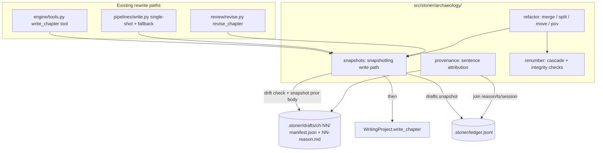
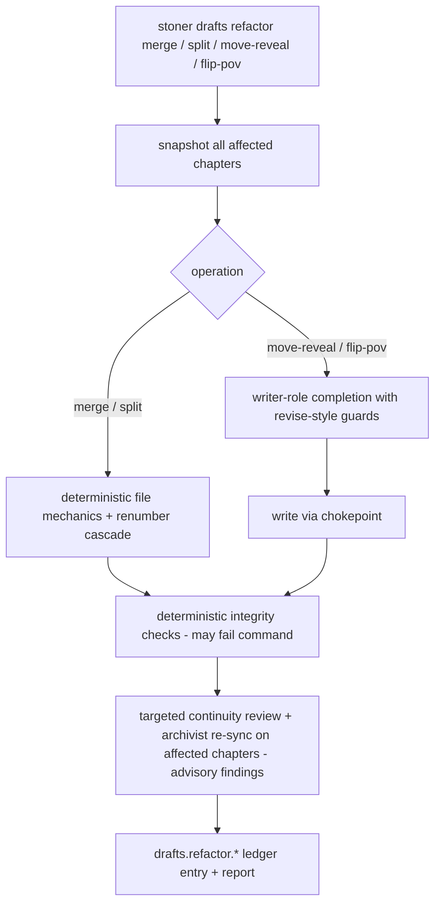

## Summary

Preserve every draft the harness overwrites, make sentence-level provenance queryable
("which round wrote this line and why"), let the writer restore any paragraph from any
draft, and turn structural rewrites — merge, split, move a reveal, flip POV — into
one-command pipelines with automatic downstream continuity re-verification.

---

## Problem Frame

Real books are rewritten, and the harness already rewrites aggressively: the slop gate
auto-revises, `stoner revise` applies findings, book mode revises the worst-hit chapters
every review round. Each of those calls `WritingProject.write_chapter` and the prior body
is gone. The ledger records *that* a rewrite happened (`review.revise`,
`pipeline.write.slop_revise`) and session transcripts record the conversation, but the
prose states themselves are not kept, so nothing can answer "what did chapter 4 look like
before the slop loop" or "which round introduced this sentence."

The institutional learning is that provenance should be an INDEX over what already exists
— ledger.jsonl actions, `.stoner/sessions/` transcripts, git when present — plus
lightweight body snapshots, not a new recording mechanism. The repo has exactly four
places where chapter text is rewritten today, all funnelling into
`WritingProject.write_chapter`:

- `src/stoner/pipelines/write.py` — single-shot draft (text-only providers) and the
  fallback save when the agent never called the tool
- `src/stoner/engine/tools.py` — the `write_chapter` agent tool (the main tool-loop path;
  also redrafts)
- `src/stoner/review/revise.py` — `revise_chapter`, shared by the slop auto-revise loop,
  `stoner revise`, and book mode

One snapshotting write path in the archaeology module, adopted by those four sites, gives
every current and future rewrite provenance for free — including Draft Tournaments'
graft, if that ships. Structural refactors (merge/split/move/flip-POV) are the second
half: they are exactly the operations writers avoid because the blast radius (beat
sheets, memory.json, threads/timeline chapter refs, book-state) is too scary to touch by
hand, and archaeology makes them safe because every prior state is recoverable.

---

## Requirements

Preservation:

- R1. Whenever the harness rewrites an existing chapter body, the prior full chapter text
  (frontmatter + body) is snapshotted to `.stoner/drafts/ch-NN/<seq>-<reason>.md` before
  the write, with a manifest entry recording reason, timestamp, body hash, session ref,
  and caller-supplied detail.
- R2. Human hand-edits made between harness runs are detected by body-hash comparison at
  the next harness touch of that chapter and snapshotted with reason `human-edit` before
  anything overwrites them. Hand-edited prose is never lost.
- R3. All four existing rewrite paths (agent tool, single-shot draft, fallback save,
  `revise_chapter`) route through the snapshot chokepoint; existing tests keep passing.
- R4. Snapshots are plain markdown files plus one JSON manifest per chapter. Identical
  consecutive bodies are deduplicated by hash (manifest entry recorded, no duplicate
  file). `stoner drafts prune` bounds storage while never removing the original draft or
  `human-edit` snapshots.

Provenance:

- R5. `stoner drafts blame <ch>` attributes each sentence of the current chapter to the
  rewrite event that introduced it (reason, timestamp, session, detail), computed
  deterministically with difflib-grade diffing over the snapshot sequence. No model
  calls; identical inputs give identical output.
- R6. `stoner drafts list/show/diff` expose the snapshot sequence: list per chapter, show
  any snapshot, unified diff between any two snapshots or a snapshot and the current
  body.
- R7. When the project root is a git repo and `git` is on PATH, each snapshot records the
  current HEAD commit; the feature is fully functional without git.

Restore:

- R8. `stoner drafts restore <ch> <seq>` restores a whole chapter from any snapshot;
  `--paragraph N` restores a single paragraph, aligned to the current body
  deterministically. Restore writes through the chokepoint (so the pre-restore state is
  itself snapshotted) and requires `--force` when an undetected hand-edit is present.

Structural refactors:

- R9. `stoner drafts refactor merge <a> <b>` and `... split <ch> --at <n>` are
  deterministic file operations: snapshot everything affected first, then
  concatenate/cut and renumber. No prose is model-touched.
- R10. `stoner drafts refactor move-reveal` and `... flip-pov` are model-assisted
  pipelines with `revise_chapter`-style guards: sentinel extraction, length sanity
  (refuse < 1/4 original words), snapshot-before-write, text-only-provider compatible
  (single plain completion, no tool loop).
- R11. Renumbering handles the full blast radius: manuscript files, `outline/beats/`,
  `.stoner/memory.json` chapter keys, `.stoner/book-state.json`, `.stoner/drafts/`
  directories renumbered deterministically; `canon/threads.md` and `canon/timeline.md`
  chapter references renumbered when unambiguous, flagged as findings when not.
- R12. Every refactor is followed by verification: deterministic renumbering integrity
  checks (these may fail the command), then targeted continuity review plus archivist
  re-sync on affected chapters producing advisory findings only (opt-out via
  `--no-verify` / config).

Operational:

- R13. Every mutating archaeology action appends a `drafts.*` ledger entry.
- R14. All commands except `move-reveal`, `flip-pov`, and post-refactor model
  verification work offline with no API key.

---

## Key Technical Decisions

- One chokepoint in the archaeology module, not a hook inside `WritingProject`:
  `archaeology/snapshots.py` exposes a snapshotting chapter-write function that pipelines
  call in place of `project.write_chapter`. Keeps `project.py` free of an archaeology
  import (no cycle), keeps the shared-file diff to four one-line call-site swaps, and
  gives other feature plans a named seam (call it with your own `reason` string) so
  provenance is free for tournaments, room revisions, and anything else that rewrites
  prose.
- Snapshot semantics: `reason` names the rewrite event that displaced the content
  (`draft`, `slop-revise`, `review-revise`, `book-revise`, `restore`,
  `refactor-<op>`, `human-edit`, `manual`). Reasons are free-form dotted-free strings by
  convention, mirroring the ledger's no-registry action names, so other plans can add
  reasons without touching this module.
- Provenance is an index, not a recorder: attribution joins snapshot manifest entries
  (reason, ts, session, detail) to what the ledger and session transcripts already
  record; the only new data written is the body states themselves. No new event stream.
- Deterministic attribution only (invariant 2): sentence tokenization by regex, exact
  match walk-back across snapshots for "introduced in", difflib `SequenceMatcher` for
  changed-vs-new classification and paragraph alignment. No model calls anywhere in
  blame/diff/restore; output is reproducible.
- Manifest hashes cover the body only, not frontmatter, so a status bump or recomputed
  word count neither triggers a false `human-edit` detection nor defeats dedup. Snapshot
  files still store the full chapter text so restore can recover title/pov.
- Deterministic checks gate, model checks advise (invariant 2): renumbering integrity
  failures exit nonzero and name the broken reference; continuity review and archivist
  re-sync after a refactor produce Findings for human triage and never block.
- Renumbering is a rename cascade with snapshot-first discipline (invariant 11): every
  affected body is snapshotted under its original number before any file moves; merge
  vacates the highest chapter number only after both source bodies are preserved in
  `.stoner/drafts/`. No prose is ever unrecoverable.
- Git is enrichment, never a dependency (invariant 6): a best-effort `git rev-parse HEAD`
  subprocess when `.git` exists; any failure silently omits the field. No git library
  dependency, no new extra.
- Model-assisted refactors resolve against the `writer` role (they write prose, not
  critique) and mirror `revise.py`'s inline prompt builders rather than adding
  `engine/prompts/` templates — the prompts are single-purpose and co-located with their
  guards.
- Prune keeps the story, drops the bytes: pruned manifest entries are marked
  `pruned: true` and keep their hashes so the attribution chain stays intact (blame
  degrades to "a state existed here" instead of breaking); content files are removed only
  when no live entry references them.

---

## High-Level Technical Design

### Snapshot chokepoint and data flow

Chokepoint behavior on a write of chapter N with reason R:

1. Read current on-disk body (if the chapter exists). If the manifest's last recorded
   result-hash differs from the current body hash, snapshot the current body first with
   reason `human-edit`.
2. Snapshot the (possibly just-hand-edited) prior body as `<seq>-<R>.md` unless its hash
   equals the previous snapshot's (dedup: manifest entry referencing the existing file).
3. Call `project.write_chapter`, then record the new body's hash on the manifest entry as
   the result-hash (this is what drift detection compares against next time).
4. Append `drafts.snapshot` to the ledger with chapter, seq, reason.

Manifest entry fields (directional): `seq`, `ts`, `reason`, `sha256` (snapshotted body),
`result_sha256` (body written by the event), `file`, `session`, `detail` (caller dict,
e.g. slop score / findings applied / review report path), `git_head` (optional),
`pruned`. Producer attribution is derived: the content of snapshot k was produced by the
event named in entry k-1 (entry 1's content is the initial state).

### Refactor pipeline shape

Renumbering blast radius, handled explicitly:

| Artifact | Handling |
|---|---|
| `manuscript/ch-NN.md` | rename cascade (down for merge, up for split), snapshot-first |
| `outline/beats/ch-NN.md` | renamed in lockstep; orphans flagged |
| `.stoner/memory.json` chapter keys | keys renumbered; `book_so_far` rebuilt via existing `Memory.rebuild_book_so_far` |
| `.stoner/book-state.json` | `chapters_planned` / `chapters_done` keys renumbered; corrupt state follows the existing `.bak` pattern |
| `canon/threads.md` `opened_in`/`resolved_in` | renumbered when the cell parses as a chapter ref (via `parse_table`/`render_table`); otherwise flagged |
| `canon/timeline.md` chapter column | same renumber-or-flag rule |
| `.stoner/drafts/ch-NN/` | directories renumbered; the refactor's own ledger entry records the full old→new mapping |
| `.stoner/reviews/*` | untouched — timestamped history, filenames stay accurate to when they ran |

Move-reveal contract: the writer supplies the reveal as a quote (located with the same
tolerant matching as `review.passes.locate_span`); the model rewrites the source chapter
(reveal removed, seams healed) and the target chapter (reveal woven in) in two guarded
completions; both writes go through the chokepoint with reason `refactor-move`.
Flip-POV: one guarded completion per chapter, updates the `pov` frontmatter field.

---

## Integration Surface

- CLI: new group `stoner drafts` via `src/stoner/cli/drafts_cmds.py` exposing
  `register(app)` (one line added at the bottom of `src/stoner/cli/main.py`).
  Commands: `drafts list`, `drafts show`, `drafts diff`, `drafts blame`,
  `drafts restore`, `drafts snapshot` (manual), `drafts prune`, `drafts verify`, and a
  nested `drafts refactor` sub-app with `merge`, `split`, `move-reveal`, `flip-pov`
  (nesting mirrors `canon_app` in main.py).
- config.py: one new field `archaeology: ArchaeologyConfig` with
  `enabled: bool = True`, `dedup: bool = True`, `keep_per_chapter: int | None = None`
  (prune default), `verify_after_refactor: bool = True`. `ArchaeologyConfig` defined in
  config.py beside `GateConfig`.
- types.py: no changes — snapshot/attribution models are feature-local pydantic models in
  `src/stoner/archaeology/`; refactor verification reuses the existing `Finding`.
- project.py: `.stoner/drafts` appended to `DIRS`. New state files:
  `.stoner/drafts/ch-NN/manifest.json` and `.stoner/drafts/ch-NN/<seq>-<reason>.md`.
- canon: no new artifact types, templates, or CanonStore methods; renumbering uses the
  existing `parse_table`/`render_table` helpers and `threads()` accessors.
- ledger: new actions `drafts.snapshot`, `drafts.restore`, `drafts.prune`,
  `drafts.verify`, `drafts.refactor.merge`, `drafts.refactor.split`,
  `drafts.refactor.move`, `drafts.refactor.pov`.
- review: no new PASSES entries, no PassContext changes; post-refactor verification calls
  the existing `run_review(project, ch, passes=["continuity"])` and `run_archive`.
- engine/tools.py: the existing `write_chapter` tool body swaps
  `project.write_chapter(...)` for the chokepoint call (reason `draft`); tool spec and
  return string unchanged.
- pipelines/write.py: the single-shot and fallback saves swap to the chokepoint (reason
  `draft`); the slop loop passes `reason="slop-revise"` through to `revise_chapter`.
- review/revise.py: `revise_chapter` gains an optional `reason: str = "review-revise"`
  kwarg and writes via the chokepoint; `pipelines/book.py` passes `reason="book-revise"`.
  All three are additive keyword-only changes.
- engine/prompts/: none — move-reveal/flip-pov prompts are inline builders mirroring
  `revise.py`.
- ModelRoles: no new role; move-reveal and flip-pov resolve against `writer`,
  verification review/archivist keep their configured roles.
- UI: none (deferred; see Scope Boundaries).
- pyproject: no new dependencies or extras (difflib, hashlib, subprocess are stdlib).
- Other feature plans: no hard dependencies. Provides the snapshot-chokepoint seam other
  plans consume by calling it with their own reason string (e.g. Tournaments' graft as
  `tournament-graft`); any plan that rewrites prose through the existing four paths gets
  provenance with zero effort.

---

## Implementation Units

### U1. Snapshot store and chokepoint

**Goal**: `.stoner/drafts/` snapshot store with manifest, hashing, dedup, human-edit
drift detection, git cross-link, and the single snapshotting write function everything
else calls.

**Requirements**: R1, R2, R4 (dedup half), R7, R13

**Dependencies**: none — this unit lands first; other features build against it.

**Files**:
- `src/stoner/archaeology/__init__.py`
- `src/stoner/archaeology/snapshots.py`
- `src/stoner/config.py` (add `ArchaeologyConfig` + field)
- `src/stoner/project.py` (add `.stoner/drafts` to `DIRS`)
- `tests/test_archaeology.py`

**Approach**: A `DraftStore` bound to a `WritingProject` owning manifest read/write
(tolerant of a corrupt manifest via the `book-state.json.bak` pattern), body hashing
(sha256 over the body only), snapshot file naming `<seq>-<reason>.md` (zero-padded seq,
reason slugified), and dedup (equal-hash consecutive snapshots record an entry pointing
at the existing file). The module-level chokepoint function takes
`(project, number, fm, body, reason, session="", detail=None)`, performs the four-step
sequence described in the design (drift check → snapshot prior → `write_chapter` →
record result hash), appends `drafts.snapshot`, and returns the written path. Drift
detection is write-triggered only: read-only commands (`stoner drafts blame`, `show`,
`diff`) never mutate state, and the resulting lazier loss window is accepted — for
git-managed projects, git covers the gap between harness touches. Respect
`archaeology.enabled=False` by passing straight through to `write_chapter`. Git
cross-link is a best-effort `git rev-parse HEAD` guarded by `.git` existence; any
subprocess failure omits the field.

**Patterns to follow**: `pipelines/book.py` `load_state`/`save_state` for
corrupt-JSON-to-`.bak` tolerance; `Ledger.append` free-form detail kwargs; `project.py`
module helpers (`split_frontmatter`/`join_frontmatter`) for parsing snapshot files.

**Test scenarios**:
- First write of a new chapter through the chokepoint: no snapshot created, manifest
  records the result hash; second write with a changed body creates `01-<reason>.md`
  containing the first body.
- Human-edit detection: harness writes body A via chokepoint; test edits the chapter file
  directly to body B; next chokepoint write snapshots B with reason `human-edit` before
  the prior body snapshot, and no content is lost.
- Dedup: chokepoint write where only frontmatter changed (same body) records a manifest
  entry without a new content file.
- Corrupt manifest.json is moved to `.bak` and snapshotting continues from a fresh
  manifest.
- Git enrichment: in a `git init`-ed tmp project, entries carry `git_head`; in a plain
  directory, the field is absent and nothing fails.
- `archaeology.enabled: false` in stoner.yaml: chokepoint writes without creating
  `.stoner/drafts/` entries.
- Ledger: every snapshot appends `drafts.snapshot` with chapter and reason.

**Verification**: unit tests pass; a scripted sequence of writes yields a manifest whose
entries replay exactly to the current body; full suite stays green.

### U2. Route existing rewrite paths through the chokepoint

**Goal**: every harness rewrite of chapter prose is snapshotted, with the correct reason
per path.

**Requirements**: R3

**Dependencies**: U1

**Files**:
- `src/stoner/engine/tools.py` (`write_chapter` tool body)
- `src/stoner/pipelines/write.py` (single-shot save, fallback save, slop-loop reason)
- `src/stoner/review/revise.py` (`revise_chapter` writes via chokepoint; new `reason`
  kwarg defaulting to `review-revise`)
- `src/stoner/pipelines/book.py` (pass `reason="book-revise"` to `revise_chapter`)
- `tests/test_archaeology.py` (integration additions)

**Approach**: One-line call-site swaps plus the additive `reason` kwarg threading
described in Integration Surface. The tool path cannot see the agent session name (tool
funcs receive only the project), so its snapshots carry an empty session; the ledger's
surrounding `agent.turn` entries provide the session join by timestamp. Behavior of
every path is otherwise unchanged — same return strings, same errors, same frontmatter
merging.

**Patterns to follow**: keep `engine/tools.py` tool contract (never raise, `ERROR:`
strings); keep `revise_chapter`'s guard order (length check before any write).

**Test scenarios**:
- `run_write` with a `ScriptedProvider` whose draft fails the slop gate: after the run,
  `.stoner/drafts/ch-NN/` holds the pre-revise body with reason `slop-revise`
  (mirror `tests/test_pipeline.py`'s sloppy fixture).
- `revise_chapter` with a scripted revision: prior body snapshotted with reason
  `review-revise`; a refused too-short revision snapshots nothing and leaves the chapter
  untouched.
- Agent-tool redraft of an existing chapter (call the tool function directly): prior body
  snapshotted with reason `draft`.
- Existing suites `tests/test_pipeline.py`, `tests/test_engine.py`, `tests/test_book.py`,
  `tests/test_review.py` pass unmodified.

**Verification**: full test suite green with no edits to existing test files; grep
confirms no remaining direct `project.write_chapter` calls in the four rewrite paths.

### U3. Provenance engine

**Goal**: deterministic sentence-level attribution across the snapshot sequence:
which event introduced each sentence of the current body, and why.

**Requirements**: R5

**Dependencies**: U1

**Files**:
- `src/stoner/archaeology/provenance.py`
- `tests/test_archaeology.py` (provenance section)

**Approach**: Pure functions: a regex sentence tokenizer (split on terminal punctuation +
paragraph boundaries, whitespace-normalized for comparison), reconstruction of the state
chain (snapshots in seq order plus the current body as head), and walk-back attribution —
a sentence is attributed to the earliest state containing it verbatim; the producing
event is derived from the manifest (content of state k was produced by the event of entry
k-1; the head was produced by the last entry's reason). Sentences that appear modified
rather than new are classified with `difflib.SequenceMatcher` opcodes between adjacent
states (ratio threshold, module-level `_UPPER_SNAKE` constant) and reported as
"revised in <event>, originated in <event>". The "why" joins each attributed event to its
manifest `detail`, `session`, and `git_head`. Pruned entries participate via their stored
hashes: attribution reports the event but flags the content as pruned. Also expose the
unified-diff helper `drafts diff` will use.

**Patterns to follow**: `slop/` analyzer style — pure `(inputs) -> result` functions,
thresholds as module constants; `review/passes.py` `locate_span` for tolerant quote
matching.

**Test scenarios**:
- Three-state chain (draft → slop-revise → review-revise) built via the chokepoint:
  untouched sentences attribute to the draft; a sentence added by the second revision
  attributes to `review-revise` with its detail dict.
- A sentence lightly reworded between states reports "revised in" the later event and
  "originated in" the earlier one.
- Determinism: running attribution twice on the same project yields byte-identical
  output.
- Empty manifest (never-rewritten chapter): every sentence attributes to the initial
  state with a clear "no rewrite history" note, no crash.
- Pruned middle entry: attribution still resolves events on both sides.

**Verification**: unit tests pass; attribution of a hand-built fixture matches a
hand-computed expected table.

### U4. CLI: list / show / diff / blame / restore / snapshot / prune

**Goal**: the writer-facing surface over the store and provenance engine, including
paragraph-level restore with destructive-write guards.

**Requirements**: R6, R8, R4 (prune half), R13, R14

**Dependencies**: U1, U3

**Files**:
- `src/stoner/cli/drafts_cmds.py`
- `src/stoner/cli/main.py` (register line)
- `src/stoner/archaeology/restore.py`
- `tests/test_drafts_cli.py`

**Approach**: `drafts_cmds.py` mirrors `cli/book_cmds.py` exactly: own `console`/
`err_console`, `_project()`, `_fail()`, `register(app)`, heavy imports inside command
bodies, rich `Table` output. `list` shows seq/reason/ts/words/git per chapter; `show`
prints a snapshot; `diff` renders a unified diff between two seqs or seq-vs-current;
`blame` renders the provenance table (`--quote` filter via tolerant matching). `restore`
whole-chapter rewrites through the chokepoint with reason `restore`; `--paragraph N`
takes paragraph N of the snapshot (blank-line-separated blocks) and replaces the
best-aligned current paragraph (SequenceMatcher ratio above a module constant), demanding
an explicit `--at M` when alignment is ambiguous; when the store detects un-snapshotted
hand-edits, restore refuses without `--force` (invariant 11 — the chokepoint will
snapshot the hand-edit either way, the flag is informed consent). `snapshot` takes a
manual snapshot with reason `manual`. `prune` applies `--keep K` (default from
`archaeology.keep_per_chapter`), always retaining seq 1 and all `human-edit` entries,
marking removed entries `pruned: true`, deleting only unreferenced content files, and
supporting `--dry-run`.

**Patterns to follow**: `cli/book_cmds.py` module shape; `cli/main.py` `stoner ledger`
table rendering; `chapter_import`'s refuse-and-explain error style.

**Test scenarios** (typer `CliRunner`, `monkeypatch.chdir`, no network):
- `drafts list`/`show`/`diff` over a seeded two-snapshot chapter print expected content
  and exit 0; `diff` between a snapshot and current shows the changed lines.
- Whole-chapter restore: chapter body equals the snapshot body afterwards; a new
  snapshot with reason `restore` exists; ledger has `drafts.restore`.
- Paragraph restore replaces exactly one aligned paragraph; ambiguous alignment without
  `--at` fails with guidance and touches nothing.
- Restore onto a hand-edited chapter without `--force` exits nonzero and changes nothing;
  with `--force` the hand-edit survives as a `human-edit` snapshot.
- Prune with `--keep 2` on a five-snapshot chapter: seq 1, human-edit entries, and the
  last two survive as files; pruned entries remain in the manifest with hashes;
  `--dry-run` deletes nothing.
- Error paths: unknown chapter and unknown seq fail with actionable messages.

**Verification**: CLI tests pass; `stoner drafts --help` lists all commands; no command
in this unit touches the network.

### U5. Renumbering engine and integrity checks

**Goal**: a deterministic renumber cascade covering the full blast radius, plus the
integrity checker that gates refactors and backs `stoner drafts verify`.

**Requirements**: R11, R12 (deterministic half)

**Dependencies**: U1

**Files**:
- `src/stoner/archaeology/renumber.py`
- `tests/test_archaeology_refactor.py`

**Approach**: Two pure-ish layers. First, `plan_renumber(project, mapping)` computes
every rename/rewrite as data (manuscript files, beats files, memory keys, book-state
keys and planned list, drafts dirs, threads/timeline cell edits) without touching disk —
cells in `canon/threads.md`/`canon/timeline.md` are renumbered only when they parse as a
chapter reference (bare int, `ch N`, `ch-NN` forms); anything else becomes a flag in the
plan. Second, `apply_renumber` executes the plan in collision-safe order (rename through
a temp suffix for overlapping mappings), snapshot-first for every manuscript body,
appending one ledger entry carrying the full mapping. The integrity checker returns a
list of `Finding`-shaped problems: non-contiguous chapter numbers, orphaned beats files,
memory keys without chapters, unresolvable thread/timeline chapter refs, book-state
inconsistencies, manifest result-hash mismatches. It is deterministic and free, so
refactor commands treat any `major` problem as a command failure (invariant 2 lets it
gate).

**Patterns to follow**: `canon/store.py` `parse_table`/`render_table` for pipe-table
edits; `canon/archivist.py`'s plan-then-apply split (`apply_updates(auto=False)` as the
dry-run precedent); `Memory` accessors instead of raw JSON edits where they suffice.

**Test scenarios**:
- Shift-down mapping (5→4, 6→5) on a seeded project renames manuscript + beats + drafts
  dirs, renumbers memory and book-state keys, and rewrites `opened_in: 5` to `4` in
  threads.md.
- A threads.md cell reading "mid-book" is left untouched and flagged.
- Overlapping mapping (2→3, 3→4 during a split) applies without clobbering.
- Integrity checker on a healthy project returns nothing; after deleting a beats file's
  chapter it reports the orphan; a gap in chapter numbers reports non-contiguity.
- Every renamed manuscript body exists in `.stoner/drafts/` under its original number
  before the rename (crash-safety assertion).

**Verification**: refactor tests pass; running plan→apply→integrity on fixtures ends
with zero integrity findings.

### U6. Deterministic refactors: merge and split

**Goal**: `stoner drafts refactor merge <a> <b>` and `split <ch> --at <paragraph>` as
one-command, snapshot-first, renumber-complete operations.

**Requirements**: R9, R11, R13

**Dependencies**: U2, U5

**Files**:
- `src/stoner/archaeology/refactor.py`
- `src/stoner/cli/drafts_cmds.py` (refactor sub-app: merge, split)
- `tests/test_archaeology_refactor.py` (extend)

**Approach**: Pipeline functions returning a result dataclass (counts, notes, findings,
`usage: Usage` — zero for these two), never printing. Merge: snapshot both chapters,
append b's body to a's with a scene-break separator, keep a's frontmatter (word count
recomputed by `write_chapter`), write via chokepoint (reason `refactor-merge`), then
renumber everything above b down by one via U5; b's beat sheet content is appended to
a's beat sheet with a marker; memory summaries for a and b are concatenated under a.
Merge vacates the highest chapter number with no tombstone stub — "never delete chapter
files" means never-lose-prose: every affected body is snapshotted before any file moves,
the snapshot plus manifest is the durable record, and the U5 renumber-integrity checks
own the resulting gap handling.
Split: snapshot, cut at paragraph N (or at an exact marker string via `--at-text`),
renumber everything above the chapter up by one, write both halves via chokepoint
(reason `refactor-split`); the beat sheet stays with the first half and the integrity
report flags the second half as beat-less. Both commands run the U5 integrity check and
fail on major problems; both append `drafts.refactor.merge`/`.split` with the mapping.

**Patterns to follow**: `pipelines/write.py` result-dataclass shape and
ledger-start/done discipline; CLI wiring mirrors `book_cmds.register`.

**Test scenarios**:
- Merge 4+5 in a 7-chapter project: ch-04 contains both bodies in order, chapters 6-7
  became 5-6, beats and memory follow, integrity check is clean, both original bodies
  are restorable from `.stoner/drafts/`.
- Split ch-03 at paragraph 4 in a 5-chapter project: two chapters with the expected
  bodies, old 4-5 became 5-6, second half flagged as missing beats.
- Merge with a hand-edited source chapter: the hand-edit is preserved as a `human-edit`
  snapshot before the merge body lands.
- Split at an out-of-range paragraph fails before touching any file.
- Ledger carries the refactor action with the full old→new mapping.

**Verification**: end-to-end merge-then-restore round-trip recovers the pre-merge bodies
byte-for-byte; suite green.

### U7. Model-assisted refactors: move-reveal and flip-POV

**Goal**: `stoner drafts refactor move-reveal <from> <to> --quote "..."` and
`flip-pov <ch> --to <character>` as guarded model pipelines.

**Requirements**: R10, R13, R14 (scoping: these two are the network-touching commands)

**Dependencies**: U2

**Files**:
- `src/stoner/archaeology/refactor.py` (extend)
- `src/stoner/cli/drafts_cmds.py` (refactor sub-app: move-reveal, flip-pov)
- `tests/test_archaeology_refactor.py` (extend, `ScriptedProvider`)

**Approach**: Both accept `model: str | None = None, provider: Provider | None = None`
and resolve against the `writer` role via `resolve_role_model`. Move-reveal: locate the
quote in the source chapter with `locate_span`-grade tolerant matching (fail with
guidance if absent), then two sequential guarded completions built inline in
`revise.py`'s style — SUMMARY + `BEGIN CHAPTER`/`END CHAPTER` sentinels, tolerant
extraction, refuse new body < 1/4 old words — first rewriting the source without the
reveal, then the target with the reveal woven in at a caller-hinted position
(`--position early|late`, default early). Flip-POV: one guarded completion carrying the
canon context pack and the target character's canon entry; on success the `pov`
frontmatter field is updated. All writes go through the chokepoint (reasons
`refactor-move`, `refactor-pov`) so a bad rewrite is one `drafts restore` away. Plain
single completions, so text-only providers work unchanged (invariant 7). Ledger:
`drafts.refactor.move` / `drafts.refactor.pov` with usage counts in detail.

**Patterns to follow**: `review/revise.py` end to end — prompt builder, sentinel regexes,
length guard, ledger entry; `pipelines/common.call_model` for the completions.

**Test scenarios**:
- Move-reveal with a `ScriptedProvider` returning valid sentinel-wrapped rewrites: source
  loses the quote, target gains it, both prior bodies snapshotted with `refactor-move`.
- Quote not found in source: command fails before any model call.
- Scripted truncated response (too short): refuses, both chapters untouched, snapshots
  from the failed attempt absent.
- Flip-POV: body replaced, `pov` frontmatter updated, prior body snapshotted; response
  missing sentinels still extracts via the tolerant fallback.
- Provider with `supports_tools=False` follows the identical path (no tool loop to
  degrade from).

**Verification**: scripted end-to-end tests pass with no network; a deliberate bad
scripted response leaves the manuscript byte-identical.

### U8. Post-refactor verification wiring

**Goal**: every refactor ends with automatic downstream re-verification: deterministic
integrity gate, then targeted continuity review and archivist re-sync on affected
chapters as advisory findings.

**Requirements**: R12, R13

**Dependencies**: U6, U7

**Files**:
- `src/stoner/archaeology/verify.py`
- `src/stoner/archaeology/refactor.py` (call-site wiring)
- `src/stoner/cli/drafts_cmds.py` (`drafts verify` command, `--no-verify` flags)
- `tests/test_archaeology_refactor.py` (extend)

**Approach**: `verify_refactor(project, affected_chapters, provider=None)` runs the U5
integrity check first (findings with `source: drafts:integrity`), then — when
`archaeology.verify_after_refactor` and not `--no-verify`, and a provider/key is
available — `run_review(project, ch, passes=["continuity"])` per affected chapter plus
`run_archive(project, ch, auto=False)` (preview mode: conflicts surface, canon is never
auto-overwritten — invariant 3), aggregating everything into one saved report in
`.stoner/reviews/` and a `drafts.verify` ledger entry. Model findings are advisory only:
the command exits nonzero solely on integrity failures. A provider error degrades to a
note ("model verification skipped: <reason>") rather than failing the refactor —
deterministic checks already ran.

**Patterns to follow**: `review/runner.py`'s degrade-to-info-Finding-never-abort
discipline; `run_book_review`'s saved-report shape; `cli/book_cmds.py` exit-code
convention (nonzero only on the gating condition).

**Test scenarios**:
- Merge followed by verification with a `ScriptedProvider`: continuity findings tagged to
  the merged chapter land in a saved report; exit code 0 despite major *model* findings.
- Verification after a refactor that leaves an orphaned beats file: integrity finding
  reported, command exits nonzero.
- `--no-verify`: only the integrity check runs, no provider constructed (assert no
  scripted calls consumed).
- Provider raising `ProviderError` mid-verification: refactor result intact, note
  recorded, exit code still governed by integrity only.
- `stoner drafts verify` standalone on a healthy project prints a clean bill and exits 0.

**Verification**: end-to-end merge→verify with scripted provider passes; ledger shows
`drafts.refactor.merge` followed by `drafts.verify`; suite green.

---

## Scope Boundaries

Non-goals:

- No git automation: no committing, branching, or requiring a repo. Git is a read-only
  enrichment field on snapshots.
- No snapshotting of canon, beats, memory, or outline edits — only manuscript chapter
  bodies. The canon method (invariant 3) already governs canon change control.
- No whole-book "compare draft 1 vs draft 2" manuscript-level diffing UI; snapshots are
  per chapter.
- No model-scored "which draft is better" judgment anywhere in this feature — that is
  Draft Tournaments' territory (comparative judging, invariant 1).
- No background watchers or filesystem hooks; human edits are detected lazily at the
  next harness touch, keeping the plain-files, no-daemon posture.
- Parking-lot items (series canon, voice fine-tunes, nonfiction mode, multi-writer) are
  out of scope.

### Deferred to Follow-Up Work

- UI panel: a drafts timeline + blame view in `ui/static/index.html` with read endpoints
  in `ui/server.py`. Deferred to keep this plan's shared-seam footprint minimal.
- Compression of pruned/old snapshot files (gzip) if real projects show size pressure;
  plain files first.
- `move-reveal` across more than two chapters (rippling foreshadow adjustments) — the
  two-chapter primitive ships first.
- Snapshot export (`stoner drafts export <ch>` bundling all drafts for sharing).

---

## Assumptions

- Chapter frontmatter churn (status/words) without body change should not create
  snapshots; body-only hashing encodes this.
- Snapshot `reason` names the rewrite event that displaced the content; producer
  attribution derived from the previous entry is acceptable to writers once `blame`
  presents it plainly.
- The agent-tool write path cannot carry the session name without changing the tool
  function contract; timestamp-joining against `agent.turn` ledger entries is sufficient
  for the "why" on that path.
- `stoner drafts refactor <op>` nested under the drafts group (per the namespace
  assignment) is acceptable ergonomics; a top-level alias is a follow-up if wanted.
- Paragraph = blank-line-separated block is a good enough restore granularity; sentence
  provenance is read-only (blame), not a restore unit.
- Book mode's revise calls flow through `revise_chapter`, so a `reason` kwarg is the
  only book.py change needed.
- `.stoner/reviews/` filenames are historical records and must not be renumbered.
- Default-on snapshotting (`archaeology.enabled=True`) is wanted, since other features'
  provenance depends on it; disk cost is bounded by prose sizes and prune.

---

## Risks & Dependencies

- Shared-file contention: U2 touches `engine/tools.py`, `pipelines/write.py`,
  `review/revise.py`, `pipelines/book.py` — files other plans also read. The edits are
  one-line call swaps plus additive kwargs; the integration plan (011) should land U1+U2
  early so downstream features write through the chokepoint from the start.
- Renumbering is the riskiest surface (many artifacts, hand-authored table cells). The
  plan/apply split, snapshot-first discipline, and gating integrity checker are the
  mitigations; flags-over-guesses for ambiguous refs keeps it honest.
- Sentence attribution is heuristic at the edges (heavy rewrites break exact-match
  walk-back). The difflib "revised in" classification covers most drift; residual
  misattribution is advisory information, never load-bearing.
- Snapshot volume on long book-mode runs (every slop loop snapshots). Dedup plus prune
  bound it; if it bites, gzip is the deferred follow-up.
