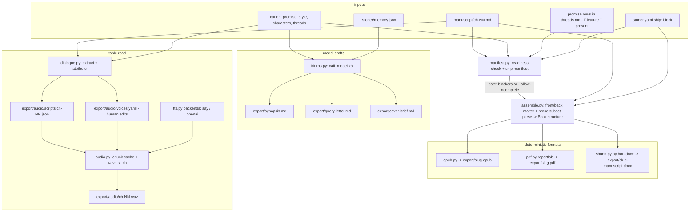

## Summary

`stoner ship` turns a finished manuscript into shippable artifacts in a new `export/` project dir: a typeset trade-paperback PDF, an EPUB3, a Shunn-format submission DOCX, model-drafted synopsis / query letter / cover brief, and a multi-voice table-read audiobook draft whose whole purpose is that hearing dialogue exposes clunk no eye catches. Deterministic converters gate and reproduce; model-generated artifacts are drafts the human edits.

---

## Problem Frame

The harness can plan, draft, review, and revise a book, and the acceptance corpus (`examples/novella/`, Sungrown, 15 chapters, all `status: revised`) proves it — but the pipeline dead-ends at `manuscript/ch-NN.md`. There is no way to hand the book to a reader, an agent, or the author's own ears. The repo has zero export tooling and zero export dependencies, so this feature makes the harness's real dependency-surface choices (invariant 8): every format must degrade independently, and nothing heavy may land in core.

The production line is also the last quality instrument, not just packaging: a table read with distinct character voices is a revision tool ("hearing dialogue exposes clunk"), and the pre-ship completeness check is the only place the harness ever asks "is this book actually done?" — chapter statuses and (if the Promise & Motif Ledger exists) unfired guns block; plain open threads are surfaced as warnings.

---

## Requirements

Readiness and manifest:

- R1. `stoner ship check` produces a deterministic readiness report split into blockers and warnings. Blockers: chapter numbering gaps; chapter statuses outside the shippable set (`revised`, `final`); and — when feature 7's `CanonStore.promises()` is available — open promise-kind rows in `canon/threads.md`, labeled unfired guns (getattr-guarded; its absence degrades to warnings-only thread reporting, never an error). Warnings: plain kind-less `open` rows in `canon/threads.md`, reported but never refusing — deliberate texture threads staying open is normal authorial practice (the corpus's t8 is explicitly texture), while an unfired gun is a genuine not-done.
- R2. All artifact-producing `ship` commands run the readiness check first and refuse on blockers unless `--allow-incomplete` is passed; the override is recorded in the ledger entry. Warnings are printed but never refuse. (Deterministic checks may gate — invariant 2; the blocker/warning split narrows what gates, not whether.)
- R3. A ship manifest resolves book metadata (title, author, year, ISBN placeholder, contact block) from a `ship:` config block with fallbacks to `project_name` and `canon/premise.md`, and fixes the chapter order and titles used by every format.

Assembly:

- R4. A single canonical assembly step produces the ordered book structure (front matter, chapters with titles, back matter) that all three document formats consume, so formats never disagree about content.
- R5. Manuscript prose is parsed by a deterministic feature-local prose-markdown subset parser (paragraphs, `*em*`/`**strong**` inline runs, scene breaks `* * *` / `***` / `---`, everything else passes through as plain text). Typographic quotes and em-dashes in the corpus pass through untouched.

Document formats:

- R6. `stoner ship epub` writes a valid EPUB3 (`export/<slug>.epub`) using only the standard library; two runs on the same inputs are byte-identical.
- R7. `stoner ship pdf` writes a typeset trade-paperback PDF (`export/<slug>.pdf`): configurable trim (default 5.5in x 8.5in), mirrored margins with gutter, running heads (author verso / title recto), page numbers, chapter openers, front matter pages. Requires the `export` extra.
- R8. `stoner ship docx` writes a Shunn standard-manuscript-format DOCX (`export/<slug>-manuscript.docx`): 1in margins, 12pt Times New Roman, double spacing, 0.5in first-line indents, contact block and word count (rounded to nearest 500) on page one, `Surname / TITLE / page` running header with a live page-number field, `#` scene breaks, "END" terminator. Requires the `export` extra.
- R9. Each format degrades independently: a missing optional dependency fails only that format with an actionable install message (`pip install 'st0n3r[export]'`); other formats and commands are unaffected.

Model-generated drafts:

- R10. `stoner ship blurbs` drafts `export/synopsis.md`, `export/query-letter.md`, and `export/cover-brief.md` via `pipelines/common.call_model` from canon context pack + memory (book-so-far + chapter summaries) + threads + premise comps/promise — never the whole manuscript (invariant 4).
- R11. Blurb drafts are human property once written: regeneration refuses to overwrite an existing file without `--force` (invariant 11).

Table-read audio:

- R12. Dialogue attribution is deterministic-first: quote extraction (curly and straight double quotes), tag-pattern attribution, and two-speaker alternation within a scene, against the character inventory from `canon/characters/`. Unattributed lines are marked `UNKNOWN` and voiced by the narrator.
- R13. LLM-assisted attribution (`--assist`) resolves only the ambiguous lines, is marked as advisory in the script, and never gates; both the per-chapter script and the voice map are human-editable files regenerated non-destructively.
- R14. TTS goes through a small ship-local backend abstraction with two adapters: `say` (macOS, local, subprocess, the default where available) and `openai` (plain httpx POST to the speech endpoint; no vendor SDK import — invariant 7). Network synthesis is explicit opt-in via config/flag and every run ledgers the backend used (invariant 9).
- R15. Dialogue-only mode is first-class: `stoner ship audio --dialogue-only` renders just the dialogue lines (optional spoken speaker announcements), per chapter or whole book.
- R16. Synthesis is resumable: per-chunk WAV cache keyed by (backend, voice, text hash); an interrupted or re-run chapter synthesizes only missing chunks (invariant 10 spirit).
- R17. Chapter audio is stitched to `export/audio/ch-NN.wav` with the stdlib `wave` module; MP3 conversion happens only when `ffmpeg` is on PATH, otherwise WAV stands with a note.

Cross-cutting:

- R18. Every artifact-producing command appends a `ship.*` ledger entry naming the output file (invariant 5).
- R19. The whole line runs end-to-end on `examples/novella/` (15 chapters): check passes with warnings naming the open threads (no `--allow-incomplete` needed), then EPUB/PDF/DOCX, scripted-provider blurbs, and a fake-backend table read; the `--allow-incomplete` override path is covered by a fixture with a draft-status chapter.

---

## Key Technical Decisions

- **PDF engine: reportlab (`export` extra)**: BSD license, pure-python core, actively maintained (5.0.0, 2026-06-18), and Platypus page templates handle running heads/page numbers/mirrored margins. Rejected: weasyprint (best CSS Paged Media engine but requires system Pango/HarfBuzz/cairo — not pip-installable, real friction against invariant 8), fpdf2 (LGPL-3.0 and no pagination-control primitives for widows/running heads), pandoc/LaTeX and typst (external binaries; the stated preference is pure-python extras first). reportlab's reproducible-output mode is used so PDF builds are stable.
- **EPUB3: hand-rolled on stdlib `zipfile`, no dependency, not behind an extra**: ebooklib is AGPL-3.0 — disqualifying for an MIT tool (license invariant 12's spirit). EPUB3 is a zip with an uncompressed-first `mimetype`, `container.xml`, an OPF package, a nav document, and XHTML chapters; a feature-local writer is small, fully controlled, and lets EPUB be the always-available format. Zip entry timestamps fixed (1980-01-01) and the `dc:identifier` derived as a UUID5 of project name + title so builds are byte-identical (R6).
- **DOCX: python-docx (`export` extra)**: MIT, maintained (1.2.0, 2025-06-16), covers fonts/margins/spacing/italics/headers directly. Known gap: no first-class page-number field — the header's `PAGE` field is injected as raw OOXML field codes (the documented workaround; python-docx already carries the oxml layer). Modern Shunn (Times, real italics) is the default; `underline_italics` config flag emits classic Courier-era underlines.
- **Prose parsing: feature-local subset parser, no markdown library**: harness-drafted prose (verified against the corpus) is paragraphs, curly-quote dialogue, emphasis, and `* * *` scene breaks — full CommonMark is overkill and would either lean on rich's transitive markdown-it-py (fragile) or grow core deps (invariant 8). The parser is deterministic, ~one screen of code in the slop-analyzer hand-rolled tradition, with explicit passthrough for anything unrecognized.
- **TTS: ship-local backend protocol, two adapters, no SDK**: `say` (zero-dep local default on macOS, `-o` WAV via `--data-format`, voices discovered from `say -v ?`) and `openai` (`POST /v1/audio/speech`, `gpt-4o-mini-tts`, 13 voices, `response_format=wav`, called with core-dep httpx and `OPENAI_API_KEY` per the providers registry convention — invariant 7 kept: no vendor SDK outside `providers/`, and this is not a text-completion Provider so it does not belong in `providers/`). Rejected: piper (relicensed GPL-3.0 under OHF, maintainer-wanted flag), kokoro (stale PyPI, GPL espeak-ng phonemizer), ElevenLabs adapter (no WAV output, paid-only; clean follow-up given the backend registry), pydub (unmaintained; broken by the `audioop` removal). Stitching is stdlib `wave` over uniform-format chunks; MP3 via optional `ffmpeg` subprocess.
- **`ship all` is deterministic-only**: it runs check + EPUB + PDF + DOCX and prints hints for `ship blurbs` / `ship audio`. Model-calling stays in explicitly model-calling commands, preserving the docs/faq.md network promise (invariant 9) and the rule that everything `ship all` produces is deterministic and ledgered.
- **Blurbs are drafts, not products**: synopsis/query/cover-brief are saved as markdown in `export/` for the human to edit before/alongside conversion; the harness never round-trips or machine-edits them afterward (invariant 3's body-prose ethos applied to export artifacts). They resolve against the `writer` role; attribution assist resolves against the cheap `archivist` role. No new ModelRoles field.
- **Readiness gates, attribution advises**: completeness checks are deterministic file/table reads and therefore may block (invariant 2), but only genuine not-dones block — chapter gaps, non-shippable statuses, unfired guns. Kind-less open threads are warnings: blocking on them would train authors to reflexively pass `--allow-incomplete`, destroying the gate's value. LLM speaker attribution is advisory metadata a human can override in the script file — it never blocks synthesis.
- **One config block**: everything lands under a single `ship: ShipConfig` field on StonerConfig (with a nested audio sub-model), per shared-seam etiquette.

---

## High-Level Technical Design

Data shapes (directional, all ship-local pydantic models in `src/stoner/ship/`):

- `ShipManifest`: resolved metadata + ordered `[(number, title, rel_path)]` + readiness report (list of blockers, list of warnings).
- `Book` (from assembly): front-matter pages, chapters as lists of blocks, where a block is a paragraph (list of styled inline runs), a scene break, or a heading.
- `Script` (per chapter): ordered segments `{kind: narration|dialogue, speaker: slug|narrator|UNKNOWN, text, attribution: tag|alternation|llm|manual}` — JSON on disk, hand-editable.
- `voices.yaml`: `narrator: <voice>` plus `characters: {slug: voice}`; regenerated additively (new characters appended, existing assignments preserved).

Attribution ladder (deterministic first, each rung only for lines the previous left unresolved):

1. Tag in the same paragraph: `"...," said X` / `X said|asked|answered|called...` with X matched against canon character names/surnames (corpus check: `"Sold." She said it plain` and `Denny said it like...` both land here).
2. Sole-character paragraph: exactly one known character named in the paragraph.
3. Two-speaker alternation: inside one scene (between scene breaks), once two consecutive turns are tagged to two speakers, untagged quoted turns alternate.
4. `--assist`: ambiguous lines batched to the archivist-role model with local context, STRICT JSON reply parsed tolerantly (mirror `review/passes.py` `extract_json`), results marked `attribution: llm` — advisory (R13).

---

## Integration Surface

- CLI: `cli/ship_cmds.py` with `register(app)` adding a nested `ship` sub-app (mirrors `canon_app`): `stoner ship check`, `ship all`, `ship epub`, `ship pdf`, `ship docx`, `ship blurbs`, `ship voices`, `ship audio`. One import + register line appended in `cli/main.py`.
- config.py: one new field `ship: ShipConfig` (defaults: `title=""` -> project_name, `author=""`, `year=""`, `isbn=""`, `contact_lines=[]`, `trim="5.5x8.5"`, `underline_italics=False`, `dedication=""`, nested `audio: ShipAudioConfig{backend="say", narrator_voice="", announce_speakers=False}`).
- types.py: no changes (all models ship-local).
- project.py: `"export"` appended to `DIRS`; new project output tree `export/`, `export/audio/`, `export/audio/scripts/`, `export/audio/cache/`.
- canon: no new artifact types, templates, or CanonStore methods; reads premise/style/characters/threads via existing CanonStore APIs; calls `CanonStore.promises()` defensively when feature 7 has landed it (getattr-guarded).
- ledger: `ship.check`, `ship.epub`, `ship.pdf`, `ship.docx`, `ship.synopsis`, `ship.query`, `ship.cover`, `ship.voices`, `ship.script`, `ship.audio` (override/backends recorded in detail fields).
- review: no PASSES entries, no PassContext changes.
- engine/tools.py: no new agent tools.
- engine/prompts/: `ship_synopsis.md`, `ship_query.md`, `ship_cover.md`, `ship_attribution.md` (standard HTML doc-comment placeholder headers).
- ModelRoles: no new roles — blurbs resolve against `writer`, attribution assist against `archivist`.
- UI: no endpoints or panels (deferred).
- pyproject: new optional extra `export = ["reportlab>=5.0", "python-docx>=1.2"]`; `all` extra grows `export`. No `audio` extra needed — both TTS adapters ride on stdlib subprocess and core httpx.
- docs: docs/faq.md network-commands sentence gains `ship blurbs`, `ship audio --assist`, and network TTS backends (additive edit; integration plan 011 owns final wording if it consolidates).
- dependencies on other feature plans: consumes `CanonStore.promises()` (Promise & Motif Ledger, feature 7 — promises are typed rows in `canon/threads.md`, not a separate file) if present; degrades to the plain open-threads check if absent. Nothing else; no hard dependencies.

---

## Implementation Units

### U1. Ship config, manifest, and readiness gate

**Goal**: `stoner ship check` works end-to-end; the `ship:` config block, `export/` dir, CLI group skeleton, and the gate every later unit calls all exist.

**Requirements**: R1, R2, R3, R18 (for `ship.check`)

**Dependencies**: none

**Files**:
- `src/stoner/ship/__init__.py`
- `src/stoner/ship/manifest.py`
- `src/stoner/cli/ship_cmds.py`
- `src/stoner/config.py` (add `ShipConfig`, `ShipAudioConfig`, `ship` field)
- `src/stoner/project.py` (`DIRS` + `"export"`)
- `src/stoner/cli/main.py` (register line)
- `tests/test_ship.py`

**Approach**: `ShipConfig` pydantic models in config.py so `stoner.yaml` round-trips them. `manifest.py` exposes a build function returning `ShipManifest`: metadata resolution (config > premise title heuristics > project_name), ordered chapter list via `WritingProject.chapters()`, and a readiness report split into blockers (chapter gaps, statuses outside `{revised, final}`, and — when feature 7's `CanonStore.promises()` exists — open promise-kind rows labeled unfired guns, getattr-guarded so its absence never errors) and warnings (kind-less open `ThreadRow`s via `CanonStore.threads()`, reported but never refusing). `slug` derived with `canon/store.slugify`. `ship check` prints a rich table (blockers and warnings distinguished) and exits 1 only on blockers; a shared helper `require_ready(project, allow_incomplete)` is what artifact commands call, ledgering `ship.check` with the override flag.

**Patterns to follow**: `cli/book_cmds.py` (`register(app)`, local `_project`/`_fail`), `cli/main.py` nested `canon_app` for the sub-app, `canon/store.py` `threads()` for the open-rows/promises consume.

**Test scenarios**:
- Fixture project with ch-01 `revised`, ch-02 `draft`: check reports a status blocker naming ch-02; exit code 1 via CliRunner.
- Chapters 1 and 3 only: gap blocker.
- All chapters `final`, threads all `resolved`/`abandoned`: check passes; `abandoned` does not block.
- An open kind-less thread row: reported as a warning, exit 0, no blocker.
- A `CanonStore` exposing `promises()` with an open promise-kind row: blocker listed and labeled unfired gun; a store without the method (feature 7 absent): the same row surfaces as a warning only, no exception.
- `--allow-incomplete` on a project with blockers (e.g. a draft-status chapter): `require_ready` passes and the `ship.check` ledger entry carries the override detail.
- `ShipConfig` defaults survive a `StonerConfig.load`/`dump_yaml` round trip; `stoner init` creates `export/`.

**Verification**: `stoner ship check` in `examples/novella/` passes (exit 0) with no blockers — all 15 chapters are `revised` — and warnings naming the open threads (t1, t4, t5, t8, whichever are open at head); 227 existing tests still green.

### U2. Manuscript assembly and prose subset parser

**Goal**: one canonical `Book` structure — front matter, parsed chapters, back matter — that every format unit consumes.

**Requirements**: R4, R5

**Dependencies**: U1

**Files**:
- `src/stoner/ship/assemble.py`
- `tests/test_ship.py`

**Approach**: The parser walks chapter bodies (frontmatter already stripped via `project.read_chapter`): blank-line-separated paragraphs; `* * *`, `***`, `---` lines become scene-break blocks; inline `*em*`/`**strong**` become styled runs; `#`-prefixed lines become headings; anything else is a plain-text run (explicit passthrough, no surprises). Assembly builds the `Book`: half-title/title/copyright/dedication pages from the manifest metadata (ISBN placeholder text when unset), chapters titled from frontmatter (fallback "Chapter N"), and an end page. Pure functions, no I/O beyond the project reads, no provider — testable without any extra installed.

**Patterns to follow**: `slop/` analyzer style (hand-rolled deterministic text processing, module-level `_UPPER_SNAKE` constants), `project.split_frontmatter` for reads.

**Test scenarios**:
- Paragraph with curly quotes and em-dashes: single paragraph block, text byte-identical.
- `* * *` line between paragraphs: scene-break block (also `***` and `---` inside a body).
- `*leaned*` and `**hard**` inline: styled runs with correct boundaries; unbalanced `*` degrades to literal text.
- Chapter without a title: "Chapter N" fallback; dedication empty: page omitted.
- Corpus integration: assembling `examples/novella/` yields 15 chapters, first chapter title "Cloning", total paragraph text word count matching `count_words` totals.

**Verification**: assembly of the corpus is loss-free (concatenated block text equals chapter bodies modulo scene-break normalization).

### U3. EPUB3 writer

**Goal**: `stoner ship epub` — dependency-free, byte-reproducible EPUB3.

**Requirements**: R6, R9 (EPUB is the never-degrades format), R18

**Dependencies**: U2

**Files**:
- `src/stoner/ship/epub.py`
- `src/stoner/cli/ship_cmds.py` (command body)
- `tests/test_ship_formats.py`

**Approach**: stdlib `zipfile` + `xml.sax.saxutils` escaping. Structure: uncompressed `mimetype` first entry; `META-INF/container.xml`; `OEBPS/package.opf` (dc:title, dc:creator, dc:language, dc:identifier = UUID5(project name + title), dcterms:modified pinned to a fixed epoch for reproducibility); `OEBPS/nav.xhtml` TOC; one XHTML per front-matter page and chapter; one embedded stylesheet (serif body, centered scene breaks, chapter-title styling). All ZipInfo timestamps fixed at 1980-01-01, entries written in stable order. Ledger `ship.epub` with output path and chapter count.

**Patterns to follow**: `slop/report.py` render purity (build content, return/write, no console side effects in the library function); CLI output style from `cli/main.py`.

**Test scenarios**:
- Build from a 3-chapter fixture: unzip, assert `mimetype` is entry zero and stored uncompressed with exact content; `container.xml` points at the OPF; OPF parses as XML with 3 spine chapter items in manuscript order; nav lists chapter titles.
- Byte-identity: two consecutive builds produce identical bytes (R6).
- Italic runs render as `<em>` in chapter XHTML; XML-special characters in prose (`&`, `<`) escaped.
- Corpus integration: `examples/novella/` produces an EPUB with 15 chapters (check passes with thread warnings, no override needed); ledger tail contains `ship.epub`.

**Verification**: corpus EPUB opens in an EPUB reader; (dev-only, not CI) `epubcheck` passes — noted as a manual check since it needs a JVM.

### U4. Trade-paperback PDF

**Goal**: `stoner ship pdf` — typeset interior via reportlab behind the `export` extra.

**Requirements**: R7, R9, R18

**Dependencies**: U2 (parallel with U3, U5)

**Files**:
- `src/stoner/ship/pdf.py`
- `src/stoner/cli/ship_cmds.py` (command body)
- `pyproject.toml` (`export` extra, `all` growth)
- `tests/test_ship_formats.py`

**Approach**: lazy `import reportlab` inside the build function; ImportError -> actionable message naming `pip install 'st0n3r[export]'` (that format only fails — R9). Platypus document with the trim parsed from `ship.trim` (5.5x8.5in default -> 396x612pt), mirrored inner/outer margins, page templates whose onPage callbacks draw running heads (author verso / title recto, suppressed on chapter openers and front matter) and folios. Chapter openers start on a new page with sunk titles; scene breaks render as a centered ornament; body in a built-in serif face (Times-Roman; no font embedding in v1). Front matter from the `Book`. reportlab's reproducible/invariant mode pins CreationDate and document ID so repeated builds are stable. Ledger `ship.pdf` with page count.

**Patterns to follow**: `ui/server.py` lazy-import-with-actionable-error for the extra; `tests/test_ui.py` `builtins.__import__` monkeypatch for missing-extra tests.

**Test scenarios**:
- `pytest.importorskip("reportlab")`: build from fixture -> file starts `%PDF`, page box is 396x612, nonzero page count grows with chapter count.
- Reproducibility: two builds byte-identical (skip with a comment if reportlab's invariant mode proves partial — then assert stable size/pagecount instead).
- Missing extra (monkeypatched import): `ship pdf` fails with the install message; `ship epub` in the same project still succeeds (R9).
- Corpus integration: novella PDF builds; spot-check the title page carries config title/author.

**Verification**: novella PDF paginates as a plausible trade paperback (running heads alternate, chapters open on fresh pages) on visual inspection.

### U5. Shunn submission DOCX

**Goal**: `stoner ship docx` — standard manuscript format via python-docx behind the `export` extra.

**Requirements**: R8, R9, R18

**Dependencies**: U2 (parallel with U3, U4)

**Files**:
- `src/stoner/ship/shunn.py`
- `src/stoner/cli/ship_cmds.py` (command body)
- `tests/test_ship_formats.py`

**Approach**: module named `shunn.py` (not `docx.py`) to avoid shadowing confusion with the library. Lazy import, same degradation contract as U4. Document: 1in margins, Normal style 12pt Times New Roman double-spaced with 0.5in first-line indent and no inter-paragraph spacing; page one with `contact_lines` block upper-left and word count (rounded to nearest 500, flat, regardless of length, via `project.count_words` totals) upper-right, title a third down, byline; chapters as centered headings with page breaks; scene breaks as centered `#`; italic runs as `run.italic` (or underline when `ship.underline_italics`); final centered "END". Running header `Surname / TITLE / N` from page 2: static text plus a `PAGE` field injected as raw OOXML field codes (`fldChar`/`instrText`) — python-docx's documented gap, handled in one small helper; `different_first_page` suppresses it on page one. Ledger `ship.docx`.

**Patterns to follow**: U4's lazy-import/degradation shape; keep the OOXML injection isolated in one helper with a comment naming the python-docx issue.

**Test scenarios**:
- `pytest.importorskip("docx")`: build from fixture; reopen with python-docx: margins are 1in, Normal font is Times New Roman 12pt, line spacing double.
- Unzip the .docx and assert `header1.xml` (or equivalent part) contains an `instrText` with `PAGE` and the `Surname / TITLE /` literal.
- `underline_italics=True`: an italic source run comes back underlined-not-italic; default: italic.
- Word count on page one is rounded to nearest 500.
- Missing extra: actionable failure, other formats unaffected.
- Corpus integration: novella manuscript DOCX builds; 15 chapter headings present.

**Verification**: the corpus DOCX opens in Word/Pages with correct header pagination (field renders live page numbers).

### U6. Synopsis, query letter, cover brief

**Goal**: `stoner ship blurbs` — three model-drafted markdown artifacts in `export/`, edit-safe.

**Requirements**: R10, R11, R18

**Dependencies**: U1 (parallel with U2-U5)

**Files**:
- `src/stoner/ship/blurbs.py`
- `src/stoner/engine/prompts/ship_synopsis.md`
- `src/stoner/engine/prompts/ship_query.md`
- `src/stoner/engine/prompts/ship_cover.md`
- `src/stoner/cli/ship_cmds.py` (command body)
- `tests/test_ship.py`

**Approach**: one context assembly shared by all three prompts: `CanonStore.context_pack`, `Memory` book-so-far plus every chapter summary in order (the whole book as the canon already knows it — R10, invariant 4), open/resolved thread lines, premise sections (logline, Genre & Comps via `canon/store.extract_section`, Promise to the Reader), manifest metadata, and total word count. Three `call_model` calls against the `writer` role; each result saved verbatim as markdown (drafts, never post-processed). Per-artifact skip-if-exists unless `--force`, with a console note; `--only synopsis|query|cover` for single artifacts. Ledger `ship.synopsis` / `ship.query` / `ship.cover` with usage token counts in detail. Prompts carry the standard doc-comment placeholder header; the query prompt asks for standard one-page query shape (hook, mini-synopsis, bio slot, comps from premise); the cover prompt asks for a designer-facing brief (mood, imagery, palette cues, comp covers) — not an image.

**Patterns to follow**: `pipelines/common.call_model` + `render_prompt`; `pipelines/foundation.py` for multi-artifact generation flow; `engine/prompts/writer.md` header format.

**Test scenarios**:
- ScriptedProvider returning three canned texts: three files created with exact content; ledger has all three actions with usage detail.
- Pre-existing hand-edited `export/synopsis.md`: rerun leaves it untouched and notes the skip; `--force` overwrites.
- Context assembly (pure helper): includes memory summaries for all chapters and the comps line from the corpus premise; excludes chapter body text entirely (assert a known prose sentence is absent — invariant 4 regression guard).
- Provider error surfaces as a clean CLI failure (`_fail` path), no partial file left behind for the failing artifact.

**Verification**: with the corpus and a scripted provider, `ship blurbs` produces three markdown files a human could immediately edit.

### U7. Dialogue extraction, attribution, and voice map

**Goal**: per-chapter table-read scripts plus a human-editable voice map, deterministic-first with advisory LLM assist.

**Requirements**: R12, R13, R18 (`ship.script`, `ship.voices`)

**Dependencies**: U2 (scene segmentation), U1

**Files**:
- `src/stoner/ship/dialogue.py`
- `src/stoner/engine/prompts/ship_attribution.md`
- `src/stoner/cli/ship_cmds.py` (`ship voices` command)
- `tests/test_ship_audio.py`

**Approach**: character inventory from `CanonStore.list_entries(kind="character")` (names, surnames, slugs; template entries like `_template` excluded). Quote extraction handles curly `""` (the corpus norm, 104 per chapter verified) and straight `"` pairs, splitting paragraphs into narration/dialogue segments. Attribution ladder rungs 1-3 as designed above; each segment records its attribution method. `--assist` batches UNKNOWN lines (with one-paragraph context windows) to the `archivist` role, STRICT-JSON prompt, tolerant parse mirroring `review/passes.extract_json`; failures leave lines UNKNOWN (advisory — R13). Outputs: `export/audio/scripts/ch-NN.json` (regenerate refuses to clobber a script whose segments carry `attribution: manual` edits unless `--force`) and `stoner ship voices` writing `export/audio/voices.yaml` — narrator plus characters ranked by dialogue-line count, assigned round-robin from the configured backend's voice list, existing assignments preserved on regeneration. Ledger `ship.script` per chapter and `ship.voices`.

**Patterns to follow**: `review/passes.py` prompt-builder/parser separation and `extract_json`; `canon/archivist.py` ethos (pure parse/diff, pipeline owns the model call).

**Test scenarios**:
- Tag forms from the corpus: `"Too much wood in that one," she said.` with single-POV context -> POV character; `Denny said it like he was deciding whether to bother` paragraph -> denny-calloway.
- Alternation: constructed two-speaker scene with two tagged turns then four bare quotes -> alternating attribution; a third character's tagged line resets the alternation.
- Curly and straight quotes both extract; an unclosed quote degrades that paragraph to narration (no crash).
- UNKNOWN lines with FakeProvider fenced-JSON assist -> attributed with `attribution: llm`; provider garbage -> lines stay UNKNOWN.
- Voice map: fresh generation ranks by line count; regeneration after hand-editing one voice preserves the edit and appends a newly-introduced character.
- Corpus integration: ch-08 script attributes the long Denny monologue paragraph to denny-calloway and Ruth's replies to ruth-vann with zero LLM calls.

**Verification**: deterministic attribution alone resolves a clear majority of corpus dialogue lines (spot-check ch-01/ch-08); everything ambiguous is honestly UNKNOWN rather than guessed.

### U8. TTS backends, synthesis, stitching, and `ship all`

**Goal**: `stoner ship audio` renders stitched chapter WAVs (dialogue-only first-class), and `ship all` wires the deterministic line end-to-end.

**Requirements**: R14, R15, R16, R17, R18, R19, R2 (audio honors the gate too)

**Dependencies**: U7 (scripts, voices), U3-U5 (for `ship all`)

**Files**:
- `src/stoner/ship/tts.py`
- `src/stoner/ship/audio.py`
- `src/stoner/cli/ship_cmds.py` (`ship audio`, `ship all` bodies)
- `docs/faq.md` (network sentence, additive)
- `tests/test_ship_audio.py`

**Approach**: `tts.py` defines the backend protocol — `name`, `is_network`, `list_voices()`, `synthesize(text, voice, dest_wav)` contracted to mono 16-bit PCM WAV at one backend-declared sample rate — and a small registry (mirroring `providers/registry.py` shape, ship-local). Adapter `say`: subprocess `say -v <voice> -o <path> --data-format=LEI16@22050`, voices from `say -v ?`; available only when `shutil.which("say")`. Adapter `openai`: httpx POST `/v1/audio/speech` with `gpt-4o-mini-tts`, `response_format=wav`, key from `OPENAI_API_KEY` (registry convention); selected only by explicit config or `--backend openai`, never as a silent fallback (R14); missing key -> actionable error naming the env var, value never printed. `audio.py`: narration chunked at sentence boundaries to a max-chars constant (API input caps), dialogue lines synthesized per segment with the mapped voice (UNKNOWN -> narrator), chunks cached in `export/audio/cache/` keyed by hash(backend, voice, text) so re-runs and interrupts resume (R16); stitching via stdlib `wave` (params asserted uniform, mixed-params -> clear error naming the offending chunk); `--dialogue-only` filters to dialogue segments, `announce_speakers`/`--announce` prefixes narrator-voiced name announcements; `ffmpeg` on PATH converts to mp3 alongside, else a note. Ledger `ship.audio` per chapter with backend, voice count, chunk cache hits, dialogue-only flag. `ship all`: `require_ready` -> epub + pdf + docx with per-format status table (a failed format reports and continues — R9), then prints the `ship blurbs` / `ship audio` hints. faq.md network sentence gains the two new network paths.

**Patterns to follow**: `providers/registry.py` for backend lookup/errors; `pipelines/book.py` for resumability ethos and `on_event`-style progress prints via `cli/book_cmds._progress_printer` shape; `tests/test_providers.py` for adapter tests without network.

**Test scenarios**:
- FakeTTS backend (test-local, writes 0.1s silence WAVs): 3-segment script -> stitched chapter WAV whose frame count equals the sum of chunks; params mismatch injected -> clear error.
- Cache: run twice, second run synthesizes zero new chunks (fake backend counts calls); delete one cache file -> exactly one re-synthesis.
- `--dialogue-only`: narration segments absent from synthesis calls; with `--announce`, each speaker change adds one narrator-voiced announcement chunk.
- Backend selection: no `say` on PATH (monkeypatched which) and no explicit backend -> actionable error, no network attempt; `--backend openai` without `OPENAI_API_KEY` -> error naming the env var; openai adapter request shape verified against a mocked httpx transport (no real network).
- `ship all` with reportlab import monkeypatched away: table shows pdf failed with install hint, epub and docx succeeded, exit reflects partial failure.
- Corpus integration (R19): novella + FakeTTS -> ch-01 WAV exists, ledger tail carries `ship.audio`; full-line test: check passes with warnings naming the open threads -> epub+docx+blurbs(scripted)+audio(fake) all land in `export/`, no `--allow-incomplete`; the override path is exercised by U1's draft-status-chapter fixture scenario.

**Verification**: on a macOS dev machine (manual, not CI), `stoner ship audio 8 --dialogue-only` on the corpus produces an audible multi-voice table read of the Ruth/Denny scene with distinct voices per speaker.

---

## Scope Boundaries

Non-goals:

- No real ISBN assignment, barcodes, or printer-ready cover PDFs — the cover artifact is a designer-facing brief, not an image.
- No retailer packaging (KDP/IngramSpark bundles), no MOBI/AZW3, no print-on-demand metadata feeds.
- No retail-grade audiobook: the table read is a revision instrument; no emotion direction, no M4B chapterized container (WAV/MP3 per chapter only).
- No font embedding or custom typefaces in the PDF (built-in serif faces in v1).
- No UI panel for ship artifacts.
- Parking-lot items (series canon, voice fine-tunes, nonfiction mode, multi-writer) remain out of scope.

### Deferred to Follow-Up Work

- ElevenLabs TTS adapter (the backend registry is the extension point; blocked in v1 by no-WAV output and paid-only access).
- Typst or weasyprint as alternate high-fidelity PDF engines behind their own extras.
- epubcheck integration as an optional dev-dependency gate.
- M4B audiobook container with embedded chapter marks (needs ffmpeg unconditionally).
- Voice-drift/pacing signals derived from audio timing (belongs with features 1/4 if ever).

---

## Assumptions

- "Chapters status final/revised" means the shippable set is exactly `{revised, final}`; the corpus (all `revised`) must pass the status check. Verified: all 15 corpus chapters are `revised`.
- Open threads in the corpus (t1/t4/t5/t8 open at head) mean the acceptance run exercises the warnings path: `ship check` passes while naming them. The `--allow-incomplete` override path is covered by fixtures (a draft-status chapter), not the corpus.
- Manuscript prose stays within the subset the harness itself writes (paragraphs, emphasis, `* * *` scene breaks, curly quotes) — verified against the corpus; anything else passes through as plain text rather than erroring.
- `ship.audio` reuses `OPENAI_API_KEY` per the existing providers registry convention rather than introducing a ship-specific key name.
- LGPL would likely be acceptable for a pip dependency of an MIT tool, but BSD reportlab makes the question moot; I treated "smallest license risk" as the tiebreaker.
- The Promise Ledger (feature 7) keeps promises as typed rows inside `canon/threads.md` (a trailing `kind` column) surfaced via `CanonStore.promises()`; the consume path is getattr-guarded so it survives feature 7 landing later or not at all.
- `export/` artifacts are regenerable products, so format outputs (epub/pdf/docx/audio) may be overwritten freely; only human-edited artifacts (blurbs, scripts with manual attributions, voices.yaml assignments) get clobber guards.
- Blurb quality from canon pack + memory summaries (no manuscript text) is acceptable for a draft the human rewrites; if it proves too thin, adding excerpt sampling is a follow-up, not a v1 requirement.

---

## Risks & Dependencies

- reportlab 5.0.0 is a fresh major (2026-06-18): pin `>=5.0` but verify the Platypus API surface early in U4; fall back to `>=4,<6` pinning if 5.x churns.
- Byte-identical PDF depends on reportlab's reproducible mode covering all metadata; the U4 test degrades to stability assertions if it does not.
- `say` voice inventories vary per machine and OS version; voice-map generation must tolerate tiny voice lists (round-robin reuse) and the CI has no `say` at all — all CI audio tests use the fake backend.
- Deterministic attribution quality on other people's prose (imported chapters) is unproven; the honest-UNKNOWN design plus human-editable scripts bounds the damage.
- OpenAI TTS pricing/model names drift; the adapter keeps model id as a config-overridable string in `ShipAudioConfig.extra`-style field rather than a hardcoded constant.
- Cross-plan: only the soft `CanonStore.promises()` consume (feature 7). If integration plan 011 lands feature 7 after this, open promise rows surface only as thread warnings until then; the unfired-gun blocker activates once `promises()` exists.

---

## Sources & Research

- reportlab 5.0.0, BSD, 2026-06-18, pure-python core with Platypus page templates — https://pypi.org/project/reportlab/
- weasyprint 69.0 still requires system Pango/HarfBuzz/cairo (not pip-installable) — https://doc.courtbouillon.org/weasyprint/stable/first_steps.html
- fpdf2 2.8.7 is LGPL-3.0-only, pure-python — https://pypi.org/project/fpdf2/
- ebooklib 0.20 is AGPL-3.0-or-later (disqualifying) — https://pypi.org/project/EbookLib/ , https://github.com/aerkalov/ebooklib
- python-docx 1.2.0, MIT, maintained; no first-class PAGE field, raw OOXML field-code injection is the documented workaround — https://pypi.org/project/python-docx/ , https://github.com/python-openxml/python-docx/issues/686
- OpenAI TTS: `gpt-4o-mini-tts`, `POST /v1/audio/speech` plain HTTPS, 13 voices, wav among output formats, ~$0.015/min — https://developers.openai.com/api/docs/guides/text-to-speech
- Anthropic has no developer TTS API as of 2026 (consumer voice mode uses ElevenLabs under the hood) — verified via Anthropic ToS disclosure reporting.
- piper: original rhasspy/piper (MIT) archived Oct 2025; successor OHF-Voice/piper1-gpl is GPL-3.0 with a maintainers-wanted notice — https://github.com/OHF-Voice/piper1-gpl , https://github.com/rhasspy/piper
- kokoro PyPI stale (0.9.4, Apr 2025) and GPL espeak-ng phonemizer exposure — https://pypi.org/project/kokoro/ , https://github.com/hexgrad/kokoro/issues/247
- pydub unmaintained; Python 3.13 removed `audioop` and the fix is unmerged — https://github.com/jiaaro/pydub/issues/725
- stdlib `wave` suffices for PCM WAV concatenation — https://docs.python.org/3/library/wave.html
- ElevenLabs: no native WAV output (mp3/pcm/opus/mu-law), paid API tiers — https://elevenlabs.io/docs/overview/capabilities/text-to-speech
- macOS `say`: per-voice invocation, `-o` with `--data-format` for non-AIFF output, voices via `say -v ?` — https://ss64.com/mac/say.html
- Shunn standard manuscript format (modern: Times New Roman, real italics; classic: Courier, underlines) — https://www.shunn.net/format/story/
- Repo grounding verified in-tree 2026-07-07: corpus dialogue uses curly quotes (104/chapter in ch-08) and `* * *` scene breaks; all 15 chapters `status: revised`; threads t1/t4/t5/t8 open; docs/faq.md enumerates network-touching commands.
