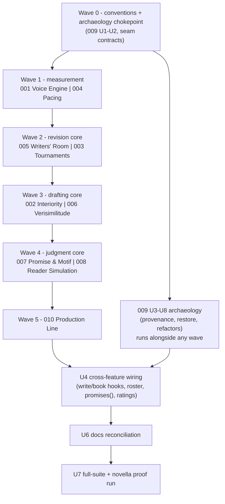

## Summary

Orchestration plan for landing the ten "next ten" feature plans (001-010) as parallel work streams: the wave schedule, the shared-seam contracts that keep ten branches mergeable, the cross-feature wiring that happens only after features land, and the final whole-harness verification. This plan owns everything the individual plans deliberately left to "integration plan 011."

---

## Problem Frame

The ten plans were written to be implemented in parallel: each owns a disjoint code namespace (`src/stoner/voice/`, `interiority/`, `tournament/`, `pacing/`, `room/`, `facts/`, `motifs/`, `readers/`, `archaeology/`, `ship/`), a CLI command group, a ledger action prefix, and its own state files. What they share is a small set of files everyone touches additively (`cli/main.py`, `config.py`, `types.py`, `project.py`, `pipelines/write.py`, `review/passes.py`, `ui/server.py`, `ui/static/index.html`, `pyproject.toml`, docs) and a handful of consume-if-present seams. Without a wiring plan, ten additive branches produce merge noise, duplicate conventions (three features invent three report-kind markers), and wiring that never happens because every plan deferred it here.

The strategic sequencing is fixed by the roadmap: measurement first (Voice, Pacing), then the revision core (Writers' Room, Tournaments), the drafting core (Interiority, Verisimilitude), the judgment core (Promise Ledger, Reader Simulation), Archaeology throughout, Production Line when books finish.

---

## Requirements

Sequencing:

- R1. Features land in waves; within a wave, features are independently implementable and mergeable in either order.
- R2. Draft Archaeology's snapshot chokepoint (plan 009 U1-U2) lands before any wave that rewrites chapter text, so every later feature gets provenance for free.
- R3. No feature blocks on another feature outside its declared consume-if-present seams; every such seam has a tested degrade path.

Shared-seam integrity:

- R4. All touches to shared files are additive and follow the conventions in this plan's seam contracts; a merge never rewrites another feature's lines.
- R5. Reports written to `.stoner/reviews/` by any feature carry a common `kind` discriminator so the reviews API and UI can route them.
- R6. The UI dashboard gains at most one panel per feature, merged serially in wave order; `ui/static/index.html` stays a single no-build file.
- R7. `docs/faq.md`'s network-touching-commands promise is reconciled once, listing every new network path (facts research, ship blurbs, ship audio network TTS, readers/tournament/room model calls) — not edited piecemeal by each branch.

Cross-feature wiring (post-wave):

- R8. Opt-in pipeline hooks are wired and default-off: voice gate in `run_write` (001), cast auto-update post-archivist (002), `stoner write --tournament N` and book-mode tournament slots (003).
- R9. Consumer seams are activated where both sides exist: Writers' Room roster can reference `interiority`/`verisimilitude` passes; ship check blocks on unfired guns via `CanonStore.promises()` (plain open threads warn); readers benchmarking uses tournament rating utilities.
- R10. After all waves, the full suite is green and one live proof run on `examples/novella/` exercises each feature's primary CLI command end-to-end.

Documentation:

- R11. `docs/` and README are reconciled once at the end (new commands, concepts, config blocks), mirroring the v2 "docs reconciliation" deliverable pattern.

---

## Key Technical Decisions

- **Waves follow the roadmap pairing, with Archaeology's chokepoint promoted to Wave 0**: the chokepoint touches the four existing rewrite paths (`engine/tools.py` write_chapter tool, `pipelines/write.py` single-shot + fallback save, `review/revise.py`); landing it first means every subsequent feature's rewrites are snapshotted from day one, and no later branch has to rebase around those four line-level swaps. The rest of plan 009 (provenance engine, CLI, refactors) parallelizes freely across waves.
- **Two features per wave, disjoint by construction**: each wave pairs features whose shared-file touches don't overlap beyond append-only lists (register lines, config fields, DIRS entries, PASSES dict entries). Merge conflicts reduce to adjacent-line appends resolvable mechanically.
- **Shared-file conventions are fixed before Wave 1, in this plan, not re-invented per branch**: register-line ordering, config field ordering, the report `kind` discriminator, and the index.html panel slot are all specified below (see Seam Contracts) so parallel branches write non-conflicting diffs.
- **Wiring is a separate stage from feature landing**: every pipeline hook (R8) and consumer seam (R9) is wired by a dedicated unit after both sides exist, keeping each feature branch shippable alone (invariant: consume-if-present with tested degrade paths). This is what makes the parallel schedule safe — no branch waits on another to compile.
- **One docs reconciliation at the end**: piecemeal doc edits across ten branches would conflict in `docs/faq.md` and README; only plan 010's additive faq sentence is allowed pre-reconciliation, and U6 rewrites the network list authoritatively (R7, R11).

---

## High-Level Technical Design

Wave ordering is about merge sequencing and strategic value, not hard code dependencies: any wave's pair could in principle land early because every cross-feature reference is consume-if-present (R3). The exceptions that ARE ordered: Wave 0 before everything (R2), and the wiring/docs/verify tail after the features it wires.

### Shared-seam touch matrix

| Shared file | 001 | 002 | 003 | 004 | 005 | 006 | 007 | 008 | 009 | 010 |
|---|---|---|---|---|---|---|---|---|---|---|
| `cli/main.py` (register line) | + | + | + | + | + | + | + (+threads kind col) | + | + | + |
| `config.py` (one field) | voice | cast | tournament | pacing | room | facts (+researcher role) | motifs | readers (+reader role) | archaeology | ship |
| `types.py` | VoiceReport | — | — | — | — | WebSearchSpec, CompletionRequest.web_search, Usage.web_searches | — | — | — | — |
| `project.py` DIRS | +2 | — | — | — | +1 | +1 | — | — | +1 | +1 |
| `pipelines/write.py` | opt-in gate | post-archivist hook | — | — | — | — | — | — | chokepoint swaps | — |
| `pipelines/book.py` | — | — | slot hook (wiring) | — | — | — | promises event | — | reason pass-through | — |
| `review/passes.py` | PassContext.voice_digest | PASSES[interiority] | — | — | — | PASSES[verisimilitude], PassContext.facts_digest | — | — | — | — |
| `engine/tools.py` | voice_check tool | — | — | — | — | web_fetch tool | — | — | write_chapter swap | — |
| `canon/store.py` | — | — | — | — | — | CanonKind fact, facts pack section | kind col, promises(), motifs, pack section | — | — | — |
| `canon/archivist.py` | — | — | — | — | — | — | planted_threads | — | — | — |
| `ui/server.py` + index.html | + | — | + | + | + | — | — | + | — | — |
| `pyproject.toml` | — | — | — | — | — | — | — | — | — | export extra |
| providers/* | — | — | — | — | — | supports_web_search + 2 adapters | — | — | — | — |

All cells are additive. The only same-file same-region contentions are `pipelines/write.py` (001/002/009 — resolved by Wave 0 ordering plus wiring-stage hooks) and `index.html` (five panels — serialized by R6).

### Seam contracts (fixed here, consumed by every branch)

- **Register lines**: `cli/main.py` keeps one `register(app)` block at the bottom; new lines append in plan number order (`voice`, `cast`, `tournament`, `pacing`, `room`, `facts`, `motifs`, `readers`, `drafts`, `ship`). Same order for config fields and DIRS entries — mechanical merges.
- **Report kind discriminator**: every JSON report written to `.stoner/reviews/` includes a top-level `kind` field (`review`, `book`, `slop`, `voice`, `pacing`, `cast`, `readers`). Existing report writers gain their `kind` in Wave 0 (three one-line additions); `ui/server.py`'s reviews listing surfaces it, replacing plan 004's provisional `_review_kind` sniffing.
- **index.html panel slot**: each feature adds one `<section>` in a marked panels region, inserted in wave order; a feature's panel is self-contained (no shared JS state beyond the existing fetch helpers).
- **PassContext extensions**: optional-with-default fields only (`voice_digest: str = ""`, `facts_digest: str = ""`), populated by `build_context` when the owning subsystem has state, empty otherwise.
- **Ledger namespaces**: `voice.* cast.* tournament.* pacing.* room.* facts.* motif.* readers.* drafts.* ship.*` — no feature writes outside its prefix.
- **Snapshot reasons**: free-form strings by convention through plan 009's chokepoint: `draft`, `slop-revise`, `review-revise`, `book-revise`, `tournament-graft`, `refactor-*`, `restore`, `human-edit`.
- **New model roles**: exactly two land (`researcher` from 006, `reader` from 008), both defaulting to empty string resolving against existing roles; no other plan adds roles.

---

## Implementation Units

### U1. Wave 0 — seam conventions and report kinds

**Goal**: the contracts above exist in code before parallel branches start: report `kind` field on the three existing report writers, the index.html panels region marker, and the register-block ordering comment.

**Requirements**: R4, R5, R6

**Dependencies**: none

**Files**:
- `src/stoner/slop/report.py`
- `src/stoner/review/runner.py`
- `src/stoner/review/book_review.py`
- `src/stoner/ui/server.py`
- `src/stoner/ui/static/index.html`
- `src/stoner/cli/main.py`
- `tests/test_review.py`, `tests/test_ui.py` (kind assertions)

**Approach**: add `kind` to `SlopReport`/`ReviewReport`/book-review JSON serialization (default values keep old reports readable — the reviews API treats a missing kind as `review` for back-compat), surface `kind` in the reviews listing endpoint, and drop an HTML comment marker delimiting the panels region in index.html. Purely additive; no behavior change.

**Patterns to follow**: existing report save paths in `review/runner.py`; `slop/report.py` render purity.

**Test scenarios**:
- New review/slop/book reports carry `kind`; a legacy report file without `kind` still lists via `/api/reviews` as kind `review`.
- Reviews API response includes the kind field per entry.

**Verification**: full suite green; a fresh `stoner review` report on a fixture shows `kind: review` in JSON.

### U2. Wave 0 — archaeology chokepoint lands

**Goal**: plan 009's U1-U2 (snapshot store + routing the four existing rewrite paths through it) are implemented and merged before Wave 1 opens.

**Requirements**: R2

**Dependencies**: U1

**Files**: as enumerated in plan 009 U1-U2 (`src/stoner/archaeology/`, `engine/tools.py`, `pipelines/write.py`, `review/revise.py`, `pipelines/book.py`, `tests/`)

**Approach**: execute plan 009's U1-U2 verbatim. The remainder of plan 009 (U3-U8) is unblocked from here and runs alongside any wave.

**Test scenarios**: owned by plan 009 U1-U2.

**Verification**: a `stoner write` + `stoner revise` cycle on a fixture produces `.stoner/drafts/ch-NN/` snapshots with correct reasons; suite green.

### U3. Wave scheduling and merge sequencing (Waves 1-5)

**Goal**: the ten feature plans execute as paired branches per the wave schedule, each merged only when its own plan's verification passes and the seam contracts hold.

**Requirements**: R1, R3, R4

**Dependencies**: U1, U2

**Files**: per feature plan; this unit owns only merge-order enforcement.

**Approach**: Wave 1: 001 + 004 (measurement). Wave 2: 005 + 003 (revision core). Wave 3: 002 + 006 (drafting core). Wave 4: 007 + 008 (judgment core). Wave 5: 010. Plan 009 U3-U8 slots into whichever wave has capacity. Within a wave, branches develop concurrently from the same base; merge order within a wave is whichever finishes first (R1). At each merge: run the full suite, verify the seam contracts (register order, config order, ledger prefixes, kind fields), and verify every consume-if-present degrade path still degrades (the consuming feature's own tests cover this — R3).

**Execution note**: implementer discretion on branch mechanics; disjoint-paths-per-stream mirrors the v1 build convention recorded in docs/planning/TRACKER.md.

**Test scenarios**: Test expectation: none — scheduling unit; per-feature tests are owned by their plans.

**Verification**: after each wave, suite green and `stoner --help` shows the wave's new command groups.

### U4. Cross-feature wiring

**Goal**: the deferred hooks and consumer seams are activated now that both sides exist.

**Requirements**: R8, R9

**Dependencies**: U3 (all waves merged)

**Files**:
- `src/stoner/pipelines/write.py`, `src/stoner/pipelines/book.py`, `src/stoner/cli/main.py` (write `--tournament`, book tournament slots)
- `src/stoner/room/` roster defaults (reference `interiority`/`verisimilitude` passes as opt-in roster entries)
- `src/stoner/ship/manifest.py` (confirm `promises()` labeling active)
- `src/stoner/readers/` benchmarking (switch to tournament rating utilities)
- `src/stoner/canon/store.py` context_pack section order (facts, motifs sections coexist under the priority budget)
- tests in each touched feature's test file

**Approach**: each wiring item is the "consumes X if present" arm the feature plans specified, now flipped to present: `stoner write --tournament N` drafts takes via plan 003's runner before the slop gate; book mode consults `tournament.slot_takes` for opening/ending chapters; the room's default roster may include the interiority and verisimilitude passes when their subsystems have state; readers benchmarking imports tournament rating math instead of its win-rate fallback; ship check's unfired-guns blocking is exercised against a promises-bearing project. Verify context_pack ordering with all new sections present stays within budget-drop semantics (whole sections drop cleanly).

**Patterns to follow**: each feature plan's own Integration Surface section; `pipelines/book.py` on_event for progress.

**Test scenarios**:
- `stoner write --tournament 3` on a fixture with ScriptedProvider: three takes, judged, winner lands in `manuscript/`, snapshots carry `tournament-graft`/`draft` reasons, ledger shows `tournament.*` then `pipeline.write.*`.
- Book mode with `slot_takes: {opening: 3}`: ch-01 runs a tournament; middle chapters draft once.
- Room session with interiority pass in roster on a cast-bearing project: interiority findings appear under the continuity editor; without cast state: pass skipped with a note.
- Readers bench with tournament utilities present: ratings match Elo math; monkeypatched absence: falls back to win-rate, results still render.
- context_pack with facts + motifs + long canon: sections drop whole per the existing budget rule; premise/style never drop.
- Ship check on a promises-bearing fixture: open promise-kind row blocks as an unfired gun; same fixture pre-feature-7 store: the open thread is a warning only, check passes.

**Verification**: all wiring scenarios green; every hook is default-off and its off-state leaves v0.2.0 behavior byte-identical (existing 227 tests untouched).

### U5. UI panel consolidation

**Goal**: the five feature panels (voice, tournaments, pacing, room, readers) render coherently in the single-file dashboard with the Hearth design system, in both themes.

**Requirements**: R6

**Dependencies**: U3

**Files**:
- `src/stoner/ui/static/index.html`
- `src/stoner/ui/server.py`
- `tests/test_ui.py`

**Approach**: panels were merged serially per wave; this unit is the coherence pass — shared fetch/error helpers deduplicated, panel order fixed (manuscript, canon, reviews triage, pacing timeline, voice, tournaments, room, readers heatmap, pipeline, ledger), the reviews triage panel routes by report `kind`, and both themes verified against the Hearth reference like the v2 UI work was.

**Patterns to follow**: existing index.html panel structure and the Hearth design brief from the v2 build.

**Test scenarios**:
- Every `/api/*` endpoint added by features 001/003/004/005/008 responds on a fixture project (contract tests).
- Reviews listing with mixed kinds routes each to the right panel data shape.

**Verification**: `stoner ui` on `examples/novella/` renders all panels without console errors in both themes (manual screenshot check, matching the v2 verification convention).

### U6. Documentation reconciliation

**Goal**: docs and README reflect the ten features once, coherently.

**Requirements**: R7, R11

**Dependencies**: U4, U5

**Files**:
- `README.md`
- `docs/faq.md` (authoritative network-commands list)
- `docs/concepts.md`, `docs/review.md`, `docs/slop.md`, `docs/autonomous.md`, `docs/ui.md`, `docs/providers.md`, `docs/getting-started.md`
- new per-feature docs where warranted (e.g. `docs/voice.md`, `docs/ship.md` — implementer's call per docs conventions)
- `docs/CREDITS.md` (PD attribution from 008; any borrowed lists)

**Approach**: one documentation pass mirroring the v2 "docs reconciliation" deliverable: new command groups into README and getting-started, new concepts (fingerprint, cast sheets, tournaments, notebooks, fact locker, promises kind, personas, snapshots, ship) into concepts.md at its existing altitude, and the faq network list rewritten to enumerate every model-calling and network-touching command across all ten features.

**Test scenarios**: Test expectation: none — docs unit; doc-verification spot checks (commands named in docs exist in `stoner --help`) ride the proof run.

**Verification**: every command named in docs exists; every new config block appears in at least one doc.

### U7. Full-suite verification and novella proof run

**Goal**: the integrated harness is proven end-to-end the way v2 was — on a real book.

**Requirements**: R10

**Dependencies**: U4, U5, U6

**Files**:
- `tests/` (any cross-feature regression tests discovered missing)
- no product files — this unit verifies

**Approach**: full pytest suite, ruff, mypy. Then a live proof sequence on a copy of `examples/novella/`: `voice learn` + `voice check`, `pacing report`, `room session` on one chapter, a small `tournament run` on one scene, `cast init` + `cast check` on one chapter, `facts research` (one topic, opt-in) + `facts sweep`, `promises check` + `motifs scan`, `readers run` (small roster) + `readers heatmap`, `drafts blame` + one `drafts refactor` dry pass, and `ship check` + `ship epub` + `ship blurbs` + a fake-backend `ship audio`. Two live-run-bug lessons from v2 apply: real runs find what tests don't; budget the pass for fix-and-retest loops.

**Test scenarios**:
- Each proof step exits zero (ship check passes with open-thread warnings on the novella) and appends its ledger actions.
- The ledger after the proof run contains at least one action from every feature's namespace.

**Verification**: suite green; proof-run transcript summarized; any bugs found are fixed with regression tests before this plan is complete.

---

## Scope Boundaries

Non-goals:

- No re-litigation of decisions inside plans 001-010; this plan wires, sequences, and verifies.
- No new features beyond the ten; parking-lot items (series canon, voice fine-tunes, nonfiction mode, two-writers-one-canon) stay parked.
- No CI setup (the repo has none; adding it is separate work).

### Deferred to Follow-Up Work

- A second proof-of-output novella generated with the full instrument stack active from chapter one (the Sungrown novella predates all ten features).
- Consolidating the ten config blocks' docs into a single reference page if stoner.yaml sprawl becomes a complaint.
- CI pipeline (GitHub Actions) once the repo goes public.

---

## Assumptions

- Wave pairing follows the user's stated sequencing; nothing in the ten plans contradicts it, and every cross-wave reference is consume-if-present, so re-pairing is cheap if priorities shift.
- The implementer(s) can run waves with two concurrent streams (the v1/v2 build used parallel subagents with disjoint paths; the namespace table preserves that property).
- Plan 010's promises consume was aligned during planning review to feature 7's actual design (`CanonStore.promises()` over typed threads.md rows; no `canon/promises.md` file exists).
- The three pre-existing report writers can gain a `kind` field without breaking old saved reports (reviews API treats missing kind as `review`).
- All owner-facing questions raised during planning were decided and folded into the ten plans on 2026-07-07 (votes train taste only; pacing stays advisory; dismissals silence notebooks; facts research is barred from book runs; strict promise checks cover kind-less threads; readers findings mirror into reviews with kind `readers`; ship check blocks on gaps/statuses/unfired guns and warns on plain open threads; nothing ships PD content). No open questions remain in any plan.

---

## Risks & Dependencies

- `pipelines/write.py` accumulates three touches (009 chokepoint, 001 gate, 002 hook); Wave 0 ordering plus wiring-stage hooks keeps each diff small, but this file is the rebase hotspot — merge it first in any conflicted wave.
- `index.html` is a single 1,090-line file gaining five panels; serialized merges (R6) prevent conflicts but the coherence pass (U5) is real work, not cleanup theater.
- Ten new config fields and two model roles land in `config.py`; a stoner.yaml written by any wave must load in all later waves (pydantic defaults guarantee it; the U3 per-merge suite run enforces it).
- The wiring stage (U4) is where cross-feature bugs will surface; its test scenarios are the integration suite the individual plans could not write alone.
- Token cost of the proof run (U7) is nontrivial (readers + tournament + room on a real book); use small rosters/takes and cheap roles per the plans' budget knobs.

---

## Sources & Research

- The ten feature plans: `docs/plans/2026-07-07-001-*.md` through `2026-07-07-010-*.md` (each carries its own Integration Surface section this plan aggregates).
- Build-history conventions: `docs/planning/TRACKER.md` (disjoint-path parallel subagent builds, live-run bug lessons, docs-reconciliation deliverable).
- Sequencing directive and feature definitions: the owner's "next ten" brief (2026-07-07).
